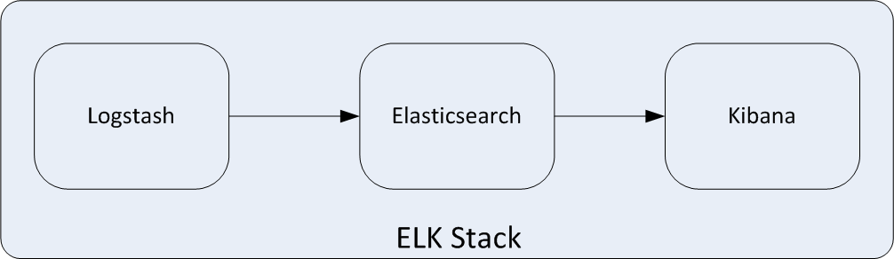
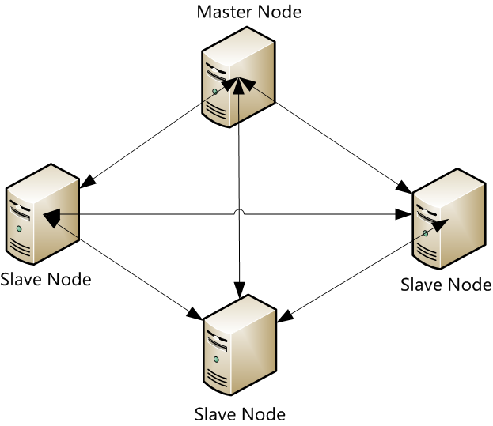
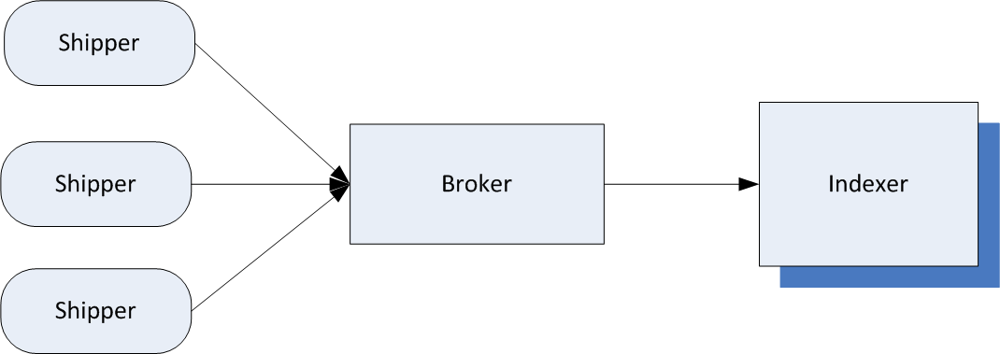
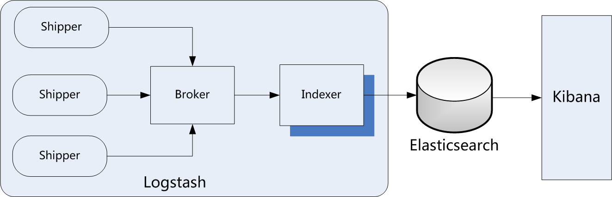
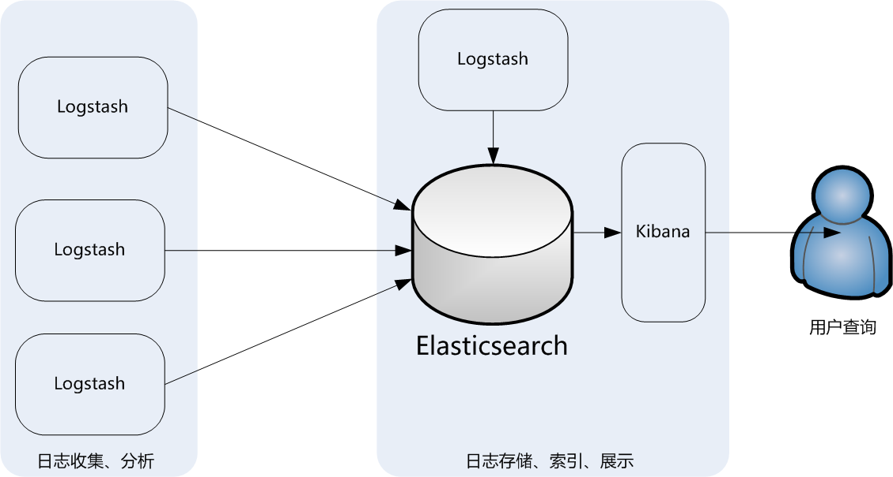
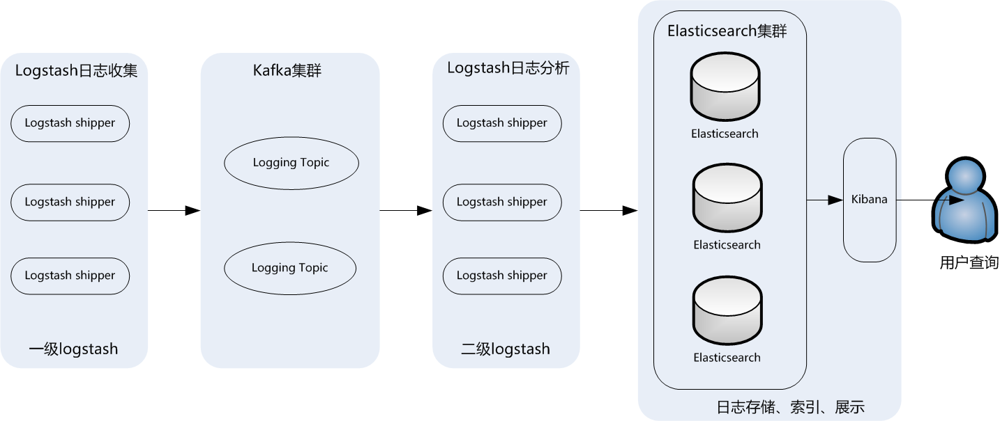
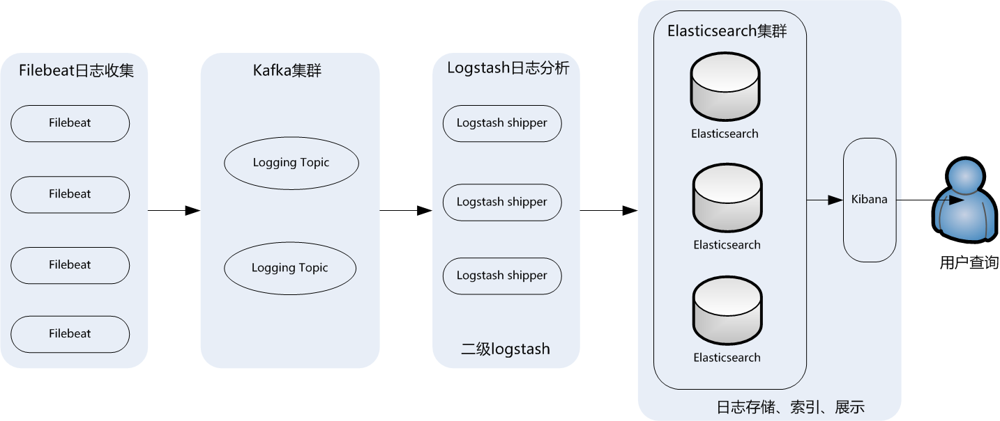

## 序：ELK应用架构介绍（附专栏目录）

# 1.ELK架构介绍

## 1.1 核心组成

ELK是一个应用套件，由Elasticsearch、 和Kibana三部分组件组成，简称ELK；它是一套开源免费、功能强大的日志分析管理系统。ELK可以将我们的系统日志、网站日志、应用系统日志等各种日志进行收集、过滤、清洗，然后进行集中存放并可用于实时检索、分析。

这三款软件都是开源软件，通常是配合使用，而且又先后归于Elastic.co公司名下，故又被简称为ELK Stack。下图是ELK Stack的基础组成。

本专栏将重点介绍这三款软件所实现的功能以及具体的应用实例。

## 1.2 Elasticsearch介绍

Elasticsearch是一个实时的分布式搜索和分析引擎，它可以用于全文搜索，结构化搜索以及分析，采用Java语言编写。目前，最新的版本是Elasticsearch  
6.3.2，它的主要特点如下：

> 实时搜索，实时分析  
> 分布式架构、实时文件存储，并将每一个字段都编入索引  
> 文档导向，所有的对象全部是文档  
> 高可用性，易扩展，支持集群（Cluster）、分片和复制（Shards和Replicas）  
> 接口友好，支持JSON

Elasticsearch支持集群架构，典型的集群架构如下图所示：

从图中可以看出，Elasticsearch集群中有Master Node和Slave  
Node两种角色，其实还有一种角色Client Node，这在后面会做深入介绍。

## 1.3、Logstash介绍

Logstash是一款轻量级的、开源的日志收集处理框架，它可以方便的把分散的、多样化的日志搜集起来，并进行自定义过滤分析处理，然后传输到指定的位置，比如某个服务器或者文件。Logstash采用JRuby语言编写，目前最新的版本是Logstash6.3.2，它的主要特点如下：

> 几乎可以访问任何数据  
> 可以和多种外部应用整合  
> 支持动态、弹性扩展

Logstash的理念很简单，从功能上来讲，它只做三件事情：

> input：数据收集  
> filter：数据加工，如过滤，改写等  
> output：数据输出

别看它只做三件事，但通过组合输入和输出，可以变幻出多种架构实现多种需求。Logstash内部运行逻辑如下图所示：

其中，每个部分含义如下：

> Shipper：主要用来收集日志数据，负责监控本地日志文件的变化，及时把日志文件的最新内容收集起来，然后经过加工、过滤，输出到Broker。
> 
> Broker：相当于日志Hub，用来连接多个Shipper和多个Indexer。
> 
> Indexer：从Broker读取文本，经过加工、过滤，输出到指定的介质（可以是文件、网络、elasticsearch等）中。

Redis服务器是logstash官方推荐的broker，这个broker起数据缓存的作用，通过这个缓存器可以提高Logstash  
shipper发送日志到Logstash indexer的速度，同时避免由于突然断电等导致的数据丢失。可以实现broker功能的还有很多软件，例如kafka等。

这里需要说明的是，在实际应用中，LogStash自身并没有什么角色，只是根据不同的功能、不同的配置给出不同的称呼而已，无论是Shipper还是Indexer，始终只做前面提到的三件事。

这里需要重点掌握的是logstash中Shipper和Indexer的作用，因为这两个部分是logstash功能的核心，在下面的介绍中，会陆续介绍到这两个部分实现的功能细节。

## 1.4 kibana介绍

Kibana是一个开源的数据分析可视化平台。使用Kibana可以为Logstash和ElasticSearch提供的日志数据进行高效的搜索、可视化汇总和多维度分析，还可以与Elasticsearch搜索引擎之中的数据进行交互。它基于浏览器的界面操作可以快速创建动态仪表板，实时监控ElasticSearch的数据状态与更改。

## 1.5 ELK工作流程

一般都是在需要收集日志的所有服务上部署logstash，作为logstash shipper用于监控并收集、过滤日志，接着，将过滤后的日志发送给Broker，然后，Logstash Indexer将存放在Broker中的数据再写入Elasticsearch，Elasticsearch对这些数据创建索引，最后由Kibana对其进行各种分析并以图表的形式展示。

ELK工作流程如下图所示：

有些时候，如果收集的日志量较大，为了保证日志收集的性能和数据的完整性，logstash shipper和logstash indexer之间的缓冲器（Broker）也经常采用kafka来实现。

在这个图中，要重点掌握的是ELK架构的数据流向，以及logstash、Elasticsearch和Kibana组合实现的功能细节。

# 2.ELK常见应用架构

## 2.1 最简单的ELK架构

ELK套件在大数据运维应用中是一套必不可少的、方便的、易用的开源解决方案，它提供搜集、过滤、传输、储存等机制，对应用系统和海量日志进行集中管理和准实时搜索、分析，并通过搜索、监控、事件消息和报表等简单易用的功能，帮助运维人员进行线上业务系统的准实时监控、业务异常时及时定位原因、排除故障等，还可以跟踪分析程序Bug、分析业务趋势、安全与合规审计，深度挖掘日志的大数据应用价值。

下图是最简单的ELK应用架构：

此架构主要是将Logstash部署在各个节点上搜集相关日志、数据，并经过分析、过滤后发送给远端服务器上的Elasticsearch进行存储。Elasticsearch再将数据以分片的形式压缩存储，并提供多种API供用户查询、操作。用户可以通过Kibana Web直观的对日志进行查询，并根据需求生成数据报表。

此架构的优点是搭建简单，易于上手。缺点是Logstash消耗系统资源比较大，运行时占用CPU和内存资源较高。另外，由于没有消息队列缓存，可能存在数据丢失的风险。此架构建议供初学者或数据量小的环境使用。

## 2.2 典型ELK架构

为保证ELK收集日志数据的安全性和稳定性，此架构引入了消息队列机制，下图是典型的ELK应用架构：

此架构主要特点是引入了消息队列机制，位于各个节点上的Logstash Agent（一级Logstash，主要用来传输数据）先将数据传递给消息队列（常见的有Kafka、Redis等），接着，Logstash server（二级Logstash，主要用来拉取消息队列数据，过滤并分析数据）将格式化的数据传递给Elasticsearch进行存储。最后，由Kibana将日志和数据呈现给用户。由于引入了Kafka（或者Redis）缓存机制，即使远端Logstash server因故障停止运行，数据也不会丢失，因为数据已经被存储下来了。

这种架构适合于较大集群、数据量一般的应用环境，但由于二级Logstash要分析处理大量数据，同时Elasticsearch也要存储和索引大量数据，因此它们的负荷会比较重，解决的方法是将它们配置为集群模式，以分担负载。

此架构的优点在于引入了消息队列机制，均衡了网络传输，从而降低了网络闭塞尤其是丢失数据的可能性，但依然存在Logstash占用系统资源过多的问题，在海量数据应用场景下，可能会出现性能瓶颈。

## 2.3 ELK集群架构

这个架构是在上面第二个架构基础上改进而来的，主要是将前端收集数据的Logstash Agent换成了filebeat，消息队列使用了kafka集群，然后将Logstash和Elasticsearch都通过集群模式进行构建，完整架构如下图所示：

此架构适合大型集群、海量数据的业务场景，它通过将前端Logstash  
Agent替换成filebeat，有效降低了收集日志对业务系统资源的消耗。同时，消息队列使用kafka集群架构，有效保障了收集数据的安全性和稳定性，而后端Logstash和Elasticsearch均采用集群模式搭建，从整体上提高了ELK系统的高效性、扩展性和吞吐量。

本专栏内容我们就以此架构为主介绍如何安装、配置、构建和使用ELK大数据日志分析系统。

同时，专栏大纲明细如下：

序：ELK（Elasticsearch、Logstash、kibana）应用架构介绍  
1.企业应用中各种常见ELK应用架构以及优劣  
2.ZooKeeper是如何工作的以及集群应用架构  
3.kafka的工作机制以及Producer生产机制与Consumer消费机制  
4.Kafka Broker集群与elasticsearch的高效互联机制  
5.如何通过Filebeat实现日志的稳定、高效传输  
6.通过Logstash、Kibana服务实现日志的分析、清洗和可视化　  
7.Logstash的输入插件(Input)与编码插件(Codec)的应用案例　  
8.Logstash过滤器插件(Filter)与输出插件（output）实战详解　  
9.ELK收集Apache访问日志实战案例　  
10.ELK收集Nginx访问日志实战案例　  
11.ELK收集tomcat日志应用案例  
12.ELK通过filebeat收集mysql慢查询日志案例  
13.使用ELK处理Docker日志应用案例  
14.ELK实现日志监控告警功能以及高并发环境下的相关调优
