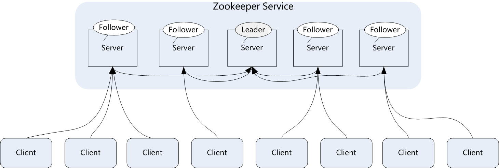
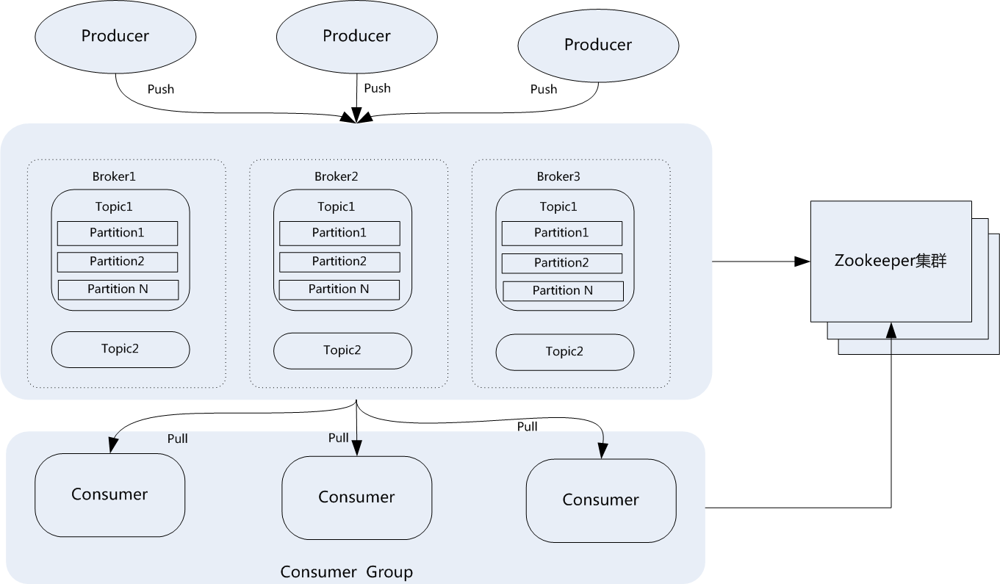

## 1.ZooKeeper与kafka的工作机制以及集群应用架构

# 1.ZooKeeper基础与入门

## 1.1 ZooKeeper概念介绍

在介绍ZooKeeper之前，先来介绍一下分布式协调技术，所谓分布式协调技术主要是用来解决分布式环境当中多个进程之间的同步控制，让他们有序的去访问某种共享资源，防止造成资源竞争（脑裂）的后果。

这里首先介绍下什么是分布式系统，所谓分布式系统就是在不同地域分布的多个服务器，共同组成的一个应用系统来为用户提供服务，在分布式系统中最重要的是进程的调度，这里假设有一个分布在三个地域的服务器组成的一个应用系统，在第一台机器上挂载了一个资源，然后这三个地域分布的应用进程都要竞争这个资源，但我们又不希望多个进程同时进行访问，这个时候就需要一个协调器，来让它们有序的来访问这个资源。这个协调器就是分布式系统中经常提到的那个“锁”，例如"进程1"在使用该资源的时候，会先去获得这把锁，"进程1"获得锁以后会对该资源保持独占，此时其它进程就无法访问该资源，"进程1"在用完该资源以后会将该锁释放掉，以便让其它进程来获得锁。由此可见，通过这个“锁”机制，就可以保证分布式系统中多个进程能够有序的访问该共享资源。这里把这个分布式环境下的这个“锁”叫作分布式锁。这个分布式锁就是分布式协调技术实现的核心内容。

目前，在分布式协调技术方面做得比较好的有Google的Chubby，还有Apache的ZooKeeper，它们都是分布式锁的实现者。ZooKeeper所提供锁服务在分布式领域久经考验，它的可靠性、可用性都是经过理论和实践验证的。

综上所述，ZooKeeper是一种为分布式应用所设计的高可用、高性能的开源协调服务，它提供了一项基本服务：分布式锁服务，同时，也提供了数据的维护和管理机制，如：统一命名服务、状态同步服务、集群管理、分布式消息队列、分布式应用配置项的管理等等。

## 1.2 ZooKeeper应用举例　

为了方便读者理解ZooKeeper，这里通过一个例子，看看ZooKeeper是如何实现分布式协调技术的，这里以ZooKeeper提供的基本服务分布式锁为例进行介绍。

在分布式锁服务中，有一种最典型应用场景，就是通过对集群进行Master角色的选举，来解决分布式系统中的单点故障问题。所谓单点故障，就是在一个主从的分布式系统中，主节点负责任务调度分发，从节点负责任务的处理，而当主节点发生故障时，整个应用系统也就瘫痪了，那么这种故障就称为单点故障。

解决单点故障，传统的方式是采用一个备用节点，这个备用节点定期向主节点发送ping包，主节点收到ping包以后向备用节点发送回复Ack信息，当备用节点收到回复的时候就会认为当前主节点运行正常，让它继续提供服务。而当主节点故障时，备用节点就无法收到回复信息了，此时，备用节点就认为主节点宕机，然后接替它成为新的主节点继续提供服务。

这种传统解决单点故障的方法，虽然在一定程度上解决了问题，但是有一个隐患，就是网络问题，可能会存在这样一种情况：主节点并没有出现故障，只是在回复ack响应的时候网络发生了故障，这样备用节点就无法收到回复，那么它就会认为主节点出现了故障，接着，备用节点将接管主节点的服务，并成为新的主节点，此时，分布式系统中就出现了两个主节点（双Master节点）的情况，双Master节点的出现，会导致分布式系统的服务发生混乱。这样的话，整个分布式系统将变得不可用。为了防止出现这种情况，就需要引入ZooKeeper来解决这种问题。

## 1.3 ZooKeeper工作原理

下面通过三种情形，介绍下Zookeeper是如何进行工作的。

（1） Master启动

在分布式系统中引入Zookeeper以后，就可以配置多个主节点，这里以配置两个主节点为例，假定它们是"主节点A"和"主节点B"，当两个主节点都启动后，它们都会向ZooKeeper中注册节点信息。我们假设"主节点A"锁注册的节点信息是"master00001"，"主节点B"注册的节点信息是"master00002"，注册完以后会进行选举，选举有多种算法，这里以编号最小作为选举算法，那么编号最小的节点将在选举中获胜并获得锁成为主节点，也就是"主节点A"将会获得锁成为主节点，然后"主节点B"将被阻塞成为一个备用节点。这样，通过这种方式Zookeeper就完成了对两个Master进程的调度。完成了主、备节点的分配和协作。

（2） Master故障

如果"主节点A"发生了故障，这时候它在ZooKeeper所注册的节点信息会被自动删除，而ZooKeeper会自动感知节点的变化，发现"主节点A"故障后，会再次发出选举，这时候"主节点B"将在选举中获胜，替代"主节点A"成为新的主节点，这样就完成了主、被节点的重新选举。

（3）Master恢复

如果主节点恢复了，它会再次向ZooKeeper注册自身的节点信息，只不过这时候它注册的节点信息将会变成"master00003"，而不是原来的信息。ZooKeeper会感知节点的变化再次发动选举，这时候"主节点B"在选举中会再次获胜继续担任"主节点"，"主节点A"会担任备用节点。

Zookeeper就是通过这样的协调、调度机制如此反复的对集群进行管理和状态同步的。

## 1.4 Zookeeper集群架构

Zookeeper一般是通过集群架构来提供服务的，下图是Zookeeper的基本架构图。

Zookeeper集群主要角色有Server和client，其中，Server又分为Leader、Follower和Observer三个角色，每个角色的含义如下：

> Leader：领导者角色，主要负责投票的发起和决议，以及更新系统状态。  
> Follower：跟随者角色，用于接收客户端的请求并返回结果给客户端，在选举过程中参与投票。  
> Observer：观察者角色，用户接收客户端的请求，并将写请求转发给leader，同时同步leader状态，但不参与投票。Observer目的是扩展系统，提高伸缩性。  
> Client：客户端角色，用于向Zookeeper发起请求。

Zookeeper集群中每个Server在内存中存储了一份数据，在Zookeeper启动时，将从实例中选举一个Server作为leader，Leader负责处理数据更新等操作，当且仅当大多数Server在内存中成功修改数据，才认为数据修改成功。

Zookeeper写的流程为：客户端Client首先和一个Server或者Observe通信，发起写请求，然后Server将写请求转发给Leader，Leader再将写请求转发给其它Server，其它Server在接收到写请求后写入数据并响应Leader，Leader在接收到大多数写成功回应后，认为数据写成功，最后响应Client，完成一次写操作过程。

# 2.kafka基础与入门

## 2.1 kafka基本概念

Kafka是一种高吞吐量的分布式发布/订阅消息系统，这是官方对kafka的定义，这样说起来，可能不太好理解，这里简单举个例子：现在是个大数据时代，各种商业、社交、搜索、浏览都会产生大量的数据。那么如何快速收集这些数据，如何实时的分析这些数据，是一个必须要解决的问题，同时，这也形成了一个业务需求模型，即生产者生产（produce）各种数据，消费者（consume）消费（分析、处理）这些数据。那么面对这些需求，如何高效、稳定的完成数据的生产和消费呢？这就需要在生产者与消费者之间，建立一个通信的桥梁，这个桥梁就是消息系统。从微观层面来说，这种业务需求也可理解为不同的系统之间如何传递消息。

kafka是Apache组织下的一个开源系统，它的最大的特性就是可以实时的处理大量数据以满足各种需求场景：比如基于hadoop平台的数据分析、低时延的实时系统、storm/spark流式处理引擎等。kafka现在它已被多家大型公司作为多种类型的数据管道和消息系统使用。

## 2.2 kafka角色术语

在介绍架构之前，先了解下kafka中一些核心概念和各种角色。

> Broker：Kafka集群包含一个或多个服务器，每个服务器被称为broker。  
> Topic：每条发布到Kafka集群的消息都有一个分类，这个类别被称为Topic（主题）。  
> Producer：指消息的生产者，负责发布消息到Kafka broker。  
> Consumer :指消息的消费者，从Kafka broker拉取数据，并消费这些已发布的消息。  
> Partition：Parition是物理上的概念，每个Topic包含一个或多个Partition，每个partition都是一个有序的队列。partition  
> 中的每条消息都会被分配一个有序的id（称为offset）。  
> Consumer：Group:消费者组，可以给每个Consumer指定消费者组，若不指定消费者组，则属于默认的group。  
> Message：消息，通信的基本单位，每个producer可以向一个topic发布一些消息。

这些概念和基本术语对于理解kafka架构和运行原理非常重要，一定要牢记每个概念。

## 2.3 Kafka拓扑架构

一个典型的Kafka集群包含若干Producer，若干broker、若干Consumer Group，以及一个Zookeeper集群。Kafka通过Zookeeper管理集群配置，选举leader，以及在Consumer Group发生变化时进行rebalance。Producer使用push模式将消息发布到broker，Consumer使用pull模式从broker订阅并消费消息。典型架构如下图所示：

从图中可以看出，典型的消息系统有生产者（Producer），存储系统（broker）和消费者（Consumer）组成，Kafka作为分布式的消息系统支持多个生产者和多个消费者，生产者可以将消息分布到集群中不同节点的不同Partition上，消费者也可以消费集群中多个节点上的多个Partition。在写消息时允许多个生产者写到同一个Partition中，但是读消息时一个Partition只允许被一个消费组中的一个消费者所消费，而一个消费者可以消费多个Partition。也就是说同一个消费组下消费者对Partition是互斥的，而不同消费组之间是共享的。

kafka支持消息持久化存储，持久化数据保存在kafka的日志文件中，在生产者生产消息后，kafka不会直接把消息传递给消费者，而是先要在broker中进行存储，为了减少磁盘写入的次数，broker会将消息暂时缓存起来，当消息的个数或尺寸、大小达到一定阀值时，再统一写到磁盘上，这样不但提高了kafka的执行效率，也减少了磁盘IO调用次数。

kafka中每条消息写到partition中，是顺序写入磁盘的，这个很重要，因为在机械盘中如果是随机写入的话，效率将是很低的，但是如果是顺序写入，那么效率却是非常高，这种顺序写入磁盘机制是kafka高吞吐率的一个很重要的保证。

## 2.4 Topic与Partition

Kafka中的topic是以partition的形式存放的，每一个topic都可以设置它的partition数量，Partition的数量决定了组成topic的log的数量。推荐partition的数量一定要大于同时运行的consumer的数量。另外，建议partition的数量大于集群broker的数量，这样消息数据就可以均匀的分布在各个broker中。

那么，Topic为什么要设置多个Partition呢，这是因为kafka是基于文件存储的，通过配置多个partition可以将消息内容分散存储到多个broker上,这样可以避免文件尺寸达到单机磁盘的上限。同时，将一个topic切分成任意多个partitions，可以保证消息存储、消息消费的效率，因为越多的partitions可以容纳更多的consumer，可有效提升Kafka的吞吐率。因此，将Topic切分成多个partitions的好处是可以将大量的消息分成多批数据同时写到不同节点上，将写请求分担负载到各个集群节点。

在存储结构上，每个partition在物理上对应一个文件夹，该文件夹下存储这个partition的所有消息和索引文件。partiton命名规则为topic名称+序号，第一个partiton序号从0开始，序号最大值为partitions数量减1。

在每个partition(文件夹)中有多个大小相等的segment(段)数据文件，每个segment的大小是相同的，但是每条消息的大小可能不相同，因此segment  
数据文件中消息数量不一定相等。segment数据文件有两个部分组成，分别为index file和data file，此两个文件是一一对应，成对出现，后缀".index"和“.log”分别表示为segment索引文件和数据文件。

## 2.5 Producer生产机制

Producer是消息和数据的生产者，它发送消息到broker时，会根据Paritition机制选择将其存储到哪一个Partition。如果Partition机制设置的合理，所有消息都可以均匀分布到不同的Partition里，这样就实现了数据的负载均衡。如果一个Topic对应一个文件，那这个文件所在的机器I/O将会成为这个Topic的性能瓶颈，而有了Partition后，不同的消息可以并行写入不同broker的不同Partition里，极大的提高了吞吐率。

## 2.6 Consumer消费机制

Kafka发布消息通常有两种模式：队列模式（queuing）和发布/订阅模式(publish-subscribe)。在队列模式下，只有一个消费组，而这个消费组有多个消费者，一条消息只能被这个消费组中的一个消费者所消费；而在发布/订阅模式下，可有多个消费组，每个消费组只有一个消费者，同一条消息可被多个消费组消费。

Kafka中的Producer和consumer采用的是push（推送）、pull（拉取）的模式，即Producer只是向broker

> push消息，consumer只是从broker  
> pull消息，push和pull对于消息的生产和消费是异步进行的。pull模式的一个好处是Consumer可自主控制消费消息的速率，同时Consumer还可以自己控制消费消息的方式是批量的从broker拉取数据还是逐条消费数据。
