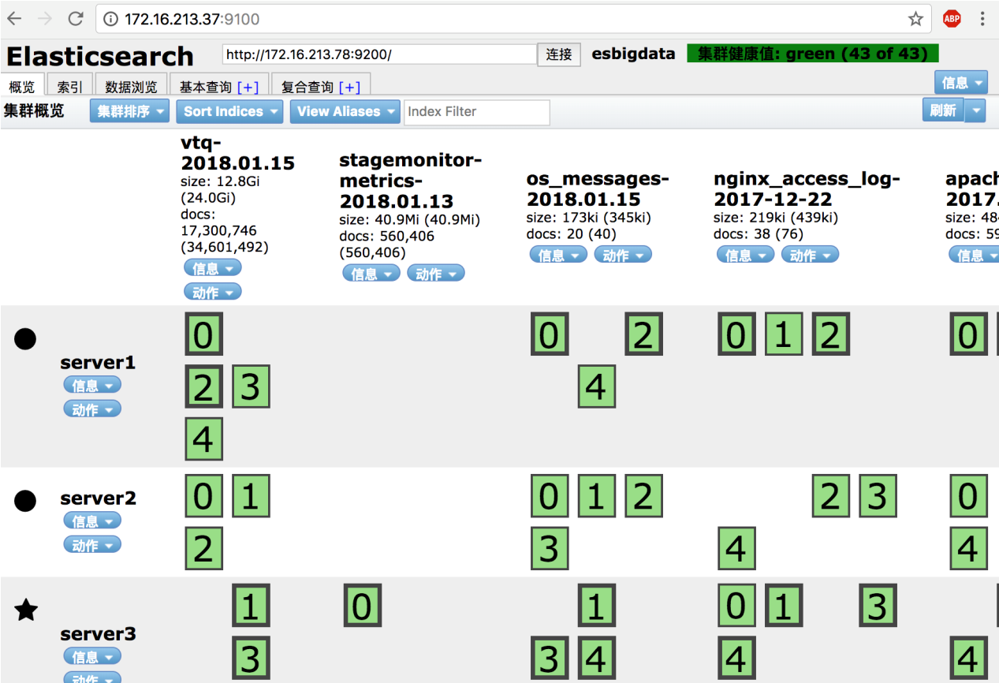
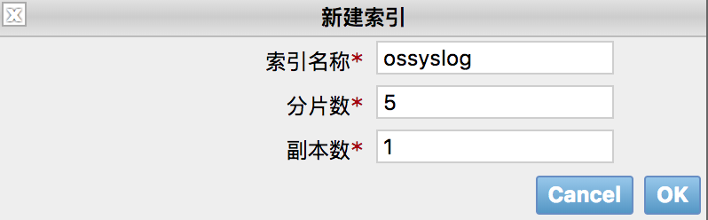
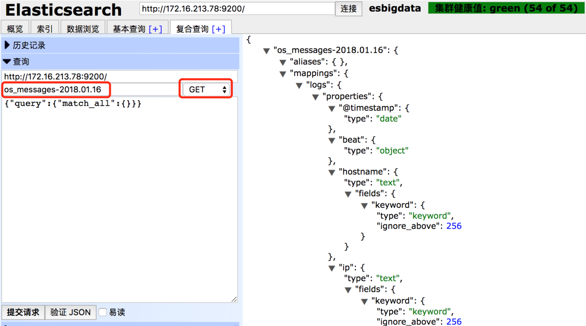
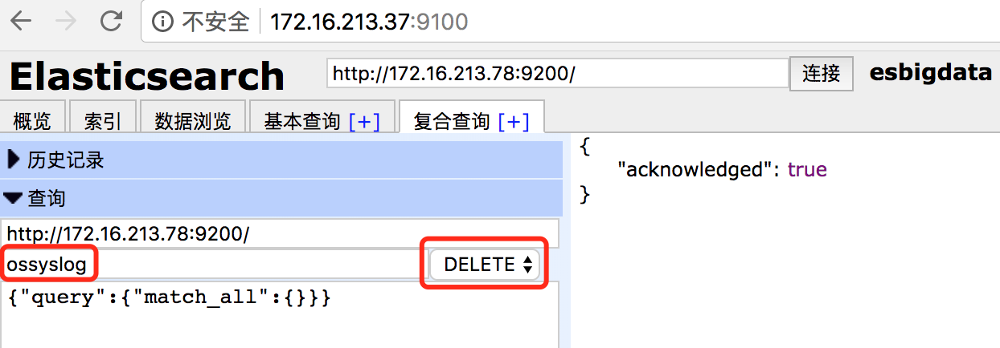

## 3.Elasticsearch的图形化界面工具的使用以及ZooKeeper集群的实现

## 1.安装Head插件

## 1.1 安装Head插件

Head插件是Elasticsearch的图形化界面工具，通过此插件可以很方便的对数据进行增删改查等数据交互操作。在Elasticsearch5.x版本以后，head插件已经是一个独立的Web App了，所以不需要和Elasticsearch进行集成。可以将Head插件安装到任何一台机器上，这里将Head插件安装到172.16.213.37（server1）机器上，读者可以从https://github.com/mobz/elasticsearch-head 下载此插件。

由于Head插件本质上是一个Node.js的工程，因此需要安装Node.js，使用npm工具来安装依赖的包。这里简单说下Node.js和NPM，作为知识的铺垫。

Node.js是一个Javascript运行环境，一个新兴的前端框架，用于方便地搭建响应速度快、易于扩展的网络应用。

NPM的全称是Node Package Manager，是一个Node.JS包管理和分发工具，它定义了包依赖关系标准，并提供了用于JavaScript开发所需要的各种常见第三方框架的下载。

在Centos7.x系统上，可以直接通过yum在线安装Node.js和NPM工具（前提是你的机器要能上网），操作如下：

```coffeescript
[root\@localhost \~]\# yum install -y nodejs npm
```

这里我们通过git克隆方式下载Head插件，所以还需要安装一个git命令工具，执行如下命令即可：

```coffeescript
[root\@localhost \~]\# yum install -y git
```

接着，开始安装head插件，这里将head插件安装到/usr/local目录下，操作过程如下：

```perl
[root\@localhost \~]\# cd /usr/local
[root\@localhost local]\# git clone git://github.com/mobz/elasticsearch-head.git
[root\@localhost local]\# npm config set registry
http://registry.npm.taobao.org/
[root\@localhost local]\# cd elasticsearch-head
[root\@localhost elasticsearch-head]\# npm install
```

其中，第一步是通过git命令从github克隆head插件程序，第二步是修改源地址为淘宝NPM镜像，因为默认NPM的官方源为 [https://registry.npmjs.org/](https://registry.npmjs.org/) ， 国内下载速度回很慢，所以建议切换到淘宝的NPM镜像站点。第四步是安装head插件所需的库和第三方框架。

克隆下来的head插件程序目录名为elasticsearch-head，进入此目录，修改配置文件 /usr/local/elasticsearch-head/\_site/app.js ,找到如下内容：

```bash
this.base_uri = this.config.base_uri || this.prefs.get("app-base_uri") || "http://localhost:9200";
```

将其中的

```plain
http://localhost:9200
```

修改为elasticsearch集群中任意一台主机的IP地址，这里修改为

```plain
<http://172.16.213.78:9200>
```

表示的意思是head插件将通过172.16.213.78（server3）访问elasticsearch集群。

注意，访问elasticsearch集群中的任意一个节点，都能获取集群的所有信息。

## 1.2 修改elasticsearch配置

在上面的配置中，将head插件访问集群的地址配置为172.16.213.78（server3）主机，下面还需要修改此主机上elasticsearch的配置，添加跨域访问支持。

修改elasticsearch配置文件，允许head插件跨域访问elasticsearch，在elasticsearch.yml文件最后添加如下内容：

```bash
http.cors.enabled: true
http.cors.allow-origin: "*"
```

其中，http.cors.enabled表示开启跨域访问支持，此值默认为false，http.cors.allow-origin表示跨域访问允许的域名地址，可以使用正则表达式，这里的“\*”表示允许所有域名访问。

## 1.3 启动head插件服务

所有配置完成之后，就可以启动插件服务了，执行如下操作：

```bash
[root\@localhost \~]# cd /usr/local/elasticsearch-head

[root\@localhost elasticsearch-head]# npm run start
```

head插件服务启动之后，默认的访问端口为9100，直接访问http://172.16.213.37:9100 就可以访问head插件了。

下图是配置完成后的一个head插件截图：



下面简单说明一下head插件的使用方法和技巧。

首先可以看到，elasticsearch集群有server1、server2和server3三个节点，其中，server3是目前的主节点。点击图上的信息按钮，可查看节点详细信息。

其次，从这个页面上可以看到elasticsearch基本的分片的信息，比如主分片、副本分片等等，以及多少可用分片。由于在elasticsearch配置中设置了5个分片，一个副本分片，因此可以看到每个索引都有10个分片，每个分片都用0、1、2、3、4等数字加方框表示，其中，粗体方框是主分片，细体方框是副本分片。

图中esbigdata是集群的名称，后面的“集群健康值”通过不同的颜色表示集群的健康状态：其中，绿色表示主分片和副本分片都可用；黄色表示只有主分片可用，没有副本分片；红色表示主分片中的部分索引不可用，但是某些索引还可以继续访问。正常情况下都显示绿色。

在索引页面可以创建索引，并且可以设置分片的数量，副本的数量等等。点击创建索引按钮，即可创建一个索引，例如：



在数据浏览页面可以看到每个索引的基本信息，比如都有什么字段，存储的内容等等。

在基本查询页面可以拼接一些基本的查询。

在复合查询页面，不仅仅可以做查询，还可以执行PUT、GET、  
DELETE等curl命令，所有需要通过curl执行的rest请求，都可以在这里执行。

例如，要查询一个索引的数据结构，可执行如下图的操作即可：



下面是删除索引数据，右边结果显示true的话，表示删除成功。



## 2.安装并配置ZooKeeper分布式集群

Zookeeper的安装和配置十分简单, 可以配置成单机模式,  
也可以配置成集群模式，这里将Zookeeper配置为集群模式。

## 2.1 ZooKeeper集群环境说明

对于集群模式下的ZooKeeper部署，官方建议至少要三台服务器，关于服务器的数量，推荐是奇数个（3、5、7、9等等），以实现ZooKeeper集群的高可用，这里使用三台服务器进行部署，服务器信息如下表所示：

| 节点名称 | IP地址 | 安装软件 |
| --- | --- | --- |
| kafkazk1 | 172.16.213.51 | JDK1.8、zookeeper-3.4.11 |
| kafkazk2 | 172.16.213.75 | JDK1.8、zookeeper-3.4.11 |
| kafkazk3 | 172.16.213.109 | JDK1.8、zookeeper-3.4.11 |

由于是部署集群模式的zookeeper，因此下面的操作需要在每个集群节点都执行一遍。

## 2.2 下载与安装ZooKeeper

ZooKeeper是用Java编写的，需要安装Java运行环境，这在前面章节已经介绍过了，这里不再介绍，读者可以从zookeeper官网https://zookeeper.apache.org/ 获取zookeeper安装包，这里安装的版本是zookeeper-3.4.11.tar.gz。将下载下来的安装包直接解压到一个路径下即可完成zookeeper的安装，这里统一将zookeeper安装到/usr/local目录下，基本操作过程如下：

```coffeescript
[root\@localhost \~]\# tar -zxvf zookeeper-3.4.11.tar.gz -C /usr/local

[root\@localhost \~]\# mv /usr/local/zookeeper-3.4.11 /usr/local/zookeeper
```

这里我们将zookeeper安装到了/usr/local目录下。

## 2.3 配置ZooKeeper

zookeeper安装到了/usr/local目录下，因此，zookeeper的配置模板文为/usr/local/zookeeper/conf/zoo\_sample.cfg，拷贝zoo\_sample.cfg并重命名为zoo.cfg，重点配置如下内容：

```makefile
tickTime=2000
initLimit=10
syncLimit=5
dataDir=/data/zookeeper
clientPort=2181
server.1=172.16.213.51:2888:3888
server.2=172.16.213.109:2888:3888
server.3=172.16.213.75:2888:3888
```

其中，每个配置项含义如下：

> \-tickTime：zookeeper使用的基本时间度量单位，以毫秒为单位，它用来控制心跳和超时。2000表示2tickTime。更低的tickTime值可以更快地发现超时问题。  
> \-initLimit：这个配置项是用来配置Zookeeper集群中Follower服务器初始化连接到Leader时，最长能忍受多少个心跳时间间隔数（也就是tickTime），这里设置为10个，即10\*2000=20秒。  
> \-syncLimit：这个配置项标识Leader与Follower之间发送消息，请求和应答时间长度最长不能超过多少个tickTime的时间长度，这里总的时间长度是5\*2000=10秒。  
> \-dataDir：必须配置项，用于配置存储快照文件的目录。需要事先创建好这个目录，如果没有配置dataLogDir，那么事务日志也会存储在此目录。  
> \-clientPort：zookeeper服务进程监听的TCP端口，默认情况下，服务端会监听2181端口。  
> \-server.A=B:C:D：其中A是一个数字，表示这是第几个服务器；B是这个服务器的IP地址；C表示的是这个服务器与集群中的Leader服务器通信的端口；D表示如果集群中的Leader服务器宕机了，需要一个端口来重新进行选举，选出一个新的Leader，而这个端口就是用来执行选举时服务器相互通信的端口。

除了修改zoo.cfg配置文件外，集群模式下还要配置一个文件myid，这个文件需要放在dataDir配置项指定的目录下，这个文件里面只有一个数字，如果要写入1，表示第一个服务器，与zoo.cfg文本中的server.1中的1对应，以此类推，在集群的第二个服务器zoo.cfg配置文件中dataDir配置项指定的目录下创建myid文件，写入2，这个2与zoo.cfg文本中的server.2中的2对应。本文中Zookeepe集群有三台服务器，可按照任意顺序，依次在每个服务器上创建myid文件写入1、2、3一个数字即可。Zookeeper在启动时会读取这个文件，得到里面的数据与zoo.cfg里面的配置信息比较，从而判断每个zookeeper server的对应关系。

为了保证zookeeper集群配置的规范性，建议将zookeeper集群中每台服务器的安装和配置文件路径都保存一致。例如将zookeeper统一安装到/usr/local目录下，配置文件统一为/usr/local/zookeeper/conf/zoo.cfg等。

## 2.4 启动zookeeper集群

Zookeeper集群所有节点配置完成后，就可以启动Zookeeper服务了，在三个节点依次执行如下命令，启动Zookeeper服务：

```coffeescript
[root\@localhost \~]\# cd /usr/local/zookeeper/bin

[root\@localhost bin]\# ./zkServer.sh start

[root\@localhost kafka]\# jps

23097 QuorumPeerMain
```

Zookeeper启动后，通过jps命令（jdk内置命令）可以看到有一个QuorumPeerMain标识，这个就是Zookeeper启动的进程，前面的数字是Zookeeper进程的PID。

Zookeeper启动后，在执行启动命令的当前目录下会生成一个zookeeper.out文件，这个就是Zookeeper的运行日志，可以通过此文件查看Zookeeper运行状态。

有时候为了启动Zookeeper方面，也可以添加zookeeper环境变量到系统的/etc/profile中，这样，在任意路径都可以执行“zkServer.sh start”命令了，添加环境变量的内容为：

```plain
export ZOOKEEPER_HOME=/usr/local/zookeeper

export PATH=\$PATH:\$ZOOKEEPER_HOME/bin
```

至此，zookeeper集群安装、配置完成。

@版权声明：51CTO独家出品，未经允许不能转载，否则追究法律责任

---------------------------------------------------


原网址: [访问](https://blog.51cto.com/cloumn/blog/243)

创建于: 2020-06-28 14:53:43

目录: default

标签: `blog.51cto.com`

