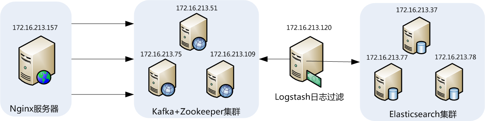
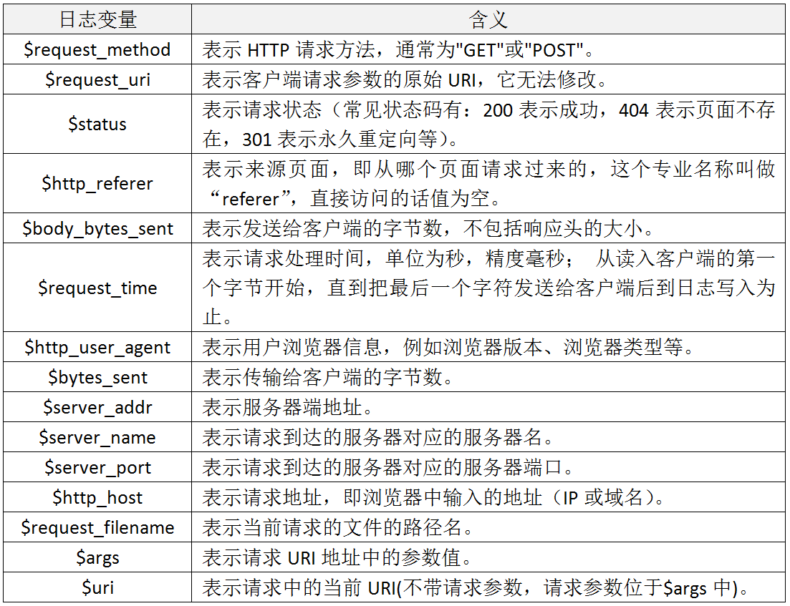
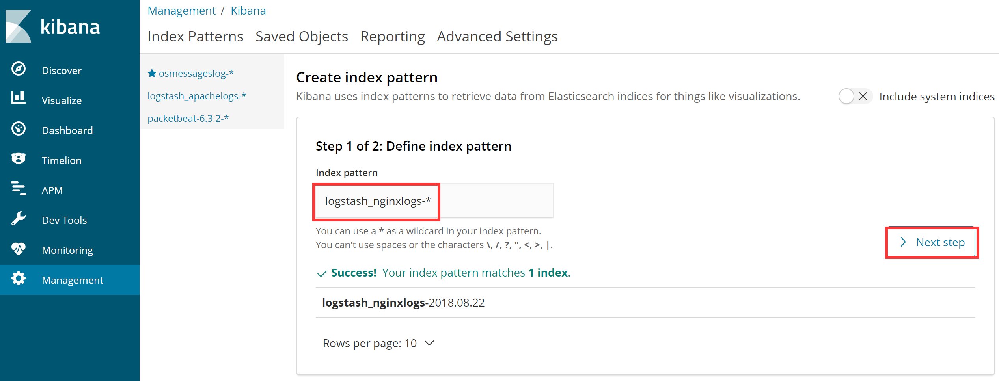
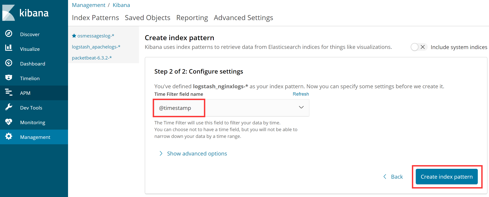
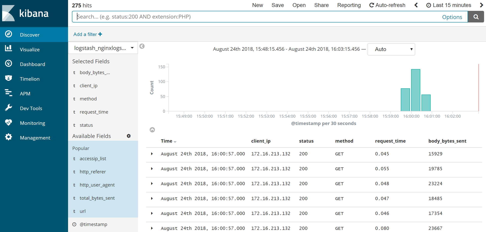

## 10.【案例】ELK收集Nginx访问日志实战案例

## 1 、ELK收集Nginx访问日志应用架构

这里我们仍以ELK+Filebeat+Kafka+ZooKeeper构建大数据日志分析平台一节的架构进行讲述，完整的拓扑结构如下图所示：



此架构需要8台服务器完成，每台服务器的作用和对应的IP信息都已经在图上进行了标注。最前面的一台是nginx服务器，用于产生日志，然后由filebeat来收集nginx产生的日志，filebeat将收集到的日志推送（push）到kafka集群中，完成日志的收集工作。接着，logstash去kafka集群中拉取（pull）日志并进行日志过滤、分析，之后将日志发送到elasticsearch集群中进行索引和存储，最后由Kibana完成日志的可视化查询。

在下面的介绍中，我们设定kafka集群和elasticsearch集群已经部署完成，在此基础上介绍如何通过filebeat和logstash收集与处理nginx日志。

ELK收集Nginx日志的方法与配置流程与收集Apache日志的方式完成相同，只不过，收集Nginx日志更简单一些。如果我们已经掌握了ELK收集Apache日志的方法，那么学习ELK收集Nginx日志将会非常简单。

## 2、Nginx的日志格式与日志变量

Nginx是目前最流行的web服务器，通过ELK收集Nginx日志也是必须要掌握的内容。Nginx跟Apache一样，都支持自定义输出日志格式，在进行Nginx日志格式定义前，先来了解一下关于多层代理获取用户真实IP的几个概念。

>  remote\_addr：表示客户端地址，但有个条件，如果没有使用代理，这个地址就是客户端的真实IP，如果使用了代理，这个地址就是上层代理的IP。
> 
>  X-Forwarded-For：简称XFF，这是一个HTTP扩展头，格式为 X-Forwarded-For: client, proxy1, proxy2，如果一个HTTP请求到达服务器之前，经过了三个代理 Proxy1、Proxy2、Proxy3，IP 分别为 IP1、IP2、IP3，用户真实IP为 IP0，那么按照 XFF标准，服务端最终会收到以下信息：  
> X-Forwarded-For: IP0, IP1, IP2

由此可知，IP3这个地址X-Forwarded-For并没有获取到，而remote\_addr刚好获取的就是IP3的地址。

还要几个容易混淆的变量，这里也列出来做下说明：

>  $remote\_addr：此变量如果走代理访问，那么将获取上层代理的IP，如果不走代理，那么就是客户端真实IP地址。  
>  $http\_x\_forwarded\_for：此变量获取的就是X-Forwarded-For的值。  
>  $proxy\_add\_x\_forwarded\_for：此变量是$http\_x\_forwarded\_for和$remote\_addr两个变量之和。

除了上面介绍的三个nginx日志变量之外，Nginx还有很多日志变量可供使用，下面列出一些常用的日志变量以及表示的含义，如下表所示：



## 3、自定义Nginx日志格式

Nginx的安装与配置这里不再介绍，仅仅介绍下Nginx配置文件中日志格式的定义方式。在掌握了Nginx日志变量的含义后，接着开始对它输出的日志格式进行改造，这里我们仍将Nginx日志输出设置为json格式，下面仅列出Nginx配置文件nginx.conf中日志格式和日志文件定义部分，定义好的日志格式与日志文件如下：

```makefile
map $http_x_forwarded_for $clientRealIp {   
        "" $remote_addr;
        ~^(?P<firstAddr>[0-9\.]+),?.*$ $firstAddr;
        }
log_format nginx_log_json '{"accessip_list":"$proxy_add_x_forwarded_for","client_ip":"$clientRealIp","http_host":"$host","@timestamp":"$time_iso8601","method":"$request_method","url":"$request_uri","status":"$status","http_referer":"$http_referer","body_bytes_sent":"$body_bytes_sent","request_time":"$request_time","http_user_agent":"$http_user_agent","total_bytes_sent":"$bytes_sent","server_ip":"$server_addr"}';
access_log  /var/log/nginx/access.log  nginx_log_json;
```

下面介绍下这段配置的含义：

上面这段配置是在nginx配置文件中http段添加的配置，这里用到了nginx的map指令，通过map定义了一个变量$clientRealIp，这个就是获取客户端真实IP的变量， map指令由ngx\_http\_map\_module模块提供,并且默认加载。

map这段配置的含义是：首选定义了一个$clientRealIp变量，然后，如果$http\_x\_forwarded\_for为" "（即为空），那么就会将$remote\_addr变量的值赋给$clientRealIp变量。而如果$http\_x\_forwarded\_for为非空时，通过一个“~^(?P<firstAddr>\[0-9.\]+),?.\*$”正则匹配，将第一个IP地址提取出来，并赋值给firstAddr，其实也就是将firstAddr的值赋给$clientRealIp变量。

接着，通过 log\_format指令自定义了nginx的日志输出格式，这里定义了13个字段，每个字段的含义在上个部分已经做了介绍。最后，通过access\_log指令指定了日志文件的存放路径。

## 4、验证日志输出

Nginx的日志格式配置完成后，重启Nginx，然后查看输出日志是否正常，如果能看到类似如下内容，表示自定义日志格式输出正常：

```json
{"accessip_list":"172.16.213.132","client_ip":"172.16.213.132","http_host":"172.16.213.157","@timestamp":"2018-02-28T12:26:26+08:00","method":"GET","url":"/img/guonian.png","status":"304","http_referer":"-","body_bytes_sent":"1699956","request_time":"0.000","http_user_agent":"Mozilla/5.0 (Windows NT 6.3; Win64; x64) AppleWebKit/537.36 (KHTML, like Gecko) Chrome/64.0.3282.140 Safari/537.36","total_bytes_sent":"1700201","server_ip":"172.16.213.157"}
{"accessip_list":"172.16.213.132, 172.16.213.120","client_ip":"172.16.213.132","http_host":"172.16.213.157","@timestamp":"2018-02-28T12:26:35+08:00","method":"GET","url":"/img/guonian.png","status":"304","http_referer":"-","body_bytes_sent":"1699956","request_time":"0.000","http_user_agent":"Mozilla/5.0 (Windows NT 6.3; Win64; x64) AppleWebKit/537.36 (KHTML, like Gecko) Chrome/64.0.3282.140 Safari/537.36","total_bytes_sent":"1700201","server_ip":"172.16.213.157"}
{"accessip_list":"172.16.213.132, 172.16.213.84, 172.16.213.120","client_ip":"172.16.213.132","http_host":"172.16.213.157","@timestamp":"2018-02-28T12:26:44+08:00","method":"GET","url":"/img/guonian.png","status":"304","http_referer":"-","body_bytes_sent":"1699956","request_time":"0.000","http_user_agent":"Mozilla/5.0 (Windows NT 6.3; Win64; x64) AppleWebKit/537.36 (KHTML, like Gecko) Chrome/64.0.3282.140 Safari/537.36","total_bytes_sent":"1700201","server_ip":"172.16.213.157"}
```

在这个输出中，可以看到，client\_ip和accessip\_list输出的异同，client\_ip字段输出的就是真实的客户端IP地址，而accessip\_list输出是代理叠加而成的IP列表，第一条日志，是直接访问http://172.16.213.157/img/guonian.png 不经过任何代理得到的输出日志，第二条日志，是经过一层代理访问http://172.16.213.120/img/guonian.png 而输出的日志，第三条日志，是经过二层代理访问http://172.16.213.84/img/guonian.png 得到的日志输出，在三条日志的输出中，观察accessip\_list的输出结果，可以看出$proxy\_add\_x\_forwarded变量的功能，而如果要想测试$http\_x\_forwarded\_for变量和$proxy\_add\_x\_forwarded变量的异同，可以在定义日志输出格式中，将$proxy\_add\_x\_forwarded变量替换为$http\_x\_forwarded\_for变量，查看日志输出结果即可。

Nginx中获取客户端真实IP的方法很简单，无需做特殊处理，这也给后面编写logstash的事件配置文件减少了很多工作量。

## 5、配置filebeat

filebeat是安装在Nginx服务器上的，关于filebeat的安装与基础应用，在前面已经做过详细介绍了，这里不再说明，仅给出配置好的filebeat.yml文件的内容：

```plain
filebeat.inputs:
- type: log
  enabled: true
  paths:
   - /var/log/nginx/access.log
  fields:
    log_topic: nginxlogs
filebeat.config.modules:
  path: ${path.config}/modules.d/*.yml
  reload.enabled: false
name: 172.16.213.157
output.kafka:
  enabled: true
  hosts: ["172.16.213.51:9092", "172.16.213.75:9092", "172.16.213.109:9092"]
  version: "0.10"
  topic: '%{[fields.log_topic]}' 
  partition.round_robin:
    reachable_only: true
  worker: 2
  required_acks: 1
  compression: gzip
  max_message_bytes: 10000000
logging.level: debug
```

这个配置文件中，是将Nginx的访问日志/var/log/nginx/access.log内容实时的发送到kafka集群topic为nginxlogs中。需要注意的是filebeat输出日志到kafka中配置文件的写法。

配置完成后，启动filebeat即可：

```coffeescript
[root@filebeatserver ~]# cd /usr/local/filebeat
[root@filebeatserver filebeat]# nohup  ./filebeat -e -c filebeat.yml &
```

启动完成后，可查看filebeat的启动日志，观察启动是否正常。

## 6、配置logstash

由于在Nginx输出日志中已经定义好了日志格式，因此在logstash中就不需要对日志进行过滤和分析操作了，下面直接给出logstash事件配置文件kafka\_nginx\_into\_es.conf的内容：

```php
input {
    kafka {
        bootstrap_servers => "172.16.213.51:9092,172.16.213.75:9092,172.16.213.109:9092"
        topics => "nginxlogs"       #指定输入源中需要从哪个topic中读取数据，这里会自动新建一个名为nginxlogs的topic
        group_id => "logstash"
        codec => json {
           charset => "UTF-8"
        }
        add_field => { "[@metadata][myid]" => "nginxaccess-log" }   #增加一个字段，用于标识和判断，在output输出中会用到。
    }
}

filter {
    if [@metadata][myid] == "nginxaccess-log" {
     mutate {
        gsub => ["message", "\\x", "\\\x"]   #这里的message就是message字段，也就是日志的内容。这个插件的作用是将message字段内容中UTF-8单字节编码做替换处理，这是为了应对URL有中文出现的情况。
      }
      if ( 'method":"HEAD' in [message] ) {    #如果message字段中有HEAD请求，就删除此条信息。
           drop {}
      }
      json {
            source => "message"
            remove_field => "prospector"      
            remove_field => "beat"           
            remove_field => "source"
            remove_field => "input"
            remove_field => "offset"
            remove_field => "fields"
            remove_field => "host"
            remove_field => "@version“
            remove_field => "message"        
}
    }
}
output {
    if [@metadata][myid] == "nginxaccess-log" {
        elasticsearch {
            hosts => ["172.16.213.37:9200","172.16.213.77:9200","172.16.213.78:9200"]
            index => "logstash_nginxlogs-%{+YYYY.MM.dd}"   #指定Nginx日志在elasticsearch中索引的名称，这个名称会在Kibana中用到。索引的名称推荐以logstash开头，后面跟上索引标识和时间。
        }
    }
}
```

这个logstash事件配置文件非常简单，没对日志格式或逻辑做任何特殊处理，由于整个配置文件跟elk收集apache日志的配置文件基本相同，因此不再做过多介绍。所有配置完成后，就可以启动logstash了，执行如下命令：

```coffeescript
[root@logstashserver ~]# cd /usr/local/logstash
[root@logstashserver logstash]# nohup bin/logstash -f kafka_nginx_into_es.conf &
```

logstash启动后，可以通过查看logstash日志，观察是否启动正常，如果启动失败，会在日志中有启动失败提示。

## 7、配置Kibana

Filebeat从nginx上收集数据到kafka，然后logstash从kafka拉取数据，如果数据能够正确发送到elasticsearch，我们就可以在Kibana中配置索引了。  
登录Kibana，首先配置一个index\_pattern，点击kibana左侧导航中的Management菜单，然后选择右侧的Index Patterns按钮，最后点击左上角的Create index pattern，开始创建一个index pattern，如下图所示：





这里填写Nginx日志对应的索引名称logstash\_nginxlogs-\*，然后选择时间过滤器字段名为“@timestamp”。最后点击“Create index pattern”创建索引即可。索引创建完成，点击kibana左侧导航中的Discover导航栏，即可展示已经收集到的日志信息，如下图所示：  


至此，ELK收集Nginx日志的配置工作完成。
