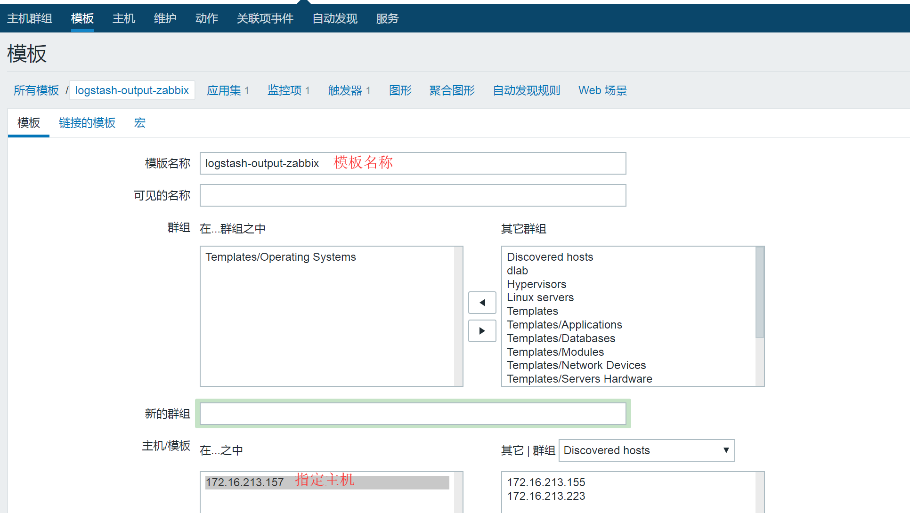
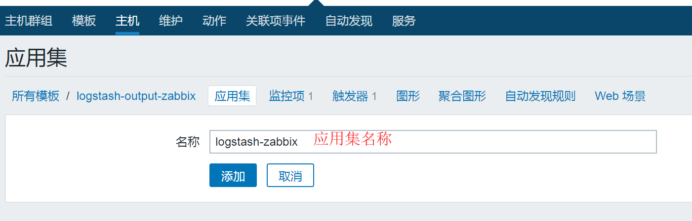
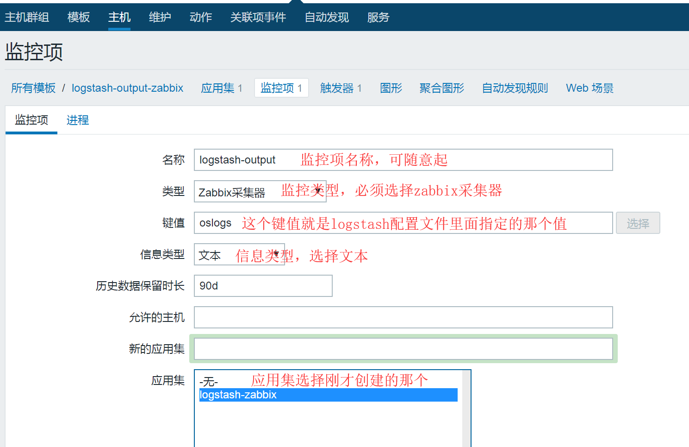
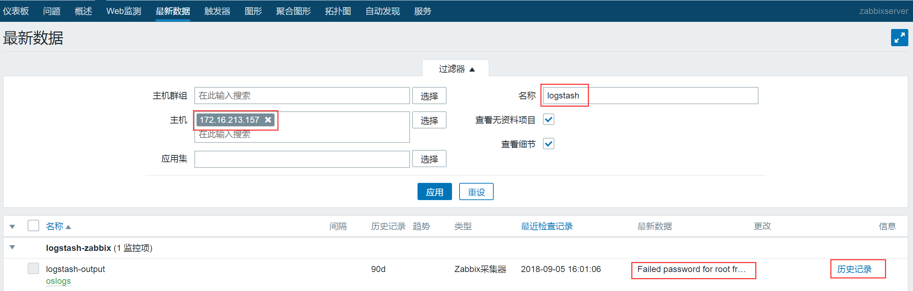
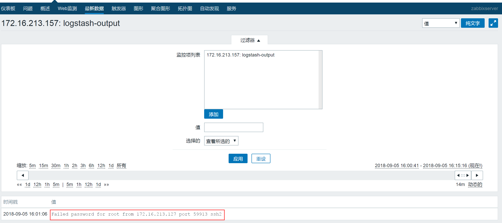
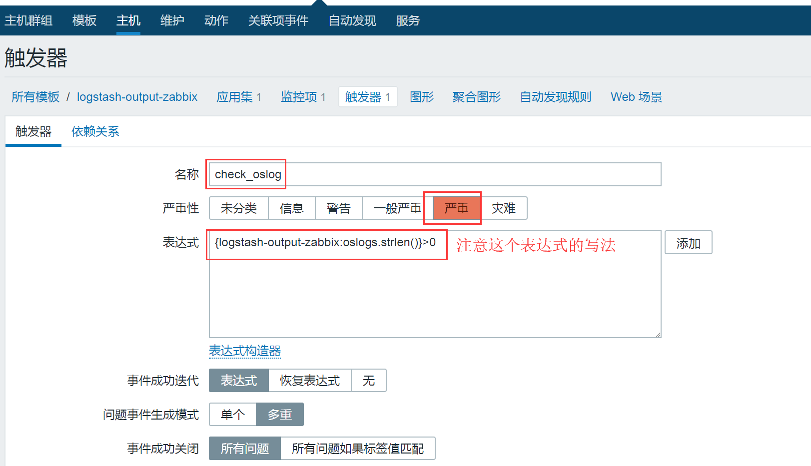
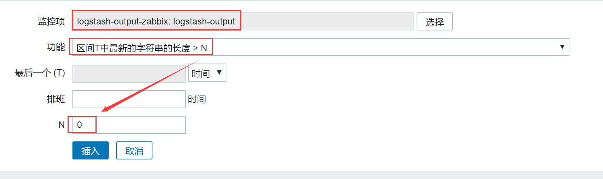
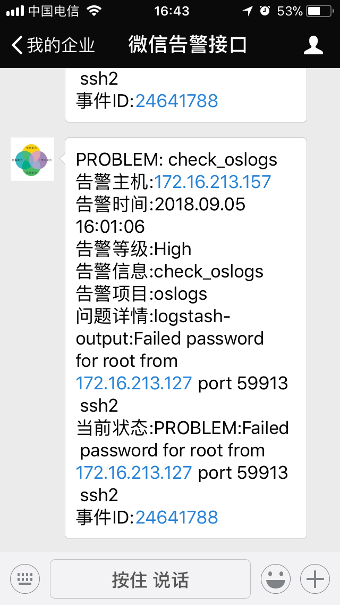

## 11.Filebeat+Logstash通过Zabbix实现日志监控告警

## 1、Logstash与插件的使用

Logstash支持多种输出介质，比如syslog、HTTP、TCP、elasticsearch、kafka等，而有时候我们想将收集到的日志中一些错误信息输出，并告警时，就用到了logstash-output-zabbix这个插件，此插件可以将Logstash与zabbix进行整合，也就是将Logstash收集到的数据进行过滤，将有错误标识的日志输出到zabbix中，最后通过zabbix的告警机制进行触发、告警。

logstash-output-zabbix是一个社区维护的插件，它默认没有在Logstash中安装,但是安装起来也很容易，直接在logstash中运行如下命令即可：

```sql
/usr/local/logstash/bin/logstash-plugin install logstash-output-zabbix
```

其中，/usr/local/logstash是Logstash的安装目录。

此外，logstash-plugin命令还有多种用法，我们来看一下：

### 1.1、列出目前已经安装的插件

将列出所有已安装的插件

> /usr/local/logstash/bin/logstash-plugin list

#将列出已安装的插件及版本信息

> /usr/local/logstash/bin/logstash-plugin list --verbose

#将列出包含namefragment的所有已安装插件

> /usr/local/logstash/bin/logstash-plugin list "http"

#将列出特定组的所有已安装插件（ input，filter，codec，output）

> /usr/local/logstash/bin/logstash-plugin list --group input

### 1.2、安装插件

要安装某个插件，例如安装kafka插件，可执行如下命令：

> /usr/local/logstash/bin/logstash-plugin install logstash-output-kafka

要使用此命令安装插件，需要你的电脑可以访问互联网。此插件安装方法，会检索托管在公共存储库（RubyGems.org）上的插件，然后下载到本地机器并在Logstash安装之上进行自动安装。

### 1.3、更新插件

每个插件有自己的发布周期和版本更新，这些更新通常是独立于Logstash的发布周期的。因此，有时候需要单独更新插件，可以使用update子命令获得最新版本的插件。

将更新所有已安装的插件

> /usr/local/logstash/bin/logstash-plugin update

将仅更新指定的插件

> /usr/local/logstash/bin/logstash-plugin update logstash-output-kafka

### 1.4、删除插件

如果需要从Logstash插件中删除插件，可执行如下命令：

> /usr/local/logstash/bin/logstash-plugin remove logstash-output-kafka

这样就删除了logstash-output-kafka插件。

## 2、logstash-output-zabbix插件的使用

logstash-output-zabbix安装好之后，就可以在logstash配置文件中使用了，

下面是一个logstash-output-zabbix使用的例子：

```php
zabbix {
        zabbix_host => "[@metadata][zabbix_host]"
        zabbix_key => "[@metadata][zabbix_key]"
        zabbix_server_host => "x.x.x.x"
        zabbix_server_port => "xxxx"
        zabbix_value => "xxxx"
        }
```

其中：

> zabbix\_host：表示Zabbix主机名字段名称， 可以是单独的一个字段， 也可以是 @metadata 字段的子字段， 是必需的设置，没有默认值。
> 
> zabbix\_key：表示Zabbix项目键的值，也就是zabbix中的item，此字段可以是单独的一个字段， 也可以是 @metadata 字段的子字段，没有默认值。
> 
> zabbix\_server\_host：表示Zabbix服务器的IP或可解析主机名，默认值是 "localhost"，需要设置为zabbix server服务器所在的地址。
> 
> zabbix\_server\_port：表示Zabbix服务器开启的监听端口，默认值是10051。
> 
> zabbix\_value：表示要发送给zabbix item监控项的值对应的字段名称，默认值是 "message"，也就是将"message"字段的内容发送给上面zabbix\_key定义的zabbix item监控项，当然也可以指定一个具体的字段内容发送给zabbix item监控项。

## 3、将logstash与zabbix进行整合

这里我们仍以ELK+Filebeat+Kafka+ZooKeeper构建大数据日志分析平台一节的架构进行讲述，由于日志已经全部进入kafka集群中，所以接下来对日志的过滤，然后选择关键字进行告警的工作，就可以在logstash上完成。

先说明一下我们的应用需求：通过对系统日志文件的监控，然后去过滤日志信息中的一些关键字，例如ERR、error、ERROR、Failed、WARNING等，将日志中这些信息过滤出来，然后发送到zabbix上，最后借助zabbix的报警功能实现对系统日志中有上述关键字的告警。

> 对于过滤关键字，进行告警，不同的业务系统，可能关键字不尽相同，例如对http系统，可能需要过滤500、403、503等这些错误码，对于java相关的系统，可能需要过滤OutOfMemoryError、PermGen、Java heap等关键字。在某些业务系统的日志输出中，可能还有一些自定义的错误信息，那么这些也需要作为过滤关键字来使用。

### 3.1、配置filebeat

这里我们是通过filebeat收集操作系统上的系统日志信息的，因此需要配置filebeat，直接给出filebeat配置文件的内容：

```plain
filebeat.inputs:
- type: log
  enabled: true
  paths:
   - /var/log/secure
   - /var/log/messages
   - /var/log/cron
  fields:
    log_topic: osmessages
processors:
 - drop_fields:
    fields: ["beat", "input", "source", "offset", "prospector"] #这里在filebeat中直接去掉不需要的字段。
filebeat.config.modules:
  path: ${path.config}/modules.d/*.yml
  reload.enabled: false
name: 172.16.213.157        #这是日志输出标识，表明日志来自哪个主机，后面再logstash会用到。
output.kafka:
  enabled: true
  hosts: ["172.16.213.51:9092", "172.16.213.75:9092", "172.16.213.109:9092"]    #日志输出到kafka集群
  version: "0.10"
  topic: '%{[fields.log_topic]}' 
  partition.round_robin:
    reachable_only: true
  worker: 2
  required_acks: 1
  compression: gzip
  max_message_bytes: 10000000
logging.level: debug
```

这里通过filebeat监控了三个系统日志文件：/var/log/secure、/var/log/messages和/var/log/cron，这三个文件的格式是一致的。因此可以放到一起。

### 3.2、配置logstash事件配置文件

接下来就是创建一个logstash事件配置文件，这里将配置文件分成三个部分来介绍，首先是input部分，内容如下：

```php
input {
        kafka {
        bootstrap_servers => "172.16.213.51:9092,172.16.213.75:9092,172.16.213.109:9092"
        topics => ["osmessages"]
        codec => "json"
        }
}
```

input部分是从kafka集群中消费日志数据，这里消费的是topic是osmessages，由于数据在kafka中的存储格式是json，因此读取的时候也需要用json格式。

接着是filter部分，内容如下：

```php
filter {
    if [fields][log_topic] == "osmessages" {
             mutate {
             add_field => [ "[zabbix_key]", "oslogs" ]      #新增的字段，字段名是zabbix_key，值为oslogs。
             add_field => [ "[zabbix_host]", "%{[host][name]}" ]   #新增的字段，字段名是zabbix_host，值可以在这里直接定义，也可以引用字段变量来获取。这里的%{[host][name]获取的就是日志数据的来源IP，这个来源IP在filebeat配置中的name选项进行定义。
             }
         }
    grok {
             match => { "message" => "%{SYSLOGTIMESTAMP:message_timestamp} %{SYSLOGHOST:hostname} %{DATA:message_program}(?:\[%{POSINT:messag
e_pid}\])?: %{GREEDYDATA:message_content}" }        #这里通过grok对message字段的数据进行字段划分，这里将message字段划分了5个子字段。其中，message_content字段会在output中用到。
        }
        mutate {        #这里是删除不需要的字段
            remove_field => "@version"
            remove_field => "message"
        }
        date {      #这里是对日志输出中的日期字段进行转换，其中message_timestamp字段是默认输出的时间日期字段，将这个字段的值传给 @timestamp字段。
                match => [ "message_timestamp","MMM  d HH:mm:ss", "MMM dd HH:mm:ss", "ISO8601"]
        }
}
```

filter部分是个重点，首先有个if判断，注意这里对字段的应用方式，\[fields\]\[log\_topic\]这个字段是在filebeat中定义的，使用if判断可以对多个日志类别进行过滤、分析，根据不同字段的标识区分不同的任务。  
在这个部分中，重点关注的是message\_timestamp字段、message\_content字段。

最后是output部分，内容如下：

```plain
output {
        if [message_content]  =~ /(ERR|error|ERROR|Failed)/  {      #定义在message_content字段中，需要过滤的关键字信息，也就是在message_content字段中出现给出的这些关键字，那么就将这些信息发送给zabbix。
              zabbix {
                        zabbix_host => "[zabbix_host]"      #这个zabbix_host将获取上面filter部分定义的字段变量%{[host][name]的值
                        zabbix_key => "[zabbix_key]"        #这个zabbix_key将获取上面filter部分中给出的值
                        zabbix_server_host => "172.16.213.140"  #这是指定zabbix server的IP地址
                        zabbix_server_port => "10051"           #这是指定zabbix server的监听端口
                        zabbix_value => "message_content"              #这个很重要，指定要传给zabbix监控项item（oslogs）的值， zabbix_value默认的值是"message"字段，因为上面我们已经删除了"message"字段，因此，这里需要重新指定，根据上面filter部分对"message"字段的内容划分，这里指定为"message_content"字段，其实，"message_content"字段输出的就是服务器上具体的日志内容。
                        }
                    }
              #stdout { codec => rubydebug }   #这里是开启调试模式，当第一次配置的时候，建议开启，这样过滤后的日志信息直接输出的屏幕，方便进行调试，调试成功后，即可关闭。
}
```

将上面三部分内容合并到一个文件kafka\_os\_into\_es.conf中，然后启动logstash服务：

```coffeescript
[root@logstashserver ~]#cd /usr/local/logstash
[root@logstashserver logstash]#nohup bin/logstash -f config/kafka_os_into_es.conf --path.data /data/osdata &
```

这里的--path.data是指定此logstash进程的数据存储目录，用于在一个服务器上启动多个logstash进程的环境中。

### 3.3、zabbix平台配置日志告警

登录zabbix web平台，选择配置--->模板--->创建模板，名称定为logstash-output-zabbix，如下图所示：  


接着，在此模块下创建一个应用集，点击应用集----->创建应用集，如下图所示：



然后，在此模块下创建一个监控项，点击监控项----->创建监控项，如下图所示：  


到此为止，zabbix监控logstash的日志数据配置完成。

这里我们模拟一个故障，在任意主机通过ssh登录172.16.213.157主机，然后输入一个错误密码，让系统的/var/log/secure文件产生错误日志，然后看看logstash是否能够过滤到，是否能够发送到zabbix中。

首先让系统文件/var/log/secure产生类似如下内容：

```coffeescript
Sep  5 16:01:04 localhost sshd[27159]: pam_unix(sshd:auth): authentication failure; logname= uid=0 euid=0 tty=ssh ruser= rhost=172.16.213.127  user=root
Sep  5 16:01:06 localhost sshd[27159]: Failed password for root from 172.16.213.127 port 59913 ssh2
```

这里面有我们要过滤的关键字Failed，因此logstash会将此内容过滤出来，发送到zabbix上。

接着，登录zabbix web平台，点击监测中----->最新数据，如果zabbix能够接收到日志，就可以看到下图的最新数据：



点击历史记录，可以查看详细内容，如下图所示：  


可以看到，红框中的内容就是在logstash中定义的message\_content字段的内容。

到这里为止，zabbix已经可以收到logstash的发送过来的数据了，但是要实现报警，还需要在zabbix中创建一个触发器，进入配置----->模板，选择logstash-output-zabbix这个模板，然后点击上面的触发器，继续点击右上角的创建触发器，如下图所示：  




这里注意触发器创建中，表达式的写法，这里触发器的触发条件是：如果接收到logstash发送过来的数据，就进行告警，也就是说接收到的数据，如果长度大于0就告警。

触发器配置完成后，如果配置正常，就会进行告警了，告警内容如下图所示：



