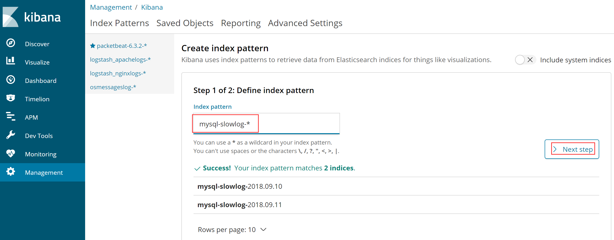
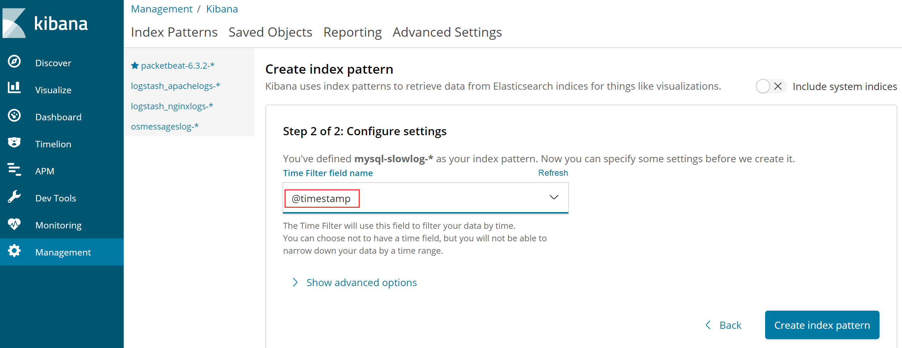
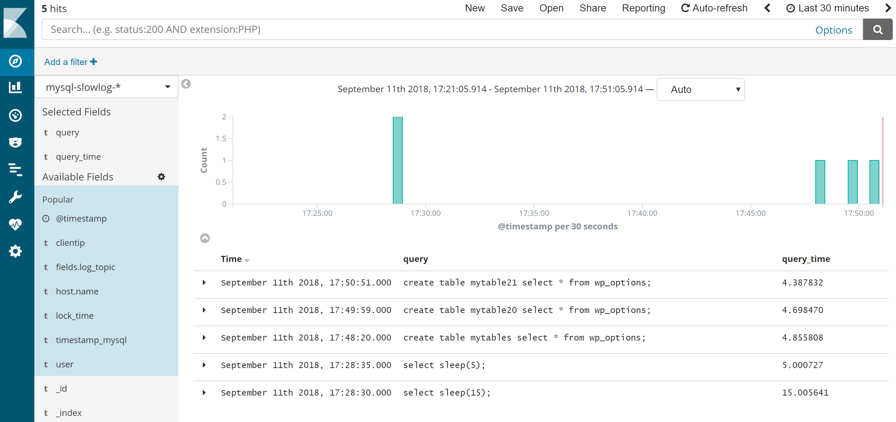
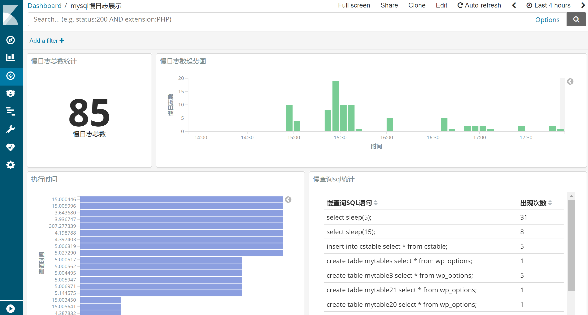

## 12.【案例】通过ELK收集mysql慢查询日志数据

# 1、开启慢查询日志

## 1.1、什么是慢查询日志

在应用程序连接mysql过程中，某些sql语句由于写的不是很标准，会导致执行完毕所花费的时间特别长，SQL语句执行时间过长，势必影响业务系统的使用，这个时候可能就会出现开发人员和运维人员相互扯皮的问题，那么如何帮助运维人员解决这样的困境呢，其实通过ELK工具，就可以轻松解决：开启mysql慢查询日志，然后将日志收集到统一展示平台，每个SQL语句的写法、执行时间、读取时间等等指标可以尽收眼底，孰是孰非，一目了然。

先介绍一下mysql中的慢查询日志，首先不要被"慢查询日志"的名字误导，不要错误的以为慢查询日志只会记录执行比较慢的SELECT语句，其实完全不是这样的，除了SELECT语句，INSERT、DELETE、UPDATE、CALL等DML操作，只要是超过了指定的时间，都可以称之为"慢查询"。

要将慢查询的SQL记录到慢查询日志中，需要一个超时时间，这个时间在mysql中进行设置，所有进入mysql的语句，只要执行时间超过设置的这个时间阀值，都会被记录在慢查询日志中。默认设置下，执行超过10秒的语句才会被记录到慢查询日志中，当然，对于"慢"的定义，每个业务系统，每个环境各不相同，超过多长时间才是我们认为的"慢"，可以自定义。

在默认情况下，mysql慢查询日志功能是关闭的，如果需要，可以手动开启，具体如何开启，下面我们将进行介绍。

## 1.2、mysql与慢查询日志相关的参数

在介绍开启mysql慢查询日志功能之前，首先介绍下跟慢查询日志相关的几个mysql参数：

> （1）log\_slow\_queries ：表示是否开启慢查询日志，mysql5.6以前的版本使用此参数指定是否开启慢查询日志，mysql5.6以后的版本使用slow\_query\_log取代了此参数，如果你使用的mysql版本刚好是mysql5.5，那么可以看到这两个参数是同时存在的，此时不用同时设置它们，我们只需设置这两个参数中的任何一个即可，另一个也会自动保持一致。
> 
> （2）slow\_query\_log ：表示是否开启慢查询日志，此参数与log\_slow\_queries的作用没有区别，mysql5.6以后的版本使用此参数替代log\_slow\_queries。
> 
> （3）log\_output : 表示当慢查询日志开启以后，以哪种方式存放慢查询日志，log\_output有4个值可以选择，分别是"FILE"、"TABLE"、"FILE,TABLE"和"NONE"。此值为"FILE"表示慢查询日志存放于指定的文件中，此值为"TABLE"表示慢查询日志存放于mysql库的slow\_log表中，此值为"FILE,TABLE"表示将慢查询日志同时存放于指定的文件与slow\_log表中，一般不会进行这样的设置，因为这样会增加很多IO压力，如果开启，建议设置为"table"或“file”,此值为"NONE"时表示不记录查询日志，即使slow\_query\_log设置为ON，如果log\_output设置为NONE，也不会记录慢查询日志，其实，log\_output不止用于控制慢查询日志的输出，查询日志的输出也是由此参数进行控制，也就是说，log\_output设置为file，就表示查询日志和慢查询日志都存放到对应的文件中，设置为table，查询日志和慢查询日志就都存放在对应的数据库表中。
> 
> （4）slow\_query\_log\_file ：当使用文件存储慢查询日志时(log\_output设置为"FILE"或者"FILE,TABLE"时)，指定慢查询日志存储于哪个日志文件中，默认的慢查询日志文件名为"主机名-slow.log"，慢查询日志的位置为datadir参数所对应的目录位置，默认情况下为 /var/lib/mysql目录。
> 
> （5）long\_query\_time ：表示"多长时间的查询"被认定为"慢查询"，这就是慢查询的时间阀值，此值默认值为10秒，表示超过10秒的查询会被认定为慢查询。
> 
> （6）log\_queries\_not\_using\_indexes ：表示如果运行的sql语句没有使用到索引，是否也被当做慢查询语句记录到慢查询日志中，OFF表示不记录，ON表示记录。
> 
> （7）log\_throttle\_queries\_not\_using\_indexes ：这是mysql5.6.5版本新引入的参数，当log\_queries\_not\_using\_inde设置为ON时，没有使用索引的查询语句也会被当做慢查询语句记录到慢查询日志中，通过使用log\_throttle\_queries\_not\_using\_indexes可以限制这种语句每分钟记录到慢查询日志中的次数，因为在生产环境中，有可能有很多没有使用索引的语句，此类语句频繁的被记录到慢查询日志中，可能会导致慢查询日志快速不断的增长，dba可以通过此参数进行控制。

## 1.3、开启mysql的慢查询日志

首先，开启慢查询日志功能，由于当前使用的mysql版本为5.7，先查询下上面各个参数的默认配置信息：

```ruby
mysql> show variables like "%log_output%";
+---------------+-------+
| Variable_name | Value |
+---------------+-------+
| log_output    | FILE  |
+---------------+-------+
1 row in set (0.00 sec)

mysql> show variables like "%slow%";
+---------------------------+--------------------------------+
| Variable_name             | Value                          |
+---------------------------+--------------------------------+
| log_slow_admin_statements | OFF                            |
| log_slow_slave_statements | OFF                            |
| slow_launch_time          | 2                              |
| slow_query_log            | OFF                            |
| slow_query_log_file       | /db/data/SparkWorker1-slow.log |
+---------------------------+--------------------------------+
5 rows in set (0.00 sec)

mysql> show variables like "%long_query_time%";
+-----------------+-----------+
| Variable_name   | Value     |
+-----------------+-----------+
| long_query_time | 10.000000 |
+-----------------+-----------+
1 row in set (0.01 sec)
```

从输出可知，log\_output是file， slow\_query\_log是off状态，slow\_query\_log\_file 的路径为/db/data/SparkWorker1-slow.log，而long\_query\_time就是默认的10秒。

下面在SQL命令行global级别动态修改这几个参数，执行如下：

```shell
mysql> set global slow_query_log=ON;
mysql> set global long_query_time=1;
```

第一个命令是动态开启慢查询日志功能，第二个命令是设置慢查询的超时时间为1秒（这里为测试方便，所以设置超时时间比较短，生产环境可根据需要自定义设置）

开启慢查询日志以后，将慢查询的时间界限设置为1秒，需要注意，在当前会话中查询设置是否生效时，需要加上global关键字，或者在一个新的数据库连接中进行查询，否则可能无法查看到最新的更改，在当前会话中，虽然全局变量已经发生改变，但是当前会话的变量值仍然没有被改变。

```plain
mysql> select @@global.long_query_time;
+--------------------------+
| @@global.long_query_time |
+--------------------------+
|                 1.000000 |
+--------------------------+
1 row in set (0.00 sec)
```

为了让设置永久生效，可将上面配置写入my.cnf文件中，编辑/etc/my.cnf，添加如下内容：

```plain
slow_query_log=ON
slow_query_log_file=/db/data/SparkWorker1-slow.log
long_query_time=1
```

等下次需要重启mysql服务时，重启后，就永久生效了。

接下来，执行下面一个语句：

```perl
mysql>  select sleep(5);
+----------+
| sleep(5) |
+----------+
|        0 |
```

此处我们故意使语句的执行时间超过1秒，然后查看慢查询日志中是否会记录这些语句。

打开/db/data/SparkWorker1-slow.log文件，发现有如下内容产生：

```shell
# Time: 2018-09-10T09:03:20.413647Z
# User@Host: root[root] @  [172.16.213.120]  Id:   484
# Query_time: 5.010390  Lock_time: 0.000000 Rows_sent: 1  Rows_examined: 0
SET timestamp=1536570200;
select sleep(5);
```

我们也可以使用如下语句，查看从mysql服务启动以后到现在，一共记录了多少条慢查询语句：

```shell
mysql> show global status like '%slow_queries%';
```

但是需要注意，这个查询只是本次mysql服务启动后到当前时间点的慢查询次数统计，当mysql重启以后，如下值将清零后重新计算，而慢查询日志与slow\_log表中的慢查询日志则不会被清除。

# 2、慢查询日志分析

下面首先给出各个mysql版本慢查询日志的格式：

mysql5.5版本慢查询日志格式：

```shell
# Time: 180911 10:50:31
# User@Host: osdb[osdb] @  [172.25.14.78]
# Query_time: 12.597483  Lock_time: 0.000137 Rows_sent: 451  Rows_examined: 2637425
SET timestamp=1536634231;
SELECT id,name,contenet from cs_tables;
```

mysql5.6版本慢查询日志格式：

```shell
# Time: 180911 11:36:20
# User@Host: root[root] @ localhost []  Id:  1688
# Query_time: 3.006539  Lock_time: 0.000000 Rows_sent: 1  Rows_examined: 0
SET timestamp=1536550580;
SELECT id,name,contenet from cs_tables;
```

mysql5.7版本慢查询日志：

```plain
# Time: 2018-09-10T06:26:40.895801Z
# User@Host: root[root] @  [172.16.213.120]  Id:   208
# Query_time: 3.032884  Lock_time: 0.000139 Rows_sent: 46389  Rows_examined: 46389
use cmsdb;
SET timestamp=1536560800;
select * from cstable;
```

通过分析上面三个mysql版本的慢查询日志，得出如下结论：

> （1）、 每个Mysql版本的慢查询日志中Time字段格式都不一样  
> （2）、在mysql5.6、5.7版本中有一个id字段，而在mysql5.5版本中是没有Id字段的。  
> （3）、 每个慢查询语句是分多行完成的，并且每行中有多少不等的空格、回车等字符。  
> （4）、use db语句可能出现在慢查询中，也可以不出现。  
> （5）、每个慢查询语句的最后一部分是具体执行的sql，这个sql可能跨多行，也可能是多条sql语句。

根据对不同mysql版本慢查询日志的分析，得出如下日志收集处理思路：

> （1）、合并多行慢查询日志：mysql的慢查询日志多行构成了一条完整的日志，日志收集时需要把这些行拼装成一条日志传输与存储。  
> （2）、慢查询日志的开始行“# Time:”由于不同版本格式不相同，所以选择过滤丢弃此行即可，要获取sql的执行时间，可以通过SET timestamp这个值来确定。  
> （3）、慢查询完整的日志应该是以"# User@Host:"开始，以最后一条SQL结束，并且需要将多行合并为一行，组成一条完整的慢查询日志语句。  
> （4）、还需要确定SQL对应的主机，这个在慢查询日志中并没有输出，但是可以通过其他办法实现：可以通过在filebeat中的name字段来解决，也就是通过给filebeat的name字段设置为服务器IP，这样filebeat最终通过host.name这个字段就可以确定SQL对应的主机了。

# 3、配置Filebeat收集mysql慢查询日志

这里我们仍以ELK+Filebeat+Kafka+ZooKeeper构建大数据日志分析平台一节的架构进行讲述，这里选择mysql服务器的ip为172.16.213.232，logstash服务器的ip为172.16.213.120，首先在172.16.213.232上安装、配置filebeat，安装过程省略，配置好的filebeat.yml文件内容如下：

```plain
filebeat.inputs:
- type: log
  enabled: true
  paths:
   - /db/data/SparkWorker1-slow.log #这是指定mysql慢查询日志文件的路径
  fields:
    log_topic: mysqlslowlogs    #定义一个新字段log_topic，值为mysqlslowlogs，下面要进行引用。
  exclude_lines: ['^\# Time']   #过滤掉# Time开头的行
  multiline.pattern: '^\# Time|^\# User'       #匹配多行时指定正则表达式，这里匹配以# Time或者# User开头的行，Time行要先匹配再过滤
     multiline.negate: true   #开启多行合并功能
  multiline.match: after     #定义如何将匹配行组合成时间，在之前或者之后，有 "after"、 "before"两个值。

processors:
 - drop_fields:
    fields: ["beat", "input", "source", "offset", "prospector"]

filebeat.config.modules:
  path: ${path.config}/modules.d/*.yml

  reload.enabled: false
name: 172.16.213.232

output.kafka:
  enabled: true
  hosts: ["172.16.213.51:9092", "172.16.213.75:9092", "172.16.213.109:9092"]
  version: "0.10"
  topic: '%{[fields.log_topic]}' 
  partition.round_robin:
    reachable_only: true
  worker: 2
  required_acks: 1
  compression: gzip
  max_message_bytes: 10000000
logging.level: debug
```

> filebeat的配置，重点是multiline.negate选项，通过此选项，将mysql慢查询日志多行合并到了一起，输出为一条日志。

配置文件编写好后，启动filebeat服务即可：

```coffeescript
[root@filebeat232 ~]# cd /usr/local/filebeat
[root@filebeat232 filebeat]#nohup ./filebeat  -e -c filebeat.yml & 
```

输出日志可从nohup.out文件中查看。

# 4、通过Logstash的grok插件过滤、分析配置mysql日志

Logstash服务部署在172.16.213.120服务器上，下面给出Logstash事件配置文件，命名为kafka\_mysql\_into\_es.conf，内容如下：

```php
input {
        kafka {
        bootstrap_servers => "172.16.213.51:9092,172.16.213.75:9092,172.16.213.109:9092"
        topics => ["mysqlslowlogs"]
        }
}

filter {
    json {
        source => "message"
    }
 grok {
        # 有ID有use
        match => [ "message", "^#\s+User@Host:\s+%{USER:user}\[[^\]]+\]\s+@\s+(?:(?<clienthost>\S*) )?\[(?:%{IP:clientip})?\]\s+Id:\s+%{NUMBER:id}\n# Query_time: %{NUMBER:query_time}\s+Lock_time: %{NUMBER:lock_time}\s+Rows_sent: %{NUMBER:rows_sent}\s+Rows_examined: %{NUMBER:rows_examined}\nuse\s(?<dbname>\w+);\nSET\s+timestamp=%{NUMBER:timestamp_mysql};\n(?<query>[\s\S]*)" ]

        # 有ID无use
        match => [ "message", "^#\s+User@Host:\s+%{USER:user}\[[^\]]+\]\s+@\s+(?:(?<clienthost>\S*) )?\[(?:%{IP:clientip})?\]\s+Id:\s+%{NUMBER:id}\n# Query_time: %{NUMBER:query_time}\s+Lock_time: %{NUMBER:lock_time}\s+Rows_sent: %{NUMBER:rows_sent}\s+Rows_examined: %{NUMBER:rows_examined}\nSET\s+timestamp=%{NUMBER:timestamp_mysql};\n(?<query>[\s\S]*)" ]

      # 无ID有use
        match => [ "message", "^#\s+User@Host:\s+%{USER:user}\[[^\]]+\]\s+@\s+(?:(?<clienthost>\S*) )?\[(?:%{IP:clientip})?\]\n# Query_time: %{NUMBER:query_time}\s+Lock_time: %{NUMBER:lock_time}\s+Rows_sent: %{NUMBER:rows_sent}\s+Rows_examined: %{NUMBER:rows_examined}\nuse\s(?<dbname>\w+);\nSET\s+timestamp=%{NUMBER:timestamp_mysql};\n(?<query>[\s\S]*)" ]

        # 无ID无use
        match => [ "message", "^#\s+User@Host:\s+%{USER:user}\[[^\]]+\]\s+@\s+(?:(?<clienthost>\S*) )?\[(?:%{IP:clientip})?\]\n# Query_time: %{NUMBER:query_time}\s+Lock_time: %{NUMBER:lock_time}\s+Rows_sent: %{NUMBER:rows_sent}\s+Rows_examined: %{NUMBER:rows_examined}\nSET\s+timestamp=%{NUMBER:timestamp_mysql};\n(?<query>[\s\S]*)" ]
    }
    date {
        match => ["timestamp_mysql","UNIX"]     #这个是对慢查询日志中的时间字段进行格式转换，默认timestamp_mysql字段是Unix时间戳格式，将转换后的时间值赋给 @timestamp字段。
        target => "@timestamp"
    }
    mutate {
              remove_field => "@version"        #删除不需要的字段
            remove_field => "message"           #上面对"message"字段的内容已经分割成了多个小字段，因此"message"字段就不需要了，所以选择删除。
    }

output {
        elasticsearch {
        hosts => ["172.16.213.37:9200","172.16.213.77:9200","172.16.213.78:9200"]
        index => "mysql-slowlog-%{+YYYY.MM.dd}" #索引的名称
        }
}
```

此配置文件的难点在对mysql慢查询日志的过滤出来上，上面在filter的grok插件中，有四个match，其实是对慢查询日志的格式分成了四种情况，当有多条匹配规则存在时，logstash会从上到下依次匹配，只要匹配到一条后，下面的将不再进行匹配。

所有配置完成后，启动logstash服务：

```coffeescript
[root@logstashserver ~]#cd /usr/local/logstash
[root@logstashserver logstash]#nohup bin/logstash -f config/kafka_mysql_into_es.conf --path.data /data/mysqldata &
```

接着，让慢查询产生日志，执行如下操作：  
在远程主机172.16.213.120上登录172.16.213.232数据库，执行一个insert写入操作：

```shell
mysql> use cmsdb; 
mysql> insert into cstable select * from cstable;   
Query OK, 46812 rows affected (1 min 11.24 sec)
Records: 46812  Duplicates: 0  Warnings: 0
```

此insert操作耗费了1分钟以上，因此会记录到慢查询日志中，下面看看慢查询日志的输出内容：

```plain
# Time: 2018-09-10T09:09:28.697351Z
# User@Host: root[root] @  [172.16.213.120]  Id:   484
# Query_time: 71.251202  Lock_time: 0.000261 Rows_sent: 0  Rows_examined: 93624
SET timestamp=1536570568;
insert into cstable select * from cstable;
```

然后在Logstash配置文件中kafka\_mysql\_into\_es.conf进行调试，通过输出为rubydebug格式后，看到的对应内容如下：

```php
{
    "timestamp_mysql" => "1536570568",
             "fields" => {
        "log_topic" => "mysqlslowlogs"
    },
         "query_time" => "71.251202",
      "rows_examined" => "93624",
         "@timestamp" => 2018-09-10T09:09:28.000Z,
           "clientip" => "172.16.213.120",
          "rows_sent" => "0",
          "lock_time" => "0.000261",
                 "id" => "484",
               "host" => {
        "name" => "172.16.213.232"
    },
               "user" => "root",
              "query" => "insert into cstable select * from cstable;"
}
```

这就是我们要的输出结果。

5、Kibana平台创建mysql慢查询日志索引

登录Kibana平台，创建一个mysql慢查询日志索引，如下图所示：



只要数据能正常写入Elasticsearch，索引就可以查看到，这里写入mysql-slowlog-\*即可。

然后继续，选择日志排序方式，选择按照@timestamp进行排序，如下图所示：  


最后，点击创建索引，即可完成。

索引创建完成后，点击左侧导航的discover，即可查看慢查询日志，如下图所示：  


还可以根据需要，添加具体的多维度、可视化图形，下面是我做好的一个Dashboard，如下图所示：  


至此，ELK收集mysql慢查询日志数据工作完成。

