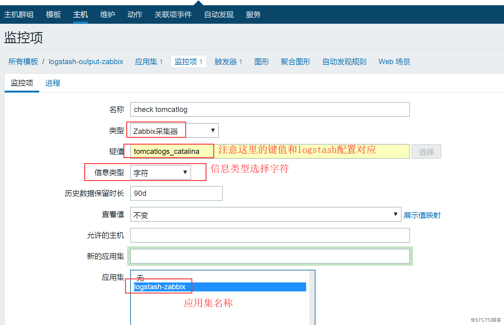
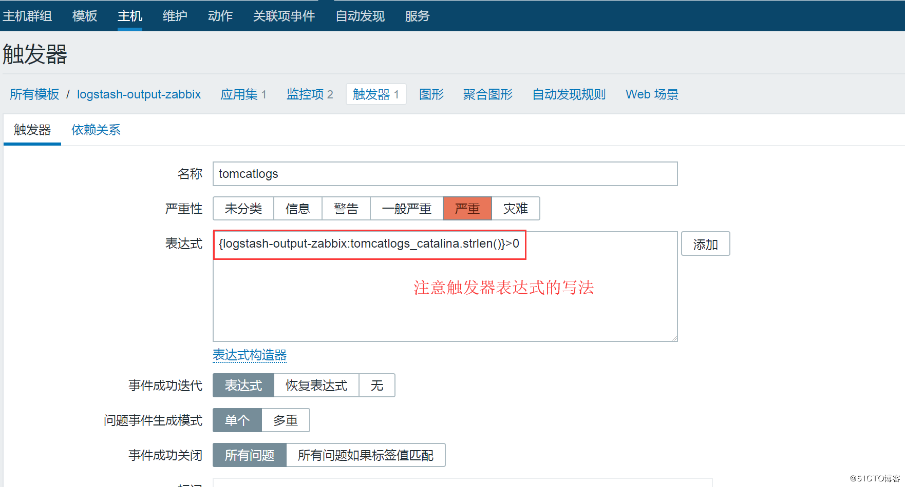
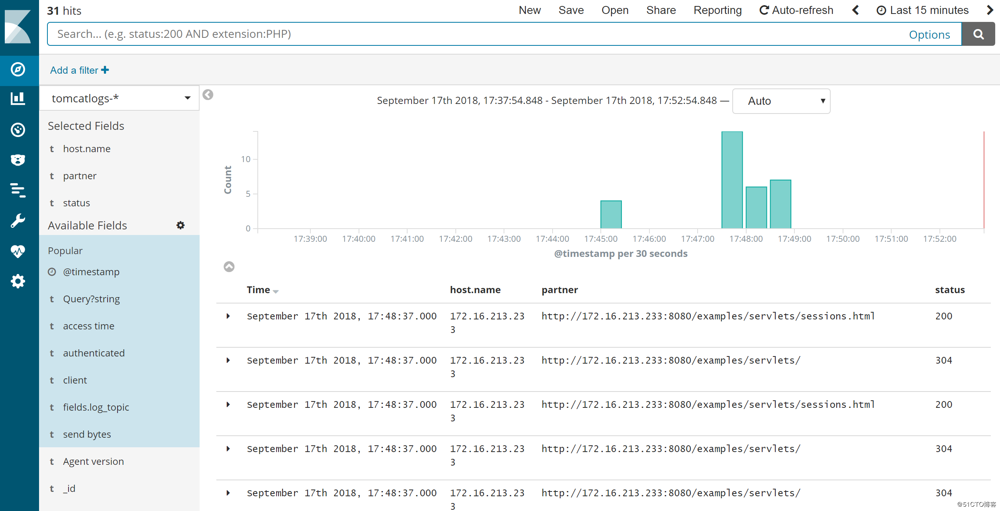

## 13【案例】通过ELK收集Tomcat访问日志和状态日志

## 1、tomcat日志解析

对tomcat的日志监控和分析主要有有两种类型，分别是访问日志（localhost\_access\_log.Y-M-D.txt）和运行状态日志（catalina.out），其中，访问日志记录访问的时间，IP，访问的资料等相关信息，catalina.out其实记录了tomcat的标准输出(stdout)和标准出错(stderr)，这是在tomcat的启动脚本里指定的，默认情况下stdout和stderr都会重定向到这里。所以可以在应用里使用System.out打印的东西都会输出到这里来。此文件对监控tomcat的运行状态非常重要。

在企业具体的运维监控中，对访问日志的监控主要是看访问量，访问来源等信息，因此，这部分日志输出可以入到elasticsearch中，然后在Kibana中展示分析，而对catalina.out文件的监控，主要是监控日志中是否有错误、告警等信息，如果监控到有类似信息，那么就进行告警，因此对catalina.out文件的日志收集，需要过滤关键字，然后输出到zabbix进行告警。

下面就开始对tomcat两种不同类型的日志进行收集、过滤和告警设置。

## 2、配置tomcat的访问日志和catalina.out文件

### 2.1、配置访问日志（localhost\_access\_log.Y-M-D.txt）输出为JSON格式

要配置访问日志文件的输出格式，需要修改tomcat的server.xml文件，这里以tomcat8.5.30为例，打开server.xml，找到如下内容：

```python
    <Valve className="org.apache.catalina.valves.AccessLogValve" directory="logs"
           prefix="localhost_access_log" suffix=".txt"
           pattern="%h %l %u %t "%r" %s %b" />
```

将此内容修改为如下配置：

```perl
    <Valve className="org.apache.catalina.valves.AccessLogValve" directory="logs"
           prefix="localhost_access_log" suffix=".log"
           pattern="{"client":"%h",  "client user":"%l",   "authenticated":"%u",   "access time":"%t",     "method":"%r",   "status":"%s",  "send bytes":"%b",  "Query?string":"%q",  "partner":"%{Referer}i",  "Agent version":"%{User-Agent}i"}"/>
```

介绍下出现的一些参数的含义：

> directory：日志文件存放的目录。通常设置为tomcat下已有的那个logs文件。  
> prefix：日志文件的名称前缀。  
> suffix ：日志文件的名称后缀。  
> pattern：比较重要的一个参数。下面列出这个参数常用的选项和含义：
> 
> %a   这是记录访问者的IP，在日志里是127.0.0.1  
> %A   这是记录本地服务器的IP。  
> %b   发送信息的字节数，不包括http头，如果字节数为0的话，显示为“-”  
> %B   发送信息的字节数，不包括http头。  
> %h   服务器的名称。如果resolveHosts为false的话，这里就是IP地址  
> %H   访问者的协议  
> %l   记录浏览者进行身份验证时提供的名称  
> %m   访问的方式，是GET还是POST  
> %p   本地接收访问的端口   
> %q   比如你访问的是aaa.jsp?bbb=ccc，那么这里就显示?bbb=ccc，表示query string的意思  
> %r   请求的方法和URL  
> %s   http的响应状态码   
> %S   用户的session ID，每次都会生成不同的session ID  
> %t   请求时间  
> %u   得到了验证的访问者，否则就是"-"  
> %U   访问的URI地址  
> %v   服务器名称  
> %D  请求消耗的时间，以毫秒记  
> %T   请求消耗的时间，以秒记

配置完成后，重启tomcat，可以查看tomcat的访问日志是否输出了json格式，如下所示：

```json
{"client":"172.16.213.132",  "client user":"-",   "authenticated":"-",   "access time":"[13/Sep/2018:19:01:09 +0800]",     "method":"GET /docs/jndi-datasource-examples-howto.html HTTP/1.1",   "status":"200",  "send bytes":"-",  "Query?string":"",  "partner":"http://172.16.213.233:8080/",  "Agent version":"Mozilla/5.0 (Windows NT 6.3; Win64; x64) AppleWebKit/537.36 (KHTML, like Gecko) Chrome/68.0.3440.106 Safari/537.36"}
{"client":"172.16.213.132",  "client user":"-",   "authenticated":"-",   "access time":"[13/Sep/2018:19:01:09 +0800]",     "method":"GET /docs/jndi-datasource-examples-howto.html HTTP/1.1",   "status":"200",  "send bytes":"35230",  "Query?string":"",  "partner":"http://172.16.213.233:8080/",  "Agent version":"Mozilla/5.0 (Windows NT 6.3; Win64; x64) AppleWebKit/537.36 (KHTML, like Gecko) Chrome/68.0.3440.106 Safari/537.36"}
{"client":"172.16.213.132",  "client user":"-",   "authenticated":"-",   "access time":"[13/Sep/2018:19:01:10 +0800]",     "method":"GET /favicon.ico HTTP/1.1",   "status":"200",  "send bytes":"21630",  "Query?string":"",  "partner":"http://172.16.213.233:8080/docs/jndi-datasource-examples-howto.html",  "Agent version":"Mozilla/5.0 (Windows NT 6.3; Win64; x64) AppleWebKit/537.36 (KHTML, like Gecko) Chrome/68.0.3440.106 Safari/537.36"}
```

简单整理一下，输出的json格式如下：

```json
{
    "client": "172.16.213.132",
    "client user": "-",
    "authenticated": "-",
    "access time": "[13/Sep/2018:19:01:09 +0800]",
    "method": "GET /docs/jndi-datasource-examples-howto.html HTTP/1.1",
    "status": "200",
    "send bytes": "-",
    "Query?string": "",
    "partner": "http://172.16.213.233:8080/",
    "Agent version": "Mozilla/5.0 (Windows NT 6.3; Win64; x64) AppleWebKit/537.36 (KHTML, like Gecko) Chrome/68.0.3440.106 Safari/537.36"
}
```

### 2.2、配置tomcat的catalina.out文件

默认情况下，tomcat8.5版本中catalina.out文件的输出格式如下：

```css
17-Sep-2018 15:57:10.387 INFO [main] org.apache.coyote.AbstractProtocol.start Starting ProtocolHandler ["http-nio-8080"]
17-Sep-2018 15:57:10.425 INFO [main] org.apache.coyote.AbstractProtocol.start Starting ProtocolHandler ["ajp-nio-8009"]
17-Sep-2018 15:57:10.443 INFO [main] org.apache.catalina.startup.Catalina.start Server startup in 31377 ms
```

在这个日志中，时间字段输出不是很友好，我们需要修改下时间自动的输出为类似“2018-09-17 15:57:10.387”这种格式，要修改catalina.out的时间输出字段，需要修改logging.properties文件，此文件位于tomcat配置文件目录conf下，打开此文件，添加如下内容：

```perl
1catalina.org.apache.juli.AsyncFileHandler.formatter = java.util.logging.SimpleFormatter
java.util.logging.SimpleFormatter.format = %1$tY-%1$tm-%1$td %1$tH:%1$tM:%1$tS.%1$tL [%4$s] [%3$s] %2$s %5$s %6$s%n
```

同时删除如下行：

```plain
java.util.logging.ConsoleHandler.formatter = org.apache.juli.OneLineFormatter
```

这样，catalina.out文件输出的时间字段就变成比较友好的格式了，如下图所示：

```css
2018-09-17 16:03:56.540 [INFO] [org.apache.coyote.http11.Http11NioProtocol] org.apache.coyote.AbstractProtocol start Starting ProtocolHandler ["http-nio-8080"] 
2018-09-17 16:03:56.582 [INFO] [org.apache.coyote.ajp.AjpNioProtocol] org.apache.coyote.AbstractProtocol start Starting ProtocolHandler ["ajp-nio-8009"] 
2018-09-17 16:03:56.602 [INFO] [org.apache.catalina.startup.Catalina] org.apache.catalina.startup.Catalina start Server startup in 41372 ms 
```

对于catalina.out文件的内容，我们只需要过滤出来四个字段即可，分别是时间字段、日志输出级别字段、异常信息字段以及运行状态内容字段，对上面的日志信息，通过logstash的grok插件进行过滤，可以很方便的取出这四个字段，登录http://grokdebug.herokuapp.com/ ，然后今天在线调试，可以很轻松得出过滤规则：

```markdown
%{TIMESTAMP_ISO8601:access_time}\s+\[%{LOGLEVEL:loglevel}\]\s+\[%{DATA:exception_info}\](?<tomcatcontent>[\s\S]*)
```

其中，access\_time取的是时间字段、loglevel取的是日志输出级别字段、exception\_info取的是异常信息字段，tomcatcontent取的是运行状态字段。

## 3、配置filebeat

在tomcat所在的服务器（172.16.213.233）上安装filebeat，然后配置filebeat，配置好的filebeat.yml文件内容如下：

```plain
filebeat.inputs:
- type: log
  enabled: true
  paths:
   - /usr/local/tomcat/logs/localhost_access_log.2018-09*.txt       #这是tomcat的访问日志文件
  fields:
    log_topic: tomcatlogs       #这是新增的字段，用于后面的kafka的topic，其实是对tomcat访问日志文件分类

- type: log
  enabled: true
  paths:
   - /usr/local/tomcat/logs/catalina.out        #这是定义的第二个tomcat日志文件catalina.out，注意写的格式。
  fields:
    log_topic: tomcatlogs_catalina      #这是新增的字段，用于后面的kafka的topic，专门用于存储catalina.out日志文件

processors:
 - drop_fields:
    fields: ["beat", "input", "source", "offset", "prospector"]
filebeat.config.modules:
  path: ${path.config}/modules.d/*.yml
  reload.enabled: false

name: 172.16.213.233
output.kafka:
  enabled: true
  hosts: ["172.16.213.51:9092", "172.16.213.75:9092", "172.16.213.109:9092"]
  version: "0.10"
  topic: '%{[fields.log_topic]}'    #这是指定topic，注意写法，上面新增了两个字段，两个对应的日志文件会分别写入不同的topic
  partition.round_robin:
    reachable_only: true
  worker: 2
  required_acks: 1
  compression: gzip
  max_message_bytes: 10000000
logging.level: debug
```

配置文件编写好后，启动filebeat服务即可：

```coffeescript
[root@filebeat232 ~]# cd /usr/local/filebeat
[root@filebeat232 filebeat]#nohup ./filebeat  -e -c filebeat.yml & 
```

## 4、通过Logstash的grok插件过滤、分析配置tomcat日志

Logstash服务部署在172.16.213.120服务器上，下面给出Logstash事件配置文件，命名为kafka\_tomcat\_into\_es.conf，内容如下：

```php
input { #这里定义了两个消费topic，分别读取的是tomcat的访问日志和catalina.out文件
        kafka {
        bootstrap_servers => "172.16.213.51:9092,172.16.213.75:9092,172.16.213.109:9092"
        topics => ["tomcatlogs"]    
        codec => "json"
        }
        kafka {
        bootstrap_servers => "172.16.213.51:9092,172.16.213.75:9092,172.16.213.109:9092"
        topics => ["tomcatlogs_catalina"]
        codec => "json"
        }
}

filter {
    if [fields][log_topic] == "tomcatlogs_catalina" {   #判断语句，根据topic不同，对日志做不同的过滤、分析，先分析的是catalina.out文件
             mutate {
             add_field => [ "[zabbix_key]", "tomcatlogs_catalina" ]
             add_field => [ "[zabbix_host]", "%{[host][name]}" ]
             }
    grok {
             match => { "message" => "%{TIMESTAMP_ISO8601:access_time}\s+\[(?<loglevel>[\s\S]*)\]\s+\[%{DATA:exception_info}\](?<tomcatcontent>[\s\S]*)" }
        }
        date {
                match => [ "access_time","MMM  d HH:mm:ss", "MMM dd HH:mm:ss", "ISO8601"]
        }
        mutate {
            remove_field => "@version"
            remove_field => "message"
            #remove_field => "[fields][log_topic]"
            #remove_field => "fields"
            remove_field => "access_time"
        }

   }
   if [fields][log_topic] == "tomcatlogs" {     #判断语句，根据topic不同，对日志做不同的过滤、分析，这里分析的是访问日志文件
     json {
        source => "message"     #由于访问日志文件已经是json格式，所以这里解码出来即可
      }
    date {
    match => [ "access time" , "[dd/MMM/yyyy:HH:mm:ss Z]" ] #时间字段转换，然后赋值给@timestamp字段
       }
    mutate {
            remove_field => "@version"      #删除不需要的字段
            remove_field => "message"
     }
  }
}

output {
        if [fields][log_topic] == "tomcatlogs_catalina" {       #输出判断，根据不同的topic，做不同的输出设置
          if ([loglevel] =~ "INFO"  or [tomcatcontent] =~ /(Exception|error|ERROR|Failed)/ ) {   #对catalina.out文件出现前面指定的关键字，就过滤出来，然后告警
              zabbix {
                        zabbix_host => "[zabbix_host]"
                        zabbix_key => "[zabbix_key]"
                        zabbix_server_host => "172.16.213.140"
                        zabbix_server_port => "10051"
                        zabbix_value => "tomcatcontent" #这是输出到zabbix的内容配置
                        }
                    }
        }
       if [fields][log_topic] == "tomcatlogs" {     #输出判断，根据不同的topic，做不同的输出设置，这是将访问日志输出到elasticsearch集群
         elasticsearch {
           hosts => ["172.16.213.37:9200","172.16.213.77:9200","172.16.213.78:9200"]
           index => "tomcatlogs-%{+YYYY.MM.dd}"
             }
       }
       stdout { codec => rubydebug }    #调试模式，可以方便观看日志输出是否正常，调试完成后，删除即可
}
```

这个配置文件稍微复杂，将两个topic的日志分别做了不同处理，将catalina.out文件首先进行grok分割，然后进行关键字过滤，如果输出指定关键字，那么将和zabbix进行联动，发出告警；

接着，将tomcat的访问日志进行简单过滤后，直接输出到 elasticsearch集群，最后在Kibana进行展示。

## 5、配置zabbix输出并告警

登录zabbix web平台，首先创建一个模板logstash-output-zabbix，然后在此模块下创建一个监控项，如下图所示：  


最后，要实现监控、告警，还需要创建一个触发器，进入刚刚创建好的模板中，创建一个触发器，如下图所示：  


这个触发器的含义是：如果收到logstash发送过来的数据就进行告警，或者说接收到的数据大于0就告警。

可以模拟产生一些包含上面关键字的日志信息，然后观察是否会进行告警。

## 6、Kibana平台创建tomcat访问日志索引

tomcat日志的索引名称为tomcatlogs-%{+YYYY.MM.dd}，登录Kibana，选择创建索引，然后添加索引名tomcatlogs-\*，然后按照时间添加排序规则，即可完成访问日志索引创建，然后到discover查看日志，如果日志输出正常，即可看到访问日志，如下图所示：  


至此，ELK收集tomcat日志完成。

