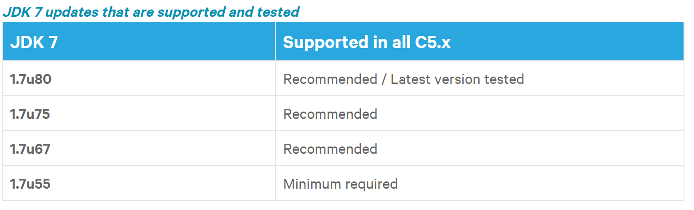
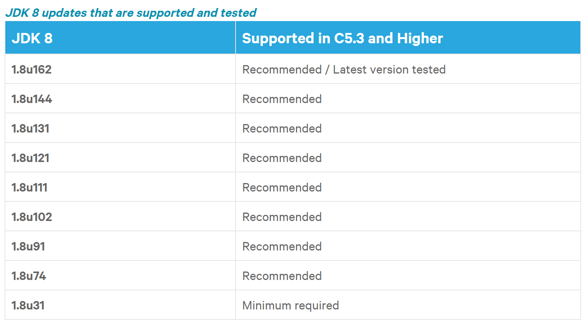
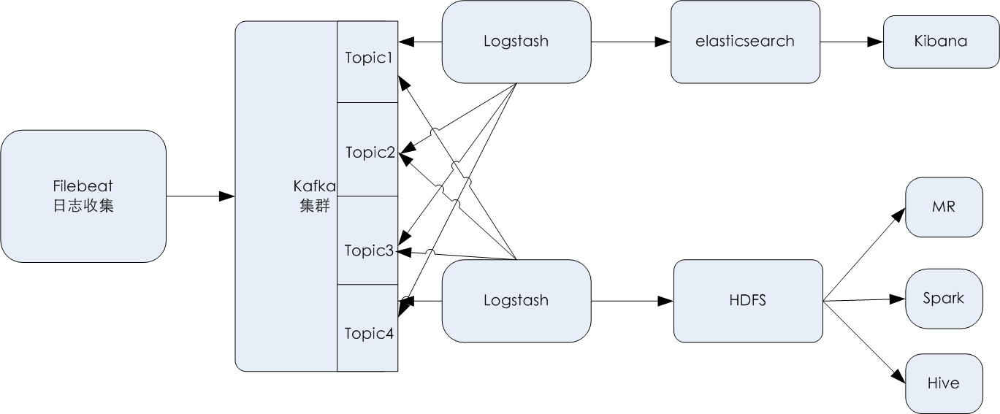

# 14.ELK订阅日志到HDFS分布式文件系统

## 14.ELK订阅日志到HDFS分布式文件系统

## 一、ELK在大数据运维时代中的应用

随着大数据时代的到来，传统运维时代也将转向数据运维时代，数据运维时代的一个典型特征是海量数据，ELK的出现解决了这个问题，有人把运维比作医生给病人看病，那么日志则是病人对自己的陈述，运维人员要从海量数据中有效的提取关键信息，才能对症下药，通过对日志的集中管理，并提供全文检索功能，不仅可以提高运维诊断问题的效率，同时可以起到实时系统监测、网络安全、事件管理和发现bug等功能。

> 而基于ELK的日志分析，通常比较常用的是实时分析，日志存储的时间不会太长，一般存储一周，最长也就是一个月，更长时间的数据都会删除，但是在有些情况下，我们需要长期保存数据做离线分析的话，就需要将数据保存到hadoop平台的HDFS上，下面就来介绍下如何通过logstash将kafka中的数据订阅一份到HDFS中长期保存。

## 二、hadoop发行版介绍

要实现将数据存储到HDFS上，就需要一个基础的hadoop环境，这里介绍下如何快速构建一个hadoop大数据平台环境。作为hadoop入门基础，首先介绍下关于hadoop发行版的知识以及如何选择适合自己的hadoop发行。

目前Hadoop发行版非常多，有Intel发行版，华为发行版、Cloudera发行版（CDH）、Hortonworks版本等，所有这些发行版均是基于Apache Hadoop衍生出来的，之所以有这么多的版本，是由于Apache Hadoop的开源协议决定的：任何人可以对其进行修改，并作为开源或商业产品发布/销售。就目前而言，不收费的Hadoop版本主要有三个，都是国外厂商，分别是：

> （1） Apache（最原始的版本，所有发行版均基于这个版本进行改进）  
> （2）Cloudera版本（Cloudera’s Distribution Including Apache Hadoop，简称CDH）  
> （3）Hortonworks版本(Hortonworks Data Platform，简称“HDP”）

对于国内用户而言，绝大多数选择CDH版本，Cloudera的CDH和Apache的Hadoop的区别如下：

> (1)、 CDH对Hadoop版本的划分非常清晰，截止目前为止，CDH共有5个版本，其中，前三个已经不再更新，最近的两个，分别是CDH4和CDH5，CDH4基于Hadoop2.0，CDH5基于hadoop2.2/2.3/2.5/2.6.相比而言，Apache版本则混乱得多；同时，CDH发行版比Apache hadoop在兼容性，安全性，稳定性上有很大增强。  
> (2)、CDH3是CDH第三个版本，基于Apache hadoop0.20.2改进而来，并融入了最新的patch，CDH4版本是基于Apache hadoop2.0.0改进的,CDH总是并应用了最新Bug修复或者Feature的Patch，并比Apache hadoop同功能版本提早发布，更新速度比Apache官方快。  
> (3)、CDH支持Kerberos安全认证，apache hadoop则使用简陋的用户名匹配认证.  
> (4)、CDH文档完善清晰，很多采用Apache版本的用户都会阅读CDH提供的文档，包括安装文档、升级文档等。  
> (5)、CDH支持yum/apt包，RPM包，tar包，Cloudera Manager三种方式安装,Apache hadoop只支持Tar包安装。

CDH首先是100%开源，基于Apache协议。基于Apache Hadoop和相关projiect开发。可以做批量处理，交互式sql查询和及时查询，基于角色的权限控制。在企业中使用最广的Hadoop分发版本。

Cloudera完善了CDH的版本，并提供了对hadoop的发布、配置和管理，监控，诊断工具，在官网提供了多种集成发行版。单纯CDH版本下载，目前最新版本为CDH5.15.1，可自由下载并免费无限制使用。

## 三、CDH的获取与操作系统、JDK的依赖

要使用CDH发行版本，可以从CDH官方下载，地址为http://www.cloudera.com/downloads.html， 也可以到下面地址下载不同版本：

> ```coffeescript
>    http://archive.cloudera.com/cdh4/
>    http://archive.cloudera.com/cdh5/
> ```

CDH支持yum/apt包，RPM包，tarball包多种安装方式，根据hadoop运维需要，我们选择tarball的安装方式（开箱即用）。

这里我们下载最新二进制包版本：

[http://archive.cloudera.com/cdh5/cdh/5/hadoop-2.6.0-cdh5.15.1.tar.gz](http://archive.cloudera.com/cdh5/cdh/5/hadoop-2.6.0-cdh5.15.1.tar.gz) 。

除了下载hadoop的二进制包，还需要JDK的支持，CDH发行版本对JDK是有要求的，仅支持JDK1.7和JDK1.8，相关依赖关系如下：  




更详细的依赖可参考：[https://www.cloudera.com/documentation/enterprise/release-notes/topics/rn\_consolidated\_pcm.html#pcm\_jdk](https://www.cloudera.com/documentation/enterprise/release-notes/topics/rn_consolidated_pcm.html#pcm_jdk)

最后，CDH对操作系统也有要求，推荐大家使用RHEL/CentOS7.5, 7.4, 7.3, 7.2, 7.1系列版本，尽量不要使用RHEL/CentOS6.x版本，因为不支持RHEL/CentOS6.x某些小版本。

更详细的操作系统依赖可参考： [https://www.cloudera.com/documentation/enterprise/release-notes/topics/rn\_consolidated\_pcm.html#concept\_jpd\_hpz\_jdb](https://www.cloudera.com/documentation/enterprise/release-notes/topics/rn_consolidated_pcm.html#concept_jpd_hpz_jdb)

## 四、伪分布式安装hadoop

为了让大家快速了解hadoop的使用和原理，我们先通过伪分布式来迅速安装一个hadoop集群，所谓的伪分布式hadoop，其实就是在一台机器上部署hadoop的所有角色和进程，主要有Namenode、datanode、resourcemanager、nodemanager等进程。伪分布式hadoop主要用于学习、开发、功能测试等方面。

### 4.1、安装规划

这里以centos7.5为例，IP地址为172.16.213.235，以下所有操作都在此服务器上完成。

jdk需要oracle JDK1.7.0\_55以上，或者JDK1.8.0\_31以上。这里选择jdk1.8.0\_162。

对于hadoop程序安装路径，这里安装到/opt/hadoop目录下，hadoop配置文件放到/etc/hadoop目录下。

> 这样规划将配置文件和主程序分开，有利于后期的程序升级和自动化运维。

### 4.2、安装过程

首先，从oracle官网下载jdk1.8.0\_162，将jdk-8u162-linux-x64.tar.gz解压到/usr/java目录下。

```coffeescript
[root@cdh5namenode hadoop]#mkdir /usr/java
[root@cdh5namenode hadoop]#tar zxvf  jdk-8u162-linux-x64.tar.gz -C /usr/java
[root@cdh5namenode hadoop]#cd /usr/java
[root@cdh5namenode hadoop]#ln -s jdk1.8.0_162 default
```

接着，需要创建一个hadoop用户，然后设置hadoop用户的环境变量，配置如下：

```plain
[root@cdh5namenode hadoop]#useradd hadoop
[root@cdh5namenode hadoop]# more /home/hadoop/.bashrc 
# .bashrc
# Source global definitions
if [ -f /etc/bashrc ]; then
        . /etc/bashrc
fi
# User specific aliases and functions
export JAVA_HOME=/usr/java/default
export CLASSPATH=.:$JAVA_HOME/jre/lib/rt.jar:$JAVA_HOME/lib/dt.jar:$JAVA_HOME/lib/tools.jar
export PATH=$PATH:$JAVA_HOME/bin
export HADOOP_PREFIX=/opt/hadoop/current
export HADOOP_MAPRED_HOME=${HADOOP_PREFIX}
export HADOOP_COMMON_HOME=${HADOOP_PREFIX}
export HADOOP_HDFS_HOME=${HADOOP_PREFIX}
export HADOOP_YARN_HOME=${HADOOP_PREFIX}
export HTTPFS_CATALINA_HOME=${HADOOP_PREFIX}/share/hadoop/httpfs/tomcat
export CATALINA_BASE=${HTTPFS_CATALINA_HOME}
export HADOOP_CONF_DIR=/etc/hadoop/conf
export YARN_CONF_DIR=/etc/hadoop/conf
export HTTPFS_CONFIG=/etc/hadoop/conf
export PATH=$PATH:$HADOOP_PREFIX/bin:$HADOOP_PREFIX/sbin
```

最后一步，就是解压安装hadoop了，tarball方式安装很简单，只需解压文件即可完成安装，然后将解压后的目录放到/opt目录下，进行授权即可：

```coffeescript
[root@cdh5namenode opt]# mkdir /opt/hadoop
[root@cdh5namenode opt]# tar zxvf  hadoop-2.6.0-cdh5.15.1.tar.gz -C /opt/hadoop
[root@cdh5namenode opt]# cd  /opt/hadoop
[root@cdh5namenode opt]# ln -s hadoop-2.6.0-cdh5.15.1 current
[root@cdh5namenode opt]#chown -R hadoop:hadoop /opt/hadoop
```

### 4.3、本地库文件（native-hadoop）支持

Hadoop是使用Java语言开发的，但是有一些需求和操作并不适合使用java，所以就引入了本地库（Native Libraries）的概念，通过本地库，Hadoop可以更加高效地执行某一些操作。目前在Hadoop中，本地库应用在文件的压缩上面，主要有gzip和zlib方面，在使用这两种压缩方式的时候，Hadoop默认会从$HADOOP\_HOME/lib/native/目录中加载本地库。

如果本地库加载失败，在执行hdfs shell命令的时候会输出如下信息：  
INFO util.NativeCodeLoader - Unable to load native-hadoop library for your platform... using builtin-java classes where applicable

CDH4版本之后，hadoop的本地库文件已经不放到CDH的安装包里面了，所以需要另行获取。

获取本地库有两种方式，一种方式是直接下载源码，自己编译源码文件，此方法比较麻烦，不推荐，另一种方式是下载apache的hadoop发行版本，这个发行版本中包含有本地库文件。

apache的hadoop发行版本下载地址为: [http://archive.apache.org/dist/hadoop/core/](http://archive.apache.org/dist/hadoop/core/)， 从这里下载跟CDH对应的apache发行版本，例如上面CDH下载的是hadoop-2.6.0-cdh5.15.1.tar.gz，那么，这里就从apache发行版本中下载hadoop-2.6.0.tar.gz版本，将下载的此版本解压，找到里面的$HADOOP\_HOME/lib/native/本地库文件，复制到CDH5版本对应的路径$HADOOP\_HOME/lib/native/就可以了。

如果成功加载native-hadoop本地库，日志会有如下输出：

```sql
DEBUG util.NativeCodeLoader - Trying to load the custom-built native-hadoop library... 
INFO util.NativeCodeLoader - Loaded the native-hadoop library
```

### 4.4、启动hadoop服务

CDH5新版本的hadoop启动服务脚本位于$HADOOP\_HOME/sbin目录下，hadoop的服务启动主要包含下面几个服务：

```plain
namenode
secondarynamenode
datanode
resourcemanager
nodemanager
```

这里以hadoop用户来进行管理和启动hadoop的各种服务。

**1、启动namenode服务**

伪分布模式下，对hadoop配置文件不用做过多配置，仅需要修改hadoop配置文件core-site.xml，增加如下内容：

```xml
<property>
  <name>fs.defaultFS</name>
    <value>hdfs://cdh5namenode</value>
</property>
```

这里的cdh5namenode是服务器的主机名，需要将此主机名在/etc/hosts进行解析，内容如下：

```css
172.16.213.235  cdh5namenode
```

其中，172.16.213.235是我安装hadoop伪分布模式机器的IP地址。

配置完成，就可以启动namenode服务了，第一次启动namenode服务，首先需要对namenode进行格式化，命令如下：

```ruby
[hadoop@cdh5namenode ~]$ cd /opt/hadoop/current/bin
[hadoop@cdh5namenode bin]$ hdfs namenode -format
```

如果提示格式化成功，就可以启动namenode服务了。

```ruby
[hadoop@cdh5namenode conf]$ cd /opt/hadoop/current/sbin/
[hadoop@cdh5namenode sbin]$ ./hadoop-daemon.sh  start namenode
```

要查看namenode启动日志，可以查看  
/opt/hadoop/current/logs/hadoop-hadoop-namenode-cdh5namenode.log文件。

namenode启动完成后，就可以通过web页面查看状态了，默认namenode启动后，会启动50070端口，访问地址为：[http://172.16.213.232:50070](http://172.16.213.232:50070/)

**2、 启动datanode服务**

启动datanode服务很简单，直接执行如下命令：

```ruby
[hadoop@cdh5namenode ~]$ cd /opt/hadoop/current/bin
[hadoop@cdh5namenode sbin]$ ./hadoop-daemon.sh  start datanode
```

可通过/opt/hadoop/current/logs/hadoop-hadoop-datanode-cdh5namenode.log查看datanode启动日志。

**3、启动resourcemanager**

resourcemanager是yarn框架的服务，用于任务调度和分配，启动方式如下：

```ruby
[hadoop@cdh5namenode ~]$ cd /opt/hadoop/current/bin
[hadoop@cdh5namenode sbin]$ ./yarn-daemon.sh start resourcemanager
```

可通过/opt/hadoop/current/logs/yarn-hadoop-resourcemanager-cdh5namenode.log查看resourcemanager启动日志。

**4、启动nodemanager**

nodemanager是计算节点，主要用于分布式运算的资源分配，启动方式如下：

```ruby
[hadoop@cdh5namenode ~]$ cd /opt/hadoop/current/bin
[hadoop@cdh5namenode sbin]$ ./yarn-daemon.sh start nodemanager
```

可通过/opt/hadoop/current/logs/yarn-hadoop-nodemanager-cdh5namenode.log查看nodemanager启动日志。

至此，hadoop伪分布式已经运行起来了。可通过jps命令查看各个进程的启动信息：

```ruby
[hadoop@cdh5namenode logs]$ jps
16843 NameNode
16051 DataNode
16382 NodeManager
28851 Jps
16147 ResourceManager
```

### 5、分布式存储与分布式计算

hadoop搭建起来后，就可以使用了，首先通过hadoop hdfs命令进行分布式存储操作，执行命令如下：

```ruby
[hadoop@cdh5namenode logs]$ hadoop fs -ls /     #查看HDFS文件系统根目录下的数据
[hadoop@cdh5namenode logs]$ hadoop fs -mkdir /logs  #在HDFS文件系统根目录下创建一个logs目录
[hadoop@cdh5namenode logs]$ hadoop fs -put test.txt /logs    #从本地磁盘将test.txt文件上传到HDFS上的logs目录
[hadoop@cdh5namenode logs]$ hadoop fs -text /logs/test.txt    #查看HDFS上/logs/test.txt文件的内容
[hadoop@cdh5namenode logs]$ hadoop fs -get /logs/test.txt  /tmp #从HDFS上下载/logs/test.txt文件到本地磁盘的/tmp目录中
[hadoop@cdh5namenode logs]$ hadoop fs -chown -R iivey:iivey  /logs/test.txt #将HDFS上/logs/test.txt文件授权给iivey用户
[hadoop@cdh5namenode logs]$ hadoop fs -rm -r  /logs/test.txt        #从HDFS上删除/logs/test.txt文件
```

可以看到，hadoop hdfs命令还是比较简单的，跟linux下的命令基本类似，其实hdfs这些命令最终还是执行的linux系统命令而已。

最后，在来看下分布式计算的威力，我们在hadoop中运行一个Mapreduce程序，这里通过hadoop安装包中附带的一个mapreduce的demo程序来做演示，我们做个简单的mr计算。

在/opt/hadoop/current/share/hadoop/mapreduce路径下找到hadoop-mapreduce-examples-2.6.0-cdh5.15.1.jar包，我们执行一个wordcount程序，统计一批文件中，相同文件的行数。

先上传一个文本文件到hdfs上，然后进行这个文件的统计分析：

```ruby
[hadoop@cdh5namenode logs]$ cat test.txt
linux On a managed deployment, Cloudera Manager
The Cloudera Manager Admin Console linux centos
CDH and Cloudera Manager Supported Transport Layer Security Versions for linux
Cloudera Manager Resource Requirements
Kafka Client Versions Used by Apache Flume in CDH
[hadoop@cdh5namenode logs]$ hadoop fs -put test.txt /input
[hadoop@cdh5namenode mapreduce]$hadoop jar  \
/opt/hadoop/current/share/hadoop/mapreduce/hadoop-mapreduce-examples-2.6.0-cdh5.15.1.jar  wordcount  /input/    /output/test90
```

其中，/output/test90是输出文件夹，必须不存在，它由程序自动创建，如果预先存在output文件夹，则会报错。上面程序执行完毕后，就会在 /output/test90中输出结果，通过hdfs的shell命令查看下输出内容：

```plain
[hadoop@cdh5namenode mapreduce]$ hadoop fs -ls /output/test90
Found 2 items
-rw-r--r--   3 hadoop supergroup          0 2018-09-21 17:46 /output/test90/_SUCCESS
-rw-r--r--   3 hadoop supergroup        225 2018-09-21 17:46 /output/test90/part-r-00000
[hadoop@cdh5namenode mapreduce]$ hadoop fs -cat /output/test90/part-r-00000
Cloudera        4
linux   3
Versions        2
CDH     2
......
```

这里的Cloudera是一个字符串，后面的4是出现的次数，也就是说Cloudera这个字符串在test.txt这个文件中出现了4次，其它类似。

到此为止，一个基础的hadoop环境构建完成了。

## 五、通过logstash从Kafka中订阅数据到HDFS

下面再回到ELK的话题上来，这里仍以专栏前面介绍的ELK架构为基础，然后新增了一条入数据到HDFS的线路，拓扑如下：



我们需要做的是将kafka中缓存的某些数据发送到hadoop的hdfs上实现长期存储和离线分析，要实现这个功能，需要用到logstash的一个output插件logstash-output-webhdfs，这个插件logstash已经自带，无需重新安装。

这里我们将nginx的日志从kafka中消费出来，然后存储到hadoop的hdfs上，这里直接给出logstash事件配置文件kafka\_nginx\_into\_hdfs.conf的内容：

```php
input {
        kafka {
        bootstrap_servers => "172.16.213.51:9092,172.16.213.75:9092,172.16.213.109:9092"
        topics => ["sinalogs"]
        codec => json {
            charset => "UTF-8"
        }
    }
 }
output {
    webhdfs {
           host => "172.16.213.235"
           port => 50070
           user => "hadoop"
           path => "/logs/nginx/logstash-%{+YYYY}-%{+MM}-%{+dd}/access-%{+HH}.log"
           compression => "gzip"
           codec => line { format => "%{message}"}
       }
   stdout { codec => rubydebug }
}
```

在input中，指定从sinalogs这个topic中消费日志数据，这里重点看output输出部分，其中，webhdfs表示将数据输出到HDFS上。

> host：指定hdfs的namenode地址。  
> port：指定webhdfs端口，一般为50070.  
> user：指定hdfs运行的用户啊，以这个用户的权限去写hdfs  
> path：指定日志文件写的路径， 上面是按天自动创建目录，按小时建log文件，这里将数据输出到HDFS的/logs/nginx/路径下。  
> compression：指定数据是否压缩和压缩的方式，有none, snappy, gzip三个选项，默认是none，表示不压缩  
> codec：指定输出数据的编解码器。输出编解码器用于在数据离开输出之前对其进行编码。默认值为line。这里表示仅输出message的值到HDFS。

配置文件编写完成，载入事件配置文件即可，执行如下命令：

```coffeescript
[root@logstashserver ~]# cd /usr/local/logstash
[root@logstashserver logstash]# nohup bin/logstash -f kafka_nginx_into_hdfs.conf  --path.data /data/hdfsdata/  &
```

logstash启动后，可以通过查看logstash日志，观察是否启动正常，如果启动失败，会在日志中有启动失败提示。

这些需要注意的是，Logstash使用webhdfs插件，可能无法正常输出到HDFS中，会出现如下报错：

```javascript
[2018-09-25T11:57:20,026][WARN ][logstash.outputs.webhdfs ] Failed to flush outgoing items {:outgoing_count=>1, :exception=>"WebHDFS::ServerError", :backtrace=>["/usr/local/logstash/vendor/bundle/jruby/2.3.0/gems/webhdfs-0.8.0/lib/webhdfs/client_v1.rb:351:in `request'", "/usr/local/logstash/vendor/bundle/jruby/2.3.0/gems/webhdfs-0.8.0/lib/webhdfs/client_v1.rb:270:in `operate_requests'", "/usr/local/logstash/vendor/bundle/jruby/2.3.0/gems/webhdfs-0.8.0/lib/webhdfs/client_v1.rb:73:in `create'", "/usr/local/logstash/vendor/bundle/jruby/2.3.0/gems/logstash-output-webhdfs-3.0.6/lib/logstash/outputs/webhdfs.rb:228:in `write_data'", "/usr/local/logstash/vendor/bundle/jruby/2.3.0/gems/logstash-output-webhdfs-3.0.6/lib/logstash/outputs/webhdfs.rb:211:in `block in flush'", "org/jruby/RubyHash.java:1343:in `each'", "/usr/local/logstash/vendor/bundle/jruby/2.3.0/gems/logstash-output-webhdfs-3.0.6/lib/logstash/outputs/webhdfs.rb:199:in `flush'", "/usr/local/logstash/vendor/bundle/jruby/2.3.0/gems/stud-0.0.23/lib/stud/buffer.rb:219:in `block in buffer_flush'", "org/jruby/RubyHash.java:1343:in `each'", "/usr/local/logstash/vendor/bundle/jruby/2.3.0/gems/stud-0.0.23/lib/stud/buffer.rb:216:in `buffer_flush'", "/usr/local/logstash/vendor/bundle/jruby/2.3.0/gems/stud-0.0.23/lib/stud/buffer.rb:159:in `buffer_receive'", "/usr/local/logstash/vendor/bundle/jruby/2.3.0/gems/logstash-output-webhdfs-3.0.6/lib/logstash/outputs/webhdfs.rb:182:in `receive'", "/usr/local/logstash/logstash-core/lib/logstash/outputs/base.rb:91:in `block in multi_receive'", "org/jruby/RubyArray.java:1734:in `each'", "/usr/local/logstash/logstash-core/lib/logstash/outputs/base.rb:91:in `multi_receive'", "org/logstash/config/ir/compiler/OutputStrategyExt.java:109:in `multi_receive'", "org/logstash/config/ir/compiler/OutputDelegatorExt.java:156:in `multi_receive'", "/usr/local/logstash/logstash-core/lib/logstash/pipeline.rb:475:in `block in output_batch'", "org/jruby/RubyHash.java:1343:in `each'", "/usr/local/logstash/logstash-core/lib/logstash/pipeline.rb:474:in `output_batch'", "/usr/local/logstash/logstash-core/lib/logstash/pipeline.rb:426:in `worker_loop'", "/usr/local/logstash/logstash-core/lib/logstash/pipeline.rb:384:in `block in start_workers'"]}
```

从错误中，可以判断应该是如下两个问题：  
（1）HDFS访问账户问题  
（2）HDFS的主机解析问题

对于第一个问题，首先要保证Logstash中指定的user要有权限写path给出的这个路径下的目录。

而第二个问题很容易忽略，Logstash默认是使用主机名进行解析的，而且从namenode获取到的也是主机名。因此需要将hadoop节点对应的主机名在Logstash所在的主机上做个本地解析，也就是将所有Hadoop节点IP和主机名映射到/etc/hosts中。

在Logstash所在主机/etc/hosts中，添加如下内容：

```css
173.172.16.213.235  cdh5master
```

然后再次启动logstash应该就恢复正常了。此时可以查看HDFS的/logs/nginx目录，应该可以看到有数据已经写入HDFS了，如下所示：

```ruby
[hadoop@cdh5master mapreduce]$ hadoop fs -ls /logs/nginx
Found 1 items
drwx------   - hadoop supergroup          0 2018-09-25 16:36 /logs/nginx/logstash-2018-09-25
[hadoop@cdh5master mapreduce]$ hadoop fs -ls /logs/nginx/logstash-2018-09-25
Found 3 items
-rwx------   3 hadoop supergroup    3822622 2018-09-25 15:58 /logs/nginx/logstash-2018-09-25/access-07.log
-rw-r--r--   3 hadoop supergroup    6405004 2018-09-25 16:35 /logs/nginx/logstash-2018-09-25/access-08.log
-rw-r--r--   3 hadoop supergroup    3019193 2018-09-25 16:49 /logs/nginx/logstash-2018-09-25/access-08.log.gz
```

这里可以看出，access-07.log是从kafka获取的文本格式的日志，access-08.log.gz是设置了gipz压缩后输出的日志格式，生产环境中建议使用压缩方式，能节省不少磁盘空间，同时也不影响对数据的分析，因为hadoop默认可以读取gz、bz2等格式的压缩文件。

