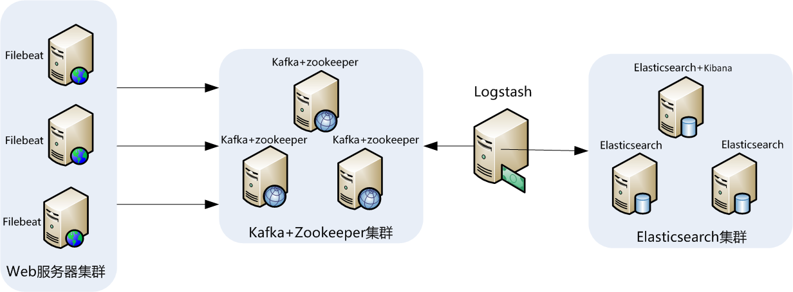
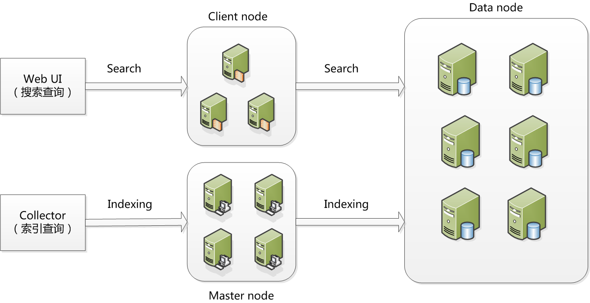
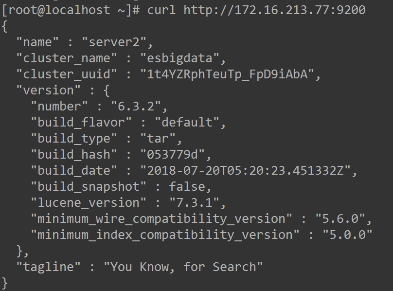

## 2.【案例】Elasticsearch集群架构的部署与调优

## 1.1 典型ELK应用架构

下图是本节即将要介绍的一个线上真实案例的架构图：



此架构稍微有些复杂，因此，这里做一下架构解读。  
这个架构图从左到右，总共分为5层，每层实现的功能和含义分别介绍如下：

**第一层、数据采集层**

数据采集层位于最左边的业务服务器集群上，在每个业务服务器上面安装了filebeat做日志收集，然后把采集到的原始日志发送到Kafka+zookeeper集群上。

**第二层、消息队列层**

原始日志发送到Kafka+zookeeper集群上后，会进行集中存储，此时，filbeat是消息的生产者，存储的消息可以随时给消费。

**第三层、数据分析层**

Logstash作为消费者，会去Kafka+zookeeper集群节点实时拉取原始日志，然后将获取到的原始日志根据规则进行分析、清洗、过滤，最后将清洗好的日志转发至Elasticsearch集群。

**第四层、数据持久化存储**

Elasticsearch集群在接收到logstash发送过来的数据后，执行写磁盘，建索引库等操作，最后将结构化的数据存储到Elasticsearch集群上。

**第五层、数据查询、展示层**

Kibana是一个可视化的数据展示平台，当有数据检索请求时，它从Elasticsearch集群上读取数据，然后进行可视化出图和多维度分析。

## 1.2 环境与角色说明

## 1 服务器环境与角色

操作系统统一采用Centos7.5版本，各个服务器角色如下表所示：

| IP地址 | 主机名 | 角色 | 所属集群 |
| --- | --- | --- | --- |
| 172.16.213.157 | filebeatserver | 业务服务器+filebeat | 业务服务器集群 |
| 172.16.213.51 | kafkazk1 | Kafka+ ZooKeeper | Kafka Broker集群 |
| 172.16.213.75 | kafkazk2 | Kafka+ ZooKeeper |  |
| 172.16.213.109 | kafkazk3 | Kafka+ ZooKeeper |  |
| 172.16.213.120 | logstashserver | Logstash | 数据转发 |
| 172.16.213.37 | server1 | ES Master、ES NataNode | Elasticsearch集群 |
| 172.16.213.77 | server2 | ES Master、Kibana |  |
| 172.16.213.78 | server3 | ES Master、ES NataNode |  |

## 2 软件环境与版本

下表详细说明了本节安装软件对应的名称和版本号，其中，ELK三款软件推荐选择一样的版本，这里选择的是6.3.2版本。

| 软件名称 | 版本 | 说明 |
| --- | --- | --- |
| JDK | JDK 1.8.0\_151 | Java环境解析器 |
| filebeat | filebeat-6.3.2-linux-x86\_64 | 前端日志收集器 |
| Logstash | logstash-6.3.2 | 日志收集、过滤、转发 |
| zookeeper | zookeeper-3.4.11 | 资源调度、协作 |
| Kafka | kafka\_2.10-0.10.0.1 | 消息通信中间件 |
| elasticsearch | elasticsearch-6.3.2 | 日志存储 |
| kibana | kibana-6.3.2-linux-x86\_64 | 日志展示、分析 |

## 1.3 安装JDK以及设置环境变量

## 1 选择合适版本并下载JDK

Zookeeper、elasticsearch和Logstash都依赖于Java环境，并且elasticsearch和Logstash要求JDK版本至少在JDK1.7或者以上，因此，在安装zookeeper、Elasticsearch和Logstash的机器上，必须要安装JDK，一般推荐使用最新版本的JDK,这里我们使用JDK1.8版本，可以选择使用Oracle  
JDK1.8 或者Open JDK1.8。这里我们使用Oracle JDK1.8。

从oracle官网下载linux-64版本的JDK，下载时，选择适合自己机器运行环境的版本，oracle官网提供的JDK都是二进制版本的，因此，JDK的安装非常简单，只需将下载下来的程序包解压到相应的目录即可。安装过程如下：

```coffeescript
[root@localhost ~]# mkdir /usr/java
[root@localhost ~]# tar -zxvf jdk-8u152-linux-x64.tar.gz -C /usr/java/
```

这里我们将JDK安装到了/usr/java/目录下。

## 2 设置JDK的环境变量

要让程序能够识别JDK路径，需要设置环境变量，这里我们将JDK环境变量设置到/etc/profile文件中。添加如下内容到/etc/profile文件最后：

```plain
export JAVA_HOME=/usr/java/jdk1.8.0_152
export PATH=$PATH:$JAVA_HOME/bin
exportCLASSPATH=.:$JAVA_HOME/lib/tools.jar:$JAVA_HOME/lib/dt.jar:$CLASSPATH
```

然后执行如下命令让设置生效：

```coffeescript
[root@localhost ~]# source /etc/profile
```

最后，在Shell提示符中执行“java -version”命令，如果显示如下结果，说明安装成功：

```css
[root@localhost ~]# java -version
openjdk version "1.8.0_152"
OpenJDK Runtime Environment (build 1.8.0_152-b12)
OpenJDK 64-Bit Server VM (build 25.152-b12, mixed mode)
```

## 2 安装并配置elasticsearch集群

## 2.1 elasticsearch集群的架构与角色

elasticsearch集群的一个主要特点就是去中心化，字面上理解就是无中心节点，这是从集群外部来说的，因为从外部来看elasticsearch集群,它在逻辑上是一个整体，与任何一个节点的通信和与整个elasticsearch集群通信是完全相同的。另外，从elasticsearch集群内部来看，集群中可以有多个节点，其中有一个为主节点（master node），这个主节点不是通过配置文件定义的，而是通过选举产生的。

下图为elasticsearch集群的运行架构图：



在ElasticSearch的架构中，有三类角色，分别是Client Node、Data Node和Master Node，搜索查询的请求一般是经过Client Node来向Data Node获取数据，而索引查询首先请求Master Node节点，然后Master  
Node将请求分配到多个Data Node节点完成一次索引查询。

本节介绍的ElasticSearch架构中，我们只用了Data Node和Master Node角色，省去了Client Node节点，关于主机和对应的各个角色如下表所示：

| 节点名称 | IP地址 | 集群角色 |
| --- | --- | --- |
| server1 | 172.16.213.37 | Master node、data node |
| server2 | 172.16.213.77 | data node |
| server3 | 172.16.213.78 | Master node、data node |

这里对集群中每个角色的含义介绍如下：

master node：

可以理解为主节点，主要用于元数据(metadata)的处理，比如索引的新增、删除、分片分配等，以及管理集群各个节点的状态。elasticsearch集群中可以定义多个主节点，但是，在同一时刻，只有一个主节点起作用，其它定义的主节点，是作为主节点的候选节点存在。当一个主节点故障后，集群会从候选主节点中选举出新的主节点。

由于数据的存储和查询都不会走主节点，所以主节点的压力相对较小，因此主节点的内存分配也可以相对少些，但是主节点却是最重要的，因为一旦主节点宕机，整个elasticsearch集群将不可用。所以一定要保证主节点的稳定性。

data node：

数据节点，这些节点上保存了数据分片。它负责数据相关操作，比如分片的CRUD、搜索和整合等操作。数据节点上面执行的操作都比较消耗CPU、内存和I/O资源，因此数据节点服务器要选择较好的硬件配置，才能获取高效的存储和分析性能。

client node：

客户端节点，属于可选节点，是作为任务分发用的，它里面也会存元数据，但是它不会对元数据做任何修改。client node存在的好处是可以分担data node的一部分压力，因为elasticsearch的查询是两层汇聚的结果，第一层是在data node上做查询结果汇聚，然后把结果发给client node，client node接收到data node发来的结果后再做第二次的汇聚，然后把最终的查询结果返回给用户。这样，client node就替data node分担了部分压力。

从上面对elasticsearch集群三个角色的描述，可以看出，每个节点都有存在的意义，我们只有把相关功能和角色划分清楚了，每种节点各尽其责，才能充分发挥出分布式集群的效果。

## 2.2 安装elasticsearch与授权

elasticsearch的安装非常简单，首先从官网https://www.elastic.co/ 下载页面找到适合的版本，可选择zip、tar、rpm等格式的安装包下载，这里我们下载的软件包为elasticsearch-6.3.2.tar.gz。安装过程如下：

```perl
[root@localhost ~]# tar -zxvf elasticsearch-6.3.2.tar.gz -C /usr/local
[root@localhost ~]# mv /usr/local/elasticsearch-6.3.2
/usr/local/elasticsearch
```

这里我们将elasticsearch安装到了/usr/local目录下。

由于elasticSearch可以接收用户输入的脚本并且执行，为了系统安全考虑，需要创建一个单独的用户用来运行elasticSearch，这里创建的普通用户是elasticsearch，操作如下：

```coffeescript
[root@localhost ~]# useradd elasticsearch
```

然后将elasticsearch的安装目录都授权给elasticsearch用户，操作如下：

```perl
[root@localhost ~]# chown -R elasticsearch:elasticsearch
/usr/local/elasticsearch
```

## 2.3 操作系统调优

操作系统以及JVM调优主要是针对安装elasticsearch的机器，为了获取高效、稳定的性能，需要从操作系统和JVM两个方面对elasticsearch进行一个简单调优。

对于操作系统，需要调整几个内核参数，将下面内容添加到/etc/sysctl.conf文件中：

```plain
fs.file-max=655360
vm.max_map_count = 262144
```

其中，第一个参数fs.file-max主要是配置系统最大打开文件描述符数，建议修改为655360或者更高，第二个参数vm.max\_map\_count影响Java线程数量，用于限制一个进程可以拥有的VMA(虚拟内存区域)的大小，系统默认是65530，建议修改成262144或者更高。

另外，还需要调整进程最大打开文件描述符（nofile）、最大用户进程数（nproc）和最大锁定内存地址空间（memlock），添加如下内容到/etc/security/limits.conf文件中：

```markdown
* soft nproc 20480
* hard nproc 20480
* soft nofile 65536
* hard nofile 65536
* soft memlock unlimited
* hard memlock unlimited

>   最后，还需要修改/etc/security/limits.d/20-nproc.conf文件（centos7.x系统），将：

* soft nproc 4096
修改为：
* soft nproc 20480
或者直接删除/etc/security/limits.d/20-nproc.conf文件也行。
```

## 2.4 JVM调优

JVM调优主要是针对elasticsearch的JVM内存资源进行优化，elasticsearch的内存资源配置文件为jvm.options，此文件位于/usr/local/elasticsearch/config目录下，打开此文件,修改如下内容：

```plain
-Xms2g
-Xmx2g
```

可以看到，默认JVM内存为2g，可根据服务器内存大小，修改为合适的值。一般设置为服务器物理内存的一半最佳。

## 2.5 配置elasticsearch

elasticsearch的配置文件均在elasticsearch根目录下的config文件夹，这里是/usr/local/elasticsearch/config目录，主要有jvm.options、elasticsearch.yml和log4j2.properties三个主要配置文件。其中jvm.options为JVM配置文件，log4j2.properties为日志配置，都相对比较简单，这里重点介绍elasticsearch.yml一些重要的配置项及其含义。

这里配置的elasticsearch.yml文件内容如下：

```plain
cluster.name: esbigdata
node.name: server1
node.master: true
node.data: true
path.data: /data1/elasticsearch,/data2/elasticsearch
path.logs: /usr/local/elasticsearch/logs
bootstrap.memory_lock: true
network.host: 0.0.0.0
http.port: 9200
discovery.zen.minimum_master_nodes: 1
discovery.zen.ping.unicast.hosts: ["172.16.213.37:9300","172.16.213.78:9300"]
```

每个配置项的含义分别介绍如下：

(1）cluster.name: esbigdata

配置elasticsearch集群名称，默认是elasticsearch。这里修改为esbigdata，elasticsearch会自动发现在同一网段下的集群名为esbigdata的主机，如果在同一网段下有多个集群，就可以通过这个属性来区分不同的集群。线上生产环境时建议更改。

（2）node.name: server1

节点名，任意指定一个即可，这里是server1，我们这个集群环境中有三个节点，分别是server1、server2和server3，记得根据主机的不同，要修改相应的节点名称。

（3）node.master: true

指定该节点是否有资格被选举成为master，默认是true，elasticsearch集群中默认第一台启动的机器为master角色，如果这台服务器宕机就会重新选举新的master。我们这个集群环境中，定义了server1和server3两个master节点，因此这两个节点上node.master的值要设置为true。

（4）node.data: true

指定该节点是否存储索引数据，默认为true，表示数据存储节点，如果节点配置node.master:false并且node.data:  
false，则该节点就是client node。这个client node类似于一个“路由器”，负责将集群层面的请求转发到主节点，将数据相关的请求转发到数据节点。在我们这个集群环境中，定义了server1、server2和server3均为数据存储节点，因此这三个节点上node.data的值要设置为true。

（5）path.data:/data1/elasticsearch, /data2/elasticsearch

设置索引数据的存储路径，默认是elasticsearch根目录下的data文件夹，这里自定义了两个路径，可以设置多个存储路径，用逗号隔开。

（6）path.logs: /usr/local/elasticsearch/logs

设置日志文件的存储路径，默认是elasticsearch根目录下的logs文件夹

（7）bootstrap.memory\_lock: true

此配置项一般设置为true用来锁住物理内存。在linux下物理内存的执行效率要远远高于虚拟内存（swap）的执行效率，因此，当JVM开始使用swap内存时elasticsearch的执行效率会降低很多，所以要保证它不使用swap，保证机器有足够的物理内存分配给elasticsearch。同时也要允许elasticsearch的进程可以锁住物理内存，linux下可以通过“ulimit -l”命令查看最大锁定内存地址空间（memlock）是不是unlimited，这个参数在之前系统调优的时候已经设置过了。

（8）network.host: 0.0.0.0

此配置项是network.publish\_host和network.bind\_host两个配置项的集合，network.bind\_host用来设置elasticsearch提供服务的IP地址，默认值为0.0.0.0，此默认配置不太安全，因为如果服务器有多块网卡（可设置多个IP，可能有内网IP，也可能有外网IP），那么就可以通过外网IP来访问elasticsearch提供的服务，显然，elasticsearch集群在外网访问的话将非常不安全，因此，建议将network.bind\_host设置为内网IP地址比较好。

network.publish\_host用来设置elasticsearch集群中该节点和其它节点间交互通信的IP地址，一般设置为该节点所在的内网IP地址即可。需要保证可以和集群中其它节点进行通信。

在elasticsearch新版本中，增加了network.host配置项，此配置项用来同时设置bind\_host和publish\_host上面两个参数，根据上面的介绍，此值设置为服务器的内网IP地址即可。也就是设置bind\_host和publish\_host为同一个IP地址。

（9）http.port: 9200

设置elasticsearch对外提供服务的http端口，默认为9200。其实，还有一个端口配置选项transport.tcp.port，此配置项用来设置节点间交互通信的TCP端口，默认是9300。

（10）discovery.zen.minimum\_master\_nodes: 1

配置当前集群中最少的master节点数，默认为1，也就是说，elasticsearch集群中master节点数不能低于此值，如果低于此值，elasticsearch集群将停止运行。在三个以上节点的集群环境中，建议配置大一点的值，推荐2至4个为好。

（11）discovery.zen.ping.unicast.hosts:  
\["172.16.213.37:9300","172.16.213.78:9300"\]

设置集群中master节点的初始列表，可以通过这些节点来自动发现新加入集群的节点。这里需要注意，master节点初始列表中对应的端口是9300。即为集群交互通信端口。

## 2.6 启动elasticsearch

启动elasticsearch服务需要在一个普通用户下完成，如果通过root用户启动elasticsearch的话，可能会收到如下错误：

```css
java.lang.RuntimeException: can not run elasticsearch as root
at org.elasticsearch.bootstrap.Bootstrap.initializeNatives(Bootstrap.java:106)
~[elasticsearch-6.3.2.jar:6.3.2]
at org.elasticsearch.bootstrap.Bootstrap.setup(Bootstrap.java:195)
~[elasticsearch-6.3.2.jar:6.3.2]
at org.elasticsearch.bootstrap.Bootstrap.init(Bootstrap.java:342)
[elasticsearch-6.3.2.jar:6.3.2]
```

这是出于系统安全考虑，elasticsearch服务必须通过普通用户来启动，在上面第一小节中，已经创建了一个普通用户elasticsearch，直接切换到这个用户下启动elasticsearch集群即可。分别登录到server1、server2和server3三台主机上，执行如下操作：

```ruby
[root@localhost ~]# su - elasticsearch
[elasticsearch@localhost ~]$ cd /usr/local/elasticsearch/
[elasticsearch@localhost elasticsearch]$ bin/elasticsearch -d
```

其中，“-d”参数的意思是将elasticsearch放到后台运行。

## 2.7 验证elasticsearch集群的正确性

将所有elasticsearch节点的服务启动后，在任意一个节点执行如下命令：

\[root@localhost ~\]# curl [http://172.16.213.77:9200](http://172.16.213.77:9200/)

如果返回类似如下结果，表示elasticsearch集群运行正常。



至此，elasticsearch集群安装、配置完成。

