## 4.Kafka分布式集群构建以及使用FileBeat收集日志

## 1.kafka分布式集群构建

## 1.1 下载与安装Kafka

Kafka也需要安装Java运行环境，这在前面章节已经介绍过了，这里不再介绍，读者可以从kafka官网https://kafka.apache.org/downloads 获取kafka安装包，这里推荐的版本是kafka\_2.10-0.10.0.1.tgz，不建议使用最新的版本。将下载下来的安装包直接解压到一个路径下即可完成kafka的安装，这里统一将kafka安装到/usr/local目录下，基本操作过程如下：

```coffeescript
[root@localhost ~]# tar -zxvf kafka_2.10-0.10.0.1.tgz -C /usr/local
[root@localhost ~]# mv /usr/local/kafka_2.10-0.10.0.1 /usr/local/kafka
```

这里我们将kafka安装到了/usr/local目录下。

## 1.2 配置kafka集群

这里我们将kafka安装到/usr/local目录下，因此，kafka的主配置文件为/usr/local/kafka/config/server.properties，这里以节点kafkazk1为例，重点介绍一些常用配置项的含义：

```plain
broker.id=1
listeners=PLAINTEXT://172.16.213.51:9092
log.dirs=/usr/local/kafka/logs
num.partitions=6
log.retention.hours=60
log.segment.bytes=1073741824
zookeeper.connect=172.16.213.51:2181,172.16.213.75:2181,172.16.213.109:2181
auto.create.topics.enable=true
delete.topic.enable=true
```

其中，每个配置项含义如下：

\-broker.id：每一个broker在集群中的唯一表示，要求是正数。当该服务器的IP地址发生改变时，broker.id没有变化，则不会影响consumers的消息情况。

\-listeners：设置kafka的监听地址与端口，可以将监听地址设置为主机名或IP地址，这里将监听地址设置为IP地址。如果设置为主机名，那么还需要将主机名与IP的对应关系本地解析到系统的/etc/hosts文件中。

\-log.dirs：这个参数用于配置kafka保存数据的位置，kafka中所有的消息都会存在这个目录下。可以通过逗号来指定多个路径，kafka会根据最少被使用的原则选择目录分配新的parition。需要注意的是，kafka在分配parition的时候选择的规则不是按照磁盘的空间大小来定的，而是根据分配的parition的个数多小而定。

\-num.partitions：这个参数用于设置新创建的topic有多少个分区，可以根据消费者实际情况配置，配置过小会影响消费性能。这里配置6个。

\-log.retention.hours：这个参数用于配置kafka中消息保存的时间，还支持log.retention.minutes和log.retention.ms配置项。这三个参数都会控制删除过期数据的时间，推荐还是使用log.retention.ms。如果多个同时设置，那么会选择最小的那个。

\-log.segment.bytes：配置partition中每个segment数据文件的大小，默认是1GB，超过这个大小会自动创建一个新的segment file。

\-zookeeper.connect：这个参数用于指定zookeeper所在的地址，它存储了broker的元信息。这个值可以通过逗号设置多个值，每个值的格式均为：hostname:port/path，其中每个部分的含义如下：

> hostname：表示zookeeper服务器的主机名或者IP地址，这里设置为IP地址。  
> port： 表示是zookeeper服务器监听连接的端口号。  
> /path：表示kafka在zookeeper上的根目录。如果不设置，会使用根目录。

\-auto.create.topics.enable：这个参数用于设置是否自动创建topic，如果请求一个topic时发现还没有创建，kafka会在broker上自动创建一个topic，如果需要严格的控制topic的创建，那么可以设置auto.create.topics.enable为false，禁止自动创建topic。

\-delete.topic.enable：在0.8.2版本之后，Kafka提供了删除topic的功能，但是默认并不会直接将topic数据物理删除。如果要从物理上删除（即删除topic后，数据文件也会一同删除），就需要设置此配置项为true。

## 1.3 启动kafka集群

在启动kafka集群前，需要确保ZooKeeper集群已经正常启动。接着，依次在kafka各个节点上执行如下命令即可：

```coffeescript
[root@localhost ~]# cd /usr/local/kafka
[root@localhost kafka]# nohup bin/kafka-server-start.sh
config/server.properties &
[root@localhost kafka]# jps
21840 Kafka
15593 Jps
15789 QuorumPeerMain
```

这里将kafka放到后台运行，启动后，会在启动kafka的当前目录下生成一个nohup.out文件，可通过此文件查看kafka的启动和运行状态。通过jps指令，可以看到有个Kafka标识，这是kafka进程成功启动的标志。

## 1.4 kafka集群基本命令操作

kafka提供了多个命令用于查看、创建、修改、删除topic信息，也可以通过命令测试如何生产消息、消费消息等，这些命令位于kafka安装目录的bin目录下，这里是/usr/local/kafka/bin。登录任意一台kafka集群节点，切换到此目录下，即可进行命令操作。下面简单列举了kafka的一些常用命令的使用方法。

（1）显示topic列表

命令执行方式如下图所示：

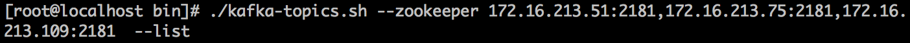

其中，“--zookeeper”参数后面跟的是zookeeper集群的主机列表。

具体操作实例如下图所示：

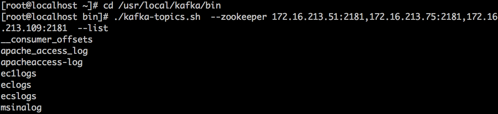

（2）创建一个topic，并指定topic属性（副本数、分区数等）

命令执行方式如下图所示：

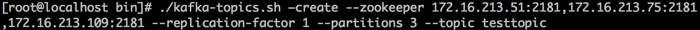

其中：

> \--create：表示创建一个topic。  
> \--replication-factor：表示这个topic的副本数，这里设置为1个。  
> \--partitions：指定topic的分区数，一般设置为小于或等于kafka集群节点数即可。  
> \--topic：指定要创建的topic的名称。

实例操作如下图所示：

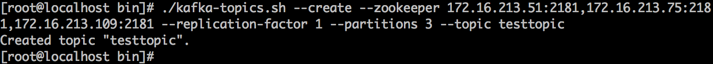

（3）查看某个topic的状态

命令执行方式如下图所示：

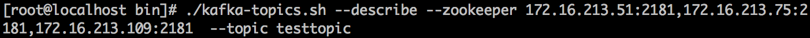

这里通过”--describe“选项查看刚刚创建好的testtopic的状态。实例操作如下图所示：

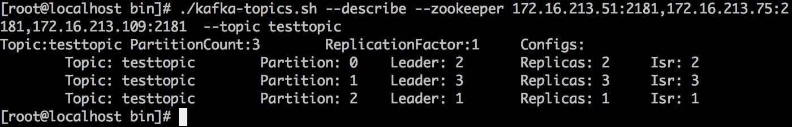

其中：

Partition：表示分区ID，通过输出可以看到，testtopic有三个分区，一个副本，这刚好和我们创建testtopic时指定的配置吻合。

> leader：表示当前负责读写的Leader broker。  
> replicas：表示当前分区的所有副本对应的broker列表。  
> isr：表示处于活动状态的broker。

（4）生产消息

命令执行方式如下图所示：

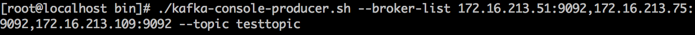

这里需要注意，”--broker-list“后面跟的内容是kafka集群的ip和端口，而非zookeeper集群的地址。

实例操作如下图所示：

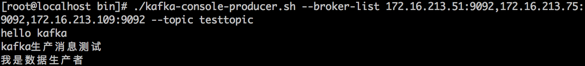

当输入这条命令后，光标处于可写状态，接着就可以写入一些测试数据，每行一条，这里输入的内容为：

hello kafka  
kafka生产消息测试  
我是数据生产者

（5）消费消息

命令执行方式如下图所示：

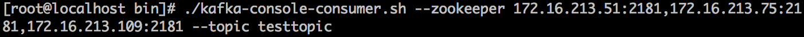

紧接着上面生产消息的步骤，再登录任意一台kafka集群节点，执行消费消息的命令，结果如下图所示：

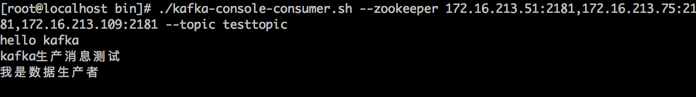

可以看到，在第四步中，输入的消息在这里原样输出了，这样就完成了消息的消费。

（6）删除topic

命令执行方式如下图所示：

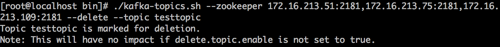

注意这里的“--delete”选项，用来删除一个指定的topic。

删除topic后会有个提示，意思是说如果kafka没有设置delete.topic.enable为true的话，那么仅仅是个标记删除，而非真正的删除。

# 2.使用filebeat收集日志数据

## 2.1 什么是Filebeat

Filebeat是一个开源的文本日志收集器,它是elastic公司Beats数据采集产品的一个子产品，采用go语言开发，一般安装在业务服务器上作为代理来监测日志目录或特定的日志文件，并把它们发送到logstash、elasticsearch、redis或Kafka等。可以在官方地址https://www.elastic.co/downloads/beats 下载各个版本的Filebeat。

## 2.2 Filebeat架构与运行原理

Filebeat是一个轻量级的日志监测、传输工具，它最大的特点是性能稳定、配置简单、占用系统资源很少。这也是强烈推荐Filebeat的原因。下图是官方给出的Filebeat架构图：


从图中可以看出，Filebeat主要由两个组件构成：  
prospector（探测器）和harvester（收集器）。这两类组件一起协作完成Filebeat的工作。

其中，Harvester负责进行单个文件的内容收集，在运行过程中，每一个Harvester会对一个文件逐行进行内容读取，并且把读写到的内容发送到配置的output中。当Harvester开始进行文件的读取后，将会负责这个文件的打开和关闭操作，因此，在Harvester运行过程中，文件都处于打开状态。如果在收集过程中，删除了这个文件或者是对文件进行了重命名，Filebeat依然会继续对这个文件进行读取，这时候将会一直占用着文件所对应的磁盘空间，直到Harvester关闭。

Prospector负责管理Harvster，它会找到所有需要进行读取的数据源。然后交给Harvster进行内容收集，如果input type配置的是log类型，Prospector将会去配置路径下查找所有能匹配上的文件，然后为每一个文件创建一个Harvster。

综上所述，filebeat的工作流程为：当开启filebeat程序的时候，它会启动一个或多个探测器（prospector）去检测指定的日志目录或文件，对于探测器找出的每一个日志文件，filebeat会启动收集进程（harvester），每一个收集进程读取一个日志文件的内容，然后将这些日志数据发送到后台处理程序（spooler），后台处理程序会集合这些事件，最后发送集合的数据到output指定的目的地。

## 3.安装并配置Filebeat

## 3.1 为什么要使用filebeat

Logstash功能虽然强大，但是它依赖java、在数据量大的时候，Logstash进程会消耗过多的系统资源，这将严重影响业务系统的性能，而filebeat就是一个完美的替代者，filebeat是Beat成员之一，基于Go语言，没有任何依赖，配置文件简单，格式明了，同时，filebeat比logstash更加轻量级，所以占用系统资源极少，非常适合安装在生产机器上。这就是推荐使用filebeat来作为日志收集软件的原因。

## 3.2 下载与安装filebeat

由于filebeat基于go语言开发，无其他任何依赖，因而安装非常简单，读者可以从elastic官网https://www.elastic.co/downloads/beats/filebeat 获取filebeat安装包，这里下载的版本是filebeat-6.3.2-linux-x86\_64.tar.gz。将下载下来的安装包直接解压到一个路径下即可完成filebeat的安装。根据前面的规划，将filebeat安装到filebeatserver主机（172.16.213.157）上，这里设定将filebeat安装到/usr/local目录下，基本操作过程如下：

```perl
[root@filebeatserver ~]# tar -zxvf filebeat-6.3.2-linux-x86_64.tar.gz -C
/usr/local
[root@filebeatserver ~]# mv /usr/local/filebeat-6.3.2-linux-x86_64
/usr/local/filebeat
```

这里我们将filebeat就安装到了/usr/local目录下。

## 3.3 配置filebeat

这里我们将filebeat安装到/usr/local目录下，因此，filebeat的配置文件目录为/usr/local/filebeat/filebeat.yml,filebeat配置非常简单，这里仅列出常用的配置项，内容如下：

```plain
filebeat.inputs:
- type: log
  enabled: true
  paths:
   - /var/log/messages
   - /var/log/secure
  fields:
    log_topic: osmessages
name: "172.16.213.157"
output.kafka:
  enabled: true
  hosts: ["172.16.213.51:9092", "172.16.213.75:9092", "172.16.213.109:9092"]
  version: "0.10"
  topic: '%{[fields][log_topic]}'
  partition.round_robin:
    reachable_only: true
  worker: 2
  required_acks: 1
  compression: gzip
  max_message_bytes: 10000000
logging.level: info
```

每个配置项的含义介绍如下：

filebeat.inputs：用于定义数据原型。

type：指定数据的输入类型，这里是log，即日志，是默认值，还可以指定为stdin，即标准输入。

enabled: true：启用手工配置filebeat，而不是采用模块方式配置filebeat。filebeat6.3版本后可以通过模块方式快速配置filebeat，也可以手工配置，默认是模块方式配置。

paths：用于指定要监控的日志文件，可以指定一个完整路径的文件，也可以是一个模糊匹配格式，例如：

```ruby
    -  /data/nginx/logs/nginx_*.log，该配置表示将获取/data/nginx/logs目录下的所有以.log结尾的文件，注意这里有个破折号“-”，要在paths配置项基础上进行缩进，不然启动filebeat会报错，另外破折号前面不能有tab缩进，建议通过空格方式缩进。
    -  /var/log/*.log，该配置表示将获取/var/log目录的所有子目录中以”.log”结尾的文件，而不会去查找/var/log目录下以”.log”结尾的文件。
```

name： 设置filebeat收集的日志中对应主机的名字，如果配置为空，则使用该服务器的主机名。这里设置为IP，便于区分多台主机的日志信息。

output.kafka：filebeat支持多种输出，支持向kafka，logstash，elasticsearch输出数据，这里的设置是将数据输出到kafka。

enabled：表明这个启动这个模块。

host： 指定输出数据到kafka集群上，地址为kafka集群IP加端口号。

topic：指定要发送数据给kafka集群的哪个topic，若指定的topic不存在，则会自动创建此topic。注意topic的写法，在filebeat6.x之前版本是通过“%{\[type\]}”来自动获取document\_type配置项的值。而在filebeat6.x之后版本是通过'%{\[fields\]\[log\_topic\]}'或者'%{\[fields.log\_topic\]}'来获取日志分类的。

logging.level：定义filebeat的日志输出级别，有critical、error、warning、info、debug五种级别可选，在调试的时候可选择info模式。

## 3.4 启动filebeat收集日志

所有配置完成之后，就可以启动filebeat，开启收集日志进程了，启动方式如下：

```coffeescript
[root@filebeatserver ~]# cd /usr/local/filebeat
[root@filebeatserver filebeat]# nohup ./filebeat -e -c filebeat.yml &
```

这样，就把filebeat进程放到后台运行起来了。启动后，在当前目录下会生成一个nohup.out文件，可以查看filebeat启动日志和运行状态。

## 3.5 filebeat输出信息格式解读

这里以操作系统中/var/log/secure文件的日志格式为例，选取一个SSH登录系统失败的日志，内容如下：

```css
Aug 16 18:25:08 localhost sshd[13053]: Failed password for root from 172.16.213.37 port 49560 ssh2
```

filebeat接收到/var/log/secure日志后，会将上面日志发送到kafka集群，在kafka任意一个节点上，消费输出日志内容如下：

```json
{"@timestamp":"2018-08-16T11:27:48.755Z",
"@metadata":{"beat":"filebeat","type":"doc","version":"6.3.2","topic":"osmessages"},
"beat":{"name":"filebeatserver","hostname":"filebeatserver","version":"6.3.2"},
"host":{"name":"filebeatserver"},
"source":"/var/log/secure",
"offset":11326,
"message":"Aug 16 18:25:08 localhost sshd[13053]: Failed password for root from 172.16.213.37 port 49560 ssh2",
"prospector":{"type":"log"},
"input":{"type":"log"},
"fields":{"log_topic":"osmessages"}
}
```

从这个输出可以看到，输出日志被修改成了JSON格式，日志总共分为七个字段，分别是"@timestamp"、"@metadata''、"beat"、"input"、"prospector"、"host"、"message"、"offset"、"source"和"fileds"字段，每个字段含义如下：

```coffeescript
   @timestamp：时间字段，表示读取到该行内容的时间。
   @metadata：元数据字段，此字段只有是跟Logstash进行交互使用。
   beat：beat属性信息，包含beat所在的主机名、beat版本等信息。
   host： 主机名字段，输出主机名，如果没主机名，输出主机对应的IP。
   source： 表示监控的日志文件的全路径。
   offset： 表示该行日志的偏移量。
   message： 表示真正的日志内容。
   prospector：filebeat对应的消息类型。
   input：日志输入的类型，可以有多种输入类型，例如Log、Stdin、redis、Docker、TCP/UDP等
   fields：topic对应的消息字段或自定义增加的字段。
```

通过filebeat接收到的内容，默认增加了不少字段，但是有些字段对数据分析来说没有太大用处，所以有时候需要删除这些没用的字段，在filebeat配置文件中添加如下配置，即可删除不需要的字段：

```makefile
processors:
- drop_fields:
   fields: ["beat", "input", "source", "offset"]
```

这个设置表示删除"beat"、"input"、"source"、"offset" 四个字段，其中， @timestamp 和@metadata 字段是不能删除的。做完这个设置后，再次查看kafka中的输出日志，已经不再输出这四个字段信息了。

