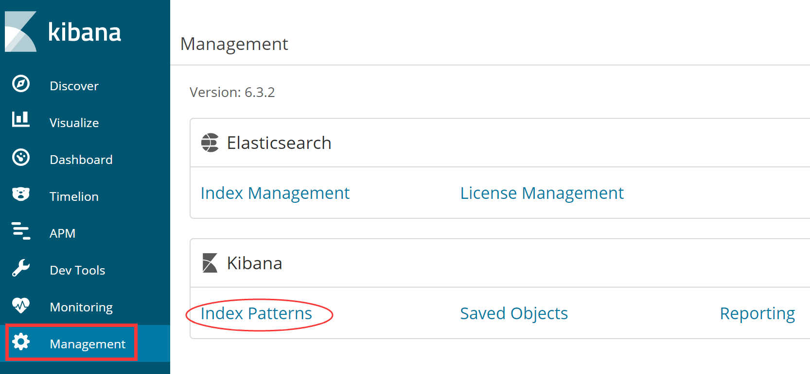
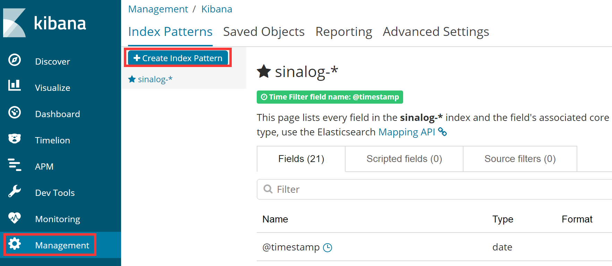
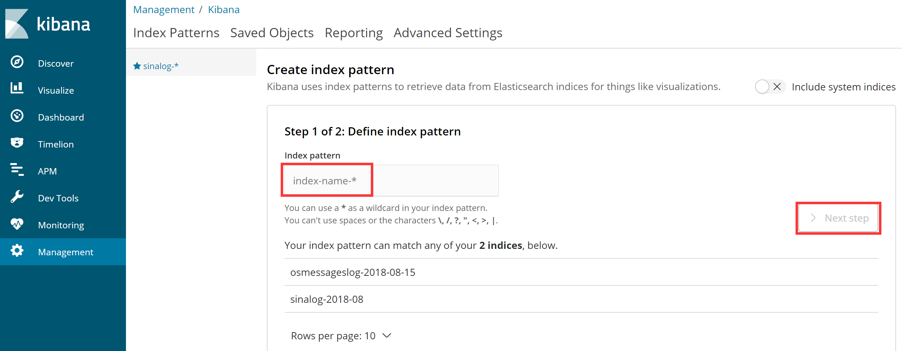
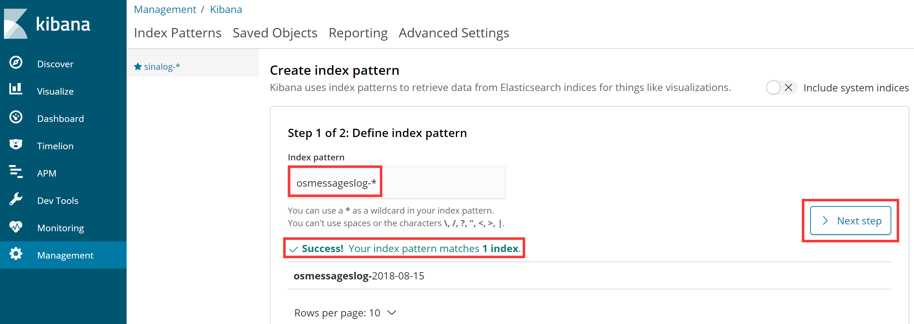
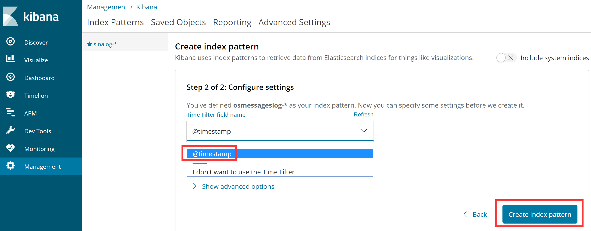
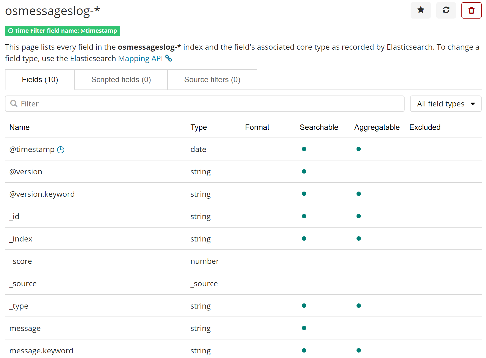
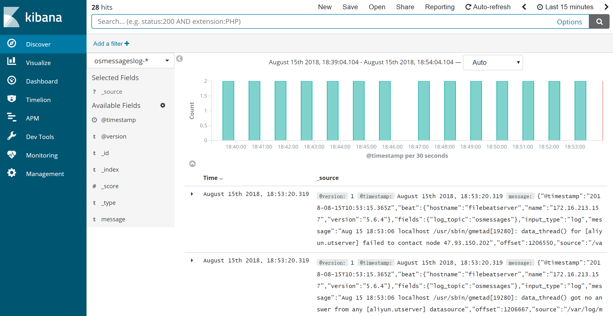
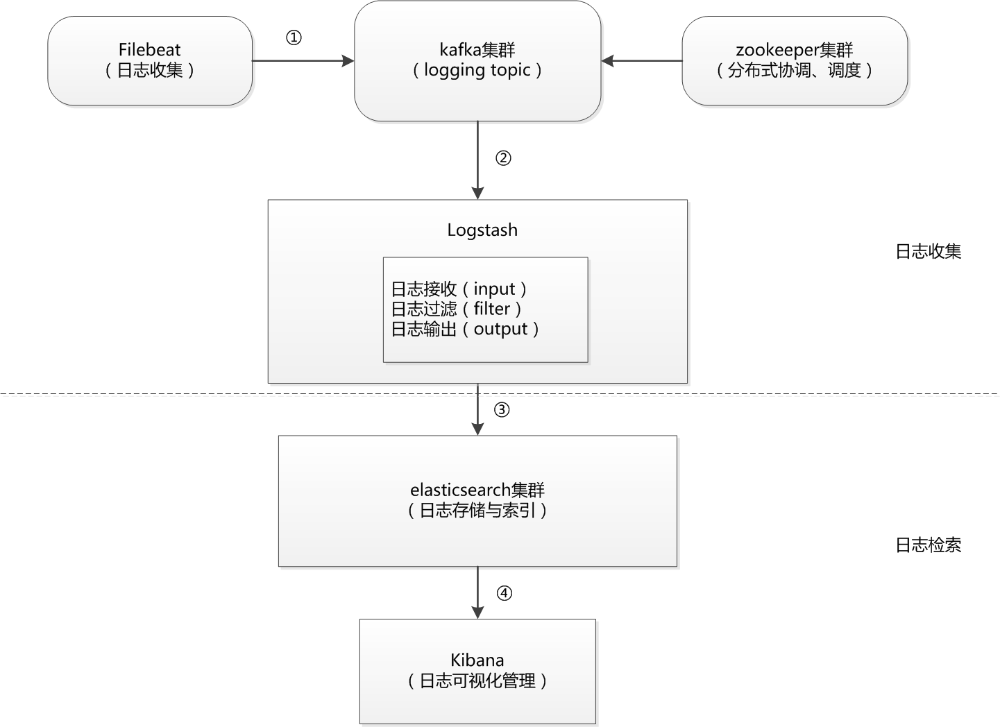

## 6.通过Kibana展示各种维度数据以及如何调试并验证日志数据流向

# 1、通过Kibana展示各种维度数据

## 1.1、下载与安装Kibana

kibana使用JavaScript语言编写，安装部署十分简单，即下即用，读者可以从elastic官网https://www.elastic.co/cn/downloads/kibana 下载所需的版本，这里需要注意的是Kibana与Elasticsearch的版本必须一致，另外，在安装Kibana时，要确保Elasticsearch、Logstash和kafka已经安装完毕。  
这里安装的版本是kibana-6.3.2-linux-x86\_64.tar.gz。将下载下来的安装包直接解压到一个路径下即可完成kibana的安装，根据前面的规划，将kibana安装到server2主机（172.16.213.77）上，然后统一将kibana安装到/usr/local目录下，基本操作过程如下：

```coffeescript
[root@localhost ~]# tar -zxvf kibana-6.3.2-linux-x86_64.tar.gz -C /usr/local
[root@localhost ~]# mv /usr/local/kibana-6.3.2-linux-x86_64  /usr/local/kibana
```

这里我们将kibana安装到了/usr/local目录下。

## 1.2、配置Kibana

由于将Kibana安装到了/usr/local目录下，因此，Kibana的配置文件为/usr/local/kibana/kibana.yml,Kibana配置非常简单，这里仅列出常用的配置项，内容如下：

```plain
server.port: 5601
server.host: "172.16.213.77"
elasticsearch.url: "http://172.16.213.37:9200"
kibana.index: ".kibana"
```

其中，每个配置项的含义介绍如下：

```css
   server.port：kibana绑定的监听端口，默认是5601。
   server.host：kibana绑定的IP地址，如果内网访问，设置为内网地址即可。
   elasticsearch.url：kibana访问ElasticSearch的地址，如果是ElasticSearch集群，添加任一集群节点IP即可，官方推荐是设置为ElasticSearch集群中client node角色的节点IP。
   kibana.index：用于存储kibana数据信息的索引，这个可以在kibanaweb界面中看到。
```

## 1.3、启动Kibana服务与web配置

所有配置完成后，就可以启动kibana了，启动kibana服务的命令在/usr/local/kibana/bin目录下，执行如下命令启动kibana服务：

```perl
[root@kafkazk2 ~]# cd /usr/local/kibana/
[root@kafkazk2 kibana]# nohup bin/kibana &
[root@kafkazk2 kibana]# ps -ef|grep node
root      6407     1  0 Jan15 ?        00:59:11 bin/../node/bin/node --no-warnings bin/../src/cli
root      7732 32678  0 15:13 pts/0    00:00:00 grep --color=auto node
```

这样，kibana对应的node服务就启动起来了。  
接着，打开浏览器访问http://172.16.213.77:5601， 会自动打开kibana的web界面，在登录kibana后，第一步要做的就是配置index\_pattern，点击kibana左侧导航中的Management菜单，然后选择右侧的Index Patterns按钮，如下图所示：  


接着，点击左上角的Create index，开始创建一个index pattern，如下图所示：  




这里需要填写一个Index pattern名称，而在logstash安装配置一节中，我们已经定义好了这个Index pattern，名为osmessageslog-%{+YYYY-MM-dd}，而这里只需填入osmessageslog-\*即可，如果已经有对应的数据写入elasticsearch，那么kibana会自动检测到并抓取映射文件，此时就可以创建此Index pattern了，如下图所示：  


如果你填入索引名称后，右下面的“Next step”按钮仍然是不可点击状态，那说明kibana还没有抓取到输入索引对应的映射文件，此时可以让filebeat再生成一点数据，只要数据正常传到elasticsearch中，那么kibana就能马上检测到。

接着，选择日志字段按照“@timestamp”进行排序，也就是按照时间进行排序，如下图所示：



最后，点击“Create index pattern”按钮，完成Index pattern的创建，如下图所示：  


创建完成Index pattern后，点击kibana左侧导航中的Discover导航栏，即可展示已经收集到的日志信息，如下图所示：  


Kibana的web界面操作和使用比较简单，这里仅仅介绍下左侧导航栏中每个导航的含义以及功能，更细节的功能读者自行操作几遍就基本掌握了。

>  Discover：主要用来进行日志检索，查询数据，这个功能使用最多。  
>  Visualize：数据可视化，可以在这里创建各种维度的可视化视图，例如面积图、折线图、饼图、热力图、标签云等，通过创建可视化视图，日志数据浏览变得非常直观。  
>  Dashboard：仪表盘功能，仪表盘其实是可视化视图的组合，通过将各种可视化视图组合到一个页面，可以从整体上了解数据和日志的各种状态。  
>  Timelion：时间画像，可以在这里创建时间序列可视化视图。  
>  Dev Tools：这是一个调试工具控制台，kibana提供了一个UI来与Elasticsearch的REST API进行交互。 控制台有两个主要方面 ：editor（编辑器）与response（响应），editor用来编写对Elasticsearch的请求，response显示对请求的响应。  
>  Management：这是管理界面，可以在这里创建索引模式，调整Kibana设置等操作。

至此，kibana基本使用介绍完毕。

# 2、调试并验证日志数据流向

经过上面的配置过程，大数据日志分析平台已经基本构建完成，由于整个配置架构比较复杂，这里我们来梳理下各个功能模块的数据和业务流向，这有助于加深对整个架构的了解和认知。  
下图是我们部署的日志分析平台的数据流向和功能模块图：



此架构从整体上分成两个部分，分别是日志收集部分、日志检索部分。而整个数据流向分成了四个步骤，每个部分所实现的功能和含义分别如下：

> ①：这个过程是生产日志的过程，filebeat主要是用来收集业务服务器上的日志数据，它安装在每个业务服务器上，接收业务系统产生的日志，然后把日志实时的传输到kafka集群中，kafka消息队列系统可以对数据进行缓冲和存储。这里filebeat相当于kafka中的Producer（生产者），而这个过程其实就是一个push的过程，也就是推送数据到kafka集群。  
> ②：这是一个pull的过程，filebeat推送数据到kafka后，kafka不会主动push数据到logstash，相反，logstash会主动去kafka集群pull数据，这里logstash相当于Consumer（消费者）。Consumer从kafka集群pull数据，这是有很多好处的，因为Consumer可自主控制消费消息的速率，同时Consumer可以自己控制消费方式，由此减少消费过程中出错的机率。  
> Logstash从kafka拉取数据的过程实际上是分为三个步骤的，分别是input、filter和ouput，也就是首先接收不规则数据，然后过滤、分析并转换成格式化数据，最后输出格式化数据。这三个步骤是整个日志分析系统中最难掌握的部分。  
> ③：这个过程是将格式化的数据发送到elasticsearch中进行存储并索引，所有的数据会存储在elasticsearch集群中。  
> ④：这个过程是将elasticsearch中的数据在Web GUI界面进行可视化展示，并形成各种曲线图和报表。

在了解了数据流向逻辑之后，就可以对架构中每个部分进行有目的的调试和分析了，例如，当filebeat发送日志之后，就可以在kafka上面执行消费数据的命令，已验证filebeat的数据是否正确、及时的传输到了kafka集群上，如果在kafka上面消费到了对应的数据，那么接着就可以在elasticsearch的Head插件的web界面查看是否有对应的数据产生，如果有数据产生，那么整个数据流向正常，在kibana界面就能直接看到数据了。

