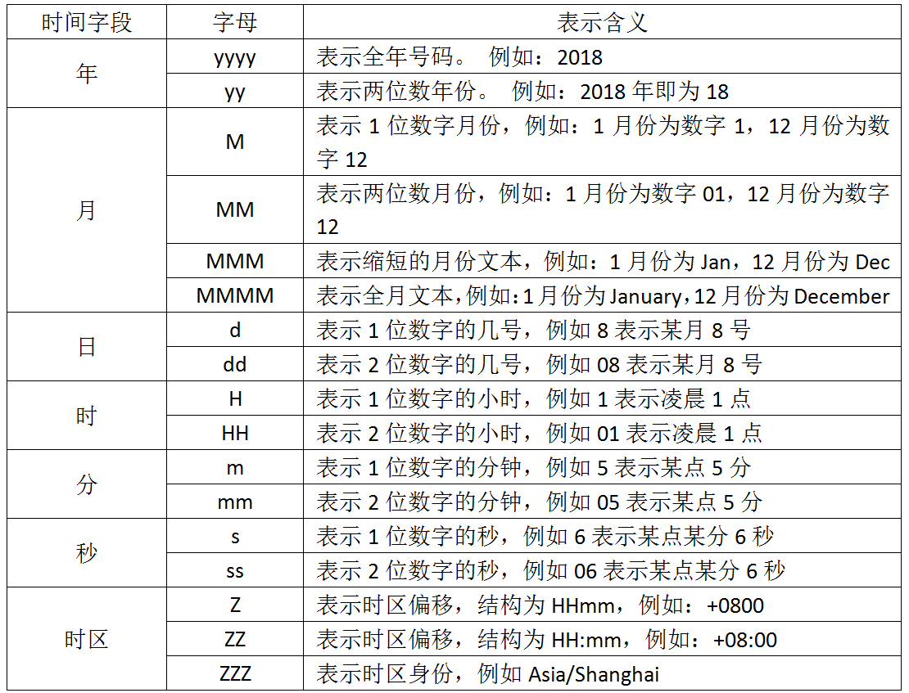

## 8.Logstash过滤器插件(Filter)以及输出插件（output）详解

# 1、Logstash过滤器插件(Filter)

丰富的过滤器插件是logstash功能强大的重要因素。名为过滤器，其实它提供的不单单是过滤器的功能。logstash还可以对进入过滤器的原始数据进行复杂的逻辑处理，甚至添加独特的事件到后续流程中。

## 1.1、Grok 正则捕获

grok是一个十分强大的logstash filter插件，他可以通过正则解析任意文本，将非结构化日志数据弄成结构化和方便查询的结构。他是目前logstash 中解析非结构化日志数据最好的方式。  
Grok 的语法规则是：

> %{语法: 语义}

“语法”指的就是匹配的模式，例如使用NUMBER模式可以匹配出数字，IP模式则会匹配出127.0.0.1这样的IP地址：

例如输入的内容为：

> 172.16.213.132 \[07/Feb/2018:16:24:19 +0800\] "GET / HTTP/1.1" 403 5039

那么，%{IP:clientip}匹配模式将获得的结果为：

> clientip: 172.16.213.132

%{HTTPDATE:timestamp}匹配模式将获得的结果为：

> timestamp: 07/Feb/2018:16:24:19 +0800

而%{QS:referrer}匹配模式将获得的结果为：

> referrer: "GET / HTTP/1.1"

到这里为止，我们已经获取了三个部分的输入内容，分别是clientip、timestamp和referrer三个字段，如果要获取剩余部分的信息，方法类似。

下面是一个组合匹配模式，它可以获取上面输入的所有内容：

```css
%{IP:clientip}\ \[%{HTTPDATE:timestamp}\]\ %{QS:referrer}\ %{NUMBER:response}\ %{NUMBER:bytes}
```

正则匹配是非常严格的匹配，在这个组合匹配模式中，使用了转义字符\\，这是因为输入的内容中有空格和中括号。

通过上面这个组合匹配模式，我们将输入的内容分成了五个部分，即五个字段，将输入内容分割为不同的数据字段，这对于日后解析和查询日志数据非常有用，这正是我们使用grok的目的。

Logstash默认提供了近200个匹配模式（其实就是定义好的正则表达式）让我们来使用，可以在logstash安装目录下，例如这里是/usr/local/logstash/vendor/bundle/jruby/1.9/gems/logstash-patterns-core-4.1.2/patterns目录里面查看，基本定义在grok-patterns文件中。  
从这些定义好的匹配模式中，可以查到上面使用的四个匹配模式对应的定义规则，如下表所示：

```ruby
匹配模式              正则定义规则
NUMBER           (?:%{BASE10NUM})
HTTPDATE          %{MONTHDAY}/%{MONTH}/%{YEAR}:%{TIME} %{INT}
IP                       (?:%{IPV6}|%{IPV4})
QS                      %{QUOTEDSTRING}
```

除此之外，还有很多默认定义好的匹配模式文件，例如httpd、java、linux-syslog、redis、mongodb、nagios等，这些已经定义好的匹配模式，可以直接在Grok过滤器中进行引用。当然也可以定义自己需要的匹配模式。

在了解完grok的匹配规则之后，下面通过一个配置实例深入介绍下Logstash是如何将非结构化日志数据转换成结构化数据的，首先看下面一个事件配置文件：

```makefile
input{
stdin{}
}
filter{
grok{
match => ["message","%{IP:clientip}\ \[%{HTTPDATE:timestamp}\]\ %{QS:referrer}\ %{NUMBER:response}\ %{NUMBER:bytes}"]
}
}
output{
stdout{
codec => "rubydebug"
}
}
```

在这个配置文件中，输入配置成了stdin，filter中添加了grok过滤插件，并通过match来执行正则表达式解析，中括号中的正则表达式就是上面提到的组合匹配模式，然后通过rubydebug编码格式输出信息。这样的组合有助于调试和分析输出结果。通过此配置启动Logstash进程后，我们仍然输入之前给出的那段内容：

> 172.16.213.132 \[07/Feb/2018:16:24:19 +0800\] "GET / HTTP/1.1" 403 5039

然后，查看rubydebug格式的日志输出，内容如下：

```php
{
      "referrer" => "\"GET / HTTP/1.1\"",
    "@timestamp" => 2018-02-07T10:37:01.015Z,
      "response" => "403",
         "bytes" => "5039",
      "clientip" => "172.16.213.132",
      "@version" => "1",
          "host" => "logstashserver",
       "message" => "172.16.213.132 [07/Feb/2018:16:24:19 +0800] \"GET / HTTP/1.1\" 403 5039",
     "timestamp" => "07/Feb/2018:16:24:19 +0800"
}
```

从这个输出可知，通过grok定义好的5个字段都获取到了内容，并正常输出了，看似完美，其实还有不少瑕疵。

首先，message字段也输出了完整的输入内容。这样看来，数据实质上就相当于是重复存储了两份，此时可以用remove\_field参数来删除掉message字段，只保留最重要的部分。

其次，timestamp字段表示日志的产生时间，而@timestamp默认情况下显示的是当前时间，在上面的输出中可以看出，这两个字段的时间并不一致，那么问题来了，在ELK日志处理系统中，@timestamp字段会被elasticsearch用到，用来标注日志的生成时间，如此一来，日志生成的时间就会发生混乱，要解决这个问题，需要用到另一个插件，即data插件，这个时间插件用来转换日志记录中的时间字符串，变成LogStash::Timestamp对象，然后转存到@timestamp字段里。

使用data插件很简单，添加下面一段配置即可：

> date {  
> match => \["timestamp", "dd/MMM/yyyy:HH:mm:ss Z"\]  
> }

注意：时区偏移量需要用一个字母Z来转换。

最后，在将timestamp自动的值传给@timestamp后，timestamp其实也就没有存在的意义了，所以还需要删除这个字段。  
将上面三个步骤的操作统一合并到配置文件中，修改后的配置文件内容如下：

```php
input {
    stdin {}
}
filter {
    grok {
        match => { "message" => "%{IP:clientip}\ \[%{HTTPDATE:timestamp}\]\ %{QS:referrer}\ %{NUMBER:response}\ %{NUMBER:bytes}" }
        remove_field => [ "message" ]
   }
date {
        match => ["timestamp", "dd/MMM/yyyy:HH:mm:ss Z"]
    }
mutate {
            remove_field => ["timestamp"]
        }
}
output {
    stdout {
        codec => "rubydebug"
    }
}
```

在这个配置文件中，使用了date插件，mutate插件以及remove\_field配置项，关于这两个插件后面会马上介绍到。

将修改后的配置文件重新运行后，仍然输入之前的那段内容:

> 172.16.213.132 \[07/Feb/2018:16:24:19 +0800\] "GET / HTTP/1.1" 403 5039

输出现在变为如下结果：

```php
{
      "referrer" => "\"GET / HTTP/1.1\"",
    "@timestamp" => 2018-02-07T08:24:19.000Z,
      "response" => "403",
         "bytes" => "5039",
      "clientip" => "172.16.213.132",
      "@version" => "1",
          "host" => "logstashserver"
}
```

这就是我们需要的最终结果。

## 1.2、时间处理(Date)

date插件是对于排序事件和回填旧数据尤其重要，它可以用来转换日志记录中的时间字段，变成LogStash::Timestamp对象，然后转存到@timestamp字段里，这在上一节已经做过简单的介绍。

下面是date插件的一个配置示例（这里仅仅列出filter部分）：

```php
filter {
    grok {
        match => ["message", "%{HTTPDATE:timestamp}"]
    }
    date {
        match => ["timestamp", "dd/MMM/yyyy:HH:mm:ss Z"]
    }
}
```

为什么要使用这个date插件呢，主要有两方面原因：

一方面由于Logstash会给收集到的每条日志自动打上时间戳（即@timestamp），但是这个时间戳记录的是input接收数据的时间，而不是日志生成的时间（因为日志生成时间与input接收的时间肯定不同），这样就可能导致搜索数据时产生混乱。

另一方面，不知道读者是否注意到了，在上面那段rubydebug编码格式的输出中，@timestamp字段虽然已经获取了timestamp字段的时间，但是仍然比北京时间早了8个小时，这是因为在Elasticsearch内部，对时间类型字段都是统一采用UTC时间，而日志统一采用UTC时间存储，是国际安全、运维界的一个共识。其实这并不影响什么，因为ELK已经给出了解决方案，那就是在Kibana平台上，程序会自动读取浏览器的当前时区，然后在web页面自动将UTC时间转换为当前时区的时间。

用于解析日期和时间文本的语法使用字母来指示时间（年、月、日、时、分等）的类型，以及重复的字母来表示该值的形式，在上面看到的"dd/MMM/yyyy:HH:mm:ss Z"就使用了这种形式，下图列出了每个使用字符的含义。



## 1.3、数据修改(Mutate)

mutate插件是Logstash另一个非常重要插件。它提供了丰富的基础类型数据处理能力。包括重命名、删除、替换和修改日志事件中的字段。这里重点介绍下mutate插件的字段类型转换功能（covert）、正则表达式替换匹配字段功能（gsub）、分隔符分割字符串为数组功能（split）、重命名字段功能（rename）、删除字段功能（remove\_field）的具体实现方法。

（1）、字段类型转换功能

mutate可以设置的转换类型有"integer"、"float"和"string"，下面是一个关于mutate字段类型转换的示例（仅列出filter部分）：

```php
filter {
    mutate {
        covert => ["filed_name", "integer"]
    }
}
```

这个示例表示将filed\_name字段类型修改为integer。  
（2）、正则表达式替换匹配字段  
gsub可以通过正则表达式替换字段中匹配到的值，只对字符串字段有效，下面是一个关于mutate插件中gsub的示例（仅列出filter部分）：

```php
filter {
    mutate {
        gsub => ["filed_name_1", "/" , "_"]
    }
}
```

这个示例表示将filed\_name_1字段中所有"/"字符替换为"_"。  
（3）、分隔符分割字符串为数组  
split可以通过指定的分隔符分割字段中的字符串为数组，下面是一个关于mutate插件中split的示例（仅列出filter部分）：

```php
filter {
    mutate {
        split => {"filed_name_2", "|"}
    }
}
```

这个示例表示将filed\_name\_2字段以"|"为区间分隔为数组。  
（4）重命名字段  
rename可以实现重命名某个字段的功能，下面是一个关于mutate插件中rename的示例（仅列出filter部分）：

```php
filter {
    mutate {
        rename => {"old_field" => "new_field"}
    }
}
```

这个示例表示将字段old\_field重命名为new\_field。  
（5）删除字段  
remove\_field可以实现删除某个字段的功能，下面是一个关于mutate插件中remove\_field的示例（仅列出filter部分）：

```php
filter {
    mutate {
        remove_field  =>  ["timestamp"]
    }
}
```

这个示例表示将字段timestamp删除。

在本节最后，我们将上面讲到的mutate插件的几个功能点整合到一个完整的配置文件中，以验证mutate插件实现的功能细节，配置文件内容如下：

```php
input {
    stdin {}
}
filter {
    grok {
        match => { "message" => "%{IP:clientip}\ \[%{HTTPDATE:timestamp}\]\ %{QS:referrer}\ %{NUMBER:response}\ %{NUMBER:bytes}" }
        remove_field => [ "message" ]
   }
date {
        match => ["timestamp", "dd/MMM/yyyy:HH:mm:ss Z"]
    }
mutate {
           rename => { "response" => "response_new" }
           convert => [ "response","float" ]
           gsub => ["referrer","\"",""]
           remove_field => ["timestamp"]
           split => ["clientip", "."]
        }
}
output {
    stdout {
        codec => "rubydebug"
    }
}
```

将此配置文件运行后，仍然输入之前的那段内容:  
172.16.213.132 \[07/Feb/2018:16:24:19 +0800\] "GET / HTTP/1.1" 403 5039  
输出结果如下：

```php
{
        "referrer" => "GET / HTTP/1.1",
      "@timestamp" => 2018-02-07T08:24:19.000Z,
           "bytes" => "5039",
        "clientip" => [
        [0] "172",
        [1] "16",
        [2] "213",
        [3] "132"
    ],
        "@version" => "1",
            "host" => "logstashserver",
    "response_new" => "403"
}
```

从这个输出中，可以很清楚的看到，mutate插件是如何操作日志事件中的字段的。

## 1.4、GeoIP 地址查询归类

GeoIP是最常见的免费IP地址归类查询库，当然也有收费版可以使用。GeoIP库可以根据IP 地址提供对应的地域信息，包括国别，省市，经纬度等，此插件对于可视化地图和区域统计非常有用。  
下面是一个关于GeoIP插件的简单示例（仅列出filter部分）：：

```plain
filter {
    geoip {
        source => "ip_field"
    }
}
```

其中，ip\_field字段是输出IP地址的一个字段。  
由于默认情况下GeoIP库输出的字段数据比较多，例如这里假定输入的ip\_field字段为114.55.68.110，那么geoip将默认输出如下内容：

```php
 "geoip" => {
             "city_name" => "Hangzhou",
              "timezone" => "Asia/Shanghai",
                    "ip" => "114.55.68.110",
              "latitude" => 30.2936,
          "country_name" => "China",
         "country_code2" => "CN",
        "continent_code" => "AS",
         "country_code3" => "CN",
           "region_name" => "Zhejiang",
              "location" => {
            "lon" => 120.1614,
            "lat" => 30.2936
        },
           "region_code" => "33",
             "longitude" => 120.1614
    }
```

有时候我们可能不需要这么多内容，此时可以通过fields选项指定自己所需要的。下例为选择输出字段的方式：

```php
filter {
    geoip {
        fields => ["city_name", "region_name", "country_name", "ip", "latitude", "longitude", "timezone"]
    }
}
```

logstash会通过latitude和longitude额外生成geoip.location，用于地图定位。geoip库仅可用来查询公共网络上的IP信息，对于查询不到结果的，会直接返回 null，而logstash对geoip插件返回null的处理方式是不生成对应的geoip字段。

## 1.5、filter插件综合应用实例

下面给出一个业务系统输出的日志格式，由于业务系统输出的日志格式无法更改，因此就需要我们通过logstash的filter过滤功能以及grok插件来获取需要的数据格式，此业务系统输出的日志内容以及原始格式如下：

```ruby

2018-02-09T10:57:42+08:00|~|123.87.240.97|~|Mozilla/5.0 (iPhone; CPU iPhone OS 11_2_2 like Mac OS X) AppleWebKit/604.4.7 Version/11.0 Mobile/15C202 Safari/604.1|~|http://m.sina.cn/cm/ads_ck_wap.html|~|1460709836200|~|DF0184266887D0E
```

可以看出，这段日志都是以“|~|”为区间进行分隔的，那么刚好我们就以“|~|”为区间分隔符，将这段日志内容分割为6个字段。这里通过grok插件进行正则匹配组合就能完成这个功能。

完整的grok正则匹配组合语句如下：

```ruby
%{TIMESTAMP_ISO8601:localtime}\|\~\|%{IPORHOST:clientip}\|\~\|(%{GREEDYDATA:http_user_agent})\|\~\|(%{DATA:http_referer})\|\~\|%{GREEDYDATA:mediaid}\|\~\|%{GREEDYDATA:osid}
```

这里用到了四种匹配模式，分别是TIMESTAMP\_ISO8601、IPORHOST、GREEDYDATA和DATA，都是logstash默认的，可以从logstash安装目录下找到，具体含义读者可自行查阅，这里不再介绍。

编写grok正则匹配组合语句有一定难度，需要根据具体的日志格式和logstash提供的匹配模式配合实现，不过幸运的是，有一个grok调试平台可供我们使用，地址为http://grokdebug.herokuapp.com，在这个平台上，可以很方便的调试grok正则表达式。

将上面编写好的grok正则匹配组合语句套入logstash事件配置文件中即可，完整的配置文件内容如下：

```php
input {
    stdin {}
}
filter {
    grok {
        match => { "message" => "%{TIMESTAMP_ISO8601:localtime}\|\~\|%{IPORHOST:clientip}\|\~\|(%{GREEDYDATA:http_user_agent})\|\~\|(%{DATA:http_referer})\|\~\|%{GREEDYDATA:mediaid}\|\~\|%{GREEDYDATA:osid}" }
       remove_field => [ "message" ]
   }
date {
        match => ["localtime", "yyyy-MM-dd'T'HH:mm:ssZZ"]
        target => "@timestamp"
    }
mutate {
           remove_field => ["localtime"]
        }
}
output {
    stdout {
        codec => "rubydebug"
    }
}
```

这个配置文件完成的功能有如下几个方面：

```plain
（1）从终端接收（stdin）输入数据
（2）将输入日志内容分为6个字段。
（3）删除message字段
（4）将输入日志的时间字段信息转存到@timestamp字段里
（5）删除输入日志的时间字段
（6）将输入内容以rubydebug格式在终端输出（stdout）
```

在此配置文件中，需要注意一下date插件中match的写法，其中，localtime是输入日志中的时间字段（2018-02-09T10:57:42+08:00），"yyyy-MM-dd'T'HH:mm:ssZZ"用来匹配输入日志字段的格式，在匹配成功后，会将localtime字段的内容转存到@timestamp字段里，target默认指的就是@timestamp，所以“target => "@timestamp"”表示用localtime字段的时间更新@timestamp字段的时间。

由于输入的时间字段格式为ISO8601，因此，上面关于date插件转换时间的写法，也可以写成如下格式：

```php
date {
        match => ["localtime", "ISO8601"]
    }
```

这种写法看起来更简单。  
最后，将上面的logstash事件配置文件运行起来，输入示例数据后，得到的输出结果如下：

```php
{
         "@timestamp" => 2018-02-09T02:57:42.000Z,
       "http_referer" => "http://m.sina.cn/cm/ads_ck_wap.html",
           "clientip" => "123.87.240.97",
           "@version" => "1",
               "host" => "logstashserver",
               "osid" => "DF0184266887D0E",
            "mediaid" => "1460709836200",
    "http_user_agent" => "Mozilla/5.0 (iPhone; CPU iPhone OS 11_2_2 like Mac OS X) AppleWebKit/604.4.7 Version/11.0 Mobile/15C202 Safari/604.1"
}
```

这个输出就是我们需要的最终结果，可以将此结果直接输出到elasticsearch中，然后在Kibana中就可以查看到对应的数据。

# 2、Logstash输出插件（output）

output是Logstash的最后阶段，一个事件可以经过多个输出，而一旦所有输出处理完成，整个事件就执行完成。 一些常用的输出包括：

>  file： 表示将日志数据写入磁盘上的文件。  
>  elasticsearch：表示将日志数据发送给Elasticsearch。Elasticsearch可以高效方便和易于查询的保存数据。  
>  graphite：表示将日志数据发送给graphite，graphite是一种流行的开源工具，用于存储和绘制数据指标。  
> 此外，Logstash还支持输出到nagios、hdfs、email（发送邮件）和Exec（调用命令执行）。

## 2.1、输出到标准输出(stdout)

stdout与之前介绍过的stdin插件一样，它是最基础和简单的输出插件，下面是一个配置实例：

```plain
output {
    stdout {
        codec => rubydebug
    }
}
```

stdout插件，主要的功能和用途就是用于调试，这个插件，在前面已经多次使用过。这里不再过多介绍。

## 2.2、保存为文件（file）

file插件可以将输出保存到一个文件中，配置实例如下：

```perl
output {
    file {
        path => "/data/log3/%{+yyyy-MM-dd}/%{host}_%{+HH}.log"
    }
```

上面这个配置中，使用了变量匹配，用于自动匹配时间和主机名，这在实际使用中很有帮助。

file插件默认会以JSON形式将数据保存到指定的文件中，而如果只希望按照日志的原始格式保存的话，就需要通过codec编码方式自定义%{message},将日志按照原始格式保存输出到文件。配置实例如下：

```php
output {
    file {
        path => "/data/log3/%{+yyyy-MM-dd}/%{host}_%{+HH}.log.gz"
        codec => line { format => "%{message}"}
        gzip => true
    }
```

在这个配置中，使用了codec编码方式，将输出日志转换为原始格式，同时，输出数据文件还开启了gzip压缩，自动将输出保存为压缩文件格式。

## 2.3、输出到elasticsearch

Logstash将过滤、分析好的数据输出到elasticsearch中进行存储和查询，是最经常使用的方法。下面是一个配置实例：

```php
    output {
    elasticsearch {
        host => ["172.16.213.37:9200","172.16.213.77:9200","172.16.213.78:9200"]
        index => "logstash-%{type}-%{+YYYY.MM.dd}"
        manage_template => false
        template_name => "template-web_access_log"
    }
}
```

上面配置中每个配置项含义如下：

>  host：是一个数组类型的值，后面跟的值是elasticsearch节点的地址与端口，默认端口是9200。可添加多个地址。  
>  index：写入elasticsearch的索引的名称，这里可以使用变量。Logstash提供了%{+YYYY.MM.dd}这种写法。在语法解析的时候，看到以+ 号开头的，就会自动认为后面是时间格式，尝试用时间格式来解析后续字符串。这种以天为单位分割的写法，可以很容易的删除老的数据或者搜索指定时间范围内的数据。此外，注意索引名中不能有大写字母。  
>  manage\_template:用来设置是否开启logstash自动管理模板功能，如果设置为false将关闭自动管理模板功能。如果我们自定义了模板，那么应该设置为false。  
>  template\_name:这个配置项用来设置在Elasticsearch中模板的名称。
