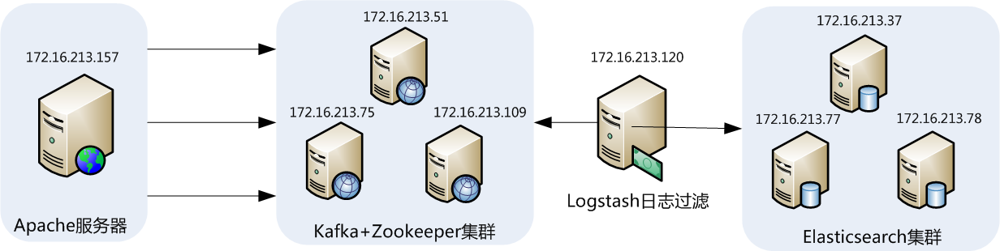
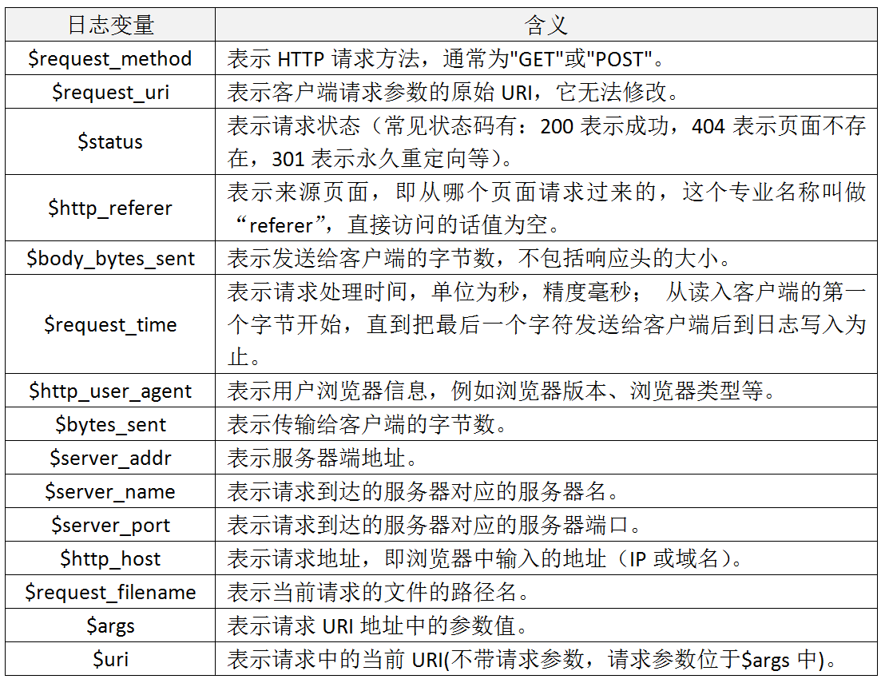
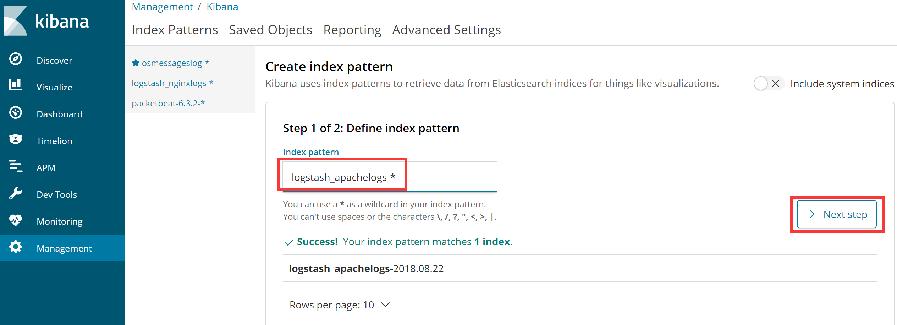
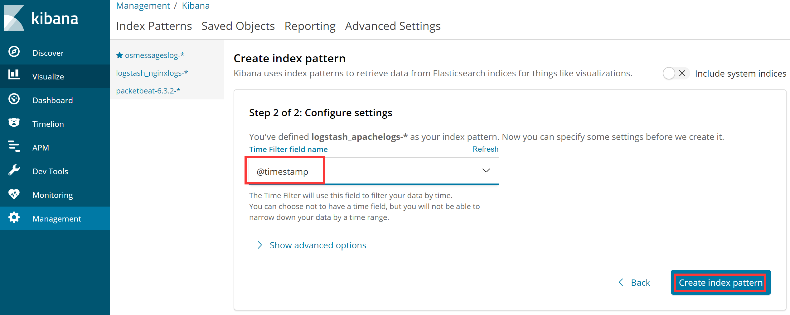
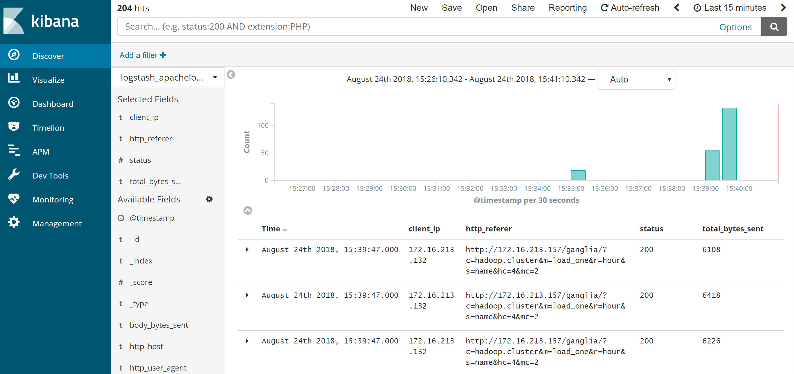

## 9.【案例】ELK收集Apache访问日志实战案例

# 1、ELK收集日志的几种方式

ELK收集日志常用的有两种方式，分别是：  
（1）不修改源日志的格式，而是通过logstash的grok方式进行过滤、清洗，将原始无规则的日志转换为规则的日志。  
（2）修改源日志输出格式，按照需要的日志格式输出规则日志，logstash只负责日志的收集和传输，不对日志做任何的过滤清洗。

这两种方式各有优缺点，第一种方式不用修改原始日志输出格式，直接通过logstash的grok方式进行过滤分析，好处是对线上业务系统无任何影响，缺点是logstash的grok方式在高压力情况下会成为性能瓶颈，如果要分析的日志量超大时，日志过滤分析可能阻塞正常的日志输出。因此，在使用logstash时，能不用grok的，尽量不使用grok过滤功能。

第二种方式缺点是需要事先定义好日志的输出格式，这可能有一定工作量，但优点更明显，因为已经定义好了需要的日志输出格式，logstash只负责日志的收集和传输，这样就大大减轻了logstash的负担，可以更高效的收集和传输日志。另外，目前常见的web服务器，例如apache、nginx等都支持自定义日志输出格式。因此，在企业实际应用中，第二种方式是首选方案。

# 2、ELK收集Apache访问日志应用架构

这里我们还是以ELK+Filebeat+Kafka+ZooKeeper构建大数据日志分析平台一节的架构进行讲述，完整的拓扑结构如下图所示：



此架构需要8台服务器完成，每台服务器的作用和对应的IP信息都已经在图上进行了标注。最前面的一台是apache服务器，用于产生日志，然后由filebeat来收集apache产生的日志，filebeat将收集到的日志推送（push）到kafka集群中，完成日志的收集工作。接着，logstash去kafka集群中拉取（pull）日志并进行日志过滤、分析，之后将日志发送到elasticsearch集群中进行索引和存储，最后由Kibana完成日志的可视化查询。

线上生产系统为了保证性能和高可用，一般会将kafka和elasticsearch做成集群模式，而在测试和开发环境下，也可以将kafka和elasticsearch部署成单机模式，可节省部分服务器资源。

在下面的介绍中，我们设定kafka集群和elasticsearch集群已经部署完成，在此基础上介绍如何通过filebeat和logstash收集与处理apache日志。

# 3、apache的日志格式与日志变量

apache是最流行的http服务器，收集apache产生的日志是ELK平台最基础的应用，这里先从apache日志格式入手，看看如何收集apache的log日志。

apache支持自定义输出日志格式，这给我们收集日志带来了很大方便，但是，apache有很多日志变量字段，所以在收集日志前，需要首先确定哪些是我们需要的日志字段，然后将日志格式定下来。要完成这个工作，需要了解apache日志字段定义的方法和日志变量的含义，在apache配置文件httpd.conf中，对日志格式定义的配置项为LogFormat，默认的日志字段定义为如下内容：

```perl
LogFormat "%h %l %u %t \"%r\" %>s %b \"%{Referer}i\" \"%{User-Agent}i\"" combined
```

这里看到的%h、%l、%u等就是apache的日志变量，下面介绍下常用的apache日志变量以及表示的含义，如下表所示：  


# 4、自定义apache日志格式

Apache的安装与配置这里不再介绍，仅仅介绍下apache配置文件中日志格式的定义方式。在掌握了apache日志变量的含义后，接着开始对它输出的日志格式进行改造，这里我们定义将apache日志输出为json格式，下面仅列出apache配置文件httpd.conf中日志格式和日志文件定义部分，定义好的日志格式与日志文件如下：

```perl
LogFormat    "{\"@timestamp\":\"%{%Y-%m-%dT%H:%M:%S%z}t\",\"client_ip\":\"%{X-Forwarded-For}i\",\"direct_ip\": \"%a\",\"request_time\":%T,\"status\":%>s,\"url\":\"%U%q\",\"method\":\"%m\",\"http_host\":\"%{Host}i\",\"server_ip\":\"%A\",\"http_referer\":\"%{Referer}i\",\"http_user_agent\":\"%{User-agent}i\",\"body_bytes_sent\":\"%B\",\"total_bytes_sent\":\"%O\"}"  access_log_json
CustomLog    logs/access.log access_log_json
```

这里通过LogFormat指令定义了日志输出格式，在这个自定义日志输出中，定义了13个字段，定义方式为：字段名称:字段内容，字段名称是随意指定的，能代表其含义即可，字段名称和字段内容都通过双引号括起来，而双引号是特殊字符，需要转移，因此，使用了转移字符“\\”，每个字段之间通过逗号分隔。此外，还定义了一个时间字段 @timestamp，这个字段的时间格式也是自定义的，此字段记录日志的生成时间，非常有用。CustomLog指令用来指定日志文件的名称和路径。

> 需要注意的是，上面日志输出字段中用到了body\_bytes\_sent和total\_bytes\_sent发送字节数统计字段，这个功能需要apache加载mod\_logio.so模块，如果没有加载这个模块的话，需要安装此模块并在httpd.conf文件中加载一下即可。对于安装和加载apache模块的细节，这里不进行介绍。

# 5、验证日志输出

apache的日志格式配置完成后，重启apache，然后查看输出日志是否正常，如果能看到类似如下内容，表示自定义日志格式输出正常：

```json
{"@timestamp":"2018-02-24T16:15:29+0800","client_ip":"-","direct_ip": "172.16.213.132","request_time":0,"status":200,"url":"/img/guonian.png","method":"GET","http_host":"172.16.213.157","server_ip":"172.16.213.157","http_referer":"http://172.16.213.157/img/","http_user_agent":"Mozilla/5.0 (Windows NT 6.3; Win64; x64; rv:58.0) Gecko/20100101 Firefox/58.0","body_bytes_sent":"1699956","total_bytes_sent":"1700218"}
{"@timestamp":"2018-02-24T16:17:28+0800","client_ip":"172.16.213.132","direct_ip": "172.16.213.84","request_time":0,"status":200,"url":"/img/logstash1.png","method":"GET","http_host":"172.16.213.157","server_ip":"172.16.213.157","http_referer":"http://172.16.213.84/img/","http_user_agent":"Mozilla/5.0 (Windows NT 6.3; Win64; x64; rv:58.0) Gecko/20100101 Firefox/58.0","body_bytes_sent":"163006","total_bytes_sent":"163266"}
{"@timestamp":"2018-02-24T17:48:50+0800","client_ip":"172.16.213.132, 172.16.213.84","direct_ip": "172.16.213.120","request_time":0,"status":200,"url":"/img/logstash2.png","method":"GET","http_host":"172.16.213.157","server_ip":"172.16.213.157","http_referer":"http://172.16.213.84/img/","http_user_agent":"Mozilla/5.0 (Windows NT 6.3; Win64; x64; rv:58.0) Gecko/20100101 Firefox/58.0","body_bytes_sent":"163006","total_bytes_sent":"163266"}
```

在这个输出中，可以看到，client\_ip和direct\_ip输出的异同，client\_ip字段对应的变量为“%{X-Forwarded-For}i”，它的输出是代理叠加而成的IP列表，而direct\_ip对应的变量为%a，表示不经过代理访问的直连IP，当用户不经过任何代理直接访问apache时，client\_ip和direct\_ip应该是同一个IP。

上面三条输出日志中，第一条是直接访问http://172.16.213.157/img/， 此时client\_ip和direct\_ip内容是相同的，但在日志中显示client\_ip为"-"，这是因为“%{X-Forwarded-For}i”变量不会记录最后一个代理服务器IP信息。

第二条日志是经过一个代理去访问http://172.16.213.157/img/， 其实就是通过访问http://172.16.213.84 ，然后再让172.16.213.84代理去访问172.16.213.157服务器。这是经过了一层代理，可以看到，此时client\_ip显示的是客户端真实IP地址，direct\_ip显示的是代理服务器的IP地址。

第三条日志是经过了两个代理去访问http://172.16.213.157/img/， 也就是客户端通过浏览器访问http://172.16.213.84 ，然后172.16.213.84将请求发送到172.16.213.120服务器，最后，172.16.213.120服务器直接去访问172.16.213.157服务器，这是一个二级代理的访问日志，可以看到，client\_ip显示了一个IP列表，分别是真实客户端IP地址172.16.213.132、第一个代理服务器IP地址172.16.213.84，并没有显示最后一个代理服务器的IP地址，而direct\_ip显示的是最后一个代理服务器的IP地址。

理解这三条日志输出非常重要，特别是针对client\_ip和direct\_ip的输出结果，因为在生产环境下，可能经常会出现多级代理访问的情况，此时我们需要的IP是真实的客户端IP，而不是多级代理IP，那么在多级代理访问情况下，如何获取客户端真实IP地址，是ELK收集apache日志的一个难点和重点。

# 6、配置filebeat

filebeat是安装在apache服务器上的，关于filebeat的安装与基础应用，在前面已经做过详细介绍了，这里不再说明，仅给出配置好的filebeat.yml文件的内容：

```plain
filebeat.inputs:
- type: log
  enabled: true
  paths:
   - /var/log/httpd/access.log
  fields:
    log_topic: apachelogs
filebeat.config.modules:
  path: ${path.config}/modules.d/*.yml
  reload.enabled: false
name: 172.16.213.157
output.kafka:
  enabled: true
  hosts: ["172.16.213.51:9092", "172.16.213.75:9092", "172.16.213.109:9092"]
  version: "0.10"
  topic: '%{[fields.log_topic]}' 
  partition.round_robin:
    reachable_only: true
  worker: 2
  required_acks: 1
  compression: gzip
  max_message_bytes: 10000000
logging.level: debug
```

这个配置文件中，是将apache的访问日志/var/log/httpd/access.log内容实时的发送到kafka集群topic为apachelogs中。需要注意的是filebeat输出日志到kafka中配置文件的写法。

配置完成后，启动filebeat即可：

```coffeescript
[root@filebeatserver ~]# cd /usr/local/filebeat
[root@filebeatserver filebeat]# nohup  ./filebeat -e -c filebeat.yml &
```

启动完成后，可查看filebeat的启动日志，观察启动是否正常。

# 7、配置logstash

关于logstash的安装与基础应用，在前面已经做过详细介绍了，这里不再说明，仅给出logstash的事件配置文件。

由于在apache输出日志中已经定义好了日志格式，因此在logstash中就不需要对日志进行过滤和分析操作了，这样编写logstash事件配置文件就会简单很多，下面直接给出logstash事件配置文件kafka\_apache\_into\_es.conf的内容：

```php
input {
    kafka {
        bootstrap_servers => "172.16.213.51:9092,172.16.213.75:9092,172.16.213.109:9092"    #指定输入源中kafka集群的地址。
        topics => "apachelogs"      #指定输入源中需要从哪个topic中读取数据。
        group_id => "logstash"
        codec => json {
            charset => "UTF-8"      #将输入的json格式进行UTF8格式编码。
        }
        add_field => { "[@metadata][myid]" => "apacheaccess_log" }  #增加一个字段，用于标识和判断，在output输出中会用到。
    }
}

filter {
    if [@metadata][myid] == "apacheaccess_log" {
      mutate {
        gsub => ["message", "\\x", "\\\x"]      #这里的message就是message字段，也就是日志的内容。这个插件的作用是将message字段内容中UTF-8单字节编码做替换处理，这是为了应对URL有中文出现的情况。
      }
      if ( 'method":"HEAD' in [message] ) {     #如果message字段中有HEAD请求，就删除此条信息。
           drop {}
      }
      json {            #这是启用json解码插件，因为输入的数据是复合的数据结构，只是一部分记录是json格式的。
            source => "message" #指定json格式的字段，也就是message字段。
            add_field => { "[@metadata][direct_ip]" => "%{direct_ip}"}     #这里添加一个字段，用于后面的判断。
            remove_field => "@version"      #从这里开始到最后，都是移除不需要的字段，前面九个字段都是filebeat传输日志时添加的，没什么用处，所以需要移除。
            remove_field => "prospector"
            remove_field => "beat"
            remove_field => "source"
            remove_field => "input"
            remove_field => "offset"
            remove_field => "fields"
            remove_field => "host"
            remove_field => "message"     #因为json格式中已经定义好了每个字段，那么输出也是按照每个字段输出的，因此就不需要message字段了，这里是移除message字段。
        }
     mutate {
            split => ["client_ip", ","]     #这是对client_ip这个字段按逗号进行分组切分，因为在多级代理情况下，client_ip获取到的IP可能是IP列表，如果是单个ip的话，也会进行分组，只不过是分一个组而已。
        }
       mutate {
            replace => { "client_ip" => "%{client_ip[0]}" }      #将切分出来的第一个分组赋值给client_ip，因为client_ip是IP列表的情况下，第一个IP才是客户端真实的IP。
       }
        if [client_ip] == "-" {         #这是个if判断，主要用来判断当client_ip为"-"的情况下，当direct_ip不为"-"的情况下，就将direct_ip的值赋给client_ip。因为在client_ip为"-"的情况下，都是直接不经过代理的访问，此时direct_ip的值就是客户端真实IP地址，所以要进行一下替换。
           if [@metadata][direct_ip] not in ["%{direct_ip}","-"] {      #这个判断的意思是如果direct_ip非空。
                mutate {
                    replace => { "client_ip" => "%{direct_ip}" }
                }
            } else {
                drop{}
            }
        }
        mutate {
            remove_field => "direct_ip"     #direct_ip只是一个过渡字段，主要用于在某些情况下将值传给client_ip，因此传值完成后，就可以删除direct_ip字段了。
        }
    }
}
output {
    if [@metadata][myid] == "apacheaccess_log" {                #用于判断，跟上面input中[@metadata][myid]对应，当有多个输入源的时候，可根据不同的标识，指定到不同的输出地址。
        elasticsearch {
         hosts => ["172.16.213.37:9200","172.16.213.77:9200","172.16.213.78:9200"]     #这是指定输出到elasticsearch，并指定elasticsearch集群的地址。
         index => "logstash_apachelogs-%{+YYYY.MM.dd}"          #指定apache日志在elasticsearch中索引的名称，这个名称会在Kibana中用到。索引的名称推荐以logstash开头，后面跟上索引标识和时间。
        }
    }
}
```

这个logstash事件配置文件的处理逻辑稍微复杂，主要是对日志中客户端真实IP的获取做了一些特殊处理，关于每个步骤实现的功能和含义，都在配置文件中做了注释。  
所有配置完成后，就可以启动logstash了，执行如下命令：

```coffeescript
[root@logstashserver ~]# cd /usr/local/logstash
[root@logstashserver logstash]# nohup bin/logstash -f kafka_apache_into_es.conf &
```

logstash启动后，可以通过查看logstash日志，观察是否启动正常，如果启动失败，会在日志中有启动失败提示。

## 1.8、配置Kibana

filebeat收集数据到kafka，然后logstash从kafka拉取数据，如果数据能够正确发送到elasticsearch，我们就可以在Kibana中配置索引了。  
登录Kibana，首先配置一个index\_pattern，点击kibana左侧导航中的Management菜单，然后选择右侧的Index Patterns按钮，最后点击左上角的Create index pattern，开始创建一个index pattern，如下图所示：

  
这里需要填写一个Index pattern名称，根据在logstash事件配置文件中已经定义好的那个Index pattern，这里只需填入logstash\_apachelogs-\*即可，如果已经有对应的数据写入elasticsearch，那么kibana会自动检测到并抓取映射文件，  
接着，点击下一步，选择按照@timestamp字段进行排序，如下图所示：



此时就可以创建此Index pattern了，创建完成Index pattern后，点击kibana左侧导航中的Discover导航栏，即可展示已经收集到的日志信息，如下图所示：  


在这个图中左下角部分，可以看到，是我们在apache配置文件中定义好的日志字段，默认情况下展示的是所有字段的内容，点击左下角对应的字段，即可添加到右边展示区域，因此，我们可以有选择性的查看或搜索某个字段的内容，做到对日志的精确监控。

