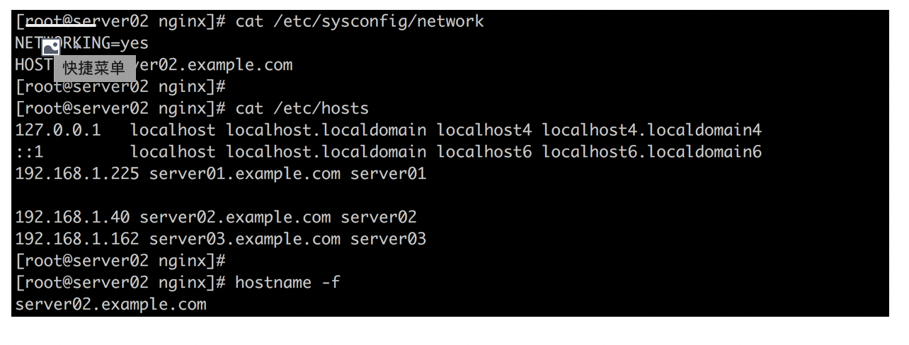
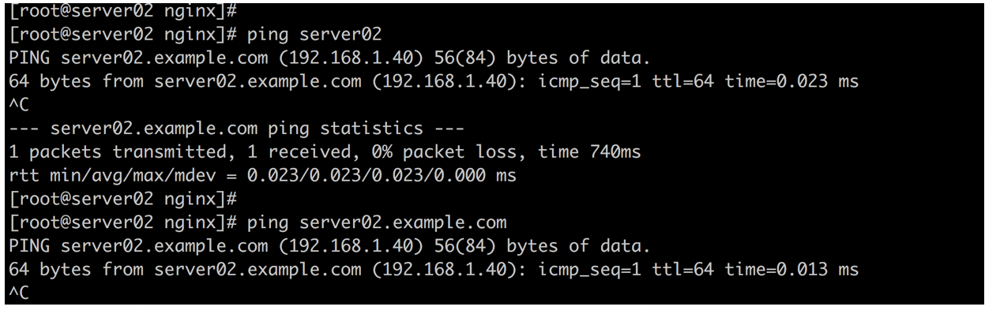
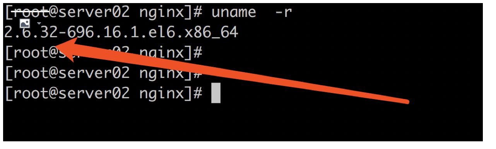

# 【学习前准备工作 强调几点注意事项】

之前看过序章的朋友 一定还记得大米跟大家提过， 一个最最简单的网站（静态网站）基础框架组成部分是什么？

那就是 NGINX(WEB服务器) + 服务器 + 操作系统(Linux)

# 这里给大家补充说明几点

第一： 首先 咱们先来说一下Linux这个重头戏的组成部分，Linux因为它的开源以及稳定等等的优质特性，现如今已经基本统一了服务器操作系统的标准，说真的 现在去机房 再想找出一台不是跑着Linux的服务器（跑着其他的系统） 估计挺难的了

在我们的专栏中（包括后续的专栏）全部都是基于Linux给大家搭建环境 并讲解的

所以 本专栏需要大家对Linux 有一定的基础后 再继续阅读  
（本专栏中 涉及到的 过于基础的Linux知识 我们就不再额外花篇幅讲解了 ）

第二：关于服务器，在序章的时候 跟大家说过 它指的是一台物理服务器 ， 所谓的互联网 其实不过就是 由无数无数的物理服务器连接在一起 最终绘制而成的（比较有经验的同学 可能会抬杠了， 谁说都是物理服务器的，现在很多不都是云虚拟机了吗？ 问的对，现在确实很多中小企业 都不再购买真正的物理服务器来搭建自己的"互联网产品", 但是 归根到底，云机只不过是针对企业用户或者个人用户来说的， 从技术层面上说， 云机是通过虚拟化技术 在物理服务器上 划分出的区域 本质永远脱离不了 本体的物理服务器）

然而 在我们的专栏学习的过程中，服务器是每个人必须准备的， 然而为了学习而购买一台上万的物理服务器肯定不现实 也没有必要  
（因为我们并不是真的要 搭建一个被好几万人访问的网站 ）

# 这里推荐大家 两种方式来 搭建我们的服务器(虚拟机)

第一种 （推荐）：在活动折扣期间 购买任意云平台的 最低配置虚拟机两台（学习过程中 最少使用两台 三台最佳 后面会讲解为什么）

这样的做法 是大米比较推荐的，虽然会产生一定的费用（折扣活动期间 最低配的一台云机 一年也不过100-200块钱而已 比较划算 ）然而 灵活性非常的高 因为购买的云机 可拥有公网IP地址 可以在任意地点登录使用和维护 这样以来 就对地点不再局限 可以在任意地方进行远程登录

另外 现在大多数云平台的云机 都支持按量付费 也就是说 用的时候才会产生费用 (一天几毛钱到几块钱 看配置高低 和 使用时长了 基本按照小时出账单) 用完后释放 就不会再产生费用， 需要注意的就是 千万别弄高配置 高带宽 那费用成指数上升 就很吓人了 一切就按最低配置来即可 学习足够用了

另外还有一个好处，就是多接触各类云计算平台的使用方法 对以后想从事运维工程师相关工作来说 是一个非常好的锻炼和准备

第二种（免费）：这个自然就是 使用我们的笔记本 或者 PC台式机 安装Linux虚拟机

估计大多数人还是会选择这样的方式来安装Linux虚拟机 ， 毕竟免费嘛 ^\_^

这里 强烈推荐大家使用 virtual box 来安装虚拟机（因为简单 又免费） ， Linux镜像选择Centos6/7 即可

关于如何在windows上使用virtual box安装虚拟机，这个非常简单 度娘一搜就一堆 这里就不再跟大家啰嗦了  
（唯一有点麻烦的就是 需要提前下载好一个 Centos.ios的镜像文件 这个文件很大 最好常备一份儿）

最稳妥的方式 推荐大家在接有网线的 台式机 或者 笔记本上 安装虚拟机三台， 网络选择"物理桥接即可"  
然后每台Linux虚拟机 手动分配固定IP (不要用DHCP自动分配 不然时不时变IP非常讨厌， 所以服务器９９％的情况 都是手动分配固定IP)

第三：解释一下什么叫做 静态站点和动态站点

关于什么是静态和动态站点 我们之前跟大家提过两次， 在这里 咱们来解释一下意思

静态网站？ 网页都是静止不动的？ 只要画面有变动就成动态网站了？ 是这个意思吗？

其实不是的哦 -\_-

所谓的静态网站 准确的定义 是网站所提供的网页内容对于所有来访的用户都是保持一致 不随用户的互动动作而计算且发生变化 除非是服务器端的静态资源（例如 文字 图片 视频 动画 声音）发生了改变

这里理解起来可能会产生误区，比如 有的学员可能就会问 比如打开一个纯看图片的网站，这算是静态了对吧， 可是当我鼠标点击站内另外一个图片链接的时候，画面就变了唉 这不就是随着我的动作发生改变了吗？ 变成动态网站了？

大米给大家的解释是，没错 这里点击另外的图片 确实是画面发生了改变， 但是这并不是动态网站效果 为什么呢？

因为 另外的图片链接原本就存在在站内，只不过是当你点击到了 才看到而已， 这里的动作只是发生了页面跳转 而并不是根据你的动作和输入 经过计算后发生改变

这么解释 估计还可能有同学不是很明白，不用太着急 接下来 咱们看一下动态网站的定义 再返回头来看 就明白多了

# 那什么是动态网站呢？

最直接简单的例子 就是一个登录欢迎页面


就像上面这张图这样， 大家都见过吧， 网页一上来就先让你输入用户名和密码

输入完成之后（比如：张三 123456） 然后会有一个对应的"程序" 把你输入的账号和密码 携带着去到数据库里查验

看看这个账号是不是存在， 再看看密码是否正确， 如果错误 就返回失败， 如果正确 就返回 一个页面写着 欢迎你 张三

这种就属于动态网站的功能， 因为网站跟用户有交互的动作， 用户会有数据的提交 ，而且根据每个用户输入数据的不同 返回的结果可能都不一样 比如 李四登录成功 就显示 欢迎你 李四， 别人登录成功的话 就会变了

除此之外 动态网站还有两个非常重要的组件 ， 那就是 网站后面有程序代码在运行和判断 还有动态网站 必然存在数据库的支持 （静态网站一般没有）

另外 从URL（也就是你输入的网址 也可以进行判断）

静态网站 更多以 .htm .html .xml结尾， 而动态网站 更多以 .php .asp .jsp .cgi （CGI通用网关接口 是最早实现动态网站的技术 大米之前在序章提过的）等等结尾 在动态网页网址中有一个标志性的符号——“?”，如有这样一个动态网页的地址为:  
[http://www.testdami.com/index.php?id=12345](http://www.testdami.com/index.php?id=12345)

其实现阶段来看 动态网站和静态网站 基本上已经不是独立存在的了, 绝大多数情况 都是混合再一起的网站 既有静态又有动态

就拿我们平时尝尝访问的几个门户网站来说， 一般都带有新闻首页对吧 上面附带着大量的静态页面内容（文字 图片 等等）， 然而与此同时 所有门户网站 都支持 用户注册登录 邮箱 搜索等等动态网站的内容

在我们的专栏的课程中 我们先做出和搭建一个最简单的静态网站为目标 后面会再加入动态网站的内容

提问：既然网站有静态和动态之分 那NGINX是不是都可以支持呢？

回答：NGINX本身只有处理静态WEB的能力 ，处理动态站点的话 NGINX本身不会自己去处理 但是它拥有的模块 （fastcgi->主要用来传递PHP , uwsgi->主要用来传递python web）会识别动态请求 进而把请求传递给后端的其他程式来处理

# 【开始准备我们学习用的Linux服务器吧】

接下来 咱们就可以着手准备我们的服务器了

大米假设大家到了这个时候 所有的Linux虚拟机都已经安装完毕了哦 ^^

接下来 我们的服务器 需要完成一些环境的配置工作 才可以正常使用的哦

*   首先是Linux的FQDN设置

首先咱们先确认 我们的虚拟主机拥有 完整主机名(FQDN) 并且可以相互ping通哦

Linux上完整主机名的配置 不光是对于NGINX, 对于其他任何服务来说 都是非常重要的

有些服务 如果检测不到正确主机名的配置 就会不断报错 甚至无法使用

另外 在生产环境中的Linux服务器，完整主机名的配置是硬性要求 因为当服务器数量大了以后，混乱的主机名会给维护带来极大的不便

完善的主机名 最简单的理解 就是 一个主机名+域名 来组成 而并不仅仅只是给机器起个名字这么简单哦 ^^

主机名：代表的是机器本身 域名：代表的是处在哪个域

例如 server001.study.com. 主机名是 server001 , 域是 study.com

就用Centos6为例子 我们按照如下的方式操作和最终验证即可



如上图中所示 一共有 三个地方需要修改 一个是 /etc/sysconfig/network 当中定义 HOSTNAME  
再一个就是 /etc/hosts下面的设置

/etc/hosts 是一个非常重要的 Linux解析配置文件， Linux最早就是依靠它 来完成 机器名和ip地址的转换工作  
比如 在上面图中 /etc/hosts文件 定义了咱们三台机器的 机器名和IP地址对应关系

server01.example.com server02.example.com server03.example.com  
另外 在每一行的最后还定义了一个短名称 这个叫做别名

这样以来， 三台机器之间 就可以相互使用 完整机器名 或者其别名 来调用了  


最后的 hostname -f (-f代表FQDN) 可以正确显示完整主机名 即可

接下来 我们检查Linux内核版本 请保证内核版本在2.6以上  
为什么呢？ 因为2.6以上版本的Linux内核 才支持epoll

说到这里会有疑问了 epoll又是个啥？（经常配置nginx的同学 一定见过 或者听说过这个词）  
其实这里相关的有三个主要词汇 select , poll , epoll

这几个是nginx配置文件中 可选的配置项(events模块 ，后面会讲到)

这里容易有个误区 ，以为这三个选项 是nginx独有的"特性" ，实则不然

select/poll , epoll 其实是Linux内核中 多路复用I/O的 三种方法，跟nginx其实并没有直接的关系

如果要真的完全解释清楚 这三种模式在Linux内核中的实现方法 是相当复杂的

我们在当前可以先简单按照如下 理解即可

首先 这三种模式 都是Linux内核 为了解决处理高并发问题而设计的

随着内核的发展 诞生的先后顺序为 select -> poll -> epoll ， epoll可以理解为 poll方法的增强版

其实 这三种方法的本质 都是多路复用 提高内核处理网络连接的工作效率

那多路复用又是个啥？

以一个生活中的例子来解释一下吧（如下一段 取自别处 个人认为很恰当的例子）.

假设你在大学中读书,要等待一个朋友来访,而这个朋友只知道你在A号楼,但是不知道你具体住在哪里,于是你们约好了在A号楼门口见面.

如果你使用的阻塞IO模型来处理这个问题,那么你就只能一直守候在A号楼门口等待朋友的到来,在这段时间里你不能做别的事情,不难知道,这种方式的效率是低下的.

现在时代变化了,开始使用多路复用IO模型来处理这个问题.你告诉你的朋友来了A号楼找楼管大妈,让她告诉你该怎么走.这里的楼管大妈扮演的就是多路复用IO的角色.

既然 明白了什么是 多路复用 那么我们看下三种方法的区别

select版大妈做的是如下的事情:比如同学甲的朋友来了,select版大妈比较笨,她带着朋友挨个房间进行查询谁是同学甲

而poll和select差不太多, poll只是解决了 select的 FD问题, 但是本质并无大变化 依然无法很好支持高并发（文件描述符的限制 ，感兴趣的同学 可以自己搜索相关文章）

epoll版大妈就比较先进了,她记下了同学甲的信息,比如说他的房间号,那么等同学甲的朋友到来时,只需要告诉该朋友同学甲在哪个房间即可,不用自己亲自带着人满大楼的找人了

理解到这里 目前就够用了

接下来 检查内核版本的方法很简单 如下  
符合我们的要求  


接下来 咱们在 Linux上 (Centos) 使用yum 安装一些软件， 这些软件都是nginx必备的 我们分别来解释一下  
(yum就不用多介绍了吧 Centos/Redhat Linux 最重要的 软件包安装管理工具)

如下安装的这些插件 如果是平时经常配置NGINX的同学一定很常见，但是我们要知其所以然 不能总是跟着网上搜来的安装教程复制几个命令一跑完事

# 1: gcc编译器的安装

C/C++语言编译器 我们后面的课程中 nginx最终都会采用源代码编译的方式来安装  
（Linux下两种安装nginx的方式， yum 和 源代码编译 ， yum安装的 直接就可以执行，简单方便 但是无法自由扩展nginx功能， 源代码编译的方式 是把nginx的源代码下载下来，然后我们自己通过编译器 自己按照需求 生成我们需要的nginx ，这个方式麻烦的多 但是 却自由度很高 也是企业中绝大部分的 部署开源软件的方式）

况且 后面也会讲到 自行修改开发nginx模块， 这些都离不开C/C++编译器的哦  
(不管是想学好Linux 还是深入Linux上运行的各种开源软件， C语言都是必不可少的)

安装的方式很简单

```plain
yum install -y gcc gcc-c++
```

# 2: PCRE库的安装

PCRE这个平时应该也挺常见的吧 :) , 其实它的全称是 Perl Compatibel Regular Expressions : Perl兼容正则表达式

意思也就是说 ，如果你的NGINX以后在配置的过程中 需要使用正则表达式 就必须装这个插件(PCRE)  
（所谓的正则表达式 就是一种使用各类特殊符号 来达到匹配或者过滤 字符串的目的 是一种通用技能）

类似就是这样的配置 ：

```plain
 rewrite ^(.*)index\.php\?$ http://10.86.255.119$request_uri;
```

看着就头晕有点 对不？ ^\_^ （其实这已经算很简单的 正则了）  
确实 正则表达式 不好学 很不容易找规律 而且最关键的是不好记忆 但是又非学不可  
（后面我们会有专门的篇幅来学习它）

安装的方式也很简单

```plain
yum install -y pcre pcre-devel
```

3: zlib库的安装

nginx处理HTTP响应的时候，是可以支持gzip先压缩 后传输的方式 进而来减少网络传输量的哦  
如果你希望nginx开启这个功能，就得把zlib编译进入nginx中

```plain
yum install -y zlib zlib-devel
```

4: OpenSSL库的安装

HTTPS大家不陌生吧 ，HTTP+SSL形成的更安全的传输协议 ， 这个库几乎是默认必须安装的  
现在基本上大部分网站 都支持HTTPS 只有一部分接口依然走HTTP , 这也是大势所趋了

```plain
yum install -y openssl openssl-devel
```

上面安装的几个软件包 只不过是完成Web服务器最基本功能所需的，后续 随着我们不断的深入学习，还有可能继续再增加别的软件包扩展 目前先了解清楚 这四个

必要的软件包装好了以后，咱们最后来看一下Linux内核参数的优化

大米先给大家解释一下 为什么要优化内核

我们平时总说 性能调优 性能优化之类的话对吧 其实说白了 就是通过各种参数调整 让服务器的性能达到最大化

一个服务器上其实是存在这么几层的嵌套关系的 从最底层开始 依次是

物理硬件 操作系统 服务软件 程序代码

其实优化的最终目的 是发挥物理硬件的最大效能 因为物理资源是不能随意改变的

至于硬件往上的部分 其实是层层嵌套的关系 一个会制约另一个 就好比 操作系统中的最大连接数没有放开 但是服务软件配置中的放开了 也是没有作用的 所以 这种嵌套关系有点像接在一起的 水龙带 光是一段很宽没用 必须都宽才行

接下来 咱们看下 针对咱们即将安装的Nginx , Linux的内核参数优化 应该掌握些什么

由于默认的Linux内核参数是最通用的场景，不符合咱们一直谈的支持高并发的特性，所以 我们需要做出一些初步的调整 把操作系统 这一层的"水龙头" 放开一些 ^\_^

```plain
fs.file-max = 100000
net.ipv4.tcp_tw_reuse = 1
net.ipv4.tcp_keepalive_time = 600
net.ipv4.tcp_fin_timeout = 30 
net.ipv4.tcp_max_tw_buckets = 5000
net.ipv4.ip_local_port_range = 1024 61000
```

内核的参数项目很多，因为我们在这儿不是专门讲Linux内核优化的 所以先拿出几个例子来简单说一下

file-max 进程可以同时打开的最大句柄数 （听说过Linux一切皆文件的说法吧） 这一项直接限制最大并发连接数

tcp\_tw\_reuse 允许将处于 TIME\_WAIT状态的socket重新用于新TCP连接， 平时我们在服务器上 应该能看到大量的 TIME\_WAIT状态的链接对不？（netstat -an | grep -i wait） ,这对于处理高并发的服务器来说 意义很大

keepalive\_time 这个参数表示 TCP发送keepalive消息的频度 ，默认是２个小时 这太长了。。。 设置的小一些 有利于清理无效的链接

port\_range TCP/UDP 连接的端口范围 ， 建立一个连接就肯定会消耗掉一个端口 ，如果不把这个值改大了 高并发的时候 连接就无法建立了。。

做好如上的准备后 我从下一篇开始接触NGINX啦~
