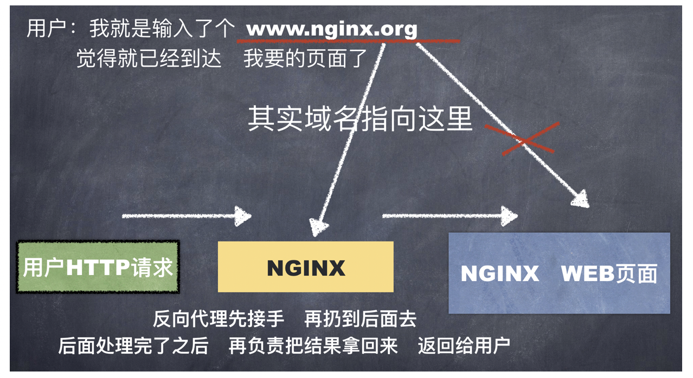
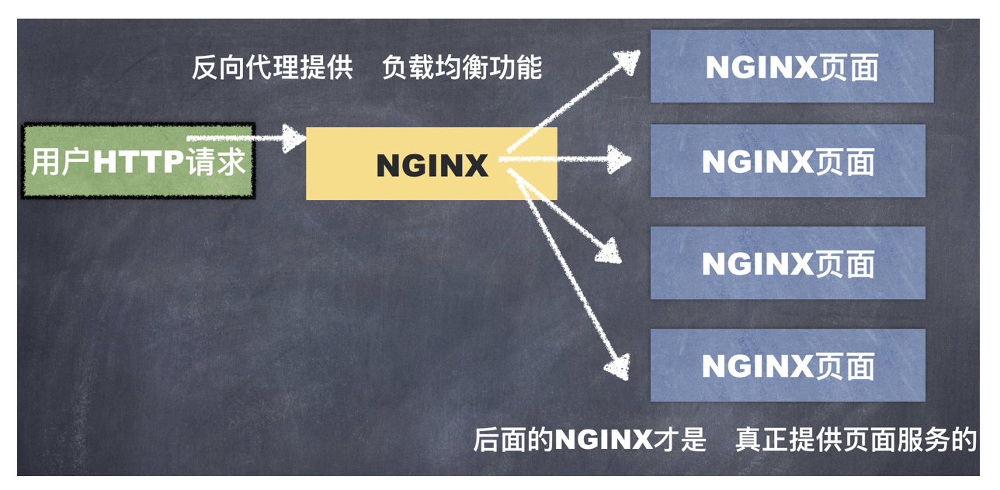
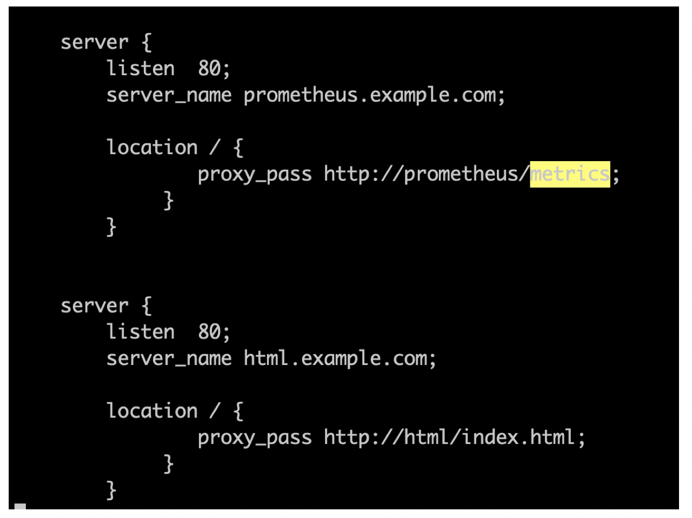
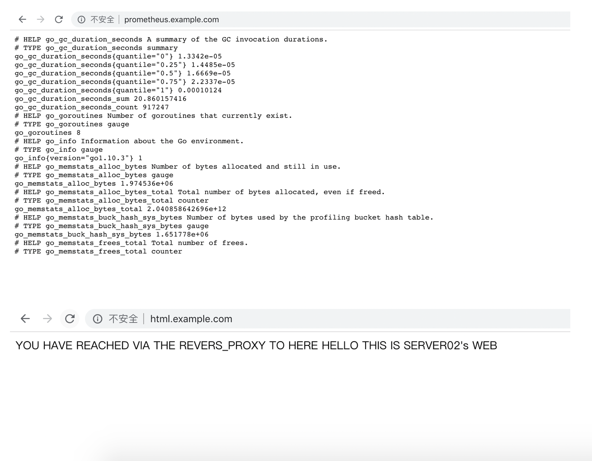

## 5.Nginx做反向代理和负载均衡 企业中必用（上篇）

［反向代理 NGINX的第二大核心功能 ］

通过之前章节的学习 我们对于NGINX如何处理HTTP请求 以及如何处理WEB页面 有了一定的认知

接下来 咱们进入另一个重头戏 就是 反向代理

看下咱们的标题~ 之所以说反向代理 是NGINX的第二大核心功能， 是因为NGINX在最初只作为处理"静态页面"的服务器 (静态我们已经懂什么意思了)  
这个功能始终都是NGINX的第一核心， 而反向代理的功能 现在也是使用的越来越普及 甚至有跃为第一功能的可能性

（大米 曾经经历的几家公司，就出现过 集群中完全没有用到NGINX的 WEB处理功能，而仅仅使用NGINX作反向代理的例子）

那么要搞清楚 啥是反向代理，咱们总得先搞明白 代理是啥

所谓的 代理 代理 就可以理解为 代为处理 不是亲自上阵的意思 这个很好懂吧  
（很多网上的资料 或者书籍 总喜欢 把正向代理 反向代理 透明代理 顺序讲一遍 大米不想这么混在一起讲 因为对于初学者 很容易搞混了 咱们先只说反向代理 因为反向代理 是用的最多最多的场景）

懂了什么是代理， 大米接下来 用最通俗的一句话 给大家解释 啥叫反向代理

所谓反向代理： 就是我们原本有一台服务器A , 上面建立了个网站的首页， 用户原本应该是直接访问到这台服务器上 对不？ 有了反向代理 就不一样了 用户先访问到的 根本不是这台真正的提供页面的服务器Ａ，而是先访问挡在前面的一台服务器B, 这台服务器B把请求 先揽到自己"头上", 再代为转交给后面 真正的服务器A, 完成一次请求。 而对于傻瓜用户来说 他根本就完全不知道 这个反向代理的服务器B的存在 以为自己直接就访问到了A

这么说应该很容易理解了吧

说的再白一点，就是反向代理 就挡在前面 先接活儿（接活不等于 直接干活 只是登记一下转交而已 :)） 然后再扔给后面的去处理 ^\_^

用下面的一张图 就很清楚说明 反向代理处在一个什么样的位置

  
\[为啥得有反向代理？多此一举？NO NO NO !~\]

有的学员可能要问了， 反向代理是怎么回事 我是明白了 不过这么做的意义何在呢？

明明服务器A提供了网页，直接让用户访问它不就好了 为啥要多此一举 先发给前面的机器 再代理转发给后面的？

有这样的疑问是很正常的哦 接下来大米给大家来通俗解释一下

第一点 关于负载的问题：

我们在上一个单元跟大家提过，大部分情况下 当一个用户输入一个网址后，请求到达的地方往往都不是"一台"服务器，而是一个集群对不？  
（一个集群 代表的是 拥有同样类似功能的服务器的组合 也就是多个服务器一起提供同样的一种服务给用户）

这是因为 不管是网站也好 一个APP也罢 通常用户流量都很大（越是知名的产品 用户就越多 流量也就越大） 在很大的流量的情况下， 一台服务器就算配置再高 也不可能扛得住的哦 :P .

一个服务器总归有它的承担流量的上限， 这个就叫做负载量， 一个服务器撑不住 自然就需要多个服务器一起来抗住流量  
怎么才能"一起抗"？ 直接对着服务器喊话 一拥而上？ 不可能哦

这就涉及到一个关机的概念 叫做 负载均衡， 所谓的负载均衡 就是通过一种技术手段 把原本一股/一堆请求 按照一定的规则 分摊到多个服务器之上  
就有点类似"大禹治水"的经典故事， 一股湍急的洪水 堵是堵不住的 只能同时挖多个小的渠道 把洪水等份的分开 流出去  
应该不难理解吧 ^\_^

那么回到咱们的主题上，负载均衡由谁来提供呢？ 不言而喻 自然就是 作为反向代理的NGINX啦  
因为流量肯定先汇总到挡在前面的NGINX , 然后再往后指派了 对不

用一幅图来表示 负载均衡



第二点 功能分配问题

反向代理的第二个重要意义 是有效率的把不同种类的请求 指派给不同的服务器 或者集群 来处理

第四单元中 我们讲过NGINX的域名和SERVER{}模块 还没忘吧？

一个WEB请求到达NGINX后，HTTP{} -> 指派 SERVER{} 接手 ， 并按照访问的域名的不同 给予不同的"待遇"(响应)

对于一款产品来说 , 就比方说 一款社交软件APP , 从一个傻瓜用户的角度来看 在APP上面作任何操作 都感觉是同样的一种"服务"在背后运作着

但是从一个工程师的角度 我们必须认识到 一个产品对应的背后 往往是一大片且功能不同的集群

举个例子来说， 当用户点击登录的时候 就可能是服务器\[A,B,C\]来帮处理的，当用户看到一个人的头像时 可能就是 服务器\[D,E,F\]来处理的  
当用户和一个美女开始聊天时 就可能是服务器\[G,H,I,J,K\]处理的 以此类推 不同种类的请求 很可能就是由不同的服务器/集群 去分别应对

而用户的任何"动作"发起时， 大多数情况下 都是先统一以 HTTP的形式发送过来（这个我们在序章就给大家说过的）  
而\[A,B,C\] \[D,E,F\] \[G-K\] 这些不同种类的服务提供者 它们可做不到 "主动" "自发"的去 把属于自己的活儿挑出来 揽过来的哦 没那么智能^\_^

在这种情况下，就必须得有一种服务 ，既能认识到HTTP的请求， 又能按照请求中的不同之处(可能是域名的不同 也可能是URL的不同 也可能是URL的参数不同 等我们讲到HTTP协议的时候 会细讲 先别着急) 来指派给不同的地方来处理

所以说，能提供这种的功能的 很自然就落到了 作为反向代理的NGINX上了

举个简单例子， 用户输入 login.example.com 就分配给处理用户登录的服务器， 用户输入 chat.example.com的时候 就分配给处理用户聊天的服务器  
但是这里需要特别说明一点， 所谓的用户输入 很多时候 用户是不知情的哦  
什么意思呢？ 大米之前在序章就说过，很多互联网的产品 虽然大量使用HTTP协议，也就说会有大量的URL网址的传递，但是它不是一个网站哦， 就好比刚才咱们拿一款社交APP来做例子， 所谓的用户输入login.example.com 其实用户不是在浏览器输入这个的 他也很可能压根就不知道 这里也没有浏览器的概念， 他只是傻瓜式的在APP界面上 点击了"登录按钮", 真正发送出来 login.example.com的并不是"用户自己"， 而是"按钮"

第三点 充当安全守护者

这一点比较容易理解  
咱们已经明白了 反向代理都是 挡在"真正服务器提供者"的前面的 对不？ 而且用户毫不知情

用户输入一个网站域名，解析出一个IP地址的时候，其实就是反向代理的IP地址 （当然了 也有可能是 个VIP地址 这个我们以后再讨论）

这样以来 真正提供服务器的 后端服务器的IP就被保护起来了， 用户并不知道它们的存在

第四点 日志的统一化采集

企业中普遍存在这样一种情况， 就是 因为请求都先到达反向代理这一层， 然后再转交后端

那么 反向代理这一层 可以作为 收集用户访问日志的最好平台

NGINX的日志功能 我们后面会学到

【为了配置反向代理 引入两个新模块 】

前面的理论基础 咱们掌握的差不多了 接下来趁热打铁 货需越来越"干"

如果想让nginx启动反向代理功能， 咱们在之前学习的基础上，需要再引进两个新的模块 才能完成

第一个新模块 upstream{}

这个词表面意思是"上游" 呵呵， 其实它是让nginx实现代理功能的 重要核心模块  
(早期的nginx 并不具备这个功能 )  
反向代理 就仰仗它了 一会咱们看实例 怎么来用它

第二个新模块 location{}  
之前提过一次吧 ，现在就到了必须用到它的时候了

location是干嘛用的呢？ 大米跟大家说过 HTTP请求的基本形式就是 URL(通常讲的网址) ， location就是专门用来接手和对付它的

这里提前打好预防针 location可以说 是出现在整个nginx中 频率最高的模块 没有之一！ (不管到哪个企业中 只要用到nginx 都一样)  
但是偏偏这个玩意 又可以说是 nginx学习中 除去后面的代码开发部分以外 最难掌握的 很容易造成身体不适（更不要说 后面又要与其结合的正则表达式）

(但是在咱们当前这个单元 先弄的简单点 我们当前的重点还是 反向代理 , 至于说location的细讲 后面会有大量的篇幅 现在先别紧张 -\_-)

这两个模块 简单的说 第一个用来定义反向代理的"对象"(到底扔给后面的谁谁)， 第二个用来应对用户输入的URL(或者说 传过来的URL 你懂的~)

接下来 咱们说一下 这两个模块 在整个"模块化"的nginx中 处于什么位置

咱们现在已学会的 http{} ->包含server{}模块 ， 这个没问题了吧

首先 upstream{} 模块 和 location模块 全都一样 也附属于http{}其下，这个也没问题 对吧

再接下来

upstream{}模块 和 server{} 是并列的关系 ， 换句话说呢 就是 这两个模块在http{}下 分别开来定义

就像下面这样

http{

upstream {}

server{}

}

然后是location{}模块， location{} 必须定义在 server{}当中才可以，换句话说 location附属于 server{}下

这样说 可能也不是特别好理解， 别着急 接下来 咱们附上nginx配置

\[NGINX反向代理 把配置讲透彻一点\]

我们先多准备出一台服务器来， 用它来作为 "后端"  
这台服务上 请大家也配置好 nginx , 并且最少配置上一个主页 并且在这个主页中 写清楚标识好 这是"后端" 服务器

在大米这里 ， 目前有两台服务器了， server01 , server02

server01 就是咱们核心配置nginx的地方，也是要马上要配置反向代理（以及负载均衡）的地方

server02 是一台新部署的机器， 在这个上面 大米不但配置了一个新nginx的主页， 另外 还附带配置了一个 "监控后端"

(这个监控后端 不是nginx哦 而是一个也可以响应http请求的 "监控组件" 来自于prometheus普罗米修斯监控, 每次请求它的时候 它都会去检查数据库的各种状态 然后给你返回一堆的结果 在这儿正好充当一个 "动态站点" )

这样以来 ，大米的 sever02这台机器上 就存在了两个不同的WEB应用 , 一个是纯静态nginx页面， 一个是动态监控组件 ， 都可以响应http的请求 正好方便我们教学中的反向代理举例子  
（有条件的朋友 也可以在 自己的第二台机器上，部署一个新的WEB应用， 例如 PHP 或者 JAVA 都可以，我们后面会讲到PHP的 目前不强求）

这个后端server02准备好了以后， 接下来 咱们开始讲解 怎么配置nginx反向代理 把不同种类的请求 指派给不同的后端"应用"

上截图




这两张截图 就包含了我们配置反向代理的 基本内容了

接下来 大米给大家叙述一下 模块的调用流程是怎么走的 按照１ ２ ３ ４ ５

１：用户输入了一个 html.example.com

２：网址被DNS解析到了 咱们的反向代理服务器 server01的IP上了

３：server01上面的 nginx下的 HTTP{}先接手

４：HTTP{}接手后 ，把请求中的URL(html.example.com) 提出来， 然后一个一个按顺序 跟SERVER{}进行对比

５：对比到 最后一个SERVER{}的时候， 这个SEVRVER{}中的 server\_name 正好就匹配上 html.example.com (还包括80端口匹配上了), 所以 由这个SERVER{}接手

６：接手后 ，请求继续进入这个SERVER{}内部，该进行下一层的匹配(Location匹配) 也就是URL的匹配了（也就是说 域名匹配完后 进行更细的匹配 看看用户输入的网址后面 有什么讲究）

７：LOCATION{}模块在这里 写的是 location / , 这个斜杠啥意思？ 在这儿的意思是说 ， 用户输入了网址 html.example.com 这个之后 如果再输入一个/（即便你不输入 ＂/＂ 浏览器也自动帮你补齐了） 就匹配上了的意思. （这里不好理解 下面马上就单独 解释这儿是啥意思）

８：Location匹配上了之后，进入location, 发现这里有个 proxy\_pass? 这里的意思是 就是代理转发了哦 ，说的白一点 ， 请求匹配到 Location{}里以后，直接就要扔给"后端"服务器了哦

９：接下来 就是决定要扔给谁了 ， proxy\_pass [http://html/index.html](http://html/index.html), 这里注意 扔给的是 [http://html/index.html](http://html/index.html) 这个地址， 但是这里有一个特殊的地方， 就是 中间那个"html", 这个可不是个域名哦（咱可根本没定义出 一个叫做html的机器名 ）， 而是一个别的地方的引用

１０：html这个"引用", 其实是哪里定义的？ 我们看 upstream html {} ， 看到这里就明白了 对么？ 其实请求到了location后， 不是直接扔给"后端"具体的一个机器去了， 而是先扔给谁？ 回答：先扔给 upstream html{}模块

１１：接下来，upstream html{}模块中， 定义了一个 server server02:8080 , server02 就是咱们的真正的第二台机器的机器名哦 当然这里直接写IP地址也是可以的  
所以说 真正把请求扔给"后端"的 是upstream做的事情 ，这就是NGINX的核心代理模块的作用了

如上， 一个完整的反向代理流程 从发起 到 结束 就是按照这个原理走了一圈

接下来 ， 咱们返回头 再给大家解释一下 当中第8步 location的匹配， 希望可以很好的理解

location / ????? 这里估计有人开始犯晕了， 所以 咱们多说几句 单独解释一下

平时你输入网址 比如 www.nginx.org, 立刻就打开nginx官网了对不？ 但是 实际上 URL网址 完整的格式 是类似如下的  
[http://www.nginx.org:80/](http://www.nginx.org/)  
这才是完整的 nginx的官网首页的 URL地址写法  
你注意到了没有，其实完整的URL 在端口80最后 还有一个 / ， 这个/其实是一个重要的分水岭  
在这个结尾的/ 之前的部分， 是协议+域名+端口， /之后的部分 我们称作 WEB路径资源（往后 我们还会讲到 更后面的参数部分 ）  
/ 之后 接上不同的"路径资源"，就会访问到 这个网站其他的页面 或者是 应用了 （当然了 前提是 你输入的路径 是有效的 并且人家的WEB SERVER中 也配置了的 才可以 ）  
例如 如下这样 就可以访问到 nginx官网的不同 页面资源了  
[http://nginx.org/en/download.html](http://nginx.org/en/download.html)  
[http://nginx.org/en/docs/](http://nginx.org/en/docs/)  
(假如你胡乱输入一个 / 之后的路径， 比如 nginx.org/hahaha 会咋样？ 必然会页面访问不存在了哦，还会给你返回一个错误代码 因为人家网站根本就没定义出这个 路径资源， 这就是我们后面会讲到的 404 返回)

到这里 大家会有一个疑问了， 那我为啥 只输入 www.nginx.org 就能打开首页了？ 最后那个/ 和前面的 http:// 我也没输入啊  
这就是浏览器存在的意义了， 所有的浏览器 都支持 基本的URL补齐功能， 所有很多地方 不需要你输入 也能带上 但是 并不表示 它就消失不见了

明白了这个之后， 再来看location / 到底咋回事， 咱们上面说了， 网址最后 必须存在一个 / 结尾， 不管你自己输入不输入 它肯定都存在  
也就说 localtion / 代表， 如果网址中 存在 / 结尾， 接下来就匹配上了  
然而 网址最后 铁定是会有一个/结尾的 这是雷打不动的啊 所以 这里实际上 location / 就变成了一种 "默认匹配"了， 因为你不管怎么着 它都一定会以/结尾的 也一定会被这个location 匹配上, 现在明白了一点了吧？ ^\_^  
(如果还是有点犯晕 也不用着急， 后面等咱们专门讲location的时候 有大量的实例出现 会越来越明白的)

再举一个例子  
你可以找一台机器 用yum install nginx 就随便装上它 然后你 看看默认情况下的 nginx.conf中  
一定就会存在 一个 location / {} 了， 意思就是说 有了这一项配置， 即便你不配更复杂的location 规则 或者根本不懂location， nginx也起码能有一个 默认的location 可以处理你的基本 URL请求 OK？

明白了如上这一流程后， 咱们继续把这个配置说完

咱们的反向代理中 一共配置了 两个upstream{}模块 如下

upstream prometheus {  
server server02:9104;  
}

upstream html {  
server server02:8080;  
}

第一个 负责扔给 server02的9104端口 ， 也就是 server02上面的 prometheus监控插件 所处的位置

第二个 负责扔给 server02的8080端口， 也就是server02上面的 nginx静态页面 所处在的位置

相对应的 server{}+location{}的组合 也有两组

分别是如下

```plain
server {
    listen  80;
    server_name prometheus.example.com;

    location / {
            proxy_pass http://prometheus/metrics;
         }
    }

server {
    listen  80;
    server_name html.example.com;

    location / {
            proxy_pass http://html/index.html;
         }
    }
```

这里走的还是 按照server\_name来区分， 输入prometheus.example.com就走到 监控这个应用， 输入html.example.com 就走到 静态页面 这个应用

如下是 结果图， 两个域名 对应到各自的应用  
（监控的这个返回结果 看不懂没关系 ^\_^ 属于prometheus监控范畴 感兴趣的 可以自己学, 在这里 只不过就是充数 作为一个 动态站点应用 被反向代理转发过来）



\[遗留问题解答 和下篇预告\]

关于本篇的内容 大米觉得 说到这里 很可能大家会有这么两个疑问在脑子里 看看谁有哈 ^\_^

第一个可能遗留问题：

大米老师： 那个proxy\_pass 是启动和调用 转发的 ，这个我明白了， 不过 奇怪的是 为啥非要在 location{}中才能用它

为啥不能在 server{}中 就调用proxy\_pass 呢， 也就是说 server{}匹配了域名之后 ， 直接就调用proxy\_pass给后端就行了 为啥还非要再调用个 location{}?

就好比 之前的篇幅中 server{}匹配之后，直接就可以 写上root 给予回应了嘛 不是也没非要用到location吗

就像如下

server{  
listen 80;  
server\_name xxxx;

root /var/www/xxxxxx ;  
}

我的回答是： 就像第三章节中 大米跟大家说过的一样 nginx的模块下会有配置项， 而有的配置项是 某些模块所独有的， 有些配置项 是可以共享的

比如就拿这个 root 网站资源根目录 来说， 它即可以 在server{}中直接调用， 也可以在 server{}中的location{}中再调用

如下这样

server{

...  
...

root xxx;  
}

或者

server{

xxx

location{  
root xxxx;  
}  
}

但是对于proxy\_pass 这个配置项， 就只能在location{}中调用， 在server{}中就不行了 咱们可以很简单就测试出来


看到了没？ 直接报错 proxy\_pass 不允许在 server{}中直接调用， 非得嵌入到 location中才可以  
这也就解释了为啥 咱们反向代理这一篇中， 两个必须使用的模块 其中之一 就一定要有 location{}

第二个可能遗留问题：

大米老师： nginx的反向代理和负载均衡 这两个感觉容易有点搞混了 是包含的关系 还是并列的关系 不太好区分啊

（首先，负载均衡的配置 在上篇中 我们还没讲， 会放入下篇中细讲）

回答这个问题是这样的

其实反向代理的概念 比负载均衡要大

咱们前面也说过了， 反向代理其中的一项重要的功能 就是可以提供负载均衡 所以 可以理解为 一种包含的关系

我设想这样的两种场景

服务器A(NGINX) -> 服务器B(应用)

服务器A(NGINX) -> 服务器B(应用)  
\-> 服务器C(应用)

这两种NGINX配置，第一个是 只转发代理给１个后端， 第二个是转发代理给两个后端

这两种都必须要用到 upstream & proxy\_pass, 所以 两种都属于 反向代理 这是必然的

只不过第二种 因为同时发给两个后端， 就必须还得启用 反向代理中的 负载均衡功能 才能完成 (启动 upstream中 load-balancing的功能 )

这样说 就比较好理解了

最后， 咱们说一下 下篇的预告

下篇中 ， 我们还是围绕 主题 反向代理和负载均衡

我们会针对反向代理 讲解一些更高难度的应用配置项，和匹配规则 ， 另外 负载均衡 我们也会把原理深入 并加入一些算法和实验

好了 休息一下眼睛吧 ^\_^

