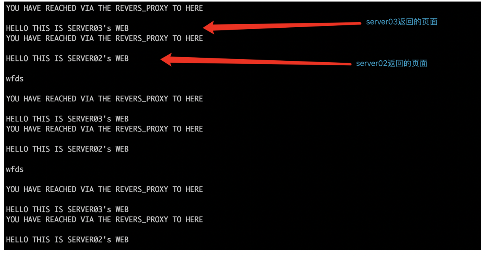
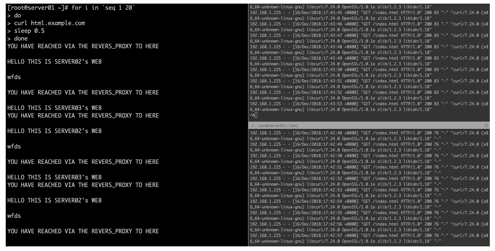
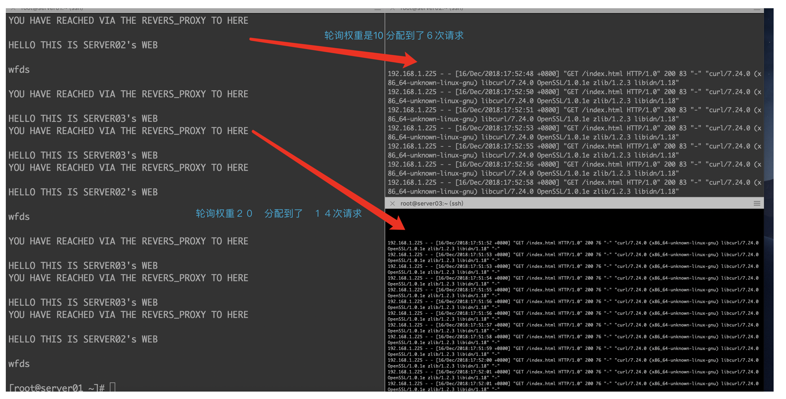
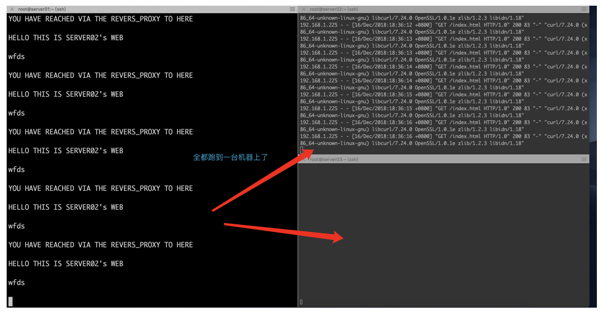

## 6.NGINX做反向代理和负载均衡，企业中必用（下篇）

【我们先说 上篇中遗留下来的 负载均衡功能】

负载均衡是做什么用的 上一篇中我们给大家解释过了 这里就不再啰嗦

我们现在当务之急 是先把nginx的负载均衡给实现出来 稍后 我们再讨论一些深入的问题

nginx实现负载均衡的话 在咱们之前讲的反向代理的基础上 就变得非常的简单了

就是在 upstream{}模块中 继续陆续 添加多个后端"节点"(节点指的就是 后端的服务器)即可

请看下面的截图

```plain

 upstream prometheus {

   server server02:9104;
   server server03:9104;
...
...

}

upstream html {
   ip_hash;
   server server02:8080;
   server server03:8080;
...
...
}
```

就像这个样子就好了，原本之前upstream只反向代理给一台服务器，我们现在多加几台后 就变成了 反向代理给多台服务器了 这就变成了负载均衡了^\_^  
是不是很简单呢？

简单是简单，但是在这里需要注意 ， 凡是你添加到upstream{}里面的 后端机器(server02/03/04....)，请你务必先手动确认 每一台要被添加的机器 是确实可用的，并且拥有一致的功能 别给搞错了哦

检查语法没有问题后，接下来 咱们准备开始做测试了 看看这个负载均衡 是不是真的像咱们预期的一样 把同一股请求 分散到多个机器上去了

但是这里有一个问题了，咱通过什么才能看到 一台服务器上 接受到了请求呢？

这就要临时引入一个新的知识点 也就是nginx的日志功能 如果不懂得怎么查看日志 往后的很多工作都无法进行了

【测试负载均衡功能前的准备工作，并介绍nginx日志功能】

接下来 咱们的实验 需要大家一起 做这么几个准备工作

1) 一共需要最少三台虚拟机

2) 每一台虚拟机上 都请安装好nginx

3) 后两台作为 负载均衡后端的NGINX 请分别建立相同位置的html主页 来作为结果展示（可加入不同标识在页面中 以方便咱们辨认）

4) 需要一个简单的压测shell脚本 (一会就跟大家说 怎么来写)

5) 确认每台nginx上 都开启了 日志功能 (稍后就会讲到)

第一项 第二项 第三项 没什么太多好说的了 大家已会 请自行准备

第四项：

最简单的压测shell脚本 直接复制给大家 很简单 就是使用while死循环 + curl 即可  
其实就是 无限次的不停发送 HTTP请求了

```plain
while true
do 
curl html.example.com
done 
```

curl后面指向的是 你的最前面的负载均衡机器中 定义的server\_name , 自行更换即可  
(shell脚本无论是在本专栏中，还是在Linux的学习中 都是必须必须掌握的 请私下多多练习)

第五项：nginx日志功能的开启

这里到了一个重头戏了 一起跟住 学好！~

nginx记录实时日志的功能 其实也是由一个模块来完成的  
(nginx处处是模块 这里又是一个很好的体现)

这个模块名称叫做 ngx\_http\_log\_module  
这个模块 其实是作为 nginx HTTP模块当中的一个 "下属模块" 存在的， 我们在这个小节中 先不管模块的问题 先学好其使用方法

nginx日志虽然是作为一个"模块"来调用的, 但是 它却不像server{} , localtion{} 那样 必须带上一个花括号才能调用

nginx日志的开启 只需要以配置项的方式 定义最少两项 就可以使用了

这两项配置项分别是 log\_format(日志格式) 和 access\_log(日志调用)

```plain

log_format  main  '$remote_addr - $remote_user [$time_local] "$request" '
                      '$status $body_bytes_sent "$http_referer" '
                      '"$http_user_agent" "$http_x_forwarded_for"';
access_log  /var/log/nginx/access.log  main;
```

先看第一项 log_format ，看着有点长 不太好懂 对不？^_^

其实它是由三个部分组成的， 就是 log\_format + \[日志名称\] + \[日志内容变量\]

log\_format总体来说 就是定义一个日志格式，说白了 这份日志当中 你希望在里面会出现记录下 什么样的内容  
定义好格式和内容之后， 最后给它起一个"名字" 叫做 main

(日志内容变量的部分比较复杂 且内容较多，我回头单独学习nginx日志功能的时候 再详细讲解 目前先使用默认自带的)

这个main名字是干啥用的？ 其实它非常关键

如果你仅仅是 制定了日志的格式 日志并不会立刻出现在你眼前的，它必须要再一次被"调用起来" 才能生效的哦

调用是谁调用的？ 就是第二项的 access\_log

access\_log /var/log/nginx/access.log main;

第二项的配置 也是由三个部分组成，access\_log + \[日志产生的位置\] + 调用名称

这里注意 最后一项的 "main" 它其实就是 调用了 你之前刚刚定义好的 日志格式的"名字"了

这两项配置内容 由于都是http{}的下属，所以 直接粘贴在 http{}下即可

例如这样：

```plain

http {
    include       /etc/nginx/mime.types;
    default_type  application/octet-stream;

    log_format  main  '$remote_addr - $remote_user [$time_local] "$request" '
                      '$status $body_bytes_sent "$http_referer" '
                      '"$http_user_agent" "$http_x_forwarded_for"';

    access_log  /var/log/nginx/access.log  main;
```

这两项定义好之后，当你的nginx再被访问到的时候，就会在 /var/log/nginx/ 目录下 产生名字为 access.log的日志了

就像下面这样


顺带一提的是，当前最新版本的nginx的配置文件中，即便你不配置上日志的配置项  
（你可以试试把 nginx.conf中自带的 log\_format , access\_log 都删掉或者屏蔽掉）  
nginx默认也会产生一份日志的，只不过 都是采用默认的一些日志格式 和 位置  
其实你可以 试试找一下 /var/log/nginx/ 下，不管你配置没配置 nginx日志 ， 这里都会已经有一份默认的日志一直在 产生中了

【万事俱备了 开始测试负载均衡吧】

大米的三台机器， 第一台 server01 依然作为反向代理和负载均衡， 同时 也是作为入口的机器，请求先到达这里 然后再分配到后面的两台机器

第二台 和 第三台 server02 & server03 都做好了一个简单的静态html页面，访问日志 存放在默认的 /var/log/nginx/access.log  
（这里大米偷懒了，就如上个小节末尾跟大家说的，新版nginx 即便你日志功能不配置 甚至都屏蔽了 nginx也可以正常产生默认格式和位置的日志的 其实 server02 server03的nginx.conf配置中 我都没有写任何的日志配置，就用默认自带的就可以了 因为当前 我们只需要清楚的看到日志的产生 即可 并不在意 日志的具体格式，这个到后面的 专门的日志章节中 我们再细讲 ）

server01的配置文件如下

```plain

http {
    include       mime.types;
    default_type  application/octet-stream;

    log_format prometheus_log  '$remote_addr $time_local' ;
    log_format html_log  '$remote_addr $time_local' ;

upstream prometheus {

   server server02:9104;
   server server03:9104;

}

upstream html {
   server server02:8080;
   server server03:8080;
}

    server {
        listen  80;
        server_name "";

        root html;

    }

    server {
        listen  80;
        server_name prometheus.example.com;

        location / {
                proxy_pass http://prometheus/metrics;
                access_log  /var/log/nginx/access_prometheus.log  prometheus_log;
             }
        }

    server {
        listen  80;
        server_name html.example.com;

        location / {
                proxy_pass http://html/index.html;
                access_log  /var/log/nginx/access_html.log  html_log;
             }

        }

}
```

咱们来拆开解释一下上面配置是什么意思

先看最上面的这两行

```plain

    log_format prometheus_log  '$remote_addr $time_local' ;
    log_format html_log  '$remote_addr $time_local' ;
```

日志配置中的 log\_format 我们紧挨着 http 下给写上

有人可能会问 为什么log\_format定义了两个呢？

是因为 大米的站点中 一共存在两个不同的WEB应用  
一个是 静态html主页， 另一个是监控动态页面 这个咱们之前讲过的 没忘吧^\_^?

大米这里是希望, 两个不同的应用 在server01上 都对应有不同日志的记录  
这两项日志 分别起名为 prometheus\_log 和 html\_log （后面即将调用这里的名字 很重要哦）

这里又有人会问了： access\_log跑到哪里去了？ log\_format下没看到啊

其实你继续往下看 access\_log只不过换了个地方 是在如下这里定义的

```plain

        location / {
                proxy_pass http://html/index.html;
                access_log  /var/log/nginx/access_html.log  html_log;
             }
```

在这里就可以看到了 ，其实access\_log 位置是不固定的，而log\_format位置是固定的  
log\_format只能定义在 http{}的"外围之中", 也就是说，不能定义在 http{}当中的任何其他的模块中{} 了 ，它相当于是一个全局的"设置"

而access\_log呢？ 它位置就不固定了，接下来给大家解释一下（这里理解有一定难度）  
access\_log 本身的功能 是调用启动日志记录，换句话说就是 啥时候 或者 啥条件下 该启动日志记录了 就写上它

如果把access\_log 放在和 log\_format一样的位置上 如下所示

```plain

http{
log_format  xxxx xxxx
access_log xxxx xxx

server{}
}
```

这样的配置 就属于 全局配置了，后面不管是哪个server{} 或者 location｛｝起作用后 都统一使用一样的日志配置

如果把access\_log 放在 server{}中 或者 location{}中呢？

例如下面这样

```ruby

http{

log_format def
log_format dhk

server{access_log def }

server{
location{access_log dhk}
}
}
```

如上这样的配置 日志只有在满足某个server{}匹配上，或者 location{}匹配上的情况下，日志才被调用起来 明白吗？

这里还有一个有意思的规则 我们需要给大家先提出来  
那就是 nginx的配置本身遵从一种 "优先细 忽略粗" 的关系  
这啥意思啊 ~~~~???

我们用如下这一段配置来举个例子

```plain

    server {
        listen  80;
        server_name html.example.com;
        access_log  /var/log/nginx/access_html2.log  html_log;

        location / {
                proxy_pass http://html/index.html;
        #        access_log  /var/log/nginx/access_html.log  html_log;
             }

        }
```

上面这一段配置中，你可以看到， server{}下 定义了一个access\_log , 存放名称是 access\_html2.log  
然而 server{}下的 location{}中 又定义了一个 access\_log 存放名称是 access\_html.log

这里起到的效果是， 如果location{}匹配上了，那么它access\_log就会启动，并且还忽略掉 server{}下面的 access\_log设置

我们在server01上 就按照这个配置 来跑一下 压测脚本吧  
压测的是 html.example.com 这个域名 （目前先不管负载均衡 ，我们只看server01上本身产生的nginx日志）  
\[root@server01 conf\]# while true; do curl html.example.com; done  
（其实大米这里是 在server01上 添加了域名绑定 然后自己压自己 这样比较方便 比从公网外去压 速度快 ）

压测之后，日志如下产生  


看到了吗？  
location{}当中的access\_log生效了于是诞生 access\_html.log，于是乎 就忽略了 server{}下的 access\_log, 不会产生access\_html2.log的内容  
（容量是 0 说明没有日志写进去 只是有个空文件放在那里，空的.log日志文件，是在执行 nginx -s reload后 就立刻产生）

好了 言归正传

我们sever01 这样配置的目的， 就是希望

当请求访问的是 html.example.com的域名时， 日志记录到  
access\_log /var/log/nginx/access\_html.log html\_log;  
当请求访问的是 prometheus.example.com的域名时，日志记录到  
access\_log /var/log/nginx/access\_prometheus.log prometheus\_log;

这样就非常清楚明白了

server01先说到这儿， 接下来是 server02 server03的配置

server02 03 的静态页面应用 通过nginx提供

配置如下即可

```plain

        server {
        listen       8080;
        server_name  localhost;
        root         /var/www/;

        location / {
            index index.php index.html index.htm;
        }
}
```

配置成这样就可以了，很简单的，因为 后端nginx就只要能提供个 主页即可 不需要额外配置了  
提供让两台后端nginx都监听在 8080端口（其他端口也可以），配置好一个主页地址即可

到这里 我们就做好准备了 接下来就是开始测试 负载均衡功能了

咱们使用简单的压测脚本 对html.example.com 先开始

while true; do curl html.example.com; done

  
上图就是 对静态页面负载均衡 html.example.com的循环访问的返回结果了

由于server02 server03 的主页 分别加入了区分标识 所以 很容易就看到 请求有时被分配到02 有时被分配到03

到这里 爱思考的学员 就会有疑问了： 负载均衡负责把请求 分给后端的多个机器时，是否会遵循一个什么规则么？ 总不会是 想给谁就给谁吧？^\_^

那么接下来 咱们就来看一下 nginx负载均衡 所提供的"算法"

nginx分配负载均衡的请求 一定会按照某一种指定的 或者默认的 "算法" 来进行  
在这里 我们先把 这几种算法 都罗列出来看看先

(如下这一段 取自其他出处)

一、Nginx负载均衡算法  
1、轮询（默认）  
每个请求按时间顺序逐一分配到不同的后端服务，如果后端某台服务器死机，自动剔除故障系统，使用户访问不受影响。

2、weight（轮询权值）  
weight的值越大分配到的访问概率越高，主要用于后端每台服务器性能不均衡的情况下。或者仅仅为在主从的情况下设置不同的权值，达到合理有效的地利用主机资源。

3、ip\_hash  
每个请求按访问IP的哈希结果分配，使来自同一个IP的访客固定访问一台后端服务器，并且可以有效解决动态网页存在的session共享问题。

4、fair  
比 weight、ip\_hash更加智能的负载均衡算法，fair算法可以根据页面大小和加载时间长短智能地进行负载均衡，也就是根据后端服务器的响应时间 来分配请求，响应时间短的优先分配。Nginx本身不支持fair，如果需要这种调度算法，则必须安装upstream\_fair模块。

5、url\_hash  
按访问的URL的哈希结果来分配请求，使每个URL定向到一台后端服务器，可以进一步提高后端缓存服务器的效率。Nginx本身不支持url\_hash，如果需要这种调度算法，则必须安装Nginx的hash软件包。

6、least\_conn  
Web请求会被转发到连接数最少的服务器上。在这种场景下，把请求转发给连接数较少的后端，能够达到更好的负载均衡效果，这就是least\_conn算法。

由于篇幅的关系 ，咱们只通过实验 给大家讲解 其中在企业中 使用最普遍的三种算法  
也就是 轮询 加权轮询 和 ip\_hash  
（其实网上介绍各种nginx负载均衡算法的很多，咱们在这里主要希望大家通过 脚本和实验来掌握的更加清楚明白）

我们先介绍 nginx的默认LB(load-balancing 负载均衡简称) 算法， 那就是轮询

轮询这种算法 很简单易懂 说白了就是 先扔给第一个 再扔给第二个 再扔给第三个... 除非有一台后端"挂了" 不然就是周而复始的 按这样的方式来分配请求  
咱们上面配置负载均衡 upstream{}的时候 貌似没有指定什么算法不是吗？ 其实什么都不指定的话 默认就是 轮询算法了哦 ^\_^

光说不练是可耻的！ 咱们接下来 用脚本和实验 精确的看看 默认轮询 具体怎么分配请求的

我们首先把之前的 简单压测脚本 做一下改动

改成这样子

```plain
for i in `seq 1 20`
do
curl html.example.com
sleep 0.5
done
```

这段脚本的意思是 循环一共２０次访问入口html.example.com（seq用法 可以自行查阅 ）  
每次间隔0.5秒

之后 我们通过在 server02 server03上 分别执行 tail -f /var/log/nginx/access.log 就可以看到 如下的结果图了  
（tail -f 可以实时查看一个文件末尾内容的增加 是使用Linux中 必须掌握的方法）



由于我们加入了 时间间隔0.5秒执行， 就可以很清楚的看到 ，一次执行 先到了server02, 下一次执行就到了 server03 周而复始 平均分配给后面的两台  
图右边显示最终，每台后端服务器 都收到了一共 １０条日志（也就是被访问到了１０次）

这就是默认的 轮询规则了 很简单

接下来 咱们来看一下 轮询加权重 是怎么样的

我们先把nginx的 配置改成如下这样

```plain
upstream html {
   server server02:8080 weight=10;
   server server03:8080 weight=20;
}
```

在每一行的后面 加入 weight=xx ，这个就代表轮询的权重值了  
权重值越高 越会更多的被分配请求 而 相反的则分配的越少  
这个也很好理解吧  
咱们接下来通过 实验来看一下 加入权重之后的 轮询 是什么样的结果吧 ^\_^



上图中 我们可以看到， 同样的２０次循环测试， 右上角的server02 由于权重值是１０ ， 只被分配到了 ６次请求， 而右下角的server03 由于权重是２０ ，被分配到了１４次请求  
所以，通过实验证明，权重值越高 轮询被分配的请求越多，并且 还是按照权重值的比例 来进行分配  
(server03 的权重 正好是 server02的两倍 ， 分到的请求 也正好是两倍了)

如上就是 加入权重值的轮询规则， 这种LB的算法 在企业中使用的最为普及（尤其是 中小型企业） 因为可以根据权重值 来灵活的调整 给后端分配请求的负载量

接下来 咱们再看 ip\_hash的 LB算法， 也就是 基于客户端IP哈希值 来进行请求分配  
这种算法相对特殊一些， 大米来解释一下怎么回事

当每一个客户端（用户）在发送访问过来的时候，都会带有客户端的IP地址，这种又叫做 来源IP地址  
比如 在我们nginx的 access.log中 默认就会记录这一地址

```coffeescript
[root@server02 ~]# cat /var/log/nginx/access.log | tail
192.168.1.225 - - [16/Dec/2018:17:52:56 +0800] "GET /index.html HTTP/1.0" 200 83 "-" "curl/7.24.0 (x86_64-unknown-linux-gnu) libcurl/7.24.0 OpenSSL/1.0.1e zlib/1.2.3 libidn/1.18"
192.168.1.225 - - [16/Dec/2018:17:52:58 +0800] "GET /index.html HTTP/1.0" 200 83 "-" "curl/7.24.0 (x86_64-unknown-linux-gnu) libcurl/7.24.0 OpenSSL/1.0.1e zlib/1.2.3 libidn/1.18"
125.64.94.201 - - [16/Dec/2018:17:53:39 +0800] "GET / HTTP/1.0" 404 169 "-" "-"
192.168.1.225 - - [16/Dec/2018:17:58:16 +0800] "GET /index.html HTTP/1.0" 200 83 "-" "curl/7.24.0 (x86_64-unknown-linux-gnu) libcurl/7.24.0 OpenSSL/1.0.1e zlib/1.2.3 libidn/1.18"
192.168.1.225 - - [16/Dec/2018:17:58:17 +0800] "GET /index.html HTTP/1.0" 200 83 "-" "curl/7.24.0 (x86_64-unknown-linux-gnu) libcurl/7.24.0 OpenSSL/1.0.1e zlib/1.2.3 libidn/1.18"
192.168.1.225 - - [16/Dec/2018:17:58:19 +0800] "GET /index.html HTTP/1.0" 200 83 "-" "curl/7.24.0 (x86_64-unknown-linux-gnu) libcurl/7.24.0 OpenSSL/1.0.1e zlib/1.2.3 libidn/1.18"
```

注意到 日志当中 左边第一列的数据了吗？ 192.168.xx , 125.64.xx 。。等等 ，这个就是记录下来的来源IP地址  
（不过 这个来源地址还有很多说头儿， 有时候获取起来并不这么简单， 后面 专门讲日志的时候，会对日志格式内容 作更详细的讲解）

总而言之，ip\_hash的算法 就是基于这个IP地址 用它作一个数学运算 最终得到一个结果值， 不同的来源客户端 在短时间内 得到的这个结果值是不一样的  
短时间内 相同的结果值的请求 就会被分配到同一台后端机器上 ， 这就是ip\_hash算法

这里有的朋友会问了： 这种算法的意图何在呢？ 为什么同一客户端的请求 要分到同一个后端服务器上？  
大米的回答： 主要是为了 会话保持 又叫做session保持， 这个理解起来难度比较大 我们放在下一个小节中再解释

接下来 做个实验吧一起

请把nginx配置 改成如下这样

```plain
upstream html {
   ip_hash;
   server server02:8080;
   server server05:8080;
}
```

就在第一行 新加入了 ip\_hash; 这样即可

接下来运行咱们的压测脚本



从上面的结果来看，所有的请求 都被发送到server02 一台去了 , server03一条日志都没有  
因为 咱们的循环测试 都是来自于咱们自己同一个客户端的呀，所以来源ip相同，自然每次请求 都计算并分配到同一台后端去了

如上 我们就通过实验 验证了nginx使用较为普遍的三种算法

另外 在upstream{}的负载均衡配置项中 还可以添加一些 其他额外的实用配置的

例如：末尾标记down之后，server02这台机器 就被负载均衡"抛弃了" 不会再有任何请求发送上去，而全都跑到server03去了

```plain

upstream html {
   ip_hash;
   server server02:8080 down;
   server server03:8080;
 }
```

再例如：末尾标记 backup之后，这台机器就成为一台 备用机器了，意思是说 只要其他的机器都还可用的情况下，这台机器就不会接受到任何请求

upstream html {  
server server02:8080 weight=10 backup;  
server server03:8080 weight=20;  
}

大家可以自行作实验 来证明其功效

# 【session会话保持的理解】

我们在上一个小节中 提到了 ip\_hash这一种LB的算法对不？ 那么在本小节我们来解释一下 它存在的意义吧

举个生活中遇到的例子

我们平时都有在各类网站上登录用户账号的时候吧，是不是只需要登录一次 然后无论之后在这个站点任何地方 都是可以一直保留着登录状态了对不？

另外，我们平时也有大量"网购" 或者"订餐"的时候 对不？ 这种都会遇到一种 叫做"加入购物车" 的动作的对不？

你在挑选货物的时候，通常都是 先慢慢浏览 当看中了一款物品之后，就先把它添加进入购物车 然后继续挑选其他的，在最后结账的时候 购物车一直都保留着你全部挑选的记录的

这种带有记忆功能的 HTTP请求 就涉及到我们所说的 session会话保持功能了

说的简单一点，就是对于同一个用户来说，当你执行登录 或者挑选货物 之后，你在"后端"某一台服务器上 就保留一份临时数据 记录着你的"状态"  
当你再发起下一次行动的时候（可以理解为 再次发起下一次HTTP请求的时候），负载均衡会把你的请求 分配到上一次所在的后端服务器上，这样你之前临时记录的数据就找到了  
不然的话，如果负载均衡把你的下一次请求 分配到了另一台 没有你的状态记录的机器上，你的状态就丢了  
（登录失效了，又要重新登录； 购物车被清空了，之前选购的东西都丢了。。。）

说到这里 肯定会有很多人有这样的一种疑问： 如果这么说的话，那岂不是 负载均衡算法 就只能使用ip\_hash这种方式才可以了，轮询或者最小链接等等其他算法就没有任何用武之地了吗？

大米给大家的解释如下：

在早期的时候某些情况下 确实是这个样子，这个跟后端的程序代码有着密切的联系  
比如：一个网购站点采用PHP编写，并且运行在十台后端服务器上  
每台服务器的PHP程序代码，都会把当前已登录的用户 临时记录在自己这台服务器之上，而其他的９台机器上是没有的  
这种情况下，就必须依赖 类似ip\_hash这种会话保持功能的负载均衡 把同一用户发送到同一台后端PHP服务器上 才可以正常保持会话

但是 随着集群技术的不断推进，代码在不断改进，各种缓存技术也在不断出现  
现如今更多的动态站点的程序 往往都不会出现这种 临时数据不共享的情况

比如：当一个用户登录之后，PHP的程序会把 这个用户的登录状态 记录在另外一个缓存集中（比如redis 或者 memcache , 也有可能记录在 mysql数据库），或者记录在用户客户端的Cookie中  
而PHP程序（不一定是PHP了）由于不会再在本地存放任何临时且不共享的数据，这样以来 ，十台后端服务器上的程序 都变成了一种 "无状态" 的情况，也就是说 用户每次请求 不管分配到哪一台后端机器 都无所谓了，反正会话保持的数据 可以从别的地方找过来

这样 就不再非要 依靠负载均衡来实现 会话保持功能了

我想通过这一段的解释，大家应该就比较明白了吧 ^\_^

# 【负载均衡的理解】

负载均衡功能目前在企业的集群中 已经是无处不在了

因为 随着互联网爆炸的发展，绝对没有哪个企业只用一台服务器 就能搞得定的 必须有分流

然而负载均衡本身是一个通用技术，并不是只有nginx才可以实现的哦

总体来说呢 负载均衡技术 可以分为 软件和硬件两个大类

所谓的 软件负载均衡 就是在一台服务器上安装某类支持反向代理+负载均衡的软件 来实现 （例如nginx）  
然而 硬件负载均衡 就是使用单独的物理设备来实现负载均衡 比如F5, netscaler 等等 这种负载均衡独立设备 性能更加强大 同时"价格也更加强大"

一般在中小企业 我们不太容易能有机会 见到使用到"硬件负载均衡"，所以 咱们更多还是以学习 软件负载均衡为主

除此之外 负载均衡 还有另外的一种分类方式，叫做 四层和七层负载均衡

四层和七层是什么鬼？？？

这个其实是 相对于 著名的OSI七层模型来说的哦  
（我们后面的篇幅 会考虑加入 学习TCP网络知识的章节，因为如果对网络不够了解，没办法更好的深入学习 运行在互联网上的nginxWEB）

七层模型不是一两句话能说清楚的 ，需要大量的篇幅，我们在这里 先简单的解释一下吧

所谓的 四层负载均衡，就是工作在比较底层的一种负载均衡方式，它只认识 ＩＰ地址和端口，别的就都不知道了  
比如 LVS负载均衡 就是知名度非常高的一款，不过它的配置方法非常的复杂  
四层负载均衡理论上说 一般效率更高 而且支持的后端的范围更广  
但是灵活性不强 只是为了分配请求而分配 并不能做出一些智能化的判断  
（DNS解析 其实也可以实现负载均衡的哦，比如同一个域名可以解析到多个不同的IP地址，而且还是以轮询的方式，第一次解析到第一个，第二次解析到第二个 这样就间接实现了 四层的负载均衡）

接下来说 七层负载均衡  
所谓的七层，简单的说 就是应用层了，属于比较高层比较智能的负载均衡  
就是它主要是基于HTTP协议的负载均衡  
也就是说 被他分配的请求，只能是HTTP协议的请求才可以 ，比如我们的nginx  
七层负载均衡 由于是工作在比较高的应用层上，所以能加入更多智能的判断 比如URL参数的判定等等 ，只是四层负载均衡所不具备的  
七层LB的执行效率 理论上是低于四层的，但是由于其高灵活性 和 易于配置的优点，近些年正在不断取代四层 而成为主流

（之前跟大家说过的，现阶段 大多数的互联网应用的"前端" 接受的都是HTTP的请求，所以很自然七层LB就使用的越来越多）

这么说可能不太容易理解，咱们举个例子吧

假设我们现在 有三台服务器，上面都跑的是 nginx同样的静态页面  
由于nginx作为应用后端，本身都是基于HTTP请求的响应， 那么如果要实现三台的负载均衡，我们前面加入一个七层LB即可 (比如 nginx upstream)

假设我们现在 有三台服务器，上面跑的都是 mysql数据库  
数据库的请求 可不是HTTP请求了哦， 这种时候 负载均衡 就需要使用四层LB  
因为四层LB就是针对 IP和端口，所以它可以不管你应用是什么类型什么协议，只要提供了IP和端口 就可以实现分发了

这样说 就比较清楚了吧

另外 顺带一提的是，新版的nginx 在安装相应的插件后，也可以支持四层的负载均衡哦

到这里 我们的反向代理和负载均衡 就说这么多啦
