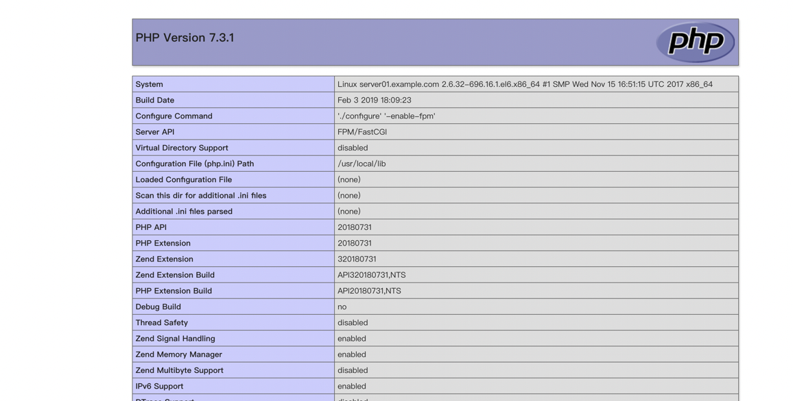

## 10.Nginx和PHP永不分家——正确理解和部署NG+PHP

# \[复习一下 什么是动态网站 什么是静态网站\]

我们早在序章的时候，就给大家讲过 什么是静态网站 什么是动态网站 还记得吧？^\_^

那么从本节课开始，我们逐步来接触动态网站的各种相关知识

之前已经讲过的东西 咱们不再啰嗦了， 仅仅以两个简单小例子来总结一下

# 什么是静态网站？

打开网页后 看到很多图片， 看到大量的文字，听到了一首歌 看了一段电影 这种都属于静态网站的内容

# 什么是动态网站？

张三登录网页版邮箱，和李四登录同一个网页版邮箱，两人都必须输入各自的账号和密码， 如果输入错误 则网页返回 禁止登录  
这种就属于动态网站内容

所以说 静态网站返回的东东 都是事先准备好的 存在服务器上的东西 ，谁来看都一样的结果

动态网站返回的东东 就是跟每个不同用户相关了。看用户怎么输入 然后由程序进行各种判断后 再返回结果 结果不是一成不变的

# \[nginx怎么处理动态呢\]

nginx是啥？ webserver对吧，http服务器

nginx自身能处理动态请求吗？ 回答： 不能

那遇到动态请求可咋办呢？ 回答： 让"别人"来帮处理就好了嘛 ^^

咱们之前 是不是学过 nginx的反向代理？

反向代理 说白了 就是把特定的请求 扔给后端的服务器 或者"服务" 来处理嘛

所以说 当webserver遇到动态请求 而自身不能处理的时候 它就会把请求扔给能处理 动态请求的 程序进行处理

能处理php程序的软件　我们又称为php解释器

交给php解释器处理很好，但是，php解释器如何与webserver进行通信呢？

为了解决不同的语言解释器(如php、python解释器)与webserver的通信，于是出现了cgi协议。只要你按照cgi协议去编写程序，就能实现语言解释器与webwerver的通信。如php-cgi程序。

（CGI 通用网关接口 是实现动态网站的重要里程碑 当前所有的动态网站 或者 动态HTTP 都是基于CGI为基础 改良而来）

# fast-cgi的改进

有了cgi协议，解决了php解释器与webserver通信的问题，webserver终于可以处理动态语言了。  
但是，webserver每收到一个请求，都会去fork一个cgi进程，请求结束再kill掉这个进程。这样有10000个请求，就需要fork、kill php-cgi进程10000次。

# 有没有发现很浪费资源？

于是，出现了cgi的改良版本，fast-cgi。fast-cgi每次处理完请求后，不会kill掉这个进程，而是保留这个进程，使这个进程可以一次处理多个请求。这样每次就不用重新fork一个进程了，大大提高了效率。

# php-fpm是什么

php-fpm即php-Fastcgi Process Manager.  
php-fpm是 FastCGI 的实现，并提供了进程管理的功能。  
进程包含 master 进程和 worker 进程两种进程。  
master 进程只有一个，负责监听端口，接收来自 Web Server 的请求，而 worker 进程则一般有多个(具体数量根据实际需要配置)，每个进程内部都嵌入了一个 PHP 解释器，是 PHP 代码真正执行的地方。

# \[nginx和PHP的安装\]

接下来 咱们就动手开始安装PHP吧 ^\_^

请先自行下载 最新的php 源代码安装的版本 （当前最新的版本是php7.x）  
[https://secure.php.net/get/php-7.3.1.tar.gz/from/a/mirror](https://secure.php.net/get/php-7.3.1.tar.gz/from/a/mirror)

安装依赖库

> yum install libxml2\*

下载之后解压并进入在解压文件中

```coffeescript

./configure  -enable-fpm
make && make install

到/usr/local/etc/目录下，将php-fpm.conf.default拷贝一份成php-fpm.conf
[root@server01 php-7.3.1]# cd /usr/local/etc/

cp php-fpm.conf.default php-fpm.conf
```

然后在编辑php-fpm.conf配置文件  
;最后一行改成如下

```makefile
include=/usr/local/etc/php-fpm.d/*.conf

进入到/usr/local/etc/php-fpm.d/目录下，将www.conf.default拷贝一份成www.conf
/usr/local/etc/php-fpm.d# cp www.conf.default www.conf

修改 www.conf的用户 
编辑www.conf文件，将user和group改成和nginx.conf中的user和group一致
user=www
group=www
```

没有这个用户的话 就手动添加一个即可

```plain
useradd www
```

然后再次 启动 php-fpm

```plain
/usr/local/sbin/php-fpm
```

查看是否启动成功

```plain
 ps -ef | grep php-fpm
root      3691     1  0 18:49 ?        00:00:00 php-fpm: master process (/usr/local/etc/php-fpm.conf)
www-data  3692  3691  0 18:49 ?        00:00:00 php-fpm: pool www      
www-data  3693  3691  0 18:49 ?        00:00:00 php-fpm: pool www      
root      4982 29553  0 18:59 pts/1    00:00:00 grep --color=auto php-fpm

 netstat -tnl | grep 9000
tcp        0      0 127.0.0.1:9000          0.0.0.0:*               LISTEN  

修改nginx的配置文件，支持php文件的解析，找到location的添加位置，在后面添加下面这个location

vim /usr/local/nginx/conf/nginx.conf

         location ~ \.php$ {
                        root /var/www/php;
                        fastcgi_pass 127.0.0.1:9000;
                        fastcgi_index index.php;
                        fastcgi_param SCRIPT_FILENAME $document_root$fastcgi_script_name;
                        include fastcgi_params;
                }
```

从这段配置文件中，我们可以读出

如果location判定 URL以.php后缀结尾，则指定到 /var/www/php/下面去找资源

动态的请求 一律通过 fastcgi 提交给 本地的9000端口来执行（php-fpm的默认工作端口）  
指定 fastcgi的首页为 index.php

添加一个 用于测试php的 index.php

```xml
vim /var/www/php/index.php

<?php phpinfo(); ?>
```

重启nginx后 再次访问 ip/index.php 如果可以看到如下的php版本信息 则表示php安装一切正常



到这里 ，我们的php跟nginx就正确的结合在一起了 :)

后面 我们还会学习 如何自行开发一个简单的php程序哦

