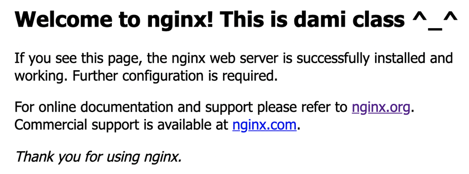
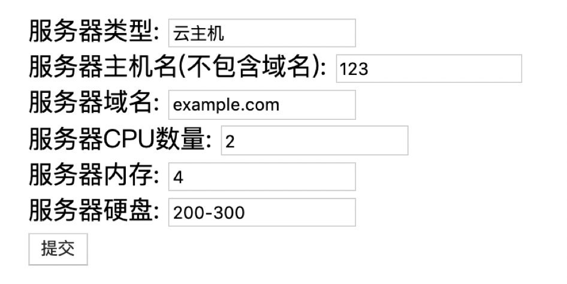
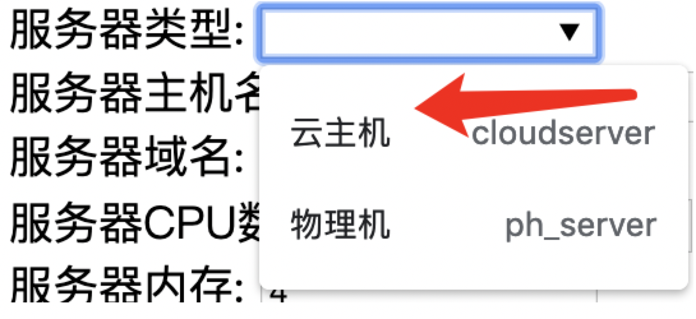
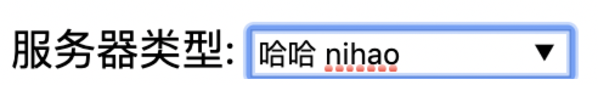
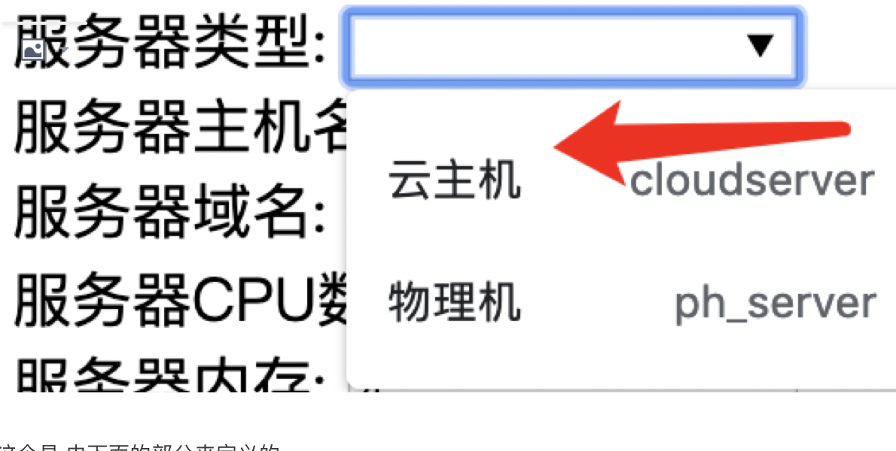
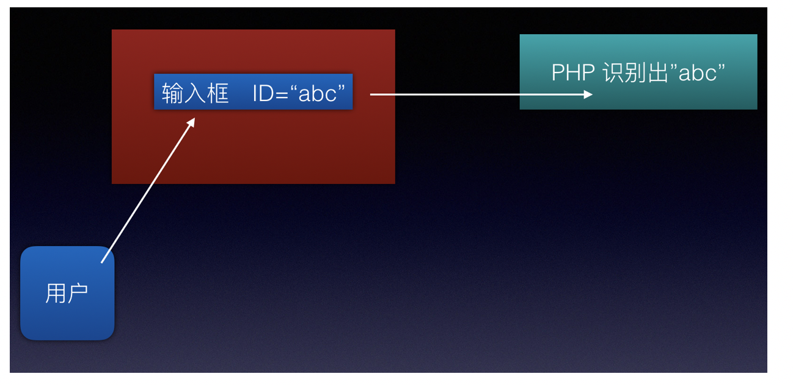

## 11.认识动态网站并学会自己制作第一个动态首页（上篇）

\[一起认识动态站点的页面\]

所谓的动态站点, 就是有一套程序在服务器上运行, 然而 这个程序是在等什么东西到来呢？

其实就是在等待用户的输入啦

我们之前也跟大家提过几次了，动态站点就是跟用户的互动 ， 用户发起自己的提交 之后呢 交由程序来做后面的处理 结果根据输入的具体情况而定 这就是所谓的动态网站处理的模式

那么大家想一想 网站要跟用户互动， 需要什么呢？

是不是 至少要让用户 先能看到一个界面才可以啊

而作为一个网站 它的界面是什么呢？

那就是 由HTML所形成的 页面啦

举个最最简单的例子吧

还记不记得 咱们之前的章节中 在学习nginx作静态首页的时候 用过如下这么一段HTML?

```xml
<!DOCTYPE html>
<html>
<head>
<title>Welcome to nginx1!</title>
<style>
    body {
        width: 35em;
        margin: 0 auto;
        font-family: Tahoma, Verdana, Arial, sans-serif;
    }
</style>
</head>
<body>
<h2>Welcome to nginx! This is dami class ^_^ </h2>
<p>If you see this page, the nginx web server is successfully installed and
working. Further configuration is required.</p>

<p>For online documentation and support please refer to
<a href="http://nginx.org/">nginx.org</a>.<br/>
Commercial support is available at
<a href="http://nginx.com/">nginx.com</a>.</p>

<p><em>Thank you for using nginx.</em></p>
</body>
</html>
```

其实 这就是nginx自带的一个欢迎首页HTML 告诉你nginx现在工作正常 另外 页面上 也附带一些链接的信息

这个就是一个 非常简单的HTML了

HTML语言的格式 大家也可以从这里 看出个端倪了

它是一种 标签语言

什么是标签呢？

看上面 最开始 是不是 <html>开头？

然后最后 还有一个 </html>结尾

这就是标签的形式 <html> 中间写具体的内容</html>

<h2> </h2> <p> </p> 这种 属于字体的标签 也就是说 在这个标签中输入的内容 会以不同的形式 展现我们需要的文字

<body></body> 这个标签呢？ 这个叫做实体标签 中间的内容 会作为网页传输的"实体" .  
（这里有点抽象，我们可以理解为 一个动态网站 如果要让用户互动 其实指的是 用户在页面提交的内容的传递 传递什么东西呢？那就是 实体当中的所有的内容， 这个内容最终会 交给谁？ 当然就是交给 网站后面的动态程序咯 ）

关于HTML语言 本身是一门很大的编程学问 我们在这里 只是让大家快速入门而已

如果真的想把HTML学精通 大家可以私下去看 HTML教学官网 进行更系统的学习

最终结果图 是这样展现的



不过 大家看出一个问题没有 这个展现出来的 就是地地道道的静态HTML页面了

所有用户看到的都一样，而且 关键是 没有提供 可以让用户输入互动内容的"地方"

想要实现动态网站， 就必须首先在HTML上 就得提供 这个 能让用户自己输入的 "地方"

"地方" 是怎么个概念呢？ 别着急 接下来一个单元 就会实现啦 ^\_^

\[动态站点的HTML 初识表单\]

## 别的先不说 咱们把 如下这一段HTML 放到你的主页目录中

```xml
<!DOCTYPE HTML>
<html>

<meta charset="utf-8">
<body>
<form action="login.php" method="post">
服务器类型: <input type="text" list="servertype_list" name="servertype" /> <br>
<datalist id="servertype_list">
        <option label="cloudserver" value="云主机" />
        <option label="ph_server" value="物理机" />
</datalist>

服务器主机名(不包含域名): <input type="text"  name="servername" /> <br>

服务器域名: <input type="text" list="serverdomain_list" name="serverdomain"> <br>
<datalist id="serverdomain_list">
        <option label="example.com" value="example.com" />
        <option label="test.admin.com" value="test.admin.com" />
</datalist>

服务器CPU数量: <input type="text" list="cpu_cores" name="servercpu"> <br>
<datalist id="cpu_cores">
        <option label="cpu_cores_2" value="2" />
        <option label="cpu_cores_8" value="8" />
        <option label="cpu_cores_16" value="16" />
        <option label="cpu_cores_32" value="32" />
</datalist>

服务器内存: <input type="text" list="server_ram" name="server_ram"> <br>
<datalist id="server_ram">
        <option label="server_ram_4" value="4" />
        <option label="server_ram_8" value="8" />
        <option label="server_ram_16" value="16" />
        <option label="server_ram_32" value="32" />
        <option label="server_ram_64" value="64" />
</datalist>

服务器硬盘: <input type="text" list="server_disk" name="server_disk"> <br>
<datalist id="server_disk">
        <option label="server_disk_1" value="200-300" />
        <option label="server_disk_2" value="300-500" />
        <option label="server_disk_3" value="500-1T" />
        <option label="server_disk_4" value="1T-5T" />
</datalist>

<input type="submit" value="提交"/>
</form>
```

* * *

上面这一大段 就是我给大家准备的 动态站点的HTML页面了

先来看一下效果吧



看到了没有啊？ ^\_^ 这个样子 就是我们期待的效果

本身这个页面 是之前大米在公司中 开发一款叫做CMDB的软件时候 所制作的一小部分 页面

关于什么是CMDB 我们下篇中再跟大家 细细介绍一下 这里 我们就只要先知道 是一个作为 服务器信息录入数据库的工具即可

这就是一个典型的动态网站了

从上面的截图 我们可以看到 这个页面本身有文字的提示 让你输入 服务器的类型 和 名称 等等

右边有输入框，选择框 等等  
（用户的输入的形式 有很多种 即可以直接在一个框中输入你的内容， 也可以通过一个事先定义好的 选择框 选择点击而作为输入）

这种可以提供用户输入的HTML页面 我们称作 HTML表单

我们注意开头 这个标签

```javascript
<form action="login.php" method="post">
</form>
```

这个form标签内部的所有内容 就是表单的内容了

说的这么热闹 那表单内容都是什么啊？

其实 这些输入框 选择框 以及旁边出现的文字 就都是表单的内容了


为什么要有 这个表单呢？

从字面理解， 表单表单 => 是不是很像 表格的意思？

我们日常生活中 填写一份"表格"是为了 干啥呢？

当然是为了 提交出去啊 ^^  
(就好比 去面试的时候 你是不是 得先填写个人信息的表格 然后交给 前台的妹妹 然后才能开始面试呢？^\_^)

所以说 表单的作用 简单的说 就是把用户输入的"内容"(不管是什么形式的 直接输入框 或者选择框 或者其他形式)  
放进一个"表格中" ，然后统一提交给后面的 程序处理

\[表单制作 细讲\]

接下来 咱们细讲一下表单的制作过程

我们先拿出 页面中的 第一个小部分 来细说一下表单的功能



看到这里没有， 选择服务器的类型 点击之后 右边是一个选择框 并且给了咱们两个固定选项

这个玩意 是怎么实现的呢？

请看如下这一段HTML代码 （学会这一个 其他的就不是问题了）

```xml
服务器类型: <input type="text" list="servertype_list" name="servertype" /> <br>
<datalist id="servertype_list">
        <option label="cloudserver" value="云主机" />
        <option label="ph_server" value="物理机" />
</datalist>
```

这段代码中 服务器类型: 这里是显示的文字 这个很好理解

接下来 右边是一个 <input....>开始的标签

<input /> 就是最重要的 网页输入框的 标签 ， 它提供这种白色的输入框 让你输入内容

而咱们这个例子中的输入框其实是有点特殊的

即可以作为 直接输入框  
（意思就是说 可以在框中 任意输入你想提交的东西）

也可以作为 选择输入框  
（意思就是说 也可以 通过选择 来进行输入）

那么 一个<input>在定义出来之后 ， 其实默认就是 直接输入框了



看到没有 可以随便输入

然而 它又支持 选择方式输入



这个是 由下面的部分来定义的

```xml
服务器类型: <input type="text" list="servertype_list" name="servertype" /> <br>
<datalist id="servertype_list">
        <option label="cloudserver" value="云主机" />
        <option label="ph_server" value="物理机" />
</datalist>
```

看 <datalist> </datalist> 这个  
这个就是作为 一个选择框的 定义了

接下来两个 <option>标签 什么意思呢？ 就是 这个选择框 必须要给用户提供 事先定义好的选项啊

所以这里 我们可以看到 这个选择框的 两个事先定义好的选项 "云主机" "物理机"

明白了 这里之后 后面其他的 选择框 都是大同小异

\[表单的矢量化 提交概念的引入\]

什么叫做矢量化呢？ 所谓的矢量化 就是把某种 原本用做"看的东西" 变成能用 能识别的意思

在咱们这里 其实指的就是 用户在页面提交的"内容" 可以让后面的程序 识别到 并且接受到

怎么来做呢？

（接下来的内容 难度较高 请务必仔细阅读 会有巨大的收获）

我们还是看这一段 HTML

```xml
服务器类型: <input type="text" list="servertype_list" name="servertype" /> <br>
<datalist id="servertype_list">
        <option label="cloudserver" value="云主机" />
        <option label="ph_server" value="物理机" />
</datalist>
```

```plain
注意在 <input ....中    有一个关键词 叫做 list="servertype_list"

什么意思呢？ 就是说 <input> 这一行 只是实现了  一个 输入框
而输入框中 选择内容的时候 ， 其实是 从下面的 <datalist>中定义好的选项  来获取的

接下来 看 <input 最右边的 name="servertype" 这里就到了 一个非常重要的关键了

name的意思是  把这个<input> 输入框 起了一个"名字"
```

但是这个 名字 可不是随便给它起个代号哦

这个名字 其实是作为一个 唯一的识别ID 这个ID作为一个唯一的标识 提交给后面 我们即将讲到的 PHP程序

PHP程序 就是依靠这个 ID 来识别输入框 并且准确的把 输入框中的内容 提取出来的哦

总体来说 大家可以通过如下这张图 来理解 我刚才说的一段话



左下角是用户， 中间红色代表的是 网页， 网页中间 有一个输入框，并且这个输入框有唯一的 ID = abc

页面提交的时候，就会把这个输入框中的用户输入内容 提交给后面的PHP程序 ， PHP通过 ID来准确获取 这一个输入框中的内容

到这里 大家可能会有一个疑问了

输入框我明白了， 可是 怎么才能"提交"呢？ 嘿嘿问得好

接下来 咱们看这里

```javascript
<input type="submit" value="提交"/>
</form>
```

代码的最后 有一个这样的<input>标签 看到了吗？ ^\_^

这个input 的 type=submit 这个叫做 提交按钮

就是页面中 这个


^\_^ 这个就叫做 提交按钮， 它点击之后 表单就会执行提交

不过还有一个问题 ， 表单提交后 怎么能指定 它到底提交给谁呢？

接下来看这里

在HTML最开头 不是有一行 <form>吗？

```xml
<form action="login.php" method="post">
```

看到了没有 action=login.php

是不是一下子豁然开朗了？ 意思就是说 把内容 提交给一个 叫做 login.php的文件 来执行啦

这样我们就很清楚了吧

上篇就说到这里了，大家好好消化一下， 在下篇中， 我们就要正式开始 学习PHP的制作方法啦 ^\_^

