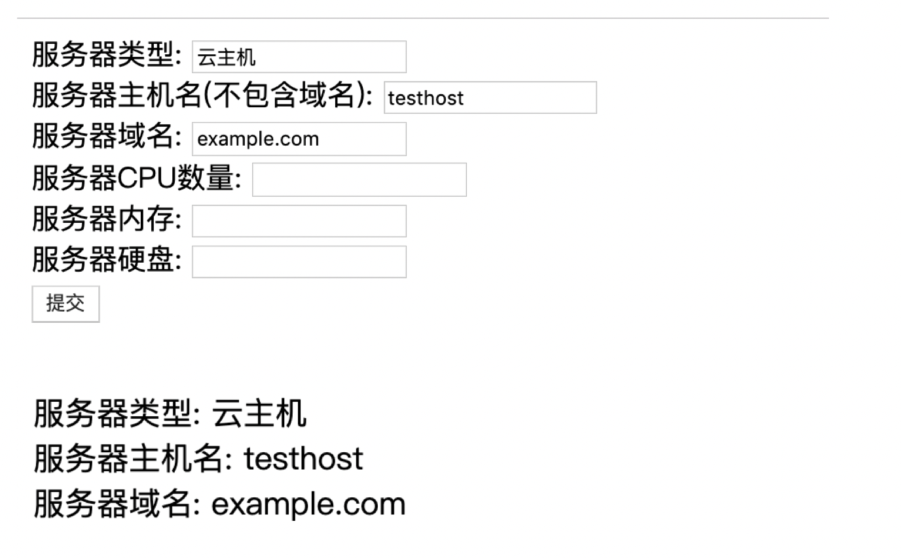

## 12.认识动态网站并学会自己制作第一个动态首页（下篇）

\[PHP对HTML表单内容的获取\]

我们在上篇最后说到, 表单依赖action指向的php文件的位置, 把内容一次性提交过去

```xml

<form action="login.php" method="post">
...
...
</form>
```

有内容的提交，就一定有内容的接收了对不？

看到末尾的 method="post"了吗？ 这就提交内容的方法

这里需要注意的是, 在表单中如果提交的方法 设置为post， 那么在PHP中接收的方法 也要一致的设置为post

好了 那么接下来 咱们就开始编写PHP的表单处理代码吧

```php
<?php

echo '服务器类型:  ';  echo $_POST["servertype"]; echo '<br>';
echo '服务器主机名:  '; echo $_POST["servername"];echo '<br>';
echo '服务器域名:  ';   echo $_POST["serverdomain"];echo '<br>';

$servertype = $_POST["servertype"];
$servername = $_POST["servername"];
$serverdomain = $_POST["serverdomain"];

?>
```

代码如上所示

PHP代码由 <?php 标签起， 到 ?>标签结束， 中间是代码的部分

从代码的第一行后面， 我们可以看到 $\_POST\["servertype"\]

$\_POST 就是PHP获取由POST方法提交上来的参数

那这个参数是什么呢

其实就是 咱们之前在 表单页面上的每一个输入框的ID 所附带的

比如：  
服务器类型: <input type="text" list="servertype\_list" name="servertype" />

后的name="servertype" . 这一项 就会最终被 $\_POST\["servertype"\] 所获取到

其他的几个输入框 也都是一样的原理

好了 接下来 咱们把准备好的php代码 写入到一个文件叫做 login.php  
再把 上篇中的 HTML的代码 写入到一个文件 叫做 index.php

把这两个php文件，放入你的nginx主目录当中去  
（之前你在哪里放的phpinfo文件的地方， 就放到哪里去）

然后 我们来测试一下效果



表单页面点击提交后， 后面紧接着调用的login.php 就成功的把你输入的内容获取到 并打印在页面上了  
到这里，说明我们的PHP 以及PHP代码 工作一切正常

\[PHP和MYSQL\]

上一个单元，我们最终实现了重要的 PHP获取表单内容

这是非常重要的一个步骤，代表着咱们的 后端PHP程序， 和前端HTML页面 可以互通信息啦

不过如果只是简单把 表单当中的 一些字段 获取到，并且打印出来， 这个也没什么实际的用途啊 是不是

所以说 我们来进一步吧

咱们应该有听说过 LNMP这个词吧 对不？

它就是 LINUX NGINX MYSQL PHP的缩写

也就是 最经典网站的动态网站的 搭建组成部分

其中的MYSQL数据库，是必不可少的一个环境

我们接下来希望实现的功能， 就是当表单提交服务器的参数数据后， 通过PHP获取到，然后最终写入到对应的数据库的表中  
(在企业中 很多功能都是这样的实现方式， 比如Devops自己用PHP+MYSQL开发一个 资源入库的小软件 等等)

咱们首先来 快速安装一下mysql, 这里直接走yum即可，版本会很旧 但是速度快 且不影响我们的任何使用

yum install mysql-server php-mysql

安装mysql的服务端, 以及php的mysql支持

安装好以后 , 执行

/etc/init.d/mysqld start

mysql安装好以后，默认是空密码登录， 但是我们的PHP程序没办法连接 空密码的mysql

所以 我们必须初始化一下 mysql root账号的密码

用 mysqladmin -uroot -p password 1234 初始化一下密码 随便设置一个 1234作为密码就好了

登录的时候 使用  
mysql -uroot -p1234

MYSQL准备好了以后， 还有一个重要的步骤 我们需要插入一下

就是咱们之前安装的PHP环境

之前我们在安装PHP的时候， 编译安装的参数 都是采用默认的 ， 但是现在 就必须做出扩展了

因为接下来PHP就要连接MYSQL了， 默认的编译参数是 无法支持的

按照如下的步骤， 回到你的php的下载解压目录中 重新执行编译

```coffeescript
[root@server01 down]# cd php-7.3.1
[root@server01 php-7.3.1]# ./configure  -enable-fpm --enable-pdo --with-mysqli --with-zlib
[root@server01 php-7.3.1]# .  make & make install
```

覆盖安装后， 重启php进程(直接 killall php-fpm , 再启动)

\[PHP代码的mysql扩展\]

接下来 我们需要把PHP程序 进行扩展

就像上一个单元中说的

把从表单提交过来的数据， 再写入到mysql数据库中去

完整的代码如下

```php
<?php

echo '服务器类型:  ';  echo $_POST["servertype"]; echo '<br>';
echo '服务器主机名:  '; echo $_POST["servername"];echo '<br>';
echo '服务器域名:  ';   echo $_POST["serverdomain"];echo '<br>';

$servertype = $_POST["servertype"];
$servername = $_POST["servername"];
$serverdomain = $_POST["serverdomain"];

$servername = "127.0.0.1";
$username = "root";
$password = "1234";

// 创建连接
$conn = mysqli_connect($servername, $username, $password);

// 检测连接
if (!$conn) {
    die("Connection failed: " . mysqli_connect_error());
}
echo "MYSQL连接成功<br>";

// 创建数据库
$sql = "CREATE DATABASE IF NOT EXISTS CMDB";
if ($conn->query($sql) === TRUE) {
    echo "数据库创建成功";
} else {
    echo "Error creating database: " . $conn->error;
}

// 创建数据库表
$sql = "CREATE TABLE if not exists CMDB.servers (
id INT(6) UNSIGNED AUTO_INCREMENT PRIMARY KEY,
servertype VARCHAR(30) NOT NULL,
servername VARCHAR(30) NOT NULL,
serverdomain VARCHAR(50))";

if (mysqli_query($conn, $sql)) {
    echo "数据表 servers 创建成功";
} else {
    echo "创建数据表错误: " . mysqli_error($conn);
}

$sql = "INSERT INTO CMDB.servers (servertype, servername, serverdomain)
VALUES ('$servertype', '$servername', '$serverdomain')";

if ($conn->query($sql) === TRUE) {
    echo "新记录插入成功";
} else {
    echo "Error: " . $sql . "<br>" . $conn->error;
}

mysqli_close($conn);
?>
```

咱们来解释一下上面这段代码

是按照如下这样一个步骤来进行的

１）获取表单的几个参数过来  
２）把获取到的参数 再分别放入三个PHP的变量中，预备后面的使用  
２）创建到你的MYSQL的链接 （这里注意，写准确你的mysql的位置， 如果是本地就是 127.0.0.1, 端口默认是9000 还有账号密码）  
３）创建一个叫做 CMDB的 数据库  
4) 在CMDB下 创建一个叫做 servers的表， 并且在表中定义了４个字段，用来存储 表单提交过来的信息  
５）把之前存储下来的 三个PHP变量内容，插入到表中  
６）关闭mysql 完毕

最后 咱们一起来测试一下结果吧 ^\_^


```ruby
mysql> select * from  servers;
+----+------------+------------+--------------+
| id | servertype | servername | serverdomain |
+----+------------+------------+--------------+
|  1 | 云主机  | 127.0.0.1  | example.com  |
|  2 | nihao      | 127.0.0.1  | example.com  |
|  3 | 云主机  | 127.0.0.1  |              |
|  4 | 云主机  | 127.0.0.1  | example.com  |
|  5 | 云主机  | 127.0.0.1  | example.com  |
+----+------------+------------+--------------+
5 rows in set (0.01 sec)
```

恭喜你 成功啦 ^\_^

感兴趣的朋友 可以自己扩展更多 PHP操作MYSQL的方法  
我们的 动态网站就学习到这里了
