## 13.Nginx+Jenkins 学习自动化持续集成（上篇）

\[自动化概念的由来\]

从这一章节开始，我们需要陆续引入几个新的技术，来配合nginx，懂得集群和自动化的概念，这无论对于开发人员，还是运维人员，还是测试人员，都是非常实用的技巧

在一般的互联网企业中，nginx几乎无处不在，为什么呢？

因为从用户端发出的请求，绝大部分都是HTTP请求，不管是浏览网页要好，玩手机游戏也好，只要是走网络，90%以上都是这种情况（这个我们也讲过的）

既然用户端发过来的都是HTTP请求，那么自然，nginx组成的集群就一般会在"前端" 等待着请求的到来

动态网站是怎么回事，我们已经学过了，既然是动态网站，那就一定有程序代码

程序代码一般怎么分布呢？

一般情况下，分为两种情况

（１）最前面一层是负载均衡层，第二层就是nginx+动态代码作为功能层（专业的叫法是：AP层）

（２）nginx和动态代码　都单独分出集群，然后，用nginx统一作为AP层的反向代理

程序代码是会不断更新上线的，而对于一个已经稍有点规模的企业，它的程序代码是不可能靠原始的手动来更新到服务器之上，都是要走一个自动化的流程

什么又是自动化呢？　其实就是把原本手工作业的活儿，用脚本来代替，解放双手提高效率

举个最简单的例子，企业中的LNMP集群，如果是手工作业更新代码的话，大概是如下的流程  
１：我们需要先把一台要被更新的后端AP，从nginx负载均衡上摘下来  
２：停止AP服务器上的　nginx 和　php(咱们就用php举例子吧)  
３：把最新的php代码从git(或者其他版本控制工具)上 checkout下来，然后提交分支  
４：把分支更新到这一台后端AP上，并且确保代码版本已经一致  
５：开启这一台AP上的各种服务  
６：通过手动发送HTTP请求，给这台AP服务器，看看输出是否正常  
７：没问题的情况下，把这台AP放回负载均衡  
８：重复这一流程，直到所有AP都被更新，并且所有NGINX上的日志　都正常返回200

即便是最简单的一个自动化更新上线流程，都要分这么多的步骤，手工很辛苦是一方面，更主要的是，全手工非常容易在中间出错，所以，自动化是必须必须的

那么最原始的自动化，就是Linux集群上的各种脚本编程了

就目前来说，用的最多的就是　shell 和 python这两种

而脚本怎么去写呢？　脚本具体都要做什么工作呢？

其实就餐考上面的 1-8　类似这样的步骤，把每一步骤都可以做成一个单独的脚本来替代手工执行

通过脚本 实现的最原始的自动化 是处于这样的一个局面 参考下面这张图  
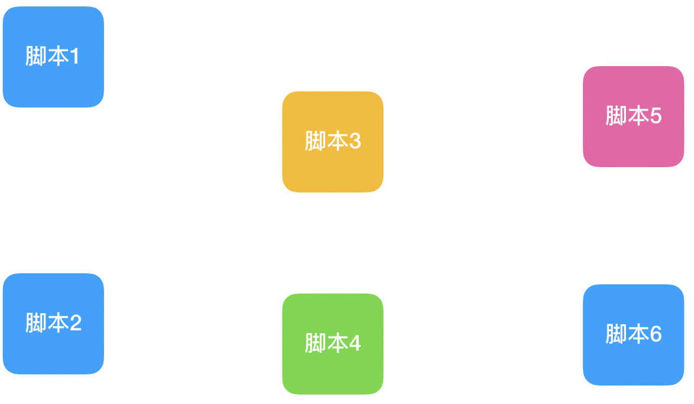

不难看的出来，各个脚本虽然从局部 已经把手工作业大大的减轻了负担， 但是 脚本由于数量过多 各自为政，那么运维工程师 在使用的时候  
也都是凭着经验 一个一个的去调用，一个一个的去检查结果， 万一中间出现了疏忽 调用了错误的脚本，那么必然会造成不必要的麻烦  
（什么叫做持续集成， 为了解决 原始化的脚本 顺序问题， 关系， 验证， 历史纪录，图形化 都可以有效的实现 并且 联合起来 ）

这里可能就有学员会问了： 那就干脆再写一个更大的脚本把所有的小脚本都融合在一起不就行了嘛？（量级 还要用 更多的代码 去实现 集成）  
这样做不是不行，但是如果提出更高的要求呢？ 比如 还希望融合起来的脚本 可以使用图形界面调用，且每一次运行都有明确的记录留下，而且还要求 任务的每一个部分 都可以方便的以接口的方式 和其他相连的部分连接起来呢？ 是不是就很难实现了

这里就要给大家推荐一个 可以实现如上要求的一款方便的持续化集成工具 就是Jenkins  
当然了，光有Jenkins还不够，还需要加上 自动化配置分发 还有版本控制 =》 最终形成 持续集成

\[实现持续集成，需要的相关技术介绍\]

*   bash 脚本编程

这个就不用多介绍了，作为一名运维的基础技能， 不过需要说明的是 bash脚本虽然很灵活简单 但是仅仅适用于  
不需要性能的 且是流程化的功能  
(提问：bash shell / python )

什么意思呢？

所谓的流程化，指的是比如 拷贝几个文件，执行几个命令 ，导出几个日志等等，这些都不怎么需要性能 就是一次性完成的事情

什么情况就不适合了呢？ 比如 分析量大的日志文件内容，循环读取 ，这种情况下 BASH是非常非常慢的

*   Python 脚本编程

后面的持续集成中， 凡事流程化的脚本 我们教给bash就好（因为编写简单 且速度不受影响）  
而需要性能的地方 主要是集中在 持续集成的过程中，需要有测试功能加入

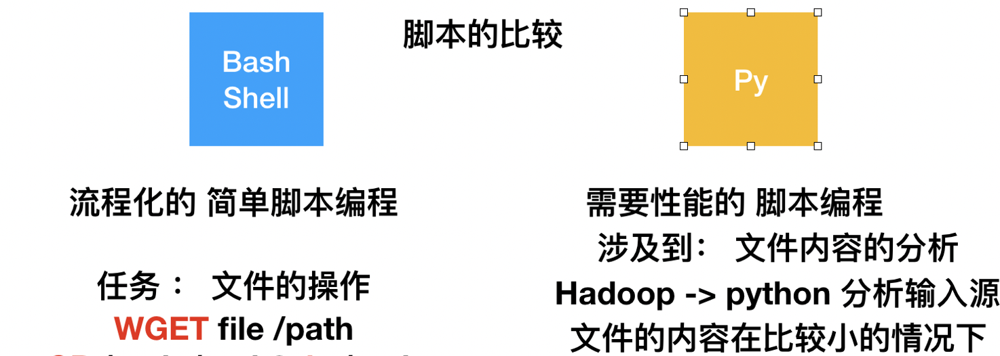

上面这张图，把bash脚本，和python脚本，各自擅长的领域做了一个介绍

*   Jenkins持续集成工具使用

Jenkins 鼎鼎大名的 使用java开发出来的 基于图形化界面的 持续化集成工具  
现阶段 只要是达到了中等规模的企业，一般都会优先考虑 引进Jenkins （因为速度快 且节约成本）

本门课程 我们会有一个阶段 单独学习 Jenkins的安装部署，以及中间的很多使用技巧

*   LNMP环境 和 开源站点搭建  
    为什么需要LNMP呢？ 持续化集成在企业中的运用，有相当大一部分 是为了统一化线上流程发布
    
*   测试相关概念

我之前也跟大家提过，运维 测试（白盒测试 python） 开发 铁三角关系 是雷打不动的  
测试工程师相关的技术 我们做运维的 也不能不懂

况且在持续集成当中，测试的观念 以及具体的技术 都是必不可少的 不然根本算不上一个完善的 持续集成自动化作业

\[jenkins的基本使用方法\]

jenkins是一个基于java的图形化的工具

请先确保你的Linux上安装了jdk

\[root@server01 ~\]# yum install java-1.8.0-openjdk\*

确保JDK之后，接下来 其实Jenkins安装很简单 如下使用yum即可  
（提问过： 什么时候 适合使用源代码编译的方式安装？ 只有线上环境 涉及到的各种软件 方便随时扩充编译模块 ， 线下环境 监控，自动化平台 ）

\[root@centos03 home\]# wget -O /etc/yum.repos.d/jenkins.repo [http://pkg.jenkins-ci.org/redhat/jenkins.repo](http://pkg.jenkins-ci.org/redhat/jenkins.repo)  
\[root@centos03 home\]# rpm --import [http://pkg.jenkins-ci.org/redhat/jenkins-ci.org.key](http://pkg.jenkins-ci.org/redhat/jenkins-ci.org.key)  
\[root@centos03 home\]# yum install jenkins

jenkins安装好以后， 可以使用netstats 命令查看 默认的8080端口的java是否开启

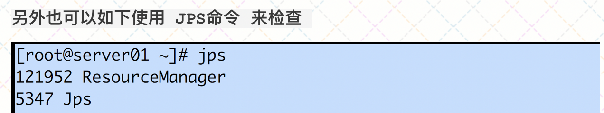

jenkins安装好了以后，service jenkins start 即可， 默认工作在 8080，直接浏览器访问即可

第一个页面 我们可以看到Jenkins提示，需要一个初始密码才能继续配置

下面也提示了，找到红色标记的那一行在Linux当中的配置，黏贴出来 就可以继续  
Unlock Jenkins  
To ensure Jenkins is securely set up by the administrator, a password has been written to the log (not sure where to find it?) and this file on the server:  
/var/lib/jenkins/secrets/initialAdminPassword  
Please copy the password from either location and paste it below.

之后 选择suggested Jenkins ，然后就如下图 开始安装了

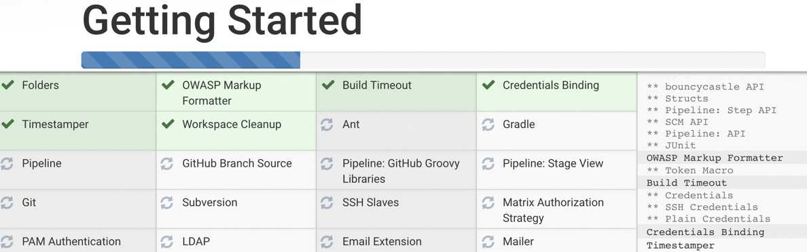

之后配置你的账号和密码， 然后一路点击即可 很简单

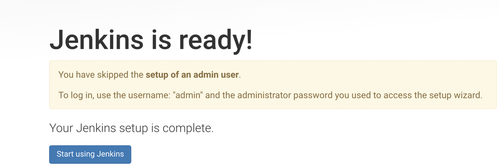

安装完毕之后，咱们就来到了 Jenkins的首页（登录之后）  
来到首页后 别的先别弄，先看中间有一个 create new jobs => 创建咱们的第一个任务

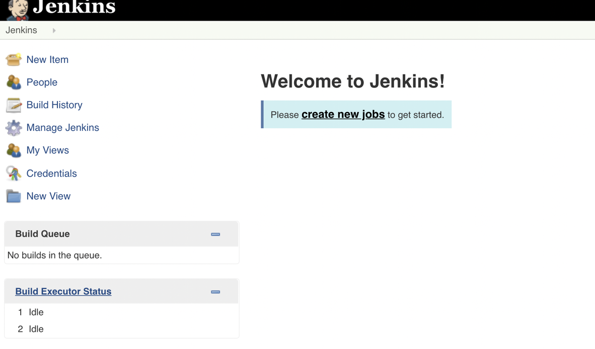

理解Jenkins当中的这个job 非常关键，它是Jenkins的核心，一切都是一个一个的任务(jobs)  
我们接下来先给 第一个job一个名字 ， 这里尽量使用英文名字 （中文名字也支持，但是后期不好管理，因为这些创建的jobs都会在Linux jenkins目录下存放 你也可以想象的到）

如下图所示，我们给咱们的第一个job 起一个名字 就叫job1就行了（在下图 第一条红线的地方）

接下来 咱们选择 Freestyle project （一般没有特殊需求 就选择这种类型的job即可）  
然后 点击最下面的 save 就OK了

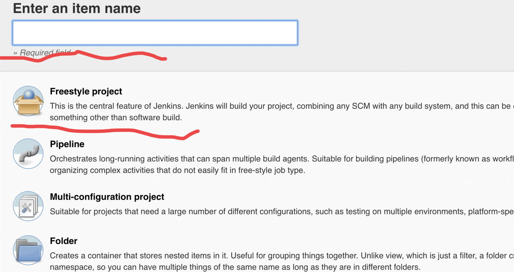

接下来 我们就可以进入 这个job01的配置界面了  
可以看到 一个job中 有很多可以配置 和 添加的地方 ，这里先不着急，就先设置一个最上面的 Description 随便写个简介就好（修改都记得 点击最下面的 save 保存）

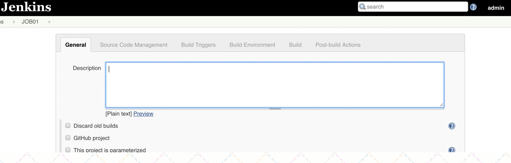

其他的地方 先不着急配置，我们先点击Jenkins页面左上角（如下图）回到首页  
然后，就可以看到 JOB01 显示在 任务列表当中

估计这里 大家还是没太理解， Jenkins当中 创建这些JOBs 都是做什么用的呢？

关于这个JOB的定义 ， 如果咱们的学员以前是做开发的，很可能会理解为， 哦 这个应该就是一个程序代码的工程吧 ？？  
这样的理解不能说是错误的，因为每个JOB中 确实都需要写代码(bash shell/ python)，但是 这个可不像编程中"工程" 那样的复杂 ， 比它简单太多了

看一下 下面这张图 给大家展示的内容 主要强调几点

*   首先Jenkins创建的任务(JOB)，一般都是在每一个任务中 添加脚本代码（例如 SHELL or Python）, 直接运行 也不需要什么编译流程
*   Jenkins的这些任务(JOBs) 与 任务之间 都可以通过很简单的方式(图形化的方式) 建立联系 建立关联 设置各种触发条件（parameterized remote trigger） 判断（比如 第一小节所说的 Hadoop任务步骤 都可以很轻松建立关联）
*   每一次任务的运行，都有运行历史的保留，不像你平时手动调用 bash.sh脚本 想留个记录就很麻烦的

其实你也可以想像，我们运维平时写的 bash / python 这些脚本都是命令行形式的  
如果想把脚本的调用变成图形化 这得多难啊！ 但是有了Jenkins以后，这就非常轻松的就可以实现了

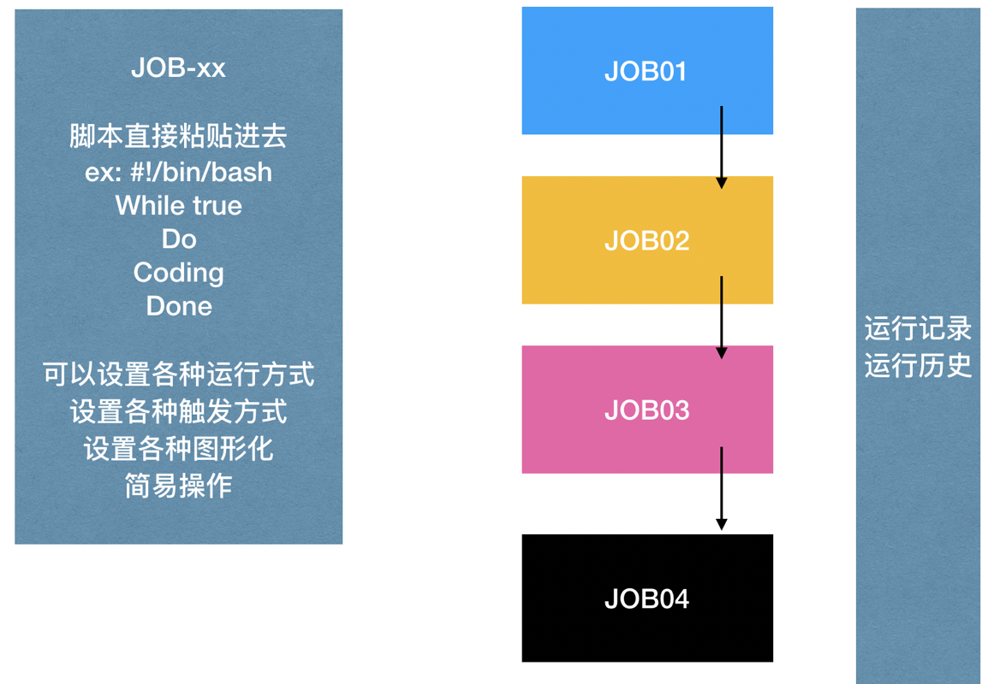

然后 我们先不着急给一个JOB添加脚本，我们得先给JENKINS安装一些之后会用到的 必要的插件  
选择最左边的Manage\_Jenkins ，然后再选择右边的 Manage Plugins(管理插件 ： 首次安装jenkins 选择模拟的推荐插件)

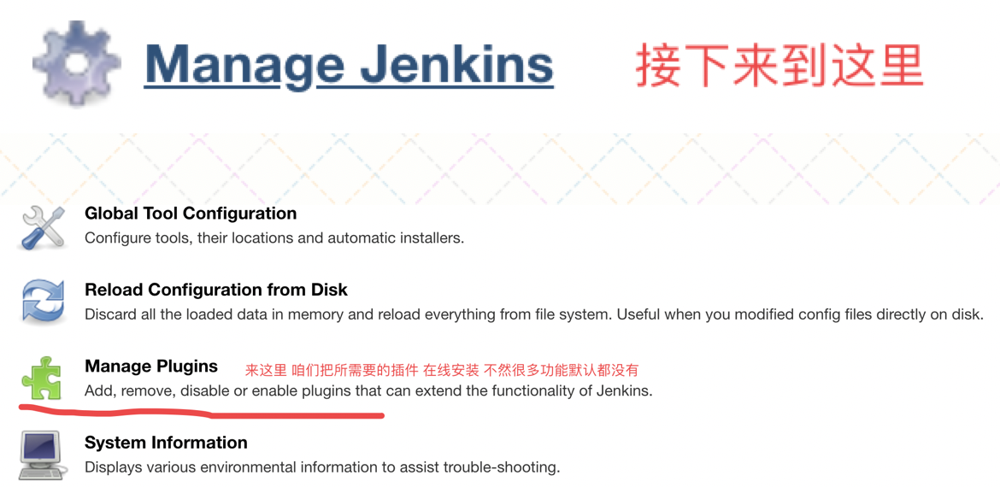

之后 就可以看到选择安装插件的界面了， 如下所示 ，多选勾选之后 点击最下面的安装即可  
我这里给大家推荐的插件 如下截图中  
（请注意，你也可以自行勾选安装别的插件，但是 我这里极不推荐都安装，因为很容易造成Jenkins的不稳定）

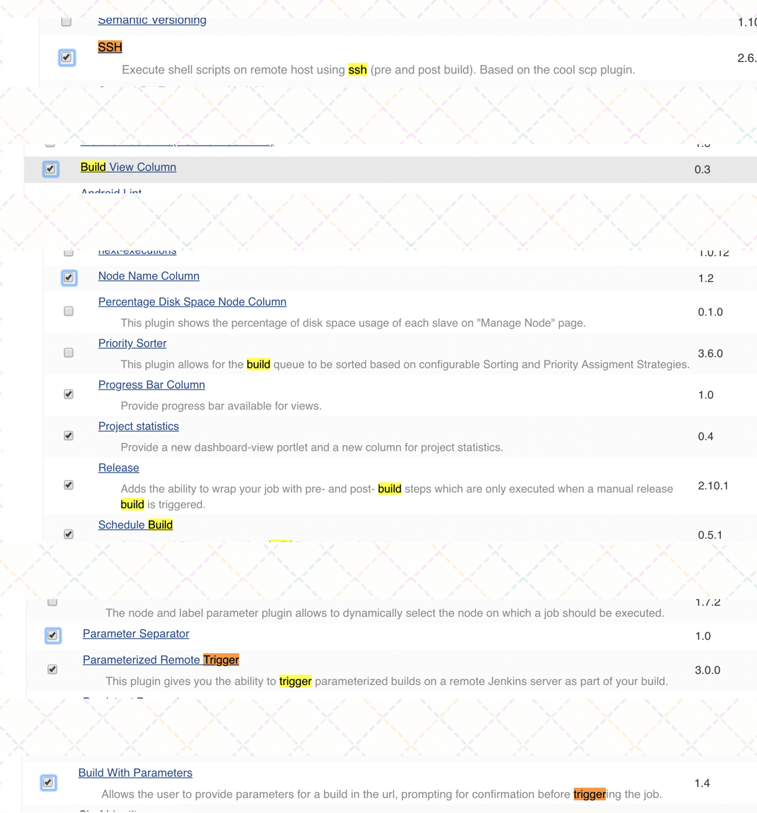

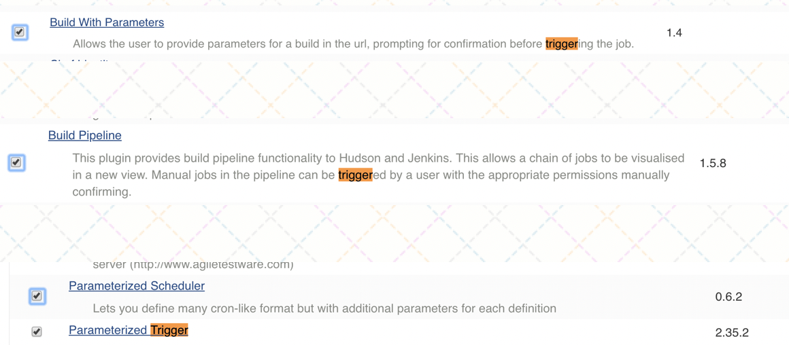

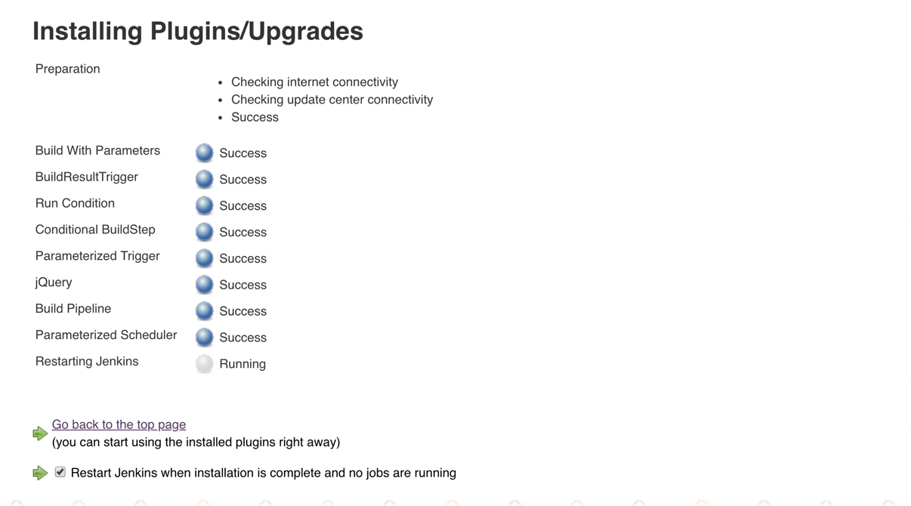

安装好插件以后，jenkins会在页面下面提示你，它会自动重启来生效

上篇就先学到这里
