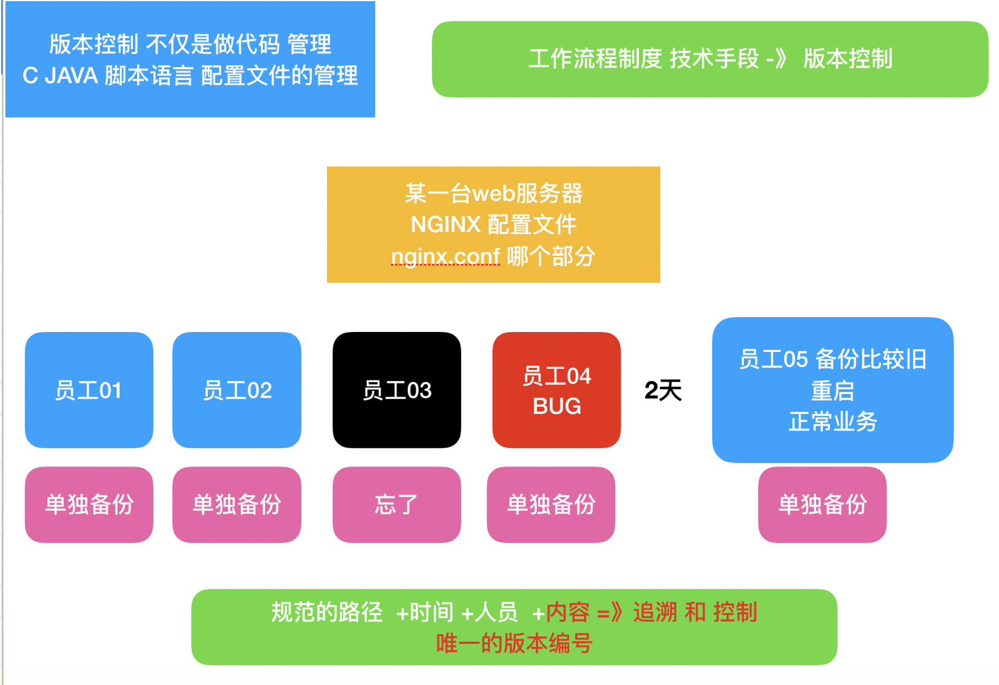
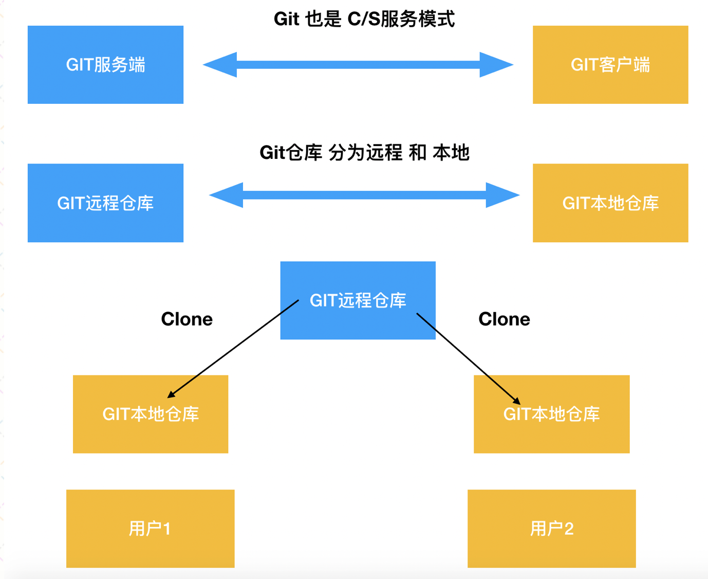
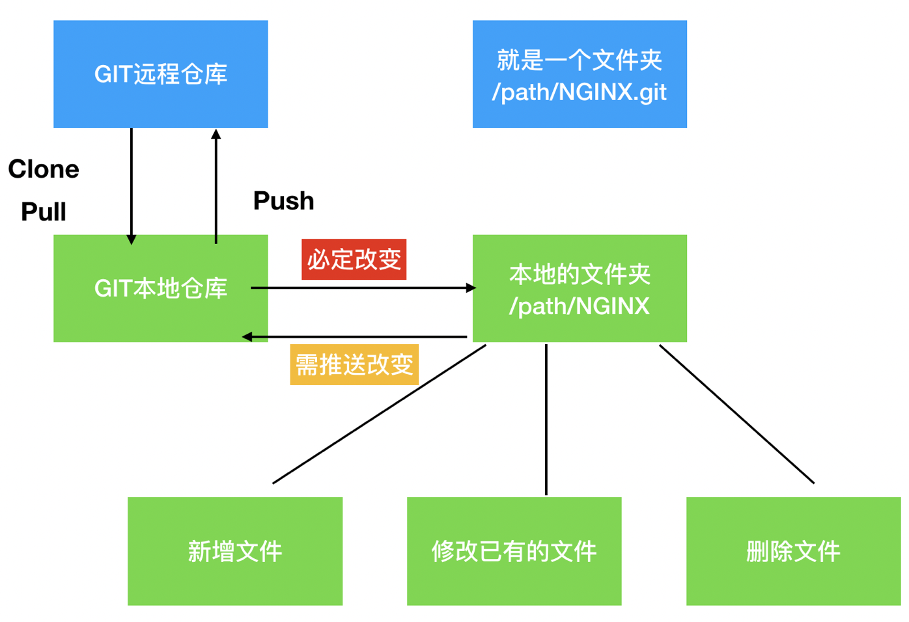
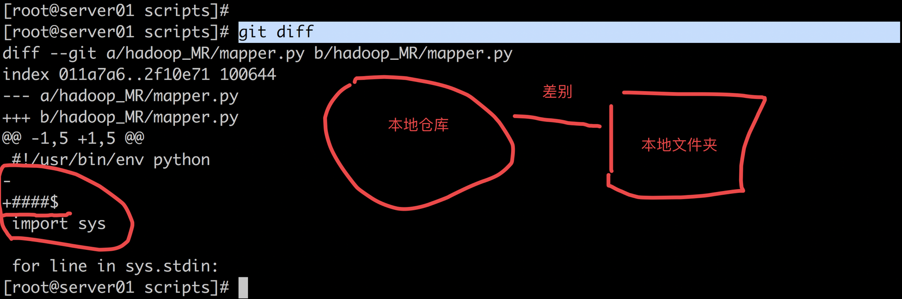
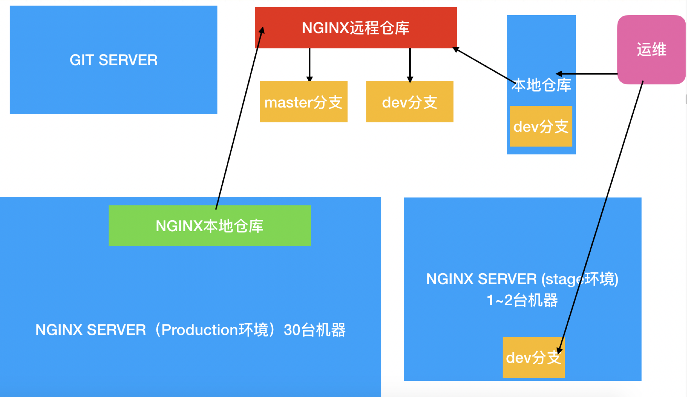
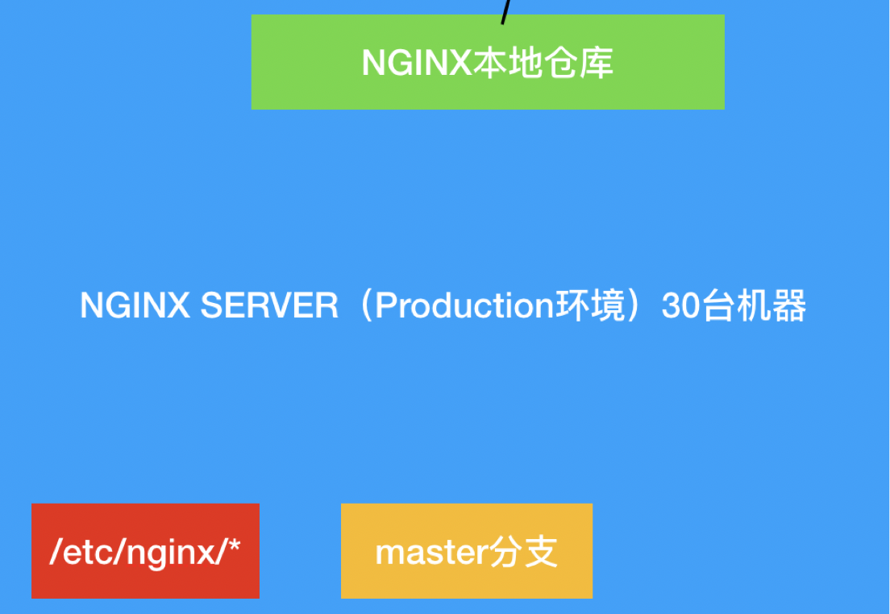
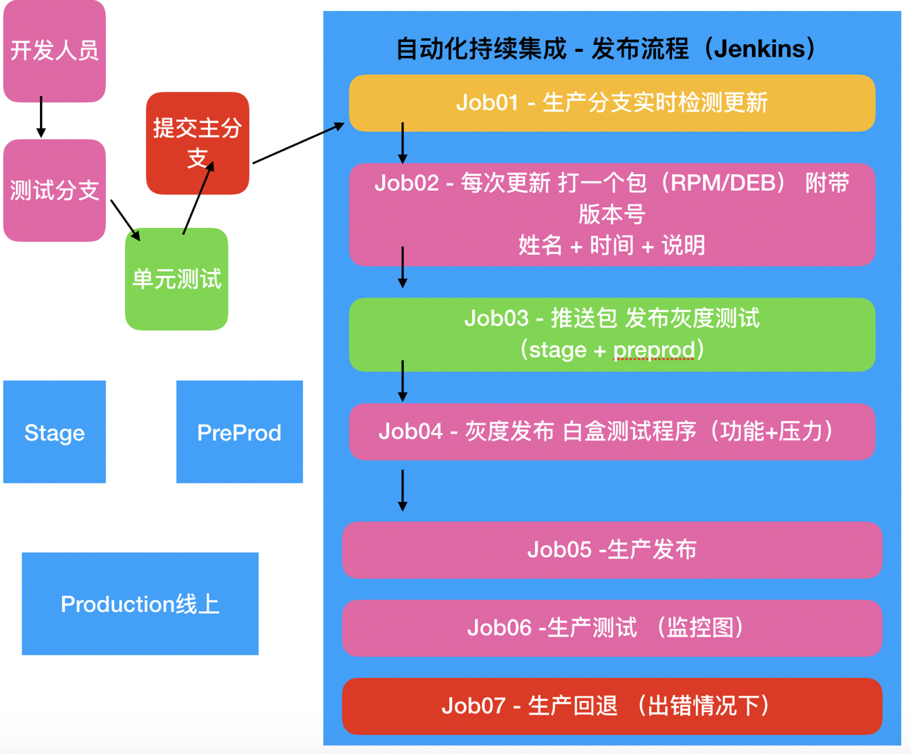

## 14.Nginx+Jenkins 学习自动化持续集成（中篇）

GIT版本控制的引入 以及和持续集成的重要关系

首先咱们先要解决的一个问题， 就是 为什么存在版本控制， 以及版本控制的重要的存在意义



在这一个小节中，我们必须先学习一下 GIT版本控制（CVS SVN）的使用方法 以及和持续集成的重要关系

本小节的任务： 学会GIT的基本概念， 以及GIT服务器搭建方法 ，把我们的持续集成中所有涉及到的脚本代码 以及一些配置文件 都要加入对应的仓库

GIT说白了 是版本控制的一种 而所谓的版本控制， 其实也就是 通过一种方式 把代码以及配置文件 有效的管理起来 有迹可循

\[GIT大体的工作模式\]  




如上图所示， GIT的基本工作原理

首先先要在服务端搭建GIT服务， 有了服务后，在创建一个仓库， 称作GIT远程仓库

用户通过 clone的方式，把远程仓库 拉取到本地一份， 变成本地仓库 ，两边在刚拉取下来的时候 是完全一致的

远程一个仓库 其实就是一个目录，仓库clone到本地后，也是同名称的 目录

用户在本地仓库所在目录中 不过执行什么操作（新增文件，修改文件，删除文件）其实都是跟GIT关联的，处于版本控制之下

仓库在刚刚创立时为空，用户需要先把本地仓库充实起来（新增我们需要的文件 进入版本控制），然后同步本地库 =>进而同步远程库

对于同一个远程仓库来说，任何一个其他的用户 都可以clone到自己本地，进行自己的修改 再推送



\[企业中 运维是怎么用GIT的（服务融合版本控制）\]





如上图所示，公司运维工程师 通过GIT 将线上NGINX配置文件 加入版本管理

管理的具体内容，其实就是 /etc/nginx/ （注意 这里是通过yum安装的nginx）下面的全部配置文件

GIT通过创建branch分支（一个分支 就是一个副本 一个镜像 互相独立）, 把 线上生产NGINX集群 和 一个小的 stage环境 分开

production 生产环境集群 是真正处理线上用户请求的 核心环境 ， 这里配置文件是取自 MASTER分支

stage 测试环境 是最小量的 ，一般没有用户请求，但是有一样的服务搭建（本例中 就是NGINX），用于任何改动下的 初步测试， 这里的配置文件 取自DEV分支  
b  
企业中并不是代码才需要版本控制，配置文件也一样需要， 只要是任何有可能被改动的文件，能引起故障的，都要受到版本控制的管理

当运维想修改 NGINX配置文件的时候，先把远程库NGINX.repo clone本地， 在dev分支中 任意修改 （或者 也可以直接登录 stage机器 在/etc/nginx/下， 确保在dev分支下 修改）

修改好以后，提交DEV分支，并在 stage机器上 拉取下来, 测试DEV分支 是否让nginx正常

测试没问题后，把DEV的分支新增加的内容，合并进入master分支(git merge , DEV:commit -> master)

之后，production环境把 master分支 同步到每一台nginx上

这里有几个隐藏问题：

1） master分支被更新后，如何让30台prod nginx 都更新呢？能想出几种方法？

```plain
30 => host.list 

for i in `cat host.list`
do

ssh "$i"   "cd /etc/nginx/ ; git branch | grep master ; git pull  ;  nginx -t ; server nginx reload"

done
```

2）如果发布production后，出了严重的问题，怎么立刻解决？

```perl
GIT 回退,  GIT本地仓库的回退 -> 本地文件也回退
git log --oneline -5  # git commit id
git reset --hard commit_id
```

3）如果在 30台 nginx 上 ， 切换了分支 会发生什么？

```coffeescript
/etc/nginx/ ;  git checkout dev
```

\[企业中 开发结合持续集成 是怎么用GIT的（版本发布的 起始点）\]



如上图所示， GIT 其实是作为 企业 持续化集成发布的 触发点

开发人员写好代码后，先提交测试分支，然后在单元测试服务器上 跑基本功能测试

没有问题后，合并测试分支 进入 主分支

持续化集成平台 是以任务和任务之间 先后顺序调度的形式 进行工作

先有第一个任务，实时检查master分支的更新，只要有了更新 就触发下一个打包任务

所谓的打包，是将开发人 希望发布的代码文件（也可能包括 开发配置文件等等）统一打成一个Linux包（RPM/DEB）

包 需要附带 人名，日期，内容

每次更新都要打一个包，但是并不一定是 每个包 都发布生产

需要发布的时候，先安装包 在灰度发布（stage 或者 preprod）

stage一般代表 没有流量的 简单功能测试 服务器  
preprod 代表有部分生产流量的 小规模集群

然后 白盒测试人员开发的程序 （代码输入输出测试 + 压力测试） 对 两个环境进行评估

Ok->继续发布生产 ， failed -> 回退灰度环境

发布生产后，需要再接上测试任务，如果失败 要全部回退

通过上面的学习内容 我们知道了 版本控制对整个研发团队至关重要 （其实对运维和测试 也很有用）  
那么咱们为了 让公司的研发团队尽快使用上GIT 运维的任务就要来了…

想用GIT 我们就得先有GIT服务 接下来的GIT\_Server的搭建方式 会很好的帮助大家 尽快在企业中把GIT服务在最短时间内 搭建起来 让开发兄弟们 点赞哦

