## 15.Nginx+Jenkins学习自动化持续集成（下篇）

\[git 服务器的搭建\]

— Git daemon 最轻型 git 服务器搭建

其实GIT服务器有简便又快捷的安装方式，这就是git-daemon.  
并不一定要依赖类似什么github,gitlab之类的平台  
如下操作：

```plain

yum install git git-daemon         # (直接yum安装就好 很简单)
```

接下来我们创建一个 空目录 作为 git server端的 仓库存储路径 并且给予权限

```coffeescript
[root@server10 ~]# mkdir -p /data/git/repo/
[root@server10 ~]# chmod 777 -R /data/
```

然后 我们通过 git daemon 启动进程  
附加detach参数 ： 是为让 git daemon以守护进程的形式 运行在后台  
附加enable=receive-pack 是为了 开启 git daemon的

```coffeescript

[root@server10 ~]# 
git daemon     --detach    --verbose  --export-all --base-path=/data/git/repo/   --reuseaddr             --enable=receive-pack        /data/git/repo/

[root@server10 ~]#
```

之后 我们就可以看到 一个默认端口工作在9418的 git daemon小型服务器就起来了

```ruby
[root@server10 ~]# netstat -tnlp
Active Internet connections (only servers)
Proto Recv-Q Send-Q Local Address           Foreign Address         State       PID/Program name
tcp        0      0 0.0.0.0:9418            0.0.0.0:*               LISTEN      2319/git-daemon
```

接下来 我们进入刚刚创建的 仓库目录  
再建立一个子目录 scripts.git (每一个不同的repo )  
（上面的 /data/git/repo 算是 git daemon server 的根目录， 根目录下的 子目录是对应每一个需求所建立的单独的repo仓库）

初始化一个 git版本库

```coffeescript

[root@server10 puppet.git]# cd /data/git/repo/scripts.git
[root@server10 puppet.git]#
[root@server10 puppet.git]#

[root@server10 puppet.git]# git init --bare #(初始化)
初始化空的 Git 版本库于 /data/git/repo/scripts.git/

[root@server10 scripts.git]#
[root@server10 scripts.git]# ls
branches  config  description  HEAD  hooks  info  objects  refs

git config daemon.receivepack true 

[root@server10 scripts.git]# git config daemon.receivepack true （这一步很重要  很多网上的文档说 git daemon时候加上—enalbe=receive-pack  就可以git push了， 但是实践证明 最后不做这一步 客户端还是不能push ）
```

有了这些文件之后 ， git daemon的服务端 我们就准备好了

—接下来 我们找一台 服务器当作 GIT 客户端

1） 执行git clone 从新建的服务端 把 .git 空仓库 拉下来

```php
git clone git://server01/scripts.git
Initialized empty Git repository in /opt/hadoop/scripts/.git/
warning: You appear to have cloned an empty repository.
```

2) 然后 进入这个 clone下来的目录 查看一下 远端的git信息

```ruby
[root@server01 scripts]#
[root@server01 scripts]# git remote -v
origin  git://server01/scripts.git (fetch)
origin  git://server01/scripts.git (push)
```

能看到远端的git仓库信息，就表示工作正常了

\[puppet server和持续集成的关系\]

puppet 是当今作为一名高级运维的必备技能，运维线下集群自动化的鼻祖, 发展到今天 puppet已经是作为一个企业中衡量运维线下集群管理自动化的其中一项很重要的指标，很多公司 面试的时候 直接就以puppet作为标准来衡量候选人的自动化理念是否合格

大米所经历的10几家企业中 有 7-8家企业都使用puppet做配置分发管理 （puppet范围 管理全部的运维）

puppet的年头也同样不短了， 互联网上各种关于puppet的学习资料 满天飞  
不过 一般的学习资料 都是比较零散的 且逐个一一 介绍puppet的各种语法细节 和资源定义

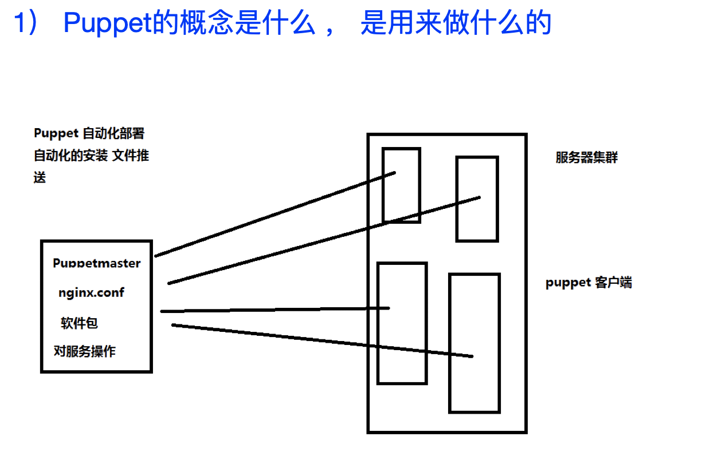

我们看一下 上面这张图  
其实 puppet 是一个基于ruby语言开发的 使用自有的puppet描述语言  
来实现 管理配置文件、用户、cron任务、软件包、系统服务等 这样一款实用配置分发管理技术

puppet 的工作模式 也是基于 C/S模型的服务（服务端 - 客户端）,  
服务端是 puppetmaster -> 负责定义和配置任务  
客户端 puppet -> 即是一个命令 也是一个服务service: 从puppetmaser主动拉取 服务端是被动的（面试中 经常被问到 puppet是主动拉取 还是推送）

puppet可以实现的功能很丰富 不过其最经典的 还是对集群的服务和配置文件的管理 （如上图中画的这样）

如上这样的定义 看上去还是有些笼统 我们接下来用更实际的例子 来说明 puppet到底做什么用的

2） Puppet对于Linux运维工程师来说 它的重要意义

上面我们介绍了puppet的基本概念  
接下来 咱们来看看puppet 在企业运维中 到底是如何发挥效用的

首先我们假设一个环境

企业中 有200+台服务器 全部安装Centos x64

运维在工作中 一个很基本的内容 就是管理所有服务器上的 用户账号(企业内部的员工)  
说到用户账号 那么Linux服务器 用的最多的 自然也就是 通过 ssh-key的方式 做登录认证

ssh-key的公钥　是需要被推送 到所有相关的服务器上的

那么假如 我们没有puppet这种配置分发管理技术 实用最原始的方法 如何来实现 这些ssh-key的推送和管理呢？

那么最原始的方法 自然也就是 运维写一个 bash 循环脚本

例如这样

```ruby

for i in `cat serverlist`
do

hostname="$i"
scp userdir/keynames*.pub $hostname:/tmp ; ssh $hostname "cat /tmp/keyname*.pub > ~/.ssh/authorized_key "

done
```

\--

这样子 原始的方法 运维自动化管理的方法  
第一 太low  
第二 很不灵活  
第三 不自动化

当然这里也要说明一下 (bash + Jenkins持续集成) ：

举个例子

一般来说 企业中（特别是那些 运维安全方面 规范比较严格的公司）  
对于 用户管理 sshkey的 还是很严格的

每个员工都必须有自己单独的ssh-key  
每个员工只能在 部分和自己工作内容相关的服务器上 有ssh-key登录的权限 （mysql DBA）  
一般除了 运维以外（运维是最高权限）其他任何员工 都不能有root的登录权限 su - root （使用sudo限定 cmd）  
一旦有新员工入职 或 老员工离职 那么需要运维在很短的时间内 就将 ssh-key部署到集群中生效（卸载或者安装）

那么这么多的要求 如果我们运维只使用这种 原始的shell脚本的话  
不是说不能实现 但是实在是太耗费没有必要的经历

有了puppet以后

对于上面举出的这个sshkey例子 就变得井然有序了

puppet的 专属ssh模块module 可以自行定义  
有哪些员工 分别登录什么机器 都可以被编入模块  
模块中 还可以划分子模块 -> 类和子类（之后会讲到） 这对同一个集群的 不同用户权限的划分 非常实用  
另外 一旦员工的ssh-key发生了改变，那么puppet会自动发现 并通知 puppet-客户端主动拉取更新 不需要人为干预

等等...

仅仅这一项ssh-key的功能 就能帮运维团队 节省下大量的时间和精力

那么 通过这一段的讲解 我们对puppet在企业中能起到什么样的作用 也有了一定的了解了

那么puppet这么实用的工具是用什么语言开发出来的呢？

我们看后续章节

3） Ruby是一种什么样的语言 用途在哪里

puppet ruby  
我们来看一下 Ruby的定义：

Ruby是一种纯粹的面向对象编程语言，一种通用的 开源的、解释的编程语言。

关于面向对象和开源的概念 咱们不需要过多解释了  
那么关于什么是 解释型的编程语言 在大米运维的高级服务篇 tomcat章节的 编程理念部分 有详细的介绍

另外 对于Ruby还有一个比较潮的称呼 有很多人叫它 ： 魔幻语言

根据语言本身的设计风格和拥护者的气质也可以把语言划分成“魔幻语言”和“简约语言“两类 （如下这段话来自其他博客评论）

所谓”魔幻语言“，主要代表作品有C++、Perl、Javascript和Ruby。  
这些语言拥有丰富的特性，聪明的技巧和意想不到的奇效，永远有发掘不完的技巧妙用

反过来，“简约语言”崇尚清晰直接 C、PHP、Python和Lua这一派语言的代表作。  
够用就行，要求从代码容易理解，宁可笨一点、累一点、多写一点代码，反对出人意料的技巧，反对故弄玄虚。

Ruby在目前阶段 还是处于一个新型的开始

有哪些应用领域呢？

准确的说ruby适合系统管理，和unix的shell结合起来用，系统管理员的最爱  
ruby语言本身可以实现日常工作的几乎任何功能，非常适合做测试语言 (puppet unit test )  
ruby on rails可以开发网站  
咱们课程的puppet 也是源自ruby语言 继承了ruby的这种魔幻特性 功能伸缩性很广  
除此之外 我本人也经历过 企业用ruby开发一些特殊的 前沿的产品 比如：人工智能 人脸识别 等等…

对于 ruby这门新型的活跃语言 我们就介绍到这里

需要提醒大家的是

puppet是基于ruby开发的 但是 我们日常工作中 所写的puppet code并不是ruby 而是一种 puppet自身的表示行语言 其写法比起脚本语言来说 更加简洁快速

4） Puppet基本语法 以及资源的定义方法

我们直接拿企业中 puppet自动化管理的一段 代码来演示一下

```php

class cron{                 #定义一个类叫motd
  package{ 'crontabs':    #定义package资源
    ensure => present,  #要求setup这个包处于被安装状态
  }

cron{node_exporter_jobs_1:
    command=>"cd /usr/local/node_exporter; bash /usr/local/node_exporter/node_exporter_shell.sh”, #
    user=>root,
    minute=>'*',
    require=>Package["crontabs"];
}

}
```

如上就是 一段取自企业中 用来定义cronjob的一小段puppet codes

个人总结看来，puppet语言形式上的特点就是“花括号分类，冒号声明，逗号结束

从上面这一段代码 我们可以看得出来 puppet自身的语言 其实是一种结果形式的  
严格来说 算不上是编程 只能说 一种配置的定义 或者说 用类似脚本的形式 定义需要被配置的资源 <=修饰

比如

```css

cron {

}
```

定义一种资源 这个资源的叫做 node\_exporter\_jobs\_1名字  
这个资源 其中的内容 其实就是 crontab job内容

然后 我们再来看 下面这两个例子

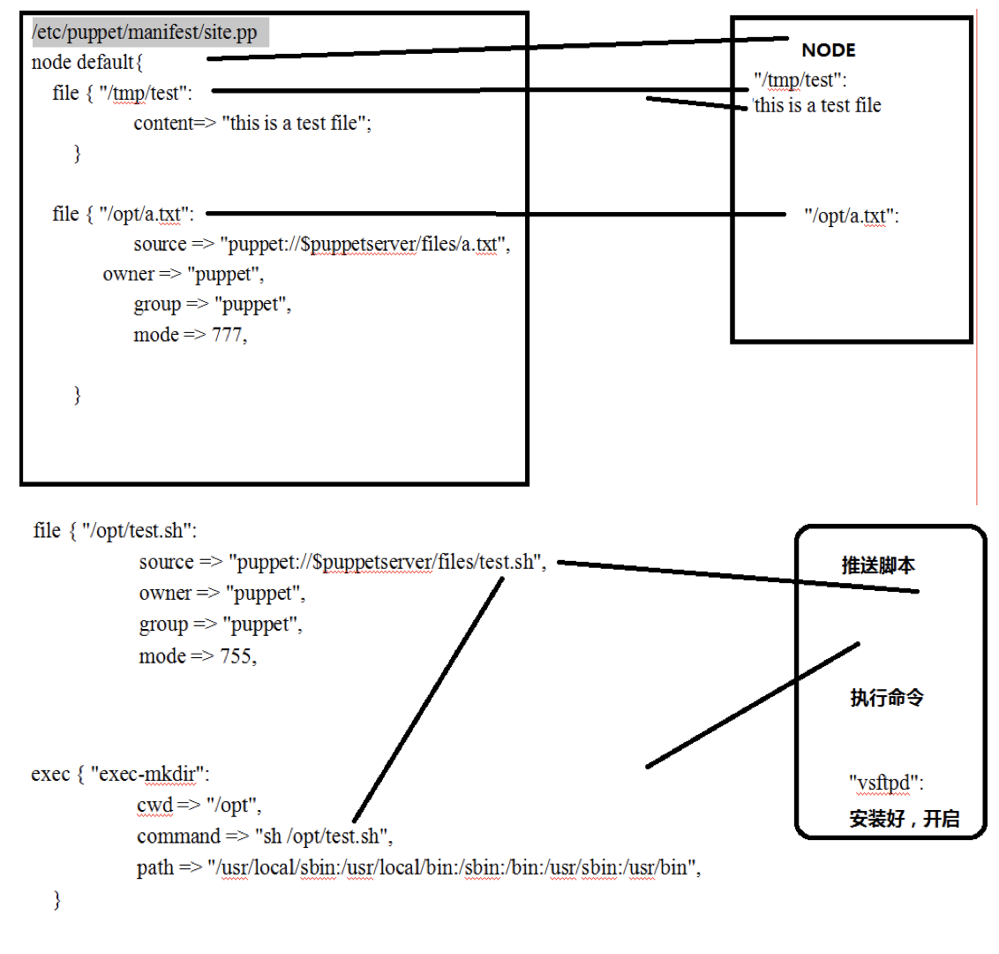

我们对 puppet语言 大概什么样子 已经有了一个初步了解  
为了 进一步掌握它的实际使用  
接下来 我们就要进入 安装配置流程了

5) Puppet服务端 客户端的安装 （重要）

为了更深入的学习 咱们先得把 它搭建起来 才行哦

我们之前已经提过了 puppet 也是基于 C/S 模型的

那么咱们从 安装puppetmaster开始 （服务端）

配置实验环境：server01(服务端) server02：（客户端）

在安装puppet之前  
我们必须先保证 2台服务器的 FQDN （完整机器名） 已经配置妥当  
并且 两台机器之间 可以使用对方的域名 直接ping通

```plain
/etc/hosts
/etc/hostname
/etc/sysconfig/network
reboot
```

这个非常重要 如果FQDN设置的有一点点不对， 那么puppet最终运行都会有问题 （如下这段话 来自其他文章）  
Puppet 要求所有机器有完整的域名（FQDN），如果没有 DNS 服务器提供域名的话，可以在两台机器上设置主机名（注意要先设置主机名再安装 Puppet，因为安装 Puppet 时会把主机名写入证书，客户端和服务端通信需要这个证书）,如果 已经配置了DNS服务器，那就不用改hosts了，如果没有就需要改hosts文件指定。

（这也是 我们在之前的第一阶段的系列课程中 为什么反复强调 FQDN的重要性 这里就是一个 典型的例子）

我们来预览一下 如果FQDN设置有任何不对的地方 会带来多少问题.. 如下图

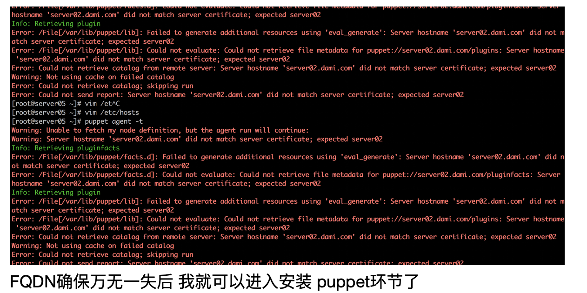

FQDN确保万无一失后 我就可以进入安装 puppet环节了

puppet的安装 大米推荐使用yum安装即可  
服务端的安装:

puppet不在CentOS的基本yum 源中，需要加入 PuppetLabs 提供的官方源：

```coffeescript
[root@master ~]# wget http://yum.puppetlabs.com/el/6/products/x86_64/puppetlabs-release-6-7.noarch.rpm
[root@master ~]# rpm -ivh puppetlabs-release-6-7.noarch.rpm
[root@master ~]#yum update
[root@master ~]# yum install puppet-server
[root@master ~]# chkconfig --list |grep puppet
 [root@master ~]# service puppetmaster start (pupetmaster , puppet )
```

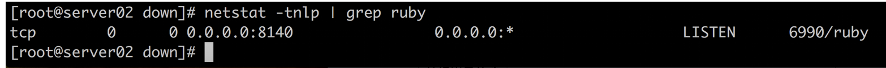

服务端端口 看到一个 ruby进程工作在 8140端口后 即可

接下来 就是安装客户端 第二台机器上 （注意 不要把 服务端和客户端 放在一台机器上测试 会有很多怪异的问题出现）  
在clients上安装puppet客户端

客户端的安装 其实仅仅只是 安装一个puppet命令而已  
另外 还安装了一个 puppet service 这个是个守护进程 运行在客户端后台  
时时监测 服务端的配置修改 然后主动拉取

```ruby
wget http://yum.puppetlabs.com/el/6/products/x86_64/puppetlabs-release-6-7.noarch.rpm
rpm -ivh puppetlabs-release-6-7.noarch.rpm
[root@node1 ~]# yum install puppet
[root@node1 ~]# chkconfig --list |grep puppet
puppet 0:off 1:off 2:off 3:off 4:off 5:off 6:off
[root@node1 ~]# chkconfig puppet on
[root@node1 ~]# chkconfig --list |grep puppet
puppet 0:off 1:off 2:on 3:on 4:on 5:on 6:off
```

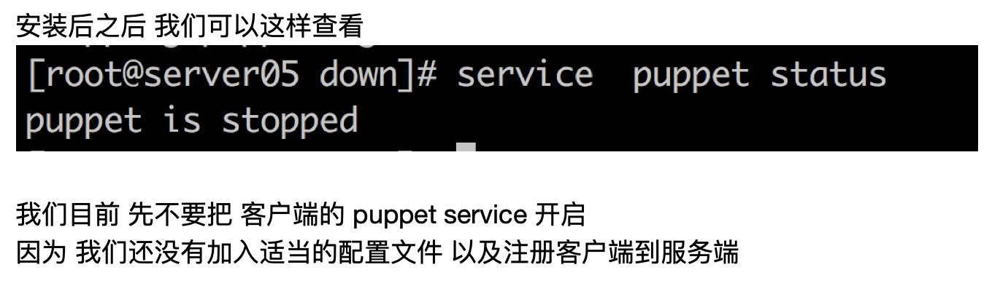

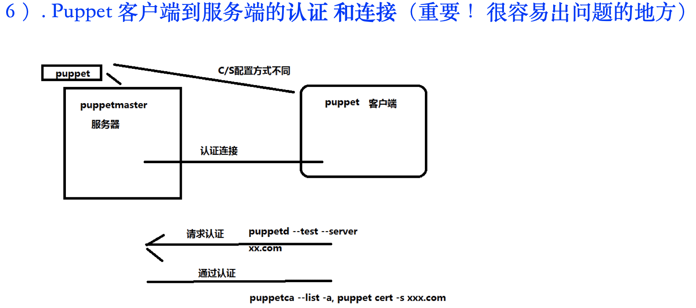

我们看下上面这张图 表示了一个 puppet客户端 到 服务端认证的一个流程

每一个新安装的 puppet客户端（一台服务器） 都需要走这个流程 把自己注册到puppetmaster（服务端）中 之后才能正常建立通信并运行

接下来 我们来看一下 具体的做法

确保 客户端和服务端直接 可以互相使用域名

```javascript
服务端
 /etc/hosts =>  192.168.56.105  server05.dami.com server05

客户端
/etc/hosts => 192.168.56.102  server02.dami.com server02

ping server05.dami.com
ping server02.dami.com
```

3) 保证 所有服务器的时间 都已经同步 ！ 重要！！

puppet => hostname + time

ntpdate + cronjob实现 时间同步

如果 任何一台服务器 时间没有同步 认证注册的时候 puppet都会爆出各种 稀奇古怪的错误！(缺点)

4） 然后 我们配置客户端

vim /etc/puppet/puppet.conf（客户端 服务端）

这个是客户端配置文件

在最后 确保有这么3行的配置

```makefile
certname = server05.dami.com  # (这是作为 自己的签到 名字 跟自己的FQDN一样即可)
server = server02.dami.com # （这是 连接哪个 puppetmaster 作为自己的服务端 和认证端）

runinterval = 60 # （多长时间 主动拉取一次 从服务端）

certname = server05.dami.com
server = server02.dami.com
runinterval = 60
```

5） 准备好如上这些步骤后 我们发起puppet客户端的注册

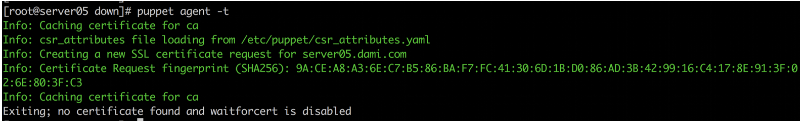

再次强调一边 这时候注意 不要开启 server puppet start !！！

我们需要先保证手动执行通过

在客户端 使用 puppet agent -t （一次性向 服务端尝试拉取一次 如果 是新装的客户端 这里也就先发起 注册申请）

这一步 没有问题后 我们去到 服务端

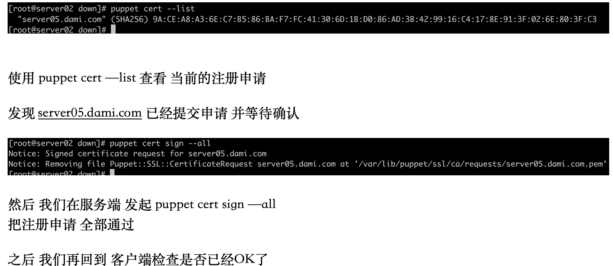

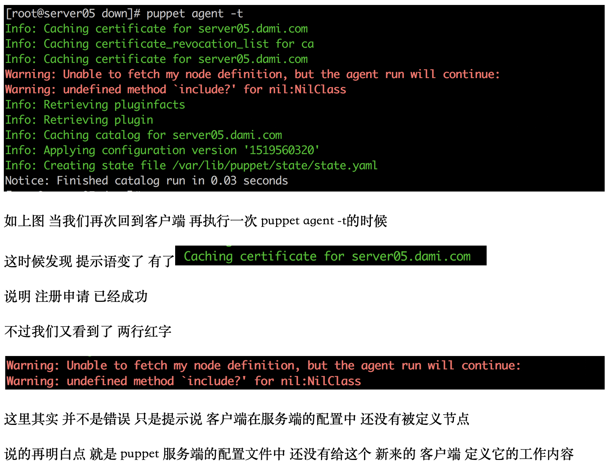  
这里没关系 我们下一个章节 会以企业中的实际案例 来解释 如何 开始 服务端的puppet 配置写法（也就是 puppet语言的开始）

7 ） 企业实例一 定义 puppetmaster 的manitests 设置集群节点 （puppet代码的开始）

第一步：设置 node节点的定义 （把每一个puppet客户端 都称作一个node 并分别定义在 puppet服务端代码文件中）  
我们回到服务端

找到这个路径

cat /etc/puppet/manifests/site.pp  
这个就是 puppet服务端 我们要学习的第一个 puppet代码文件  
site.pp =》 头节点的定义

在 site.pp中 企业中定义的内容如下

```php
node 'web6.company.com'{
  include  basic
  include  ssh
  include  cron
  include  firewall
  include  php
  kernel::sysctl {'web6.company.com':
  tcp_max_tw_buckets => 5000 ,
  tcp_max_syn_backlog => 1000 ,
}
  php::php-fpm {'web6.company.com':
  pm_max_children => 400 ,
  pm_start_servers => 100 ,
  pm_min_spare_servers => 30 ,
  pm_max_spare_servers => 100 ,
  pm_max_requests => 2000 ,
}
}

node 'web7.company.com'{
  include  basic
  include  ssh_web4578
  include  cron
  include  firewall
  include  php
  kernel::sysctl {'web7.company.com':
  tcp_max_tw_buckets => 5000 ,
  tcp_max_syn_backlog => 1000 ,
}
```

上面 标红的部分 node ‘xxxx’  
就是 定义一个新的 客户端节点 （使用FQDN）

还记得上面 当咱们配置好 客户端认证后 执行puppet agent -t的时候

报出一个

  
这里的错误 其实指的就是 这台客户端 在 site.pp中找不到 这么一个 node+FQDN的定义

然后再往后 蓝色的部分 下面

```makefile

  include  basic
  include  ssh
  include  cron
  include  firewall
  include  php
```

这里是 给这一个node节点（客户端） 都推送具体什么内容

include + 模块的名称/类名称 （什么是模块 什么是类 class 我们之后会讲到）

在这里 我们就认为 include basic => 给这台客户端需要推送 一个叫basic的模块 （其中定义了很多 Linux的基本配置）  
include ssh => 给这台客户端需要推送一个 叫ssh的模块 （专门定义 ssh配置的 模块 比如 ssh-key有哪些 等等 我们之前也举过这个例子）

8） 企业实例二 定义 puppetmaster 需要的模块（module） 模块是 企业中 puppet实用的最重要的核心之一

上一个阶段中 我们提到了 模块的概念

接下来 我们来细说

```makefile

  include  basic
  include  ssh
  include  cron
  include  firewall
  include  php
```

我们就拿 include ssh来说吧

我们在服务端 先找到 /etc/puppet/modules/ 这个路径  
模块就定义在这个下面

每一个模块 需要一个单独的目录

一个模块 是某一项功能的推送

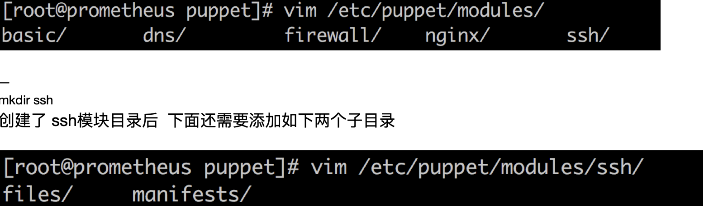

manifests/ 是这个模块的 puppet\_code (功能代码)  
也就是 这个模块都有什么内容 以什么方式推送给客户端 都在这里定义

files/ 是资源目录 。  
任何在 manifests/ 中定义的puppet代码 ，其中如果需要发送一些 文件file{}（比如发送一个ssh-key.pub文件 过去）  
那么 这个文件就需要 放入这个files/目录下 算资源的存储

接下来 咱们看下 manifests/ 下面都有什么

```php
cat /etc/puppet/modules/ssh/manifests/init.pp

class ssh{                 #定义一个类叫motd
  package{ 'openssh-server':    #定义package资源
    ensure => present,  #要求setup这个包处于被安装状态
  }

  file{ '/home/user01/.ssh/authorized_keys':  #定义file资源
    ensure  => present,  #要求file文件处于存在状态
    owner   => 'user01', #要求file文件属主为root
    group   => 'user01', #要求file文件属组为root
    mode    => '0644', #要求file文件权限为644    modules/ssh/files/authorized_keys
    source  => "puppet://$puppetserver/modules/ssh/authorized_keys" ,
    require => Package['openssh-server'], #要求文件被配置之前先执行package资源
  }
}

class ssh{                
  package{ 'openssh-server':    
    ensure => present,  
  }

  file{ '/home/user01/.ssh/authorized_keys': 
    ensure  => present,  
    owner   => 'user01', 
    group   => 'user01',
    mode    => '0644', 
    source  => "puppet://$puppetserver/modules/ssh/authorized_keys" ,
    require => Package['openssh-server'], 
  }
}
```

关于上面的 这一段 ssh模块的定义 咱们来拆分讲解

首先 manifests/ 下 至少要存在一个 init.pp (作为起始模块的定义)

init.pp中 最少要存在一个 类(class)  
在上面的例子中 就是 class ssh {}

puppet中的类 是一块功能的/资源的 集合  
这个集合 可以被 其他地方二次调用 （ 比如 : site.pp的 include ssh 就是这样调用）

puppet在定义出第一个类之后 ， 就可以开始 在这个类下 {} 添加我们具体的puppet代码内容

下面是类中的 第一个内容 package{} 是 定义一个包资源  
这里的意思是 确保 openssh-server这个rpm包 存在于客户端上

```perl
  package{ 'openssh-server':    #定义package资源
    ensure => present,  #要求setup这个包处于被安装状态
  }
```

下面 是类中的 第二个内容

file {} 是定义一个文件资源

创建 '/home/yd/.ssh/authorized\_keys’ 文件  
确保文件的各种 属性  
以及文件具体的内容是什么 source => "puppet://$puppetserver/modules/ssh/authorized\_keys" ,  
红色的部分 其实 对应的就是 files/下的 资源文件 authorized\_keys

需要 把这个 真正要被推到客户端的 authorized\_keys 文件 ， 事先存放到 files/ 目录下

```php

  file{ '/home/root/.ssh/authorized_keys':  #定义file资源
    ensure  => present,  #要求file文件处于存在状态
    owner   => ‘root', #要求file文件属主为root
    group   => ‘root', #要求file文件属组为root
    mode    => '0644', #要求file文件权限为644
    source  => "puppet://$puppetserver/modules/ssh/authorized_keys" ,
    require => Package['openssh-server'], #要求文件被配置之前先执行package资源
  }
```

这样 我们就定义好了一个 ssh{} 模块

接下来 咱们实际演示一下

9） 企业实例三 引入 puppet类以及子类 （对于企业集群细分 非常实用）

我们先来看一个 企业中 puppet子类的定义示例

```plain
modules/elk/ 
ELK 

class elk{                 #定义主类 叫ELK

    file{ "/tmp/filebeat-1.2.3-x86_64.rpm":
        ensure => present,
        mode => 644,owner => root,group => root,
    source  => "puppet://$puppetserver/modules/elk/filebeat-1.2.3-x86_64.rpm",
    before => package["filebeat"],
        }

    file{ "/etc/pki/tls/certs/logstash-forwarder.crt":
    ensure => present,
        mode => 644,owner => root,group => root,
        source  => "puppet://$puppetserver/modules/elk/logstash-forwarder.crt",
    before => file["/tmp/filebeat-1.2.3-x86_64.rpm"],
    }

    file{ "/etc/filebeat/filebeat.yml":
        ensure => present,
        mode => 644,owner => root,group => root,
        source  => "puppet://$puppetserver/modules/elk/filebeat.yml",
      #subscribe => package["filebeat"],
        }

    file{ "/etc/filebeat/conf.d":
        ensure => directory,
        mode => 755,owner => root,group => root,
        #after => package["filebeat"],
        }

  package{ 'filebeat':    #定义package资源
    ensure => present,  #要求setup这个包处于被安装状态
    provider => rpm,
    source => "/tmp/filebeat-1.2.3-x86_64.rpm",
    before => file["/etc/filebeat/filebeat.yml"],
  }

}
class elk{}
class elk::nginx {

    file{ "/etc/filebeat/conf.d/nginx.yml":
        ensure => present,
        mode => 755,owner => root,group => root,

        source  => "puppet://$puppetserver/modules/elk/nginx.yml",
        }
    exec { "filebeat-restart":
       command => "/sbin/service filebeat restart",
       provider => shell,
         subscribe   => File["/etc/filebeat/conf.d/nginx.yml"],
           refreshonly => true
    }

}

class elk::apache {

    file{ "/etc/filebeat/conf.d/apache.yml":
        ensure => present,
        mode => 755,owner => root,group => root,

        source  => "puppet://$puppetserver/modules/elk/mq1.yml",
        }
    exec { "filebeat-restart":
           command => "/sbin/service filebeat restart",
           provider => shell,
           subscribe   => File["/etc/filebeat/conf.d/mq1.yml"],
           refreshonly => true
        }

}
```

上面 是一大段 企业实际的puppet code  
本身是一个 ELK module ，用来给客户端推送 ELK所需要的 日志采集客户端  
（ELK分布式日志 后期会在 大米运维课堂 的第四大阶段 推出 , 目前第二阶段无）

在这个模块中， 定义了一个主类 两个子类  
分别是 从上到下 elk {} , elk::nginx{} , elk::apache{}

elk {}是主类

elk::nginx and apache 是两个子类

在puppet代码中 子类是主类的 一个分支

为什么这里 必须要用到 子类的功能呢？

因为 elk 本身这个模块 是用来给 客户端推送数据采集软件的（filebeat）

elk{} 主类： 是负责一个基本的推送 也就是安装 filebeat到所有 调用 elk{}的 node节点（在 manifests/site.pp中定义）  
不管 是哪一台服务器 都需要使用 ELK的日志收集

```css

elk{}
elk::nignx{}
elk::apache{}
```

定义两个子类 是因为： 对于 nginx集群的服务器来说 elk需要采集的是 nginx的特定位置和格式的 日志文件  
对于 apache集群的服务器 也是一样的

所以 不同的两个集群 通过 elk{} 主类 先把最基本的 ELK客户端装上 这儿没有区别

然后 不同的两个集群 针对自己 日志格式和位置的不同 分别用 子类 定义自己集群的单独 ELK客户端配置文件

所以 子类在这个地方 就发挥了 很好的作用

另外 ： 在这儿 再给大家举一个 企业中 曾经因为 没有使用 子类的功能 很糗的事

企业中 ssh模块配置的一个例子

```plain

class ssh{}

class ssh::log{}

class ssh::apache{}

puppetmaster 
puppet]# ls modules/ | grep ssh
ssh
ssh_log
ssh_apache
ssh_mysql => DBA ssh-key
```

这里看到了么 企业中 集群不止一个  
不同的集群之间 （甚至 同一个集群中 不同的机器）  
都有可能需要对 分发的  
由于没有使用 子类的功能

针对不同的集群的ssh需求的不同  
只能是 分别 定义多个 ssh模块 来实现

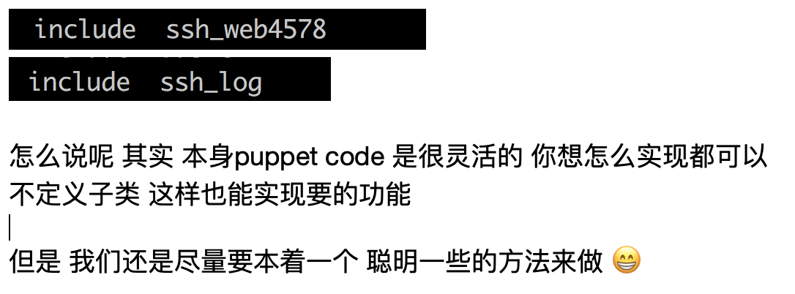

我们的持续集成和puppet就讲这么多
