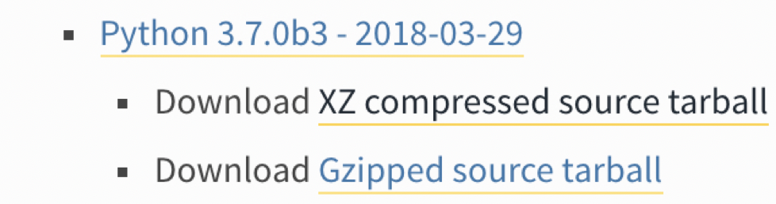
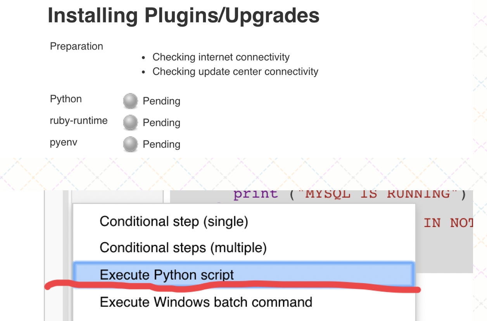
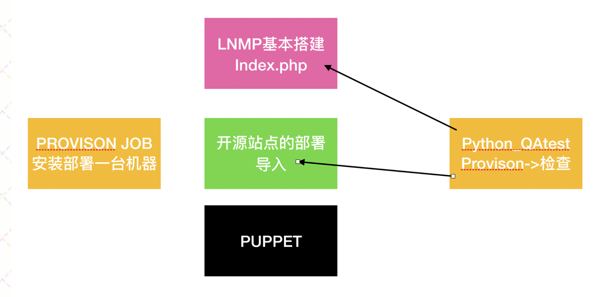
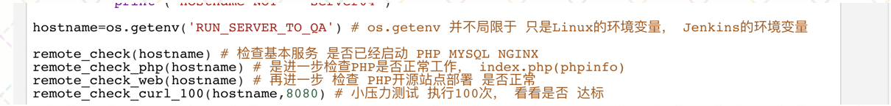
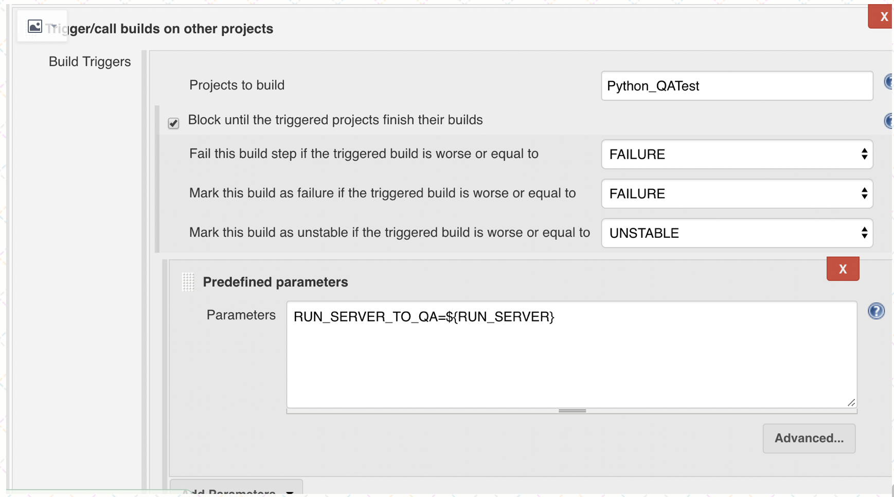
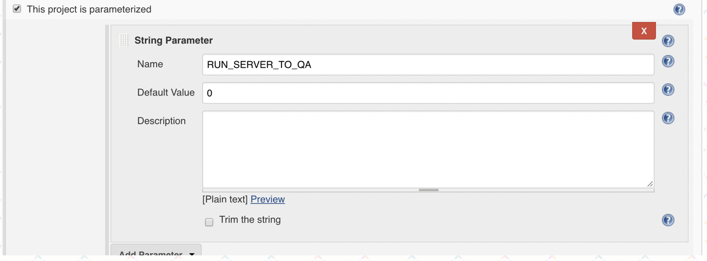
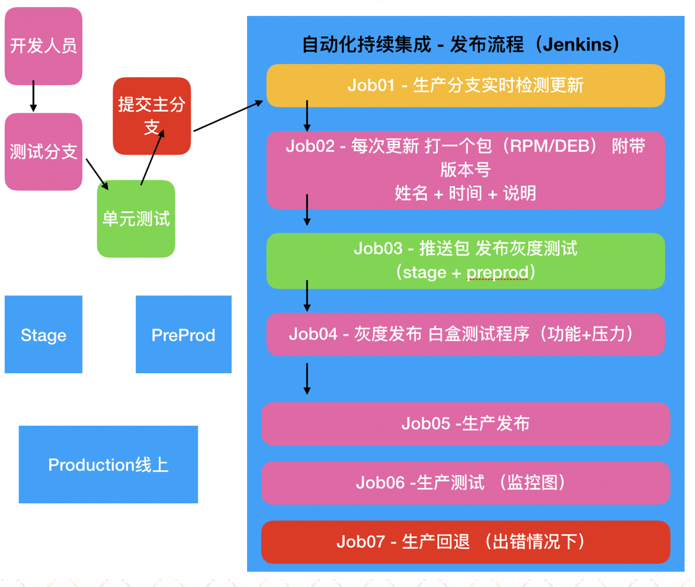

## 16.Nginx和Python白盒测试

# \[什么是白盒测试\]

提到测试工程师，我们不陌生， 不过测试到底是什么含义呢？  
其实测试的基本原则 就是检验I/O (输入输出 针对代码 或者 是针对产品功能）  
比如 LNMP环境的创建，以及后续的开源站点部署，站点部署好以后，用户的访问就是input（输入），结果的返回就是output（输出）  
接下来 我们把检测一个LNMP环境 以PYthon来做， 并且加入持续集成中

不管是安装还是部署，只要是有了改动 就一定需要经过测试，不是说放上去了就万事大吉了  
（如果是真实的企业环境部署 一旦出现纰漏 都有可能直接引起线上使用问题）

这就需要测试了，而测试工程师 一般分为 黑盒/白盒测试  
黑盒就是外围的应用功能测试(APP bug fix, QA 逐一进行应用测试 模拟用户的使用流程)  
白盒指的是代码和系统级别的测试（要求必须熟练掌握 一定的脚本变成 ， 对代码的流程 需要有一定的认知）

在我们的持续集成课程中，出马的自然是白盒测试咯，因为我们需要对安装的环境，部署的站点 进行测试（后续 还有增量的代码更新 也需要测试）  
而白盒测试使用的语言 可以说Python为主 因为大多数情况下 测试的量较多 开发速度也得快 对性能有要求 （Java）

接下来咱们就来模拟一下 持续集成中 白盒测试做的工作  
我们先得安装python3.x (Centos 默认都只是自带 python 2.x )

[https://www.python.org/downloads/source/](https://www.python.org/downloads/source/) 下载python3.x

# \[python\]



`[root@server01 down]# wget https://www.python.org/ftp/python/3.7.0/Python-3.7.0.tgz`

选择 source tarball

接下来我们进行安装 （我们的安装方法 是2.x 3.x 共存的 安装在 /usr/python/ 避免覆盖）

# 先提前安装好如下的 依赖包

`yum install libffi-devel -y ; yum install gcc-c++ zlib zlib-devel -y`

# 接下来 我们解压Python3.7 并安装

```ruby
[root@server01 down]# cd Python-3.7.0b3

./configure --prefix=/usr/python

make ; make install
```

如上即可

安装好以后 路径如下

`/usr/python/bin/python3.7`

做一下软连接， python3 python2 都有了

```ruby

 cd /usr/bin/ &&  /usr/python/bin/python3 python3
```

上面的python3的安装 ， 基于Linux下 （server01 -> Jenkins server）

安装一下 jenkins的两个 python插件



python 脚本 我们添加如下

```python
#! /usr/bin/python3

import os

def remote_check(hostname):
    str1=hostname
    #print (str1)
    cmd_line="sudo ssh" + ' ' + str1 + ' ' + "netstat -tnlp"
    print ("run cmd is :" , cmd_line)

    cmd_re=os.popen(cmd_line).readlines()
    if 'nginx' in str(cmd_re):
       print ("NGINX IS RUNNING")
    else:
       print ("NGINX RETURN IN NOT RUNNING!!!!")
       os._exit(1)

    if 'php-fpm' in str(cmd_re):
       print ("PHP IS RUNNING")
    else:
       print ("PHP RETURN IN NOT RUNNING!!!!")
       os._exit(2)

    if 'mysqld' in str(cmd_re):
       print ("MYSQL IS RUNNING")
    else:
       print ("MYSQL RETURN IN NOT RUNNING!!!!")
       os._exit(3)

def remote_check_php(hostname):
    str1="sudo ssh" + ' ' +  hostname
    print (str1)
    cmd_line=str1 + ' ' +  "curl -q http://127.0.0.1:8080/index.php | grep -i -o --color 'php version 5.6'"
    print ("run cmd is :" , cmd_line)
    cmd_re_1=os.popen(cmd_line).readlines()
    print (cmd_re_1)

    if 'PHP Version 5.6' in str(cmd_re_1):
       print ("PHP index.php IS FUNCTIONNING")
    else:
       print ("PHP index.php IS NOT OK!!!!")
       os._exit(4)

def remote_check_web(hostname):
    str1="sudo ssh" + ' ' +  hostname
    print (str1)
    cmd_line=str1 + ' ' +  "curl -q -I http://127.0.0.1:8080/php/wstweb/  | grep 'HTTP/1.1 200 OK'"
    print ("run cmd is :" , cmd_line)
    cmd_re_1=os.popen(cmd_line).readlines()
    print (cmd_re_1)

    if 'HTTP/1.1 200 OK' in str(cmd_re_1):
       print ("PHP WEB IS FUNCTIONNING")
    else:
       print ("PHP WEB IS NOT OK!!!!")
       os._exit(4)

def remote_check_curl_100(hostname,port):
    curl_str1="curl -q -I  "
    curl_url="/php/wstweb/"
    cmd_line=curl_str1 + hostname + ':' + str(port) + curl_url
    print ("run cmd is :" , cmd_line)
    HTTP_CODE_LIST = []
    HTTP_CODE_200_SUM = 0

    for i in range(0,100):
        cmd_re_1=os.popen(cmd_line).readlines()
        if 'HTTP/1.1 200 OK' in str(cmd_re_1):
            HTTP_CODE_LIST.append('200') 

        #print (cmd_re_1)
    for k in range(0,100):
        if HTTP_CODE_LIST[k] == '200':
           HTTP_CODE_200_SUM = HTTP_CODE_200_SUM + 1
           print  (HTTP_CODE_200_SUM)

    HTTP_CODE_PERCENTAL =  (HTTP_CODE_200_SUM / 100) * 100

    if HTTP_CODE_PERCENTAL < 98:
       print ("HTTP_CODE_PERCENTAL < 98 NOT ACCEPTABLE AND EXIT")
       os.exit(98)
    else:
       HTTP_CODE_PERCENTAL_RESULT = str(HTTP_CODE_PERCENTAL) + '%'
       print (HTTP_CODE_PERCENTAL_RESULT)
       print (hostname)
       if hostname == "server04":
          cmd_git_commit="cd /var/lib/jenkins/workspace/GIT_CODING_TRIGGER/php/ ; sudo git checkout master ; sudo git pull  ; sudo git merge stage ; sudo git push origin master ; sudo git checkout stage"
          git_re=os.popen(cmd_git_commit).readlines()
          print (hostname)
          print (cmd_git_commit)
       else:
          print (hostname)
          print ('hostname NOT == server04')

hostname=os.getenv('RUN_SERVER_TO_QA')
remote_check(hostname)
remote_check_php(hostname)
remote_check_web(hostname)
remote_check_curl_100(hostname,8080)
```

这一段脚本，我们大致讲解一下

主要是使用os.popen的方式，把命令行直接送到linux上执行

然后，在测试的部分，我们主要依据的是，多少次的访问请求中，多少可以正常返回

然后，计算一个最终比例。用这个，来代表测试结果

# \[白盒测试和持续集成\]



上面这张图 给大家把 这一个单元的任务 做出了一个规划

之前已经完成的provion\_instance job , 现在 我们需要 一个测试的JOB 调用PYTHON3 去检测之前 是否成功

如上这段脚本 请先注意 最后 红色的这一句， 获取环境变量 RUN\_SERVER\_TO\_QA（很重要 Python如何在Jenkins中获取 环境变量）



这个RUN\_SERVER\_TO\_QA 其实就是取自上游任务PROVISION\_INSTANCE的参数设置， 安装的是哪个机器，就把这个机器名当参数 传给这个PYTHON\_QATest JOB

这个任务 先检查远程机器在provision安装后 几个服务进程端口 有没有起来

然后 再进一步检查 PHPINFO 是否可以正常工作  
最后检查 部署的开源站点 是否工作正常

另外 脚本的最后 还有一个函数 remote\_check\_curl\_100  
这个的作用 循环从本地发起 向目标主机100词 curl请求， 如果返回100次请求中的200返回码百分比 低于98% 则测试返回失败

上游的provision 添加如下的配置 在BUILD中 再增加一项 选择 如下

  
这个添加的触发下游任务， 跟以前有点不一样了， 首先是在BUILD中添加 不再是POSTBUILD

另外， 注意 上面的配置内容， 勾选 BLOCK UNTIL ....., 意思是说， 当前的provision任务 运行了脚本安装后， 并不立刻结束， 需要等待下游的QA\_TEST任务运行完 且没有问题的情况下， 才结束

如果下游的Python\_QA\_TEST没有通过， 则这个任务 也失败

这种设置 下游的方法 在企业中很实用， 作为一种 利用下游任务 检查上游的方法

然后 Python\_QATest JOB 也需要接受这个参数

  
到这里， 我们的Provision\_JOB + Python\_QA 已经完善了 一个新LNMP实例的任务

光有LNMP还不行， 我们还得把开源站点的部署加入持续集成 ， 这里也是模拟 企业发布上线的流程

接下来 我们再新建三个Jenkins JOBs ， 分别叫做，GIT\_CODING\_TRIGGER, Deploy\_stage 和 deploy\_prod

从名字 我们也可以看得出来， 一个任务是用作发布测试环境， 一个任务是发布生产（也就是真实上线了）

咱们之前 在GIT的那个单元的时候， 跟大家介绍过，企业中的持续集成发布 是个什么样子

如下图所示 我们再来回顾一下哦



这个持续集成的流程，在真实企业中是非常复杂 且工作量巨大（图中的任何一个部分 都隐含着庞大的细节末枝）  
咱们教学中 只能简单的模拟一下 这个流程，让大家有一个基本的概念，之后在工作中 就可以提前有一个很好的认知了
