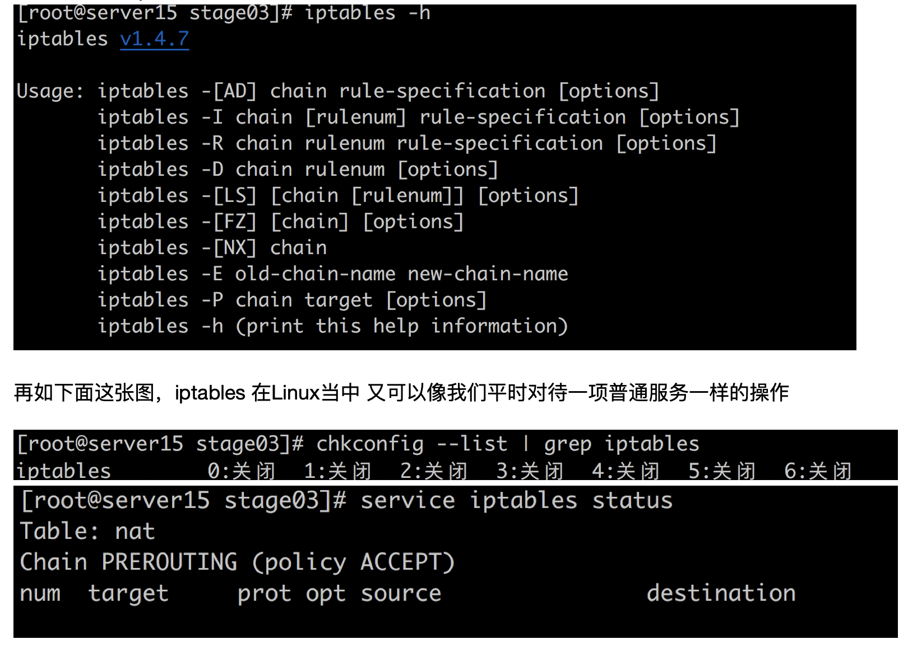
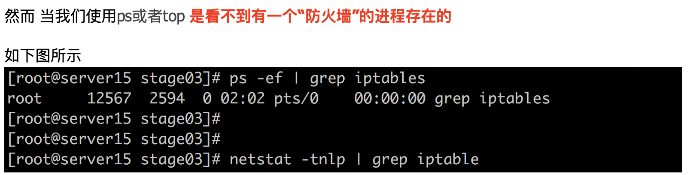
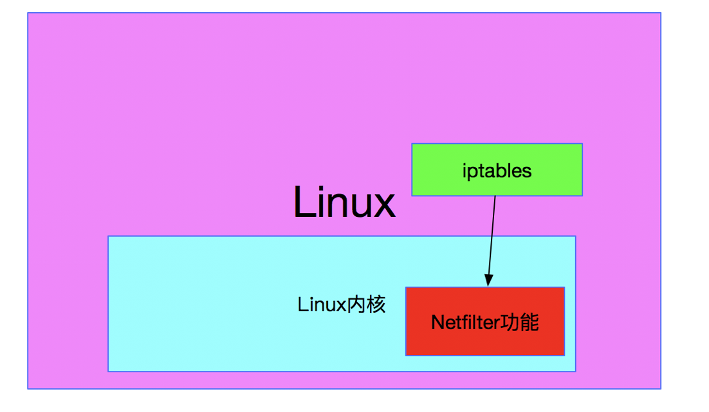

## 18.Nginx服务器安全相关（上篇）

保证nginx安全，其实很大程度上就是保证服务器的安全  
所以，我们需要使用防火墙来保证服务器上没有问题流量

（1） 防火墙的概念是什么

防火墙这个词 我们一点也不陌生 从早年大家都在玩 windows9x的时候 防火墙就一直伴随着咱们一路走过来了  
对于普通用户 接触最多的 无非就是 win上面 形形色色的 各种防火墙软件了 （有相当长一段时间 防火墙软件产品层出不穷）

那么到底什么是防火墙呢？ 区区只认识到"防火墙软件” 这么一个层面 够吗？（对咱们Linux架构师来说 自然是远远不够的）

防火墙说白了 其实是一种隔离技术， 就是把 从外面进来的访问（进入操作系统 或 进入下一个网络设备）按照事先定义好的一套规则  
进行过滤 合格的访问允许它通过，不合格的就直接丢弃了

防火墙是在两个网络通讯时执行的一种访问控制尺度，它能允许你“同意”的人和数据进入你的网络，同时将你“不同意”的人和数据拒之门外，最大限度地阻止网络中的\*\*\*来访问你的网络。换句话说，如果不通过防火墙，公司内部的人就无法访问Internet，Internet上的人也无法和公司内部的人进行通信。

防火墙有软件的，也有硬件的. 有工作在应用层上的（比如win防火墙），也有工作在底层的（比如LINUX防火墙 iptabls）  
对于硬件防火墙 主要指得是 各种网络安全硬件设备 （这个不在我们这堂课的讨论范围中）  
我们主要是 针对工作在操作系统层面的防火墙进行学习（Linux iptables）

(2) iptables是什么？做什么用？

Linux中 最普及的安全防火墙 就是 iptables  
iptables其实是经过几个阶段发展而来 , ipfirewall -> ipchains -> iptables （关于这个发展历程 由于太古老了 我们也没有太大必要了解的很详细）

首先我们需要知道的是

iptables 在Linux系统中身份比较特殊  
第一：表面上 iptables是一个命令 也是一个服务  
如下图所示，iptables本身就可以直接运行 查看使用手册

  
  
为什么会出现这样的现象呢？

因为在linux上，iptables 防火墙其实是系统内核的一部分，真正干活的实际上是内核当中一个叫做Netfilter的功能框架（对于内核Netfilter深入知识感兴趣的朋友 可以自行扩展学习）  
也就是说 Linux内核利用其自身对于网络数据包的流向判断 来间接起到防火墙的功能

而iptables呢？ 其实只是作为 方便我们用户 随时控制内核中netfilter功能的一个平台或者是桥梁 (ipfirewall -> ipchains -> iptables)  
总结来说： 真正的防火墙是 Linux的内核提供的， iptables可以理解为 使用这个防火墙的一个"bash" （Linux内核防火墙 - 专有命令行）

说到这里 我们也就回答了上面的提出的那个疑问了，因为防火墙其实是在内核中，并不是简单的一个软件跑在系统上，那么自然 ps top命令就看不到这么一个 iptables进程了

顺带着，我们也就明白了 linux防火墙到底是怎么回事了，不过为了方便理解和使用习惯 咱们依然还是称作Linux防火墙是 iptables

下面附带了一张图 方便我们理解 Linux防火墙是怎么回事  

3） iptables最容易理解的第一步： 过滤型防火墙（filter表）

光说不练是不行的， 我们接下来 就直接接触一下 iptables 最容易理解的一个防火墙类型 -> filter过滤型的防火墙

（我们这里先暂时不管 iptables的什么4个表 5个链 ）

咱们先说说什么是 过滤型的防火墙吧

最直接的例子 就是咱们平时玩windows安装的各种防火墙软件了  
windows各类防火墙 其实最基本的一个作用就是过滤

比如： 当我使用浏览器要下载一个软件时，防火墙会给我弹出警告（xxxx软件 可能会伤害你的操作系统 ）等等之类的提示语言  
要运行一个软件时 会弹出一个窗口 告诉你 xxx软件可能含有病毒（虽然很多时候 都是误报….）  
  
其实这就是一个典型的过滤形式的防火墙

过滤：指的就是 当外界的东西 新来的东西 想进入我当前的操作系统时，或者是 本地希望向外访问未知区域 并获取资源时  
在这中间卡了一道关卡 用来检查其安全性 出现疑似问题时 给予警告和处理

这就是windows的过滤型的防火墙

然而Linux的iptables防火墙 也一样具备这种过滤的功能  
虽然基本原理相通 不过跟Windows防火墙比较起来，有很多的不同 接下来我们就看看有什么不同点

1） Linux防火墙工作在内核 在操作系统更往下的底层 , 而win防火墙（大多数）是工作在应用层 也就是说 是一个软件起到防火墙的作用  
2） Linux防火墙的安全防护更加彻底，且非常固执且严谨 一板一眼 说一不二！  
而win防火墙 很多时候就有点老好人 模棱两可的意思 （应用层的防火墙 考虑的因素太多 很难100%判断是否有害）  
3） Linux由于绝大多数是 以一个服务器提供对外服务的身份工作， 所以防火墙更多的是 用来过滤外来的请求 基于网络层面的请求  
而windows更多的是 个人电脑使用，不会对外提供服务(win server)，所以 防火墙更多是判断出去的请求 或者本地即将执行的程序的可靠度 （iptables是做不到这一点的 不过其实也不需要）
