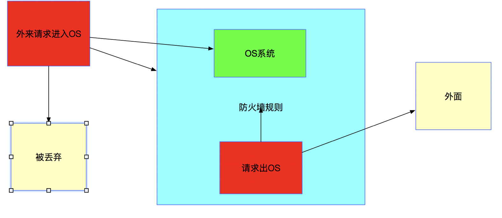
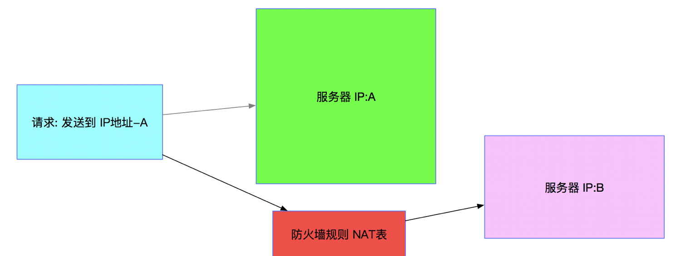

## 19.Nginx服务器安全相关（中篇）

接下来 我们来看两个 过滤类型的 iptables配置 简单的了解一下

有时候我们发现某个ip不停的往服务器发包，这时我们可以使用以下命令，将指定ip发来的包丢弃：

```coffeescript

[root@server15 ~]# iptables -A INPUT  -s 172.16.0.0/16 -j DROP

[root@server15 ~]# iptables -L

Chain INPUT (policy ACCEPT)

target     prot opt source               destination

DROP       all  --  172.16.0.0/16        anywhere
```

如上是第一个例子 ，把来源IP地址是 172.16.0.0/16 的请求丢弃掉

`root@server15 ~]# iptables -A INPUT -s 192.168.0.0/16 -j ACCEPT`

接下来的 这个例子 如果来源IP是192.168网段的 就允许通过

如上就是两个最简单的 通过iptables设置过滤类型的防火墙配置

iptables 4个表(tables)代表什么意思

通过上面一讲 我们对过滤类型的防火墙 有了一定的了解  
（过滤防火墙 ）

所谓过滤：就是符合某种条件就通过，不符合就丢弃

接下来 我们顺着这个 “过滤型” 继续学习

其实大米在前两节课中 反复给大家举的 过滤型 的例子 是为了方便初学iptables的朋友  
过滤型的防火墙规则 在iptables当中 实际上对应的是 iptables当中的一个”表” ，也就是filter表（过滤）

iptables在使用过程中，有4种标准化预定义的 “表” (tables)  
每一种表(table) 是代表了一种使用的类型 或者说方向 （比如咱们之前提的 filter表）

除了filter table之外， 其他还有三种tables

```plain
filter / nat /     mangle / raw 
```

其中 前两项 filter & nat 表 可以说是日常工作当中 接触频率最高的 同时 也是咱们本课程上篇的主讲内容  
关于 mangle 和 raw 属于高级的扩展用法 难度较大 且实际工作中出场率不算高 所以我们放到 下篇去讲解

filter和nat表 是我们作为一个合格的Linux运维 必须必须优先掌握的 不然 你也别说自己会iptables了 - \_ - …..

filter table 主要是起到 过滤的作用 根据一定的规则 把即将发送到OS的请求 或者是即将发送出OS的请求（或者是转发的请求） 预先做一个判断  
根据判断结果 ，决定是否放行. — 这个就是作为防火墙 提供的最基础 也是使用频率最高的用法 （windows防火墙 主要也是做这个事）

  
nat table 的作用跟filter就大不一样了 (以往 对于防火墙的认知)  
NAT （Network Address Translation，网络地址转换）是一种对数据包的特殊处理  
其主要的目的 是通过iptables防火墙 把原本发送过来的请求 更改其原始的目的地址 或者 更改其来源地址 （port 端口）  
以做到 将请求转发的目的

这么说 可能不好理解 ，咱们来看下下面这张示意图  
  
在上面 这张图中 从最左边 原本一个请求 是发送到 IP地址A的服务器， 但是经过iptables-nat规则之后  
把请求的目的地址 从IP:A —>改成了 IP:B  
于是 请求就这样被转发到 IP:B上去了

除了IP地址的改变之外 ，我们再来看一个 改变端口的例子  
这里只有一台服务器， 原本请求是发送到这台服务器的80端口  
通过NAT表之后，请求的目的端口被改变到 8080了 ，所以请求被送往8080端口所属的应用

通过如上两个例子 我们也就可以 大致明白了，iptable NAT表 不是对请求进行过滤，而是把请求的IP地址或者端口进行临时的转换  
以达到转发的目的 这种使用方法 在实际工作中也是很常见的，很多架构中的应用 其实也是基于这种原理实现 比如：反向代理，负载均衡(LVS NAT) 等等

```plain
iptables 使用中 -t 参数 代表的就是 表

iptables -t filter -L   : 显示 filter表中 都有什么规则
（filter是默认表 ，不加 -t filter 也是一样的）

iptables -t nat -L : 显示 nat表中 都有什么规则
```

如上是查询  
修改和添加 也是一样的方法

```plain
iptables -A INPUT -t filter -s 172.16.0.0/16 -j DROP

iptables -t nat -A PREROUTING -p tcp -d 192.168.102.37 --dport 422 -j DNAT --to 192.168.102.37:22
```

