# 【先跟着大米 手把手 跟nginx混个脸熟】

上一个篇幅中 我们补了补服务器和一些概念 做了一些Linux系统上铺垫的准备工作

接下来 终于到了我们该动手实践nginx的时候了 小兴奋？^\_^

关于各种复杂的原理 咱们暂时先扔一边去 先把nginx跑出个样子是真的！  
（在整个过程中 各种Linux的操作 捎带着也复习了）

首先 咱们先去到nginx的官网看一看吧 (www.nginx.org)  
（补充说明 今后无论学习还是工作 不管是哪一项技术 遇到吃不准的疑难时 都尽量以官网为准 这一点应该不需要过多解释了吧，英文不过关？没事 有大米呢 怕个球啊 ^\_^）

nginx的首页比较务实 没那么多花俏 首页显示的是nginx news (最新动态)

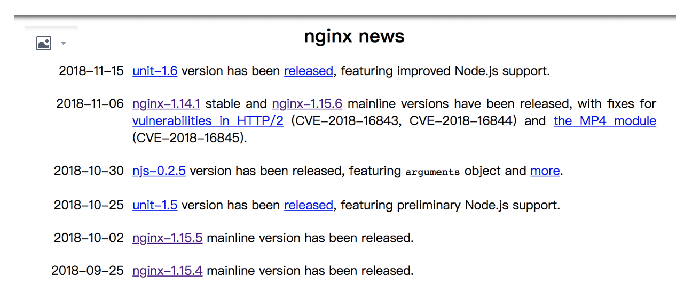  
随意点击一个 nginx-1.xx.x 就可以来到 nginx的官方下载页面了

下载nginx是咱们的首要任务 ，不过先别猴急 大米带大家先 认识一下 官网发型的几个不同的版本标识是啥意思  
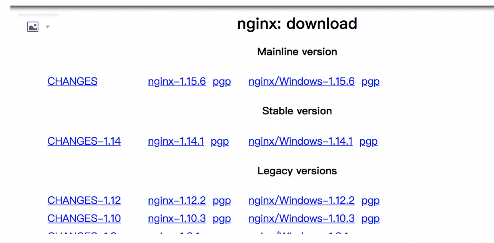

从上面的截图我们可以看到 Nginx官网提供了三个类型的版本

Mainline version：Mainline 是 Nginx 目前主力在做的版本，可以说是开发版  
Stable version：最新稳定版，生产环境上建议使用的版本  
Legacy versions：遗留的老版本的稳定版

在这里 大米只推荐大家 下载和使用 最新的stable版本 当前也就是1.14.1  
（稳定版 一般是经过完善接口功能测试的版本 理论上是符合运行在咱们生产环境上的版本）

提问： 啥叫生产环境？ - -

回答： 在你上班的企业 用来服务你们的用户所搭建的服务器 就叫生产环境 （也叫线上环境） 是核心最重要的环境了 （自然用稳定版 毋庸置疑）

接下来 说干就干 咱们在网页上复制下载链接 然后直接在咱们自己的其中一台Linux上 执行下载  
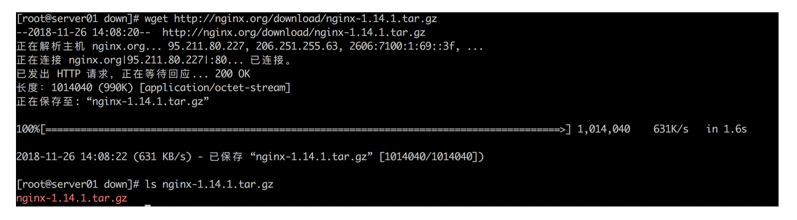

提问： 为啥我的Linux上 找不到wget啊啊！

回答：yum install wget 就有了啦

下载完成后 是一个tar.gz结尾的压缩文件， 我们在Linux上执行解压缩

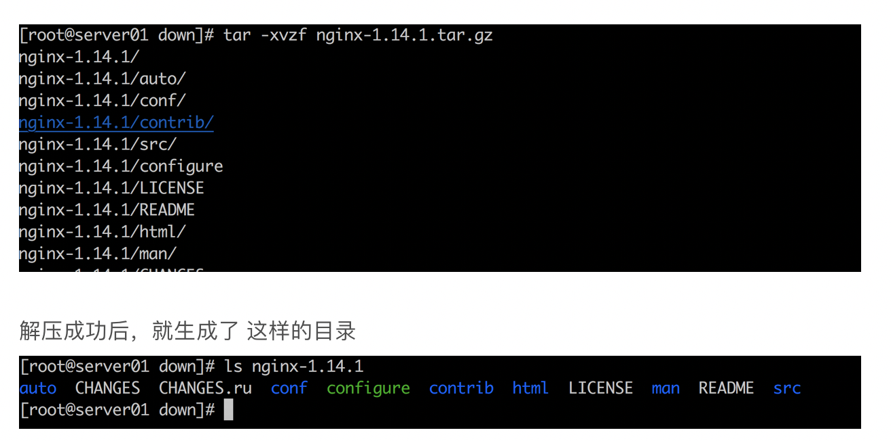

解压成功后，就生成了 这样的目录

提问： 为啥我下载的 nginx.tar.gz 解压缩报错啊

回答： 如下图所示 请你确认你下载的文件 是否正确 使用file 命令确认文件类型， 用md5sum命令确认你下载的完整性  
(md5sum 可确认文件的完整性， 生成的加密字串 只有在文件完完全全一模一样的情况下 才能保证一致哦)

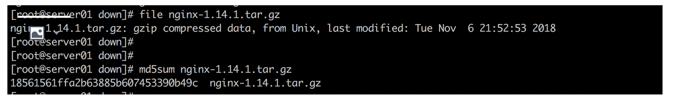

没有问题后，接下来该做什么呢？ 直接就可以运行启动nginx??

NO NO !~, 我们当前只是下载并解压了nginx 1.14.1 的"源代码" ，都还没有生成可执行文件呢 怎么能运行的了呢  
（Linux下面的 可执行文件 就是指的直接 ./software\_name 就可以运行跑起来的 ）

提问：nginx的源代码在哪里？ 我要是看不懂怎么用它啊

回答：nginx的源代码 就在你刚刚下载并解压之后的 src/目录下哦 请看下面的图  
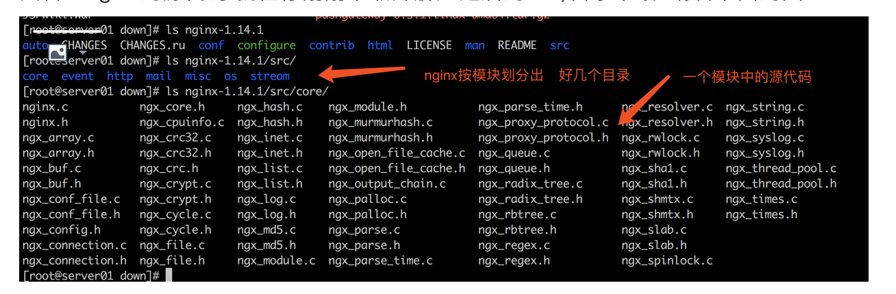

从上面的截图 我们可以看出 src目录就是存放源代码的 其下面按照 nginx不同的组成模块 划分出 core/event/http....等等

提问：为什么nginx/src下面 会看到多个子目录

回答：因为Nginx是一个高度模块化的WEB 服务器， 所谓的模块化 就是软件在开发设计的时候 就按照不同层次 不同功能 将代码分开封装 你所看到这几个自带的目录 是官方默认提供的模块 当有请求到达的时候，请求依次经过这条链上的部分或者全部模块，进行处理。 我们后面 还会有专门讲nginx模块的篇章 这里只要先知道就好

看到了这些源代码 但是我们现在又看不懂里面的代码怎么办？  
这个不用着急，因为目前还不需要我们去读懂它的代码 我们只需要掌握 如何把这种源代码形式的NGINX 转换成可以使用的NGINX即可

这就是所谓的 开源软件-源代码安装流程  
（大多数Linux下的开源软件 都采用很类似的源代码安装方式 所谓一通百通）

安装的流程在NGINX这款软件下 非常的简单 三步即可

./configurate  
make  
make install  
完事了。。。。 接下来 我们赶快运行一下 试试看

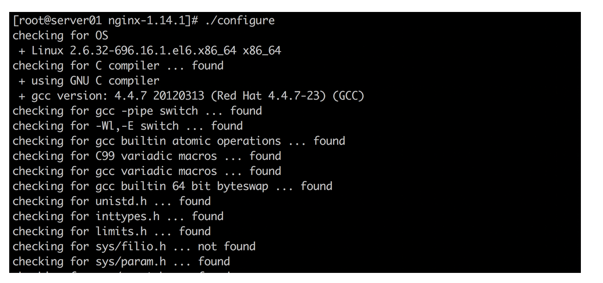

接下来 运行  
make && make install

安装完毕 ! 就这么容易

提问： 安装运行的这三个步骤都是干嘛用的啊~~

回答：configurate 命令是一个由作者手动编写的 bash脚本 （不知道Linux下的bash? 那只能自己多补补课了）这个脚本做了很多 "幕后"的工作 包括检测你的操作系统版本 已经安装的软件是否合适 最终生成MakeFile文件

make呢？ 就是根据上一步生成的MakeFile文件 执行 "编译工作" ， 所以说 这里才是真正的 把源代码开始进行转换工作 ，最终生成了 我们可以直接使用的二进制文件（可执行文件）

make install 呢？ 这个做的是最后收收尾的工作 例如 最后把nginx的配置文件 和 二进制文件 都放到预先指定好的目录中去

接下来 我们做个小实验 看下configurate都做些什么检查

比如 还记不记得 我们上一篇中最后 让大家准备Linux环境的时候 让通过yum安装 pcre & pcre-devel 对不？

我现在把 pcre-devel卸载掉 然后再运行一下 configurate 试试

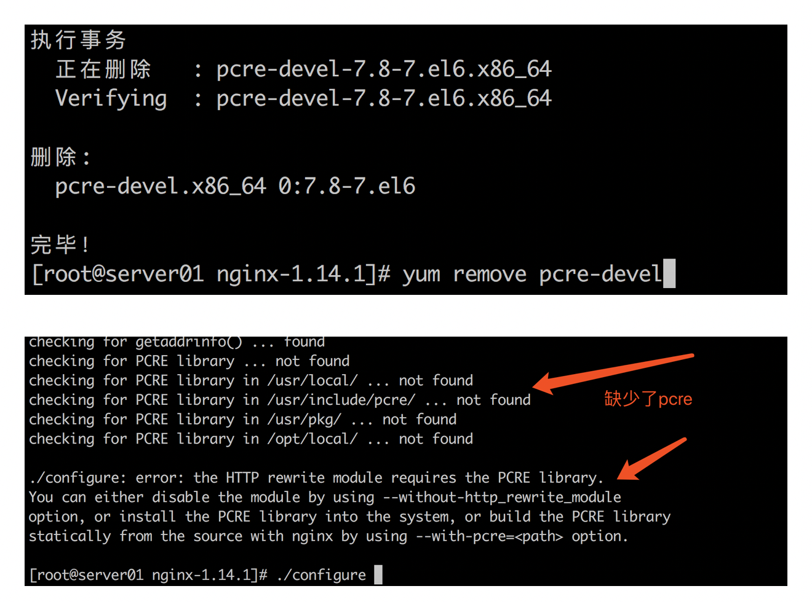

立刻就检查出了问题， 系统中缺少了 pcre的相关开发库 这就是configurate检测出来的

而最终当我们 执行了 make install成功后， 我们就可以进入 如下目录来看下咱们的NGINX了  

如上图所示，我们默认的那三个步骤，就会最终把nginx安装到 这个路径中 (/usr/local/nginx/)

接下来 咱们就找找nginx的可执行文件在哪里吧

这个就是了 ，我们接下来就可以通过它 对nginx下达各种命令啦~~~~

别的先不管 先运行起来 nginx

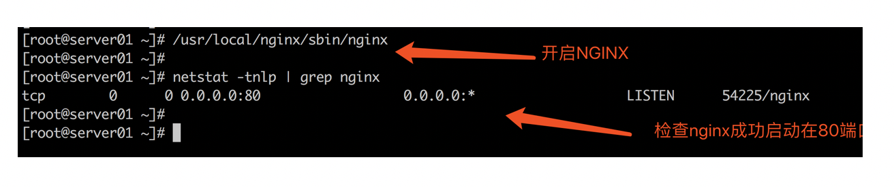

这样 我们就可以 把nginx启动起来了 ， 并且 我们使用netstat来查看 nginx进程是否已经跑起来在80端口了  
（sbin/nginx 就是最终生成的 nginx可执行文件 ）

（我们之前说过了 nginx是一个处理http协议的web 服务器， 而http协议的一个非常重要的特点 就是默认工作在80端口)

现在nginx是跑起来了 ， 但是我们还也没有去编写任何网页 ，怎么才能看到效果呢？

其实nginx本身就提供了默认的欢迎页面 我们直接就可以通过浏览器 或者命令行来尝试访问了

按照如下的方法

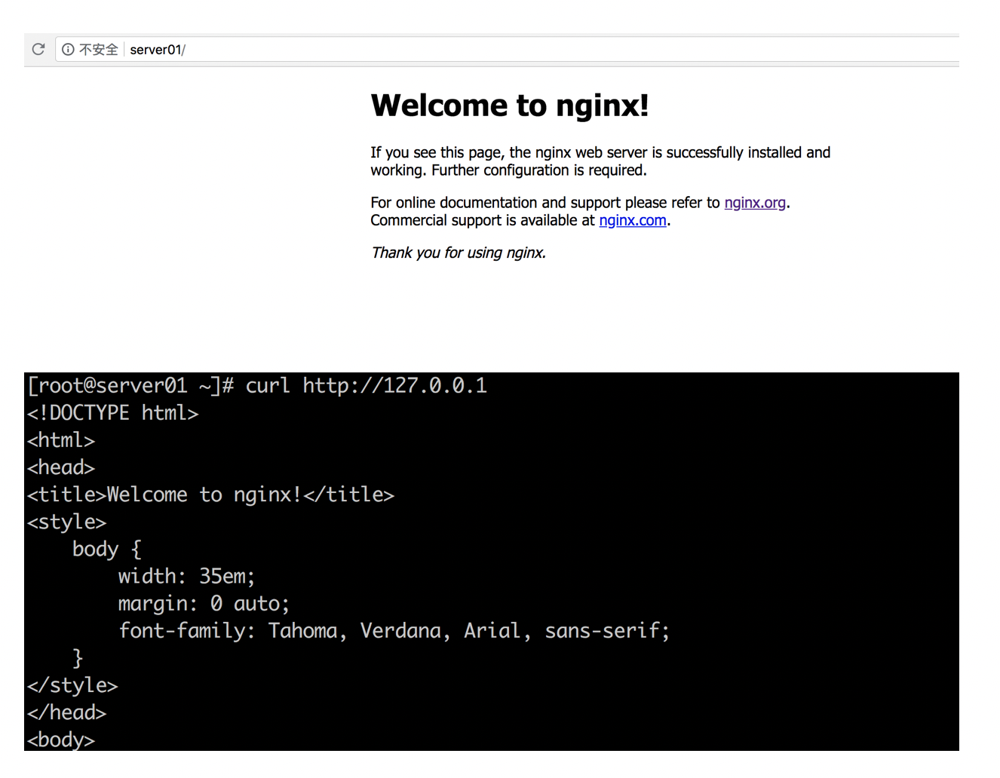

如上两种方法 都可以用来测试

第一种方法： 使用浏览器访问你的NGINX主页

你可以直接输入你的虚拟机ip地址即可 ， 比如 [http://192.168.0.5/](http://192.168.0.5/)  
我的截图中 输入的是 [http://server01](http://server01/) ， 这是因为 我实在 自己的本机上捆绑了主机名 /etc/hosts server01 ipaddress

第二种方法： 使用curl命令行来访问

这种访问方式 是在命令行下 模拟浏览器访问的效果 （换句话说 就是命令行 发送http请求）

Nginx默认提供的欢迎主页出来了 没问题

不过 这毕竟只是官方给出的欢迎页面啊 不是说好了 咱们弄个属于咱们自己的首页么？

接下来 就跟大米来一起做一下

首先 我们得先找到之前看到的官方页面在哪里 对不？

咱们一起打开nginx的默认配置文件nginx.conf（也是咱们第一次接触配置文件了）

这个文件的位置就在 你的nginx的安装路径下 入下图所示

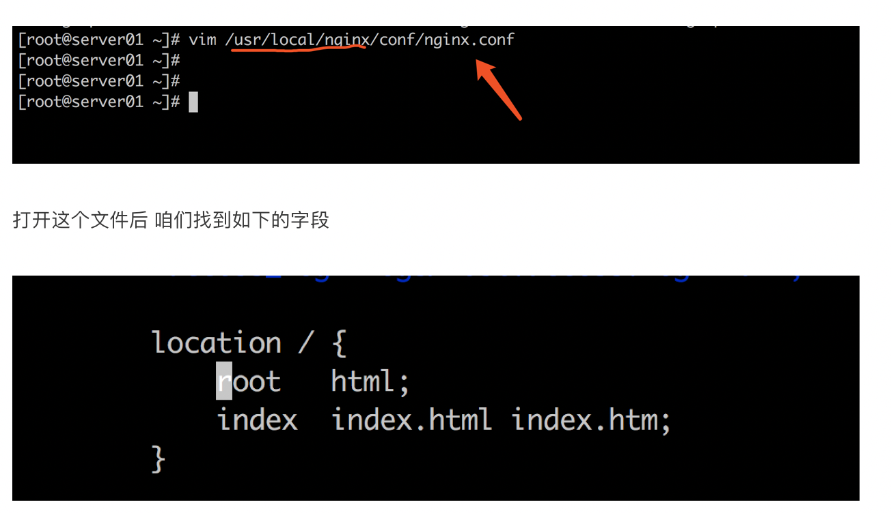

打开这个文件后 咱们找到如下的字段

注意root这一行了么

这里代表的就是 网站的根在html的相对目录下（包括咱们刚才看到的 网站的首页）

那么这个html目录又在哪里呢？

其实就在如下的位置  
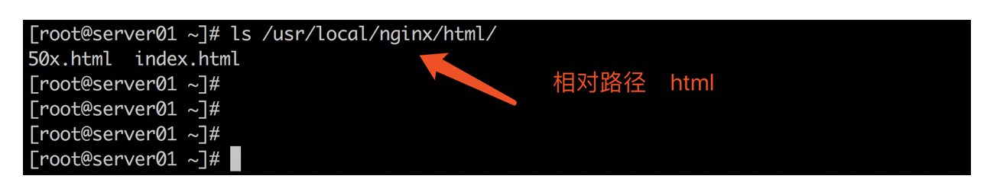

/usr/local/nginx 是咱们的安装目录， 那么如果配置中写成 root html 指的就是 在安装目录下 有一个相对目录叫html , 这个html目录 就是网站的根 换句话说 当访问网站的时候 所有静态资源 从这个目录里面调取

那么讲到这里，大家应该也看出来， 在这个目录下 有个 index.html

其实这个index.html就是 我们刚才看到的nginx默认给出的欢迎页面了

不信 自己可以 vim一下 index.html文件当中的内容

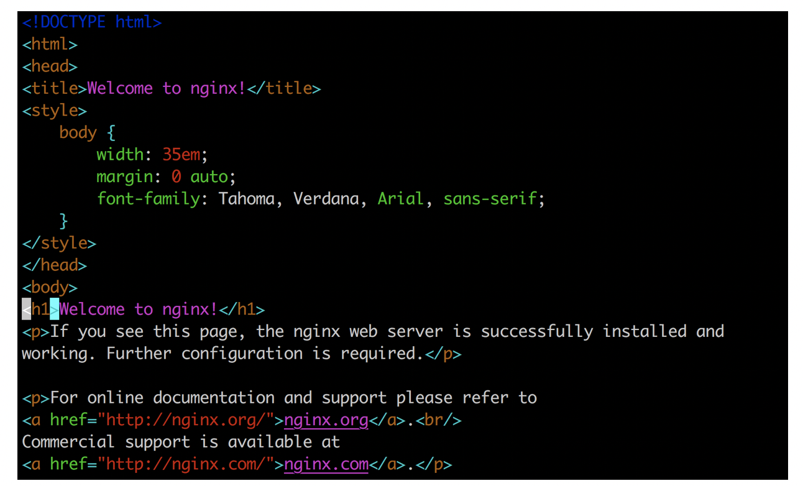

是一个使用HTML的简单页面 只有几句话而已

接下来 咱们可以尝试 在这个index.html中随意做些改动  
让它变成一个 咱们自己的首页。

