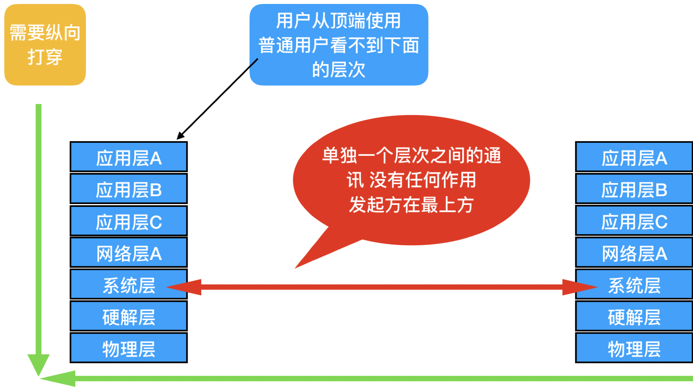
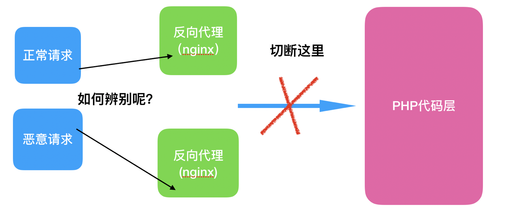
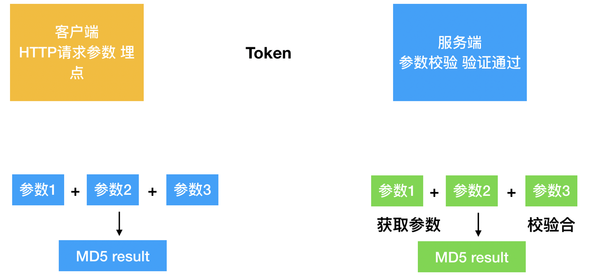

## 21.Nginx和lua的结合

\[先来看看什么是网络attack\]

attack的本质是什么？ 其实说到底 就是 对服务器现有资源的强力打击 或者说是消耗

那么从我们运维架构的角度出发， 企业中的服务器资源的又有哪些分类呢？

第一类：服务器物理层面的 资源

这个是最好理解的，无非就是 CPU / 内存 / 硬盘 /，这些都是作为计算机物理层面上的 有限资源

第二类：OS操作系统层面的 资源

我们就以运维的核心OS Linux为基准

那么操作系统的资源 简单举几个例子 ， 端口数量，连接数 , TCP列队数， 文件句柄数 ， 进程调度/优先级 ， 等等

网络资源

这里主要指的是网络带宽，这是非常珍贵的资源，后面也会具体的讲解

上面提到的三种类型的资源 都是作为一个集群架构的有限资源 attack的本质其实就是对资源的消耗

资源的消耗殆尽 最终会致使服务器无法再响应用户的请求，这也就是 咱们常说的 Dos 拒绝服务attack

另外，如上提到的三大类的资源 彼此并不是独立的 之间实际上都有着 大量的连带关系

现如今都是互联应用时代，一切都走网络，所以 网络资源的消耗 自然是不言而喻的

就算我们暂时忽略掉 IP包在路由途中的过程， 就算是直接到达了 我们的服务集群

在我们的集群中 也会发生一些列的 连带其他资源的消耗

如下图所示， 比如 一个HTTP的请求到达之后，按照标准七层协议的框架 由下至上 从物理层一直到应用层 都会串联起来  


网卡会进行IP包重组，TCP/UDP会进行传输层的连接建立，连接的建立必定又会继续向上 消耗系统的 CPU/RAM/IO , 端口，连接数，列队数 ， 文件句柄数 ，等等

任何一种资源 如果出现瓶颈 都会牵制其他的资源

从attack方来说， 逐渐由高难度的 4层attack ， 逐渐转变为 傻瓜式的 7层attack  
例如：后面要讲到的 基于4层的 系统漏洞attack（主要指的是TCP/IP 三层和四层协议）  
这种attack不但要精通TCP/IP协议，还要掌握系统底层知识，以及代码的功底

从流量要求很小的Dos attack， 逐渐变成并发量大的Ddos attack （Distributed dental of service）  
原本 在操作系统（主要指的是Linux）内核较低时，服务器性能较低时 ， 少量的attack即可造成系统瘫痪  
随着OS和服务器的提升， attack流量 有着越来越高的要求

从早期的 attack物理层 attack系统层，造成第一类 第二类资源的消耗，逐渐过度到 网络带宽的消耗

另外就是费用问题，攻方和守方的费用 其实都是一直在增长的

\[谈一谈现如今的Ddos\]

DoS是Denial of Service的简称，即拒绝服务，其目的是使计算机或网络无法提供正常的服务。带宽attack指以极大的通信量冲击网络，使得所有可用网络资源都被消耗殆尽，最后导致合法的用户请求就无法通过

什么是分布式拒绝服务(DDOS)  
分布式拒绝服务(DDoS:Distributed Denial of Service)指借助于客户/服务器技术，将多个计算机联合起来作为平台，对一个或多个目标发动DoS　attack，从而成倍地提高拒绝服务的威力。通常，攻方使用一个偷窃帐号将DDoS主控程序安装在一个计算机上，在一个设定的时间主控程序将与大量代理程序通讯，代理程序已经被安装在Internet上的许多计算机上。代理程序收到指令时就发动attack。利用客户/服务器技术，主控程序能在几秒钟内激活成百上千次代理程序的运行。

随着计算机和网络技术的发展，硬件设备的处理性能加速度增长，成本也变得非常低廉，网络的快速发展更是让带宽、出入口节点宽度等大大的提升，这让传统的DoSattack很难凑效。  
　

\[补充学习一下TCP的知识\]

我给大家提出了一个 U型结构 的TCP/IP（这又是什么鬼？？）

先别着急，咱们接着顺着上一节的末尾 继续往下说

进入80年代初后，计算机的发展是越来越快了，伴随着的 自然就是对网络的需求

但是 在这个发展时期 又出现了一个比较严重的问题 是什么呢？

BASIC语言 虽然古老 但是在那个年代 是一个非常重大的里程碑，它是第一个可在当时称为 高级编程语言的  
（高级编程语言 指的是相对于 更原始的 汇编语言 和 后来 FORTURN语言，这种接近机器底层语言 而说的）

高级编程语言的出现，极其快速的推进了计算机单机的发展，很快就出现了所谓的 应用程序/应用程序编程

什么是应用程序呢? 简单的来说，就是通过编程的发展，把计算机的功能层层嵌套 不断的往上堆积

让人使用计算机的难度 越来越低 看上去是一件好事，但是对于网络的发展来说，确是一把双刃剑

什么意思呢？ 这把双刃剑是什么 ？接下来 咱们继续说

高级语言的诞生 加快了单机的发展， 然而 协议的混乱状态，又拖延了网络的发展  
造成的结果就是， 网络的发展跟不上单机的发展 （咱们就拿游戏来举个例子 ， 经常玩电脑游戏的我们都知道， 单机游戏有着漫长的发展史，网络游戏的泛滥也不过是近十多年的事情，而单机游戏 在BASIC时代其实就出现了，而游戏本身 其实也是 应用程序的一种体现）

接下来 我们详细来看下 单机 和 网络出现的矛盾 到底是什么

我们所理解的 计算机 到 计算机 的网络通讯 大概是这个样子

感觉不就是点 到 点 就可以通讯了吗？（偏向宏观的认知）

其实不是的，我们刚才也说过了，由于单机应用程序的快速发展， 一个计算机形成了多层结构 如下面这个样子

其实随着编程的提高，应用程序的逐渐复杂，计算机这一个 "节点" 其实是分为多个层次的  
如果要实现互联网的通讯，必须要考虑到所有层次的综合的通讯才可以.

由于计算机作为一个整体而言，分成树形的 多个层次

需要说明的问题是：

由于编程的不断发展，使得计算机被从底层开始，层层向上封装起来，直到应用程序的出现 （即便是在应用程序中 也会有底层 和 高层）

这种层层向上包装 堆叠带来的好处 就是计算机的使用难度越来越下降了， 现如今计算机已经被封装的太完美，以至于一个完全不懂的技术的人 简单教一下， 用鼠标也能轻松给计算机下达工作指令

然而 我们目前关注点 是在网络通讯上，这种层层向上包装，如果想实现通讯 ，就必须充分考虑到 每一个层次，且还要考虑到 层与层之间的传递

作为一个不懂技术的用户来说，他处于计算机的最顶端，也就是最高的应用层之上，他只会在这个层次上 傻瓜式的操作

我们就拿 发送一封邮件来说吧 ：

比如 普通用户 就知道写好一封邮件，然后点击 发送按钮 （傻瓜式的操作），然后剩下的他就全不管了（他也根本不懂后面会发生什么事）

邮件的发送 一样属于网络通讯 ， 普通用户可以不管背后发生的而事，但是作为技术人员的我们，却不能不管（用户是上帝啊）

回到正题上，用户在最顶端发起傻瓜请求（网络通讯请求）， 这个请求发生在 最上层的 应用层A

请求的传递，需要从这一个层次开始，一路向下走 （一路打穿下去 看左边的绿色向下箭头），到达左边的最底层

到达最底层之后，向右边传递 （计算机网络的中通讯 真正背后是发生在最底层的 ，用户感知不到 并不代表就没有）

从最底层到达右边后（这里先简单理解为 右边的计算 代表接受邮件的傻瓜用户）， 从底层传过来的 还得向上再打穿，一直打穿到右边的 最高层 应用A

这时候，右边的傻瓜用户 才看到了 刚刚发送过来的邮件

我们之前也跟大家说过， TCP/IP是一个协议的族群 ，它依然需要正确的指引路径 才能真正完善 且普及开来

\[反向代理的重要性 \]

很多朋友 都知道反向代理的概念， 但是并不是十分清楚其实质作用

我们就基于LNMP的环境进行讲解， HTTP的请求道来后，需要先经过 nginx 处理HTTP协议 以及静态内容

如果请求中有动态内容，则反向代理到 PHP（代码层）进行处理

关键也就在于此处

Nginx可以做七层负载均衡，其实负载均衡的基本功能 也是归属在反向代理之中

反向代理的资源消耗 要远远小于 PHP代码层的资源消耗 （Nginx高并发处理，资源开销很小）

所以，我们希望的就是 当attack请求到来时，最多控制在反向代理为止，不让其连带到 PHP代码层

尽可能切断这种 关联

但是 这种切断 需要判断请求的真伪 这是一个疑难问题  


\[提出高层埋点的方式，nginx+lua实现智能反向代理\]

问题在这里了，关键是怎么甄别来到的请求是善意的，还是恶意的。我们之前学习过的防火墙比如iptables这种，已经没有办法实现  
我们得求助于更高级别智能的方法  
首先，之前也说过 CC Ddosattack 是模拟真实用户请求

想通过很简单的方法，例如 用防火墙加个 IP黑名单的做法 是行不通的

IP数量庞大，且动态改变 或者IP伪装  
既然CCattack处在七层，那么我们应对的方案 也需要在七层中 去想办法

我这里分享的一种 甄别的方法 ，叫做 埋点七层摸手

什么意思呢？请看下图

  
如上图所示：  
我们在客户端的HTTP请求中，刻意加入几个参数, 然后计算这几个参数的md5值. 然后，服务端的反向代理中，加入判断的代码  
这段代码会验证客户端是否正确提交了这几项参数，并且在服务端重新把这几项参数做一次md5值的验证。如果通过才会继续提交给后端的AP服务器，如果不通过则直接返回403错误码  
在这几项参数中，需要加入一个动态参数，还有一个暗扣参数，这是什么意思呢？  
动态参数：每一次客户端提交上来的这个参数都会不一样，比如：可以按时间的推移，把秒或者毫秒计算成一个参数，让它时时刻刻都在改变  
暗扣参数：有一个参数是客户端和服务端藏起来的，也就是不直接体现在URL当中，而是由程序员私下定制，放在代码中

\[具体实现方法和部分代码\]

我们的nginx默认是不支持lua的，需要安装额外的模块  
请按照如下的方法来操作安装  
最后，我会给出大家一段lua的代码，模拟一个请求如何被lua判断，善意或者恶意请求，只要是不符合lua逻辑中的规则，请求就会被返回客户端

Nginx安装lua支持

需要LuaJIT-2.0.4.tar.gz，ngx\_devel\_kit，lua-nginx-module  
1.下载安装LuaJIT-2.0.4.tar.gz  
2.下载解压ngx\_devel\_kit  
3.下载解压lua-nginx  
4.下载安装nginx

```plain
location =/url_token {
    set_by_lua $res "
        local hash = 'xxxacgjfja199950ss'
        local time = ngx.arg[1]
        local lat = ngx.arg[2]
        local lng = ngx.arg[3]
        local TTtoken = ngx.arg[4]
 str_join = hash .. time .. lat .. lng
    token_by_sum=ngx.md5(str_join)

        if token_by_sum == TTtoken
        then
        return 0

        else
        return TTtoken
        end
```

如上就是代码了，总体来说就是判断客户端提交过来的http参数。如果两边计算的数值不相等，就会返回403,而不把请求转交给后面的nginx了  
所以说ddos attack就会被我们的nginx+lua反向代 理屏蔽在外了
