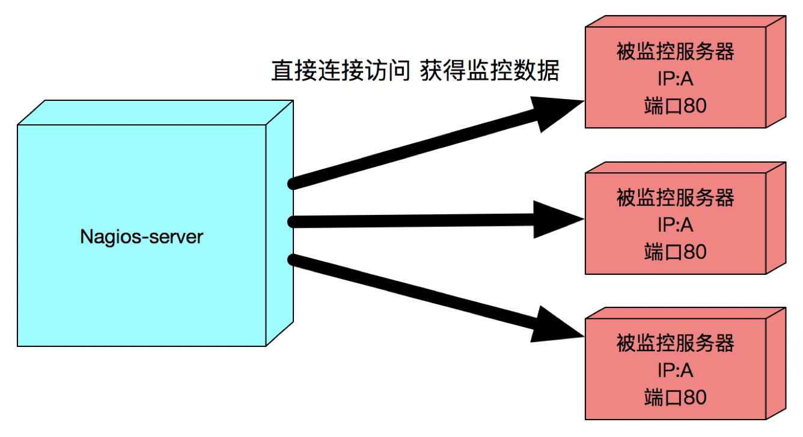
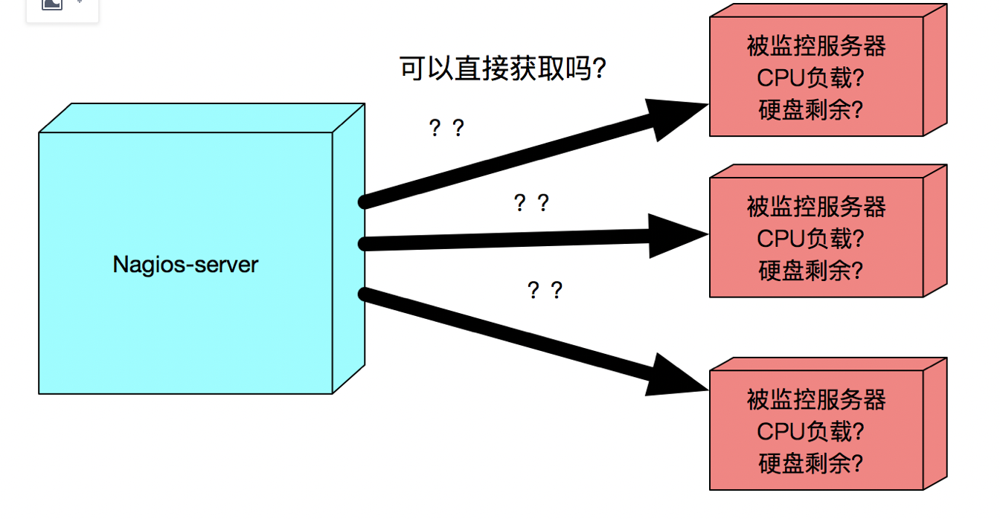
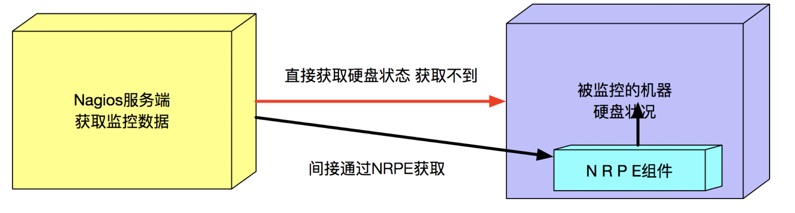
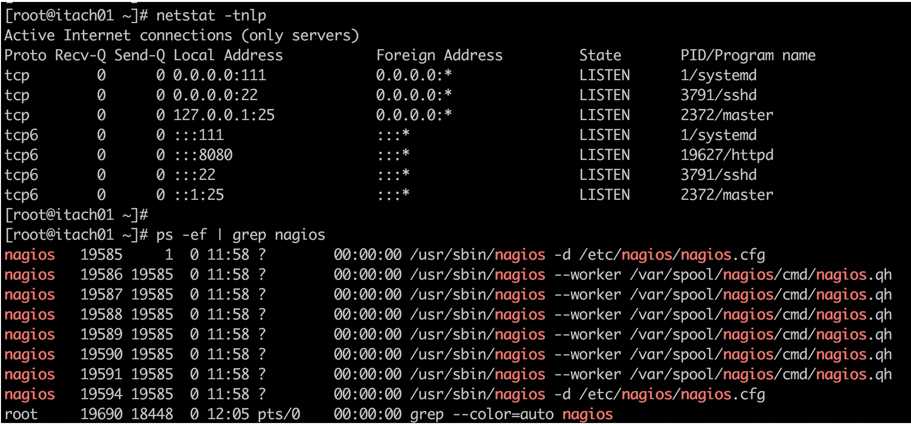
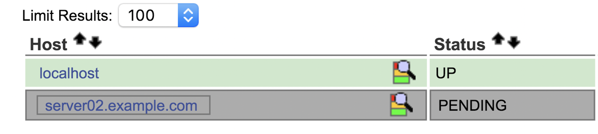
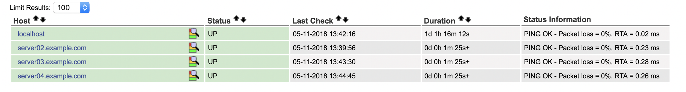

## 22.做好Nginx的监控-上篇

\[引言部分\]  
当我们搭建好一整套的nginx集群之后，它就开始了每日繁忙的处理各种http请求了  
现在的问题是，我们怎么才能确定所有的nginx服务都运转正常呢？难道每天24小时盯着页面和日志嘛？当然是不可能的，这就要依赖监控技术了

首先 无论你现在从事运维行业 处于哪一个阶段 , 监控都是最重要的核心工作内容之一

说监控是运维的第一核心也不过分

因为 系统的稳定运行 决定了运维的最高价值，而监控 是保证系统稳定的第一步 （也就是发现问题）

在运维行业流行这样一句话

您在一家企业中 如果真的把监控做到 100%到位了，什么样的问题都能即时的发现 并 预警（报警系统 跟 监控系统 虽然是一体工作的， 但是从技术和集群角度讲 是分开的 不可混为一谈 后面会谈到报警）  
那么 这家企业的运维工程师们就成了最幸福的人，每天来了 就一件事 打开监控图 看看有什么问题 然后各种去跟开发较真儿 ^\_^  
（实际的现况是 绝大部分公司企业 别说100%监控了 ，就连能达到50%程度的 都少之又少 ，所以 有大量空间去提高）

这句话说的有点偏激，但是也有一部分道理，它充分体现出了 监控对整个运维体系 集群架构的 核心作用  
所以说 对于监控 我们绝对不可等闲视之

\[讲一讲经典老牌监控 Nagios\]

Nagios 经典老牌子监控，伴随着一代运维工程师们一路成长，即便到了现在 也广泛在企业中使用

虽然现如今的新监控产品 层出不穷，但是Nagios始终有这一席之地 除了工程师们的情怀以外， 还有什么因素呢？

Nagios有三个特点决定了它屹立不倒的优势

第一： Nagios跟其他监控产品比起来 是部署和配置最便捷 没有之一，且最容易入门的开源监控产品. 企业的老总们 最喜欢的就是省时快速的完成工作 高大上的技术方案对老总来说如浮云， 从成本节约的角度 -> 光从节约员工时间成本来说 Nagios在这方面就无可替代

第二： Nagios对于各种基础服务层面的监控 就是两个字 "完善" ，这得益于 Nagios的很多对于监控项目的基本计算方式都十分的直接有效，且非常符合一般人们对于"监控" 的实现理念.

第三： 新的监控产品 虽然很多， 但是这里有一个奇怪现象： 一般企业中面试运维工程师/架构师 ， 到了监控这里 不问别的 就爱问 Nagios相关的问题 （记得我之前 就两次被面试官问道同一个Nagios问题 : 请你解释一下， Nagios 和 NRPE的工作模式和关系 .. ）， 而像现如今 炒的很热的 Zabbix 和 Prometheus 从来没有被面试官问到过，连提都不提。 说到这里 大米哥个人认为 是由于Nagios对于各个企业来说，已经是用来考核一个合格的运维工程师的基本素养的指标了

\[Nagios的两种核心工作模式\]  
nagios的第一种工作模式: 远程直连采集 工作模式

我们来看下面的一张图  
  
上面这张图 解释Nagios的第一种工作模式  
<远程直连采集 工作模式>

什么意思呢？ Nagios的监控服务器端 需要采集被监控机器的 数据

而被监控机器上的一些数据 例如 :  
IP地址通不通  
端口通不通  
HTTP页面是否可以正常返回200

等等 例如这样的监控数据， 我们称它们为 远程直连可获取 型的数据

这样一来，对于Nagios服务端来说，就很轻松的 直连上去 就能获取需要的监控数据了  
比如：如果要知道一个被监控机器 是不是正常连着网呢, 那就直接发送个ping (icmp)上去就知道了  
如果想知道一个被监控机器 上面的nginx页面是不是正常工作呢， 那就直接发送个 curl (GET) 上去就知道了

这就是Nagios的第一种工作模式： 远程直连采集

* * *

接下来咱们来讲讲 Nagios第二种工作模式： 桥接间接采集

我们来看下面一张图  


上面这种图 需要采集的监控数据 例如

CPU负载，硬盘剩余，进程存在 等等 ， 类似这样的数据 本身并不是一个"服务"  
什么意思呢？ 好比硬盘剩余多少，这是一项客户端Linux系统上的自身的状态  
本身不像 SSH服务一样 可以被外界直接访问到 ，如果nagios服务端 想获取客户端硬盘状况  
没有办法直接从网络连上去获取，那怎么办呢？

这就要提到 Nagios的一个扩展功能 ， NRPE组件了

请看如下这张图



有了nagios NRPE组件后， 其在客户端上 先收集客户端硬盘状况信息

然后 再由Nagios服务端 连接NRPE来获取该监控数据 这样的方式 就称作桥接方式获取

到这里，Nagios的两种最重要的获取监控数据的模型 我们大家就知道怎么回事了

下一个小节起 咱们正式开始安装Nagios & NRPE

请先做好Linux下时间同步

接下来 Centos7 安装repl ，之后直接就可以安装 nagios , nagos-plugin , nrpe

nagios本身不带web server, 所以我们安装 httpd （apache）来实现webserver  
安装完毕后，nagios会自动将需要的配置文件 加入到httpd中去

```sql
yum -y install epel-release   
yum install httpd     

yum install nagios* nrpe
```

之后 我们把两个服务都启动

```sql

systemctl start httpd ; systemctl start nagios 

mkdir /var/www/html ; chmod -R 777  /var/www/*
```

然后查看一下 httpd启动端口， 以及 nagios进程  
nagios启动后并没有端口 而是以cgi后端进程的方式启动



启动之后 我们来设置一下nagios的初始登录密码

在安装好的Nagios服务端上， 我们先找到如下的路径  
(注意：这里的配置路径 是遵循Centos7.x yum安装的形式 ，如果是源代码安装nagios 路径会略有不同)

如下便是 我们要找到的配置路径 可以看到已经有好多以cfg结尾的默认配置文件了  
不过 这些其实都是一些自带的模板 我们当前用不上，我们先关注 localhost.cfg

\[root@server01 nagios\]# cd /etc/nagios/objects/  
commands.cfg localhost.cfg switch.cfg timeperiods.cfg  
contacts.cfg printer.cfg templates.cfg windows.cfg

接下来咱们先学习 如何在Nagios中定义"节点" ， 这是重要的第一步

什么是定义节点呢？ 其实就是 先把每一个需要被监控的机器 初步加进来

我们再localhost.cfg模板中 可以看到如下这样的配置

```plain
# Define a host for the local machine

define host{
        use                     linux-server            ; Name of host template to use
                                                        ; This host definition will inherit all variables that are defined
                                                        ; in (or inherited by) the linux-server host template definition.
        host_name               localhost
        alias                   localhost
        address                 127.0.0.1
        } 
```

这个是nagios 安装好以后， 自定义的第一个节点，其实也就是 nagios机器本身 （127.0.0.1）  
define host 是对一个被监控节点的整机定义 ， 且每一个被监控的主机（节点） 都需要挨个这样定义才可以

接下来 我们把上面这一段 复制一下 变成如下的样子  
我们添加 除去本机以外的 第一台被监控机器

```php
define host{
        use                     linux-server            ; Name of host template to use
                                                        ; This host definition will inherit all variables that are defined
                                                        ; in (or inherited by) the linux-server host template definition.
        host_name          server02.example.com ; 被监控节点 起一个名字 是唯一标识符号， 不可以重复， 后面会被反复的调用，名字 可以随便取，建议FQDN
        alias                     server02
        address               192.168.100.108  ; IP是多少 ，定义是多
        } 
```

这里需要说明一下， use字段这里先不要动，这是一个模块的定义，因为有其他的连带关系 如果随便修改会造成报错  
我们就沿用已有的 linux-server这个模块即可，后面我们会讲到这里

接下来 host\_name , 重要的关键字， 给一台需要被监控的机器 起个名字， 这个名字是作为其在nagios整个监控中的 唯一标识符  
并不仅仅是个名字而已， 后面会大量被其他地方调用， 所以这里 我们就严格按照 被监控机器的 FQDN来设置

alias 这里就只是个 节点的别名了，可以随意修改成你想起的名字

最后， address这里 又一个重要的关键字， 就是被监控节点的 IP地址设置， nagios本身并不具备 DNS解析的能力  
设置的host\_name 必须要有真实对应的 IP地址， 不然nagios是找不到 被监控机器的

添加好上面这一段以后， 重启nagios，不需要重启 httpd

```coffeescript
[root@server01 objects]# service  nagios restart
Redirecting to /bin/systemctl restart  nagios.service
```

(注意 如果有语法错误的话，重启会造成失败)

接下来 我们来到nagios的页面 刷新以后，我们会看到 刚刚添加的这一台机器  
以灰色显示在下面  
灰色是机器被刚刚新加入nagios的时候，会处在一个 PENDING的阶段（UP）  
也就是说 nagios目前仅仅是添加了这个节点，还没有获取到监控数据  
过一小会 就会转变状态了  
  
然后我们再次刷新页面 就可以看到如下了  
被监控机器 由灰色 转变为 绿色，说这个机器已经被监控起来了 并且目前是正常的  
define\_host添加一个新节点后，其实就默认加入了 对这一个节点的 ping监控，机器是不是通的  
（注意，如果你的配置文件中 IP地址写错了，或者这台机器 目前本身就ping不通，那么这里会显示红色，进入报警状态）  
我们会定义节点之后， 我们继续把集群里的其他的 机器 都分别加上监控

```plain
define host{
        use                     linux-server            ; Name of host template to use
                                                        ; This host definition will inherit all variables that are defined
                                                        ; in (or inherited by) the linux-server host template definition.
        host_name          server02.example.com
        alias                     server02
        address               192.168.100.108
        }

define host{
        use                     linux-server            ; Name of host template to use
                                                        ; This host definition will inherit all variables that are defined
                                                        ; in (or inherited by) the linux-server host template definition.
        host_name          server03.example.com
        alias                     server03
        address               192.168.100.109
        }

define host{
        use                     linux-server            ; Name of host template to use
                                                        ; This host definition will inherit all variables that are defined
                                                        ; in (or inherited by) the linux-server host template definition.
        host_name          server04.example.com
        alias                     server04
        address               192.168.100.110
        }
```

得到如下的监控图

  
掌握了 Nagios配置的第一步 ，也就是监控节点的定义  
有了这个好的开始，就可以继续向下推进了
