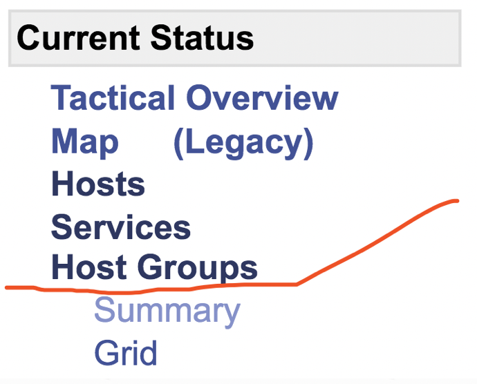
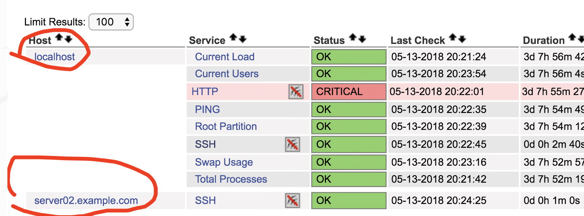
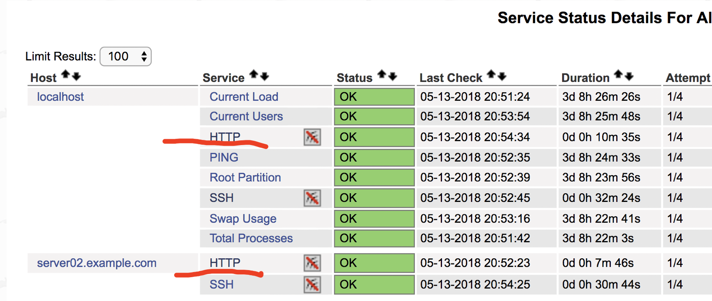
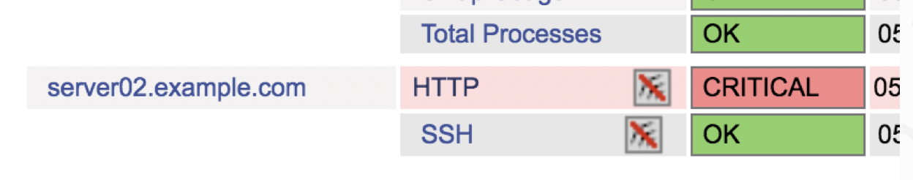
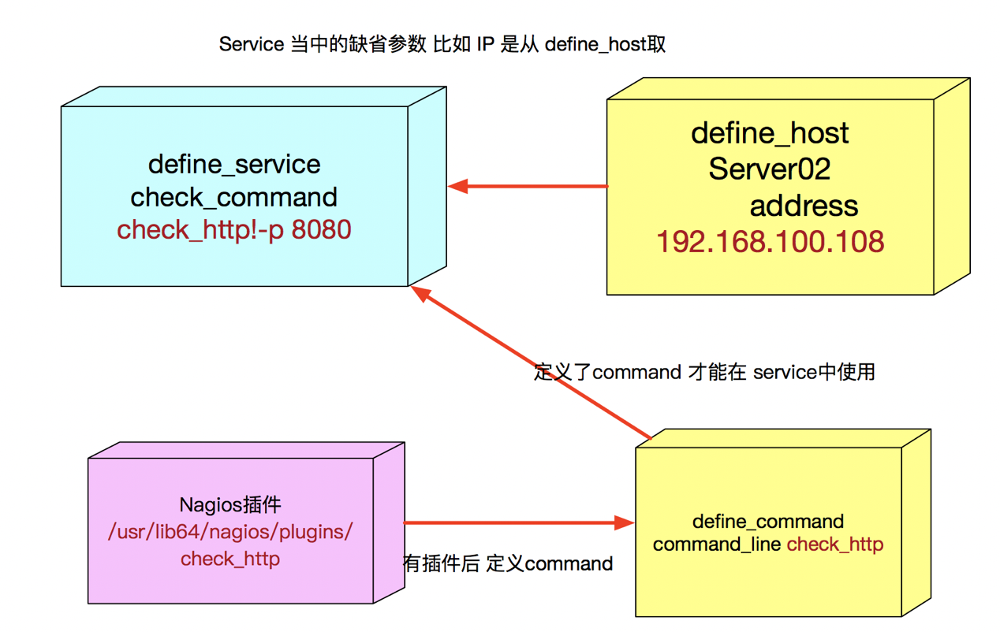
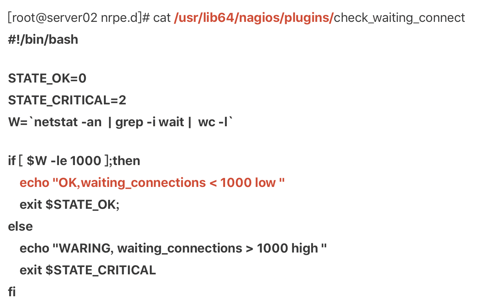

## 23\. 做好Nginx的监控-下篇

\[配置service服务的监控\]

通过上篇的学习，我们已经可以定义出监控的基本项目  
不过如果想监控nginx这样的服务，我们还得学习服务的监控方法，如何在nagios中定义  
定义好节点之后， 接下来 我们继续学习 如果定义一个host\_group 也就是组的定义

在Nagios中 各个节点的定义毕竟是分散的，我们可以将属于一类的'节点' 统一成一个'组'

接下来 我们来看下 配置文件的定义

```plain
define hostgroup{
        hostgroup_name  linux-servers ; The name of the hostgroup
        alias           Linux Servers ; Long name of the group
        members         localhost , server02.example.com , server03.example.com,server04.example.com     ; Comma separated list of hosts that belong to this group
        }
```

如上这一段 添加到 localhost.cfg , 就是把之前的四个节点（包括本机） 都加入到一个host\_group组当中

hostgourp\_name定义组名称 很好理解  
alias 则是起一个组别名

重要的是最后一项 members的定义

members 后面接上各个节点的 host\_name, 注意 这里的host\_name 就是节点当中的 host\_name， 必须一致 ，且不可以使用别名  
用逗号分隔开， 不然语法会报错

之后 我们来到Nagios页面 看一下定义的组  
左边找到如下 Host Groups

  
之后 右边会显示这个组的信息，以及组的成员

组的定义 在企业的使用中 非常实用，企业中往往 会有少则10多个，多则上百个 大大小小不同的集群  
每一个集群 都可以单独定义一个Nagios组名称， 比如 webserver\_group / DB\_group 等等这样  
在查看监控的时候，可以快速定位集群

学会了host\_group定义后，咱们再学一项新的定义内容  
就是 Nagios service(服务)的定义

定义好 节点，定义好组 这两项之后，Nagios也仅仅提供了 整机监控（也就是ping联通性）  
可是我们还需要监控更多的东西，比如 我们也要知道 被监控机器上 SSH服务是否可用  
那接下来 就要依赖Nagios service的定义了

我们来看如下这一段，取自localhost.cfg中  
这一段就是默认模板提供的 service定义方法 用来监控机器的各类服务（软件）

```plain
define host 
{host_name }

define service{
        use                             local-service         ; Name of service template to use
        host_name                       localhost
        service_description             SSH
        check_command                   check_ssh
        notifications_enabled           0
        }
```

基本的写法跟 定义 define\_host 差不太多，不过关键字有了变化

use 字段我们保留不更改  
host\_name: 这里 写上在 define\_host当中定义的 节点名字， 依然注意 必须跟之前的host\_name一致 不然Nagios找不到  
所以，这里也再次证明了， 定义节点是多么的关键，后续会大量的 二次引用

service\_description 这里仅仅是 这一项服务监控的注解， 可以随意写成你要的名字

check\_command 这是最关键的一项了，定义这一项服务监控 具体要监控什么内容，调用什么监控脚本去执行 (后面我们会讲到 脚本自定义)  
notifications\_enabled 是否开启提醒功能。1为开启,0为禁用。也就是是否 开启报警 针对这一项服务的监控(我们后面会讲到报警 Pagerduty)

学会了nagios service的定义方法后， 接下来 咱们来做一下扩展  
上面SSH的实例 ，我们可以看到如下  
host\_name localhost  
其实是针对 本机（Nagios 服务端本机） 进行的service 监控

接下来 咱们再复制添加一份SSH监控，并改成监控其他客户端

```plain
define service{
        use                             local-service         ; Name of service template to use
        host_name                       server02.example.com
        service_description             SSH
        check_command                   check_ssh
        notifications_enabled           0
        }
```

上面 我们只把host\_name 改成 server02.example.com即可 （依然注意 必须使用完全一致的 host\_name）

重启nagios服务后 再来看一下 nagios的主页  
  
我们发现 点击service之后，右边出现了 两台机器的service监控

localhost 和 server02  
所以 我们就可以以此类推 后面继续添加其他的机器 陆续进入服务监控中了

接下来 我们除了SSH service之外，再来添加一项其他的监控  
我们来在 localhost.cfg 后面 添加如下 两项配置 （第一项 其实已经是自带的了）

```perl
define service{
        use                             local-service         ; Name of service template to use
        host_name                       localhost
        service_description             HTTP
        check_command                   check_http
        notifications_enabled           0
        }
define service{
        use                             local-service         ; Name of service template to use
        host_name                       server02.example.com
        service_description             HTTP
        check_command                   check_http
        notifications_enabled           0
        }
```

上面这两项 用来监控 本机和 server02的 HTTP服务  
其中红色标记的地方 就是新改的  
这次因为需要 监控http服务了， 所以使用 check\_http 作为监控命令

这里添加的时候需要注意如下 两项

1） check\_http 本身是监控 http url是否可以正常访问的， 默认是 以 [https://IPADDRSS](https://ipaddrss/) 来访问 （80端口）  
其中的IP地址 就是你在define\_host当中定义，并且延伸下来的  
添加这两项监控之前 你需要保证 机器上 确实开启了 工作在80端口的 web server (apache 或者 nginx 无所谓)

2） check\_http 默认是监控 例如 [http://127.0.0.1/index.htm](http://127.0.0.1/index.htm) （或者是其他web server中定义的index.xxx）  
所以 你还必须保证 在你的web server配置的 root路径下 要存在首页(默认apache是在 /var/www/html/ , nginx在/usr/xxx/shar/html 版本不同 请各自查看)，不然 也是监控失败

3） 一旦check\_http 访问失败，不能返回200 ，那么监控主页 就会显示成 warning 或者 failed

正确的监控图 如下  
  
\[服务监控的进一步探索\]

上一个小节最后， 我们留下了一个问题，service监控 如果需要变通的时候 怎么办呢？

接下来 我们就得 深入一步 来学习 nagios的插件了

```plain
define service{
        use                             local-service         ; Name of service template to use
        host_name                       server02.example.com
        service_description             HTTP
        check_command                   check_http
        notifications_enabled           0
        }
```

上面这一段 service 配置中，红色标记的部分 ，之所以能直接调用check\_http  
并不是天上掉下来的 ，而是有依据的  
这个依据就是 nagios的插件 （我们之前安装的时候 不是安装了很多 nagios-plugins吗 这个就是插件）

nagios 定义service中 check\_command 其实就是通过调用插件当中 预先设置好的 这些脚本（ check\_http其实就是个脚本）  
才能实现监控的

我们接下来 分如下几步来分析 这些脚本和插件的关联

1） 首先 我们先执行如下命令行  
rpm中 先找到 跟http相关的 nagios插件  
\[root@server01 nagios\]# rpm -qa | grep nagios-plugins | grep http  
nagios-plugins-http-2.2.1-9git5c7eb5b9.el7.x86\_64

check\_http这个脚本 其实就来自于 这个插件

2）接下来 我们来查看 这个插件中 都包含了什么具体文件（脚本）  
\[root@server01 nagios\]# rpm -ql nagios-plugins-http-2.2.1-9git5c7eb5b9.el7.x86\_64  
/usr/lib64/nagios/plugins/check\_http

如上就可以看到 ，其实 check\_http 是放在了一个 默认的 nagios插件路径当中了，作为脚本被 nagios调用

3） check\_http这个脚本找到后， 我们在Linux本地来试一下

\[root@server01 nagios\]# /usr/lib64/nagios/plugins/check\_http -H 192.168.100.108  
HTTP OK: HTTP/1.1 200 OK - 275 bytes in 0.002 second response time |time=0.002124s;;;0.000000 size=275B;;;0

哦 我们发现 原来这个脚本 不光可以被 nagios的 check\_command直接调用  
它自身还可以直接被 咱们执行 并能返回结果

4）接下来 我们本地用这个命令 来变通一下

我们把 server02的 httpd 端口改到 8080

改好之后 原本的nagios 配置的check\_http 就监控不到了  
于是乎 nagios主页会变成这个样子  


那么怎么办呢？ 我们现在Linux本地 试试 check\_http 脚本 是否支持端口改变

\[root@server01 nagios\]# /usr/lib64/nagios/plugins/check\_http -H 192.168.100.108 -p 8080  
HTTP OK: HTTP/1.1 200 OK - 275 bytes in 0.002 second response time |time=0.001994s;;;0.000000 size=275B;;;0

如上图命令行的最后， 其实可以 添加一项参数 -p 来改变端口

这样以来， check\_http 就可以监控其他的端口了

但是这里咱们又遇到一个疑难问题了， 虽然这里我们使用check\_http脚本本地执行 可以实现了  
但是 本地执行脚本 跟 nagios service的配置 目前还没有关联起来啊，还是起不了作用呀  
那咱们下一个小节开始 ，咱们继续学习 如何建立这种关联

首先我们先 找到这个配置文件  
/etc/nagios/objects/commands.cfg

在找到 其中这一段配置  
如下这一段配置，其实是把 check\_http定义出来  
名称 以及 使用方法 参数如何调用 其实都是在这里设置的

```ruby
# 'check_http' command definition
define command{
        command_name    check_http
        command_line    $USER1$/check_http -I $HOSTADDRESS$ $ARG1$
        }
```

所以说 ，在 service（define\_service）中的 check\_http ，其实先要在 command.cfg中定义出来(nagios => \*.cfg)  
define command 就是定义一个监控脚本的关键字

接下来 咱们来看其中的这一行  
command\_line $USER1$/check\_http -I $HOSTADDRESS$ $ARG1$

这一行 就是咱们要找的关联地点了， 我们上一个小节中插件所在的路径(rpm => /usr/lib64/nagios/plugins/check\_xxxx)，其实存在 $USER1$/ 下

关联这个命令之后，咱们还得 给这个命令 配置参数定义

我们把 这里nagios\_commonad定义的命令 和 本地命令行使用脚本的用法 放在一起

本地命令行是这么用的 /usr/lib64/nagios/plugins/check\_http -I 192.168.100.108 -p 8080

command\_line中 是这样的 command\_line $USER1$/check\_http -I $HOSTADDRESS$ $ARG1$  
Nagios define\_host(IP)

我们注意 两行后面的 红色部分 ，这下其实不用我说 大家也看明白了  
参数在两边的定义 是一一对应的  
先是 -I + IP地址 ， 再是 -p + 端口

不过这里有一个地方需要特别的注意  
$HOSTADDRESS$ 这里 是取自service定义当中 host\_name机器对应的 ip地址  
而$ARG1$ ，比较特殊， 这个参数的值 是需要在 service中自行定义添加进去的 (define\_service , ARG1 传参数)

这么说 可能还是不太好理解， 没关系 咱们拿一段配置来给大家讲解

接下来 咱们来看一下 这样一段 service 的定义

\[root@server01 nagios\]# vim objects/localhost.cfg

```plain
define service{
        use                             local-service         ; Name of service template to use
        host_name                       server02.example.com
        service_description             HTTP
        check_command                   check_http!-p 8080
        notifications_enabled           0
        }
```

我们把之前定义的 check\_http 的配置 改成如上这个样子  
我们注意一下 红色标记的部分  
check\_command check\_http!-p 8080

这就是在 service中 调用监控脚本时候，添加额外参数的方法 使用 ! 分开  
！每一项参数 都用这个个离开 ， 参数的使用方法 跟本地命令行 是一模一样的

不过这里细心的朋友 会有这样的一个疑问  
check\_command check\_http!-p 8080  
之前 check\_http 在使用的时候，不是用了两个参数吗？ -I ipaddress , -p 8080  
怎么在这里 调用的时候 只有一个-p 参数呢？

说到这里 其实就回答了刚才的疑问， 现在明白了 刚才的两句解释了

$HOSTADDRESS$ 这里 是取自service定义当中 host\_name机器对应的 ip地址  
而$ARG1$ ，比较特殊， 这个参数的值 是需要在 service中自行定义添加进去的

这几个配置文件 和插件 直接的关系 可以用如下图 来表示  
  
接下来 我们重启 nagios来看下 监控主页 是否已经对HTTP的监控改了 端口

\[自己编写任意的监控脚本\]

我们注意到没有 之前我们在 使用nagios的时候 添加监控项目 要么是 nagios自己自带的  
要么是 nagios\_plugins\* 插件包提供的

其实 Nagios插件 是完全支持 自己动手编写的 只要你写的脚本 符合了一定的规则 那么 就可以被Nagios识别了

接下来 我们来看一下如下这一段 shell 代码

这就是 一段自行编写的 nagios监控脚本

脚本实现的内容很简单， 就是通过 netstat命令来获取 Linux系统中的 等待链接数(waitting\_connections)  
如果大于1000就报警 ，小于1000 就属于正常  
Nagios可以识别4种状态返回信息，即 0(OK)表示状态正常/绿色、1(WARNING)表示出现警告/黄色、2(CRITICAL)表示出现非常严重的错误/红色、3(UNKNOWN)表示未知错误/深黄色  
Nagios根据插件返回来的值，来判断监控对象的状态，并通过web显示出来，以供管理员及时发现故障。  
  
写好脚本后，接下来 先不管Nagios ， 我们本地测试一下  
本地测试好了脚本之后， 下一步， 咱们找到nrpe的配置文件， 添加一项新的命令(nrpe)

```plain
[root@server02 nrpe.d]# cat /etc/nrpe.d/lcgdm-common.cfg
command[check_cpu]=/usr/lib64/nagios/plugins/lcgdm/check_cpu
command[check_network]=/usr/lib64/nagios/plugins/lcgdm/check_network
command[check_process]=/usr/lib64/nagios/plugins/lcgdm/check_process -p rfiod,globus-gridftp-server
command[check_hostcert]=/usr/lib64/nagios/plugins/lcgdm/check_hostcert -C /etc/grid-security/hostcert.pem -s

command[check_waiting_connect]=/usr/lib64/nagios/plugins/check_waiting_connect
```

回到服务端 nagios 服务端添加

```plain
define service{
        use                             local-service         ; Name of service template to use
        host_name                       server02.example.com
        service_description             WAITING_CONNECTS
        check_command                   check_nrpe!check_waiting_connect
        notifications_enabled           0
        }
```

接下来 保证 客户端 nagios用户 有权限执行 监控脚本

然后来到服务端 检查

```coffeescript

[root@server01 objects]# /usr/lib64/nagios/plugins/check_nrpe -H 192.168.100.108 -c check_waiting_connect
OK,waiting_connections < 1000 low
```

如上就是脚本的编写方法了

