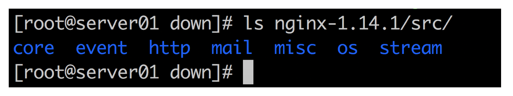
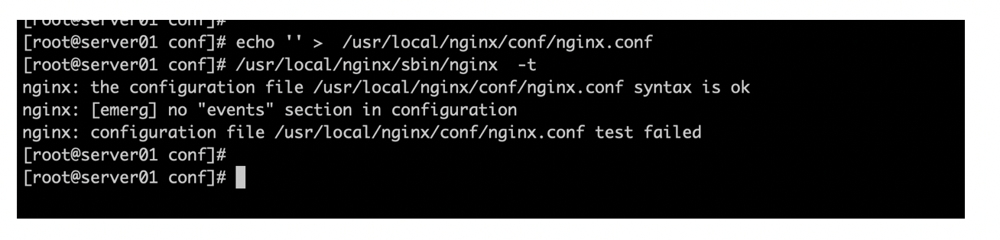
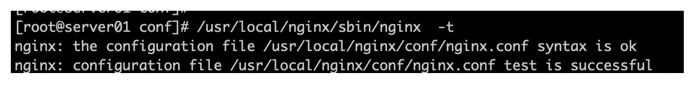
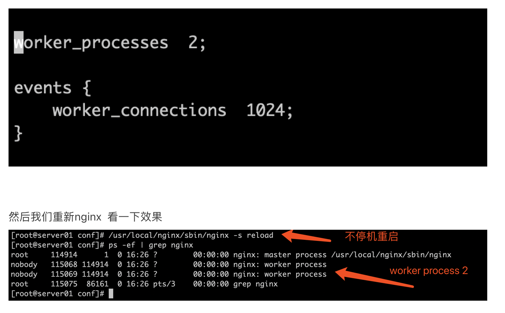
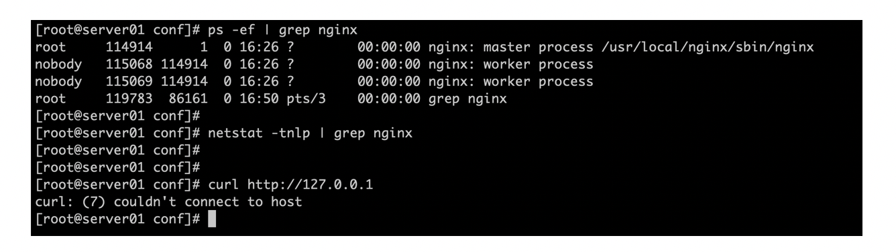
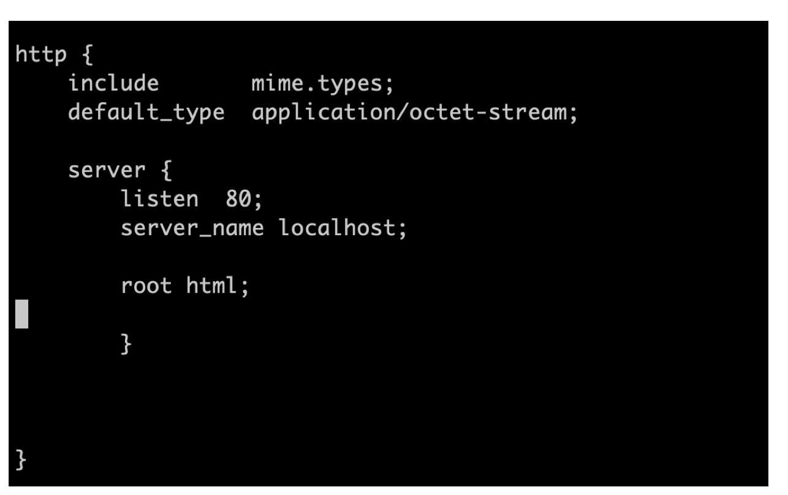

# 3.从配置文件开始 理解Nginx的模块化

## 3.从配置文件开始 理解Nginx的模块化

在运维界有这么一句话叫做 ， 配置文件是源代码的缩影 ，看不懂源代码没关系 配置文件一定要能看懂

上一个篇幅中 大米带着大家 照葫芦画瓢的 把nginx和一个首页跑起来了， 但是这在学习NGINX的万里长征中 仅仅迈出第一步  
(最多也就算是个 NGINX版的 HelloWorld 而已)

所以 为了继续深入学习 咱们就从头好好认识一下NGINX的配置文件吧

说配置文件是缩影 是因为 配置文件才是决定了 NGINX到底是怎么如何运行的 ， 大米之前跟大家说过 NGINX是一个高度模块化的开源软件对不？ 那咱们现在就针对这个"模块化" 来一探究竟

首先 还记得第一次 看到所谓的"模块化" 是在哪里？就是如下图 咱们刚刚解压完nginx的src目录下（存放着源代码）  


这些源代码 按照"模块"划分成好几 目录 ，每一个目录对应一个模块的名称 其中 可见的最重要的有  
core : 核心模块 event : 事件模块 http：页面模块 这几项

我们现在知道了 代码都是按模块来划分， 如果要让NGINX正常提供服务 就必须得恰当的调用起一个一个模块 才行 对不？

提问： 请问老师 怎么调用啊 ？ 我看不懂代码

回答： 我不是说过了吗 代码现在看不懂无所谓， 想调用模块 咱们用配置文件即可

接下来 我们来看一下NGINX的配置文件组成结构

我们从NGINX最重要的 主配置文件 nginx.conf来一点点看配置

首先是 全局配置指令 我们称作 main block (主配置段)

主配置段的 配置指令 一般就放在nginx.conf前面 就如下所示

```plain
user  nobody;
worker_processes  1;
error_log  logs/error.log;
pid        logs/nginx.pid;
```

这种 主配置段的配置指令 不需要放在花括号中 {} 而是直接 由 配置项 + 配置值 组成

接着，其他的 都是由模块配置段 组成

比如在 nginx.conf中 首先第一个可以看到的 模块配置段 就是event{}  
模块配置段 按照一个一个模块的名称 ＋ 花括号 来定义  
然后 花括号的内部 再一行一行的添加 这个模块中的 各种配置项+值

event{  
...  
}

event是 nginx的事件驱动模块 主要是提供面对用户的并发响应相关的功能（等我们后面 深入讲解NGINX的底层运行机制的之后 会返回头来看 会更清楚）

接下来的 模块配置段 就是

http {  
...  
...  
}

HTTP模块 是最重要的 给nginx提供 web请求处理的模块 ， 而且这个模块中 还会继续嵌套其他的重要模块  
比如

http{

server {}

}

如上所说的 main block , event{} , http{} 这三部分加在一起 就构成了nginx最主要的配置 因为没有它们 nginx就没法正常使用了  
（nginx还有其他很多扩展的 模块 但不是最必要的 ）

nginx的模块配置段 有两个特点  
第一 ： 部分模块中 还可以嵌套其他的模块  
第二 ： 模块中 的配置值 有的时候 并不仅限于一个模块中来调用，也支持在其他的模块中调用

比如 还记不记得 我们之前讲过的 root 配置项？ （用来定义 网站资源的根目录在哪里 ）

这个root 即可以定义在 location{} 模块中， 也可以定义在 server{} 模块中

提问： 老师啊 我现 在知道配置文件大体什么形式了 不过 这些配置中的 各个模块 以及模块中的配置项 都是用来做啥的啊 怎么入手才好呢

回答： 俗话说 书到用时方恨少 NGINX的模块和各种配置项很多很多 一个一个光秃秃的死背概念是没法学会的， 咱们下面 尽量采用实验的方式 来对一些重要的配置项进行认知 很多功能只有到了遇上需要的场景的时候 咱们才能体会它的作用

首先 咱们先把 nginx.conf备份一下 然后再整个清空 然后一项一项的添加进去 以此来看看NGINX的表现如何



nginx.conf 内容清空后 我们使用 nginx -t (-t 是检查配置文件正确与否的 以后要反复使用) 提示配置文件出错  
events{} 模块没有被定义哦.... - -

那看来 NGINX中 最少最少要调入一个 events{} 事件处理模块 才可以 ，不然连启动的资格都没有

接下来 咱们把 events{} 加上一个配置项 添加进去

events {  
worker\_connections 1024;  
}

然后咱们检查一下语法 再尝试启动



现在是正常了，说明NGINX启动 最少需要一个events{}模块 不然就没有 响应用户请求的最基本功能了

接下来 worker\_connections 1024 又代表什么意思呢 ？

别着急 我们紧接着 先在 nginx.conf 最上面 再补充上如下一行



这里我们通过 ps 看到 nginx启动后 一共有三个进程

一个master叫做主进程  
两个worker进程 叫做工作进程

我们用下面一幅图来给大家解释一下 nginx的 基本工作原理


nginx采用 master/worker的形式来工作的 ， 也就是说 通常情况下 nginx先启动一个 master进程 这个进程属于"纯管理"的工作  
并不参与处理用户的请求的处理， 它是负责 调度开启workers ， 加载配置文件，启动停止服务等等 。 而真正用来处理 HTTP请求 则全部都由workers进程担任

master进程只启动一个（一般拥有root权限） ， 而worker进程则可以有多个

那么学员问了， worker进程 启动几个由什么决定呢？ 另外 每个worker进程 能处理多少请求呢？

^\_^ 这就等于是回答了 咱们刚才的问题了

worker\_processes 2;

events {  
worker\_connections 1024;  
}

刚刚咱们加入的配置文件 worker\_processes ２ 决定了 一共启动两个worker进程  
而 worker\_connections 1024 设定了 每个worker进程 可以同时最多处理 1024个 HTTP请求

不过说到这里 咱们又遇到一个问题了 -\_-

现在nginx起来了么？

回答：起来了

那nginx现在可以处理请求么？

回答：处理不了

我们看下 Linux上面的情况



如上这张图看到了么， 我们的 nginx 连端口都没有开启 根本无法接受请求啊 就算进程起来了 也没有用处

那怎么办呢？

继续加配置文件啊 调用模块啊！

nginx想要拥有 处理http的基本功能 必须调用 http{}这个最大的模块 才可以的哦

另外 在http{}模块中 我们还需要再调用一个 server{}模块 用它来定义出一个 "虚拟主机"

虚拟主机的概念

虚拟主机，就是把一台物理服务器划分成多个“虚拟”的服务器，每一个虚拟主机都可以有独立的域名和独立的目录

或者说的再简单点，就是一个虚拟主机 就可以理解是 一个"网站" 多个虚拟主机 就可以是多个"网站"

nginx中 最少要有一个 虚拟主机 server{} 才可以正常工作



接下来 咱们把 http{} 以及 server{}模块段的配置 补在后面 如上图所示

http{} 起头 先调用mime 是为了让nginx 不但可以处理纯文本 也可以处理多媒体

举个例子来说吧， 你平时访问一个网站的时候 难道只有文字？？ 一定还会有各种图片 动画 flash 对不？ ^\_^

接下来是 server{}模块中的 配置项

listen 80 ; 我们让这个 虚拟主机 监听在８０端口  
server\_name localhost; 这是虚拟主机名称 是个非常重要的配置项 当前我们先不太多解释 后面会详细说这里

root html; 这个我们之前在 创建咱们第一个 主页的时候 也介绍过吧， 就是设置 网站的主目录在哪里 主页面 就存在这个目录下的哦

好了之后 我们重启nginx

看下是否成功

