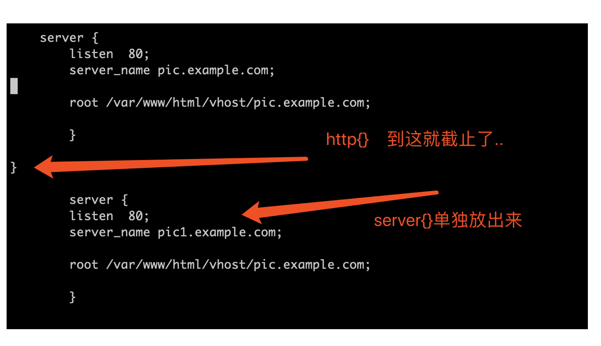
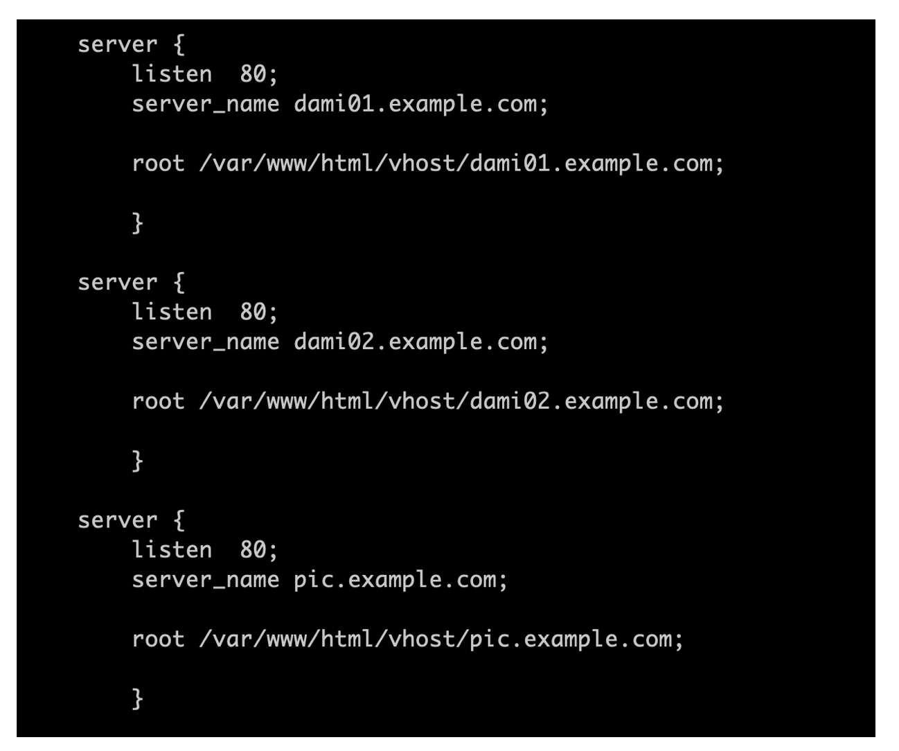
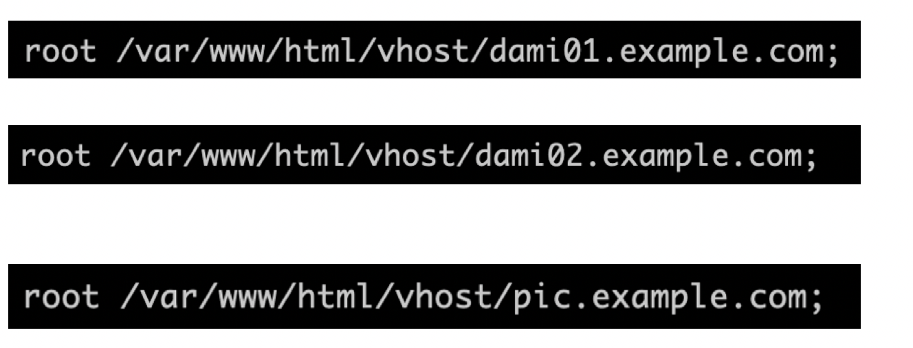

## ４.从配置文件开始 理解Nginx的虚拟主机 和 DNS解析捆绑

【网址域名和DNS的来龙去脉】

我们在上一个篇幅中 从配置文件开始 逐步理解nginx的工作流程

到了这个篇幅中我们要讨论一个关键点 同时也是难点 那就是虚拟主机的概念 以及DNS  
（对于初学者来说 这里的概念很不容易理解 但是一旦搞清楚了 收益会非常大）

请大家现在思考一个问题 我们平时是怎么访问某个网站的？

回答：输入网址呗 这还不简单么 比如 www.baidu.com . www.nginx.org 等等

但是你有没有想过 当你输入网址后 背后发生了哪些细节 到底是怎么就访问到某个网站上了

如果要搞清楚这个来龙去脉 先不说NGINX 咱们先从DNS开始

DNS是什么东东呢？ domain name server 域名服务

说的简单点 就是IP地址才是我们真正要去到地方对不？ 可是网站的IP地址几千万个上亿个 你记得住吗？记不住的

那自然就要有个方便记忆的名称 来替代繁琐的IP地址了 对不 这就是网站的域名

比如 www.nginx.org 就最终一定会 解析到一个IP地址上去了

之前咱们说过 网站的建设 一定会涉及 服务器和WEB服务 对不？

那么解析出来的IP地址 会直接对应的是一台物理服务器的IP地址 这是咱们最容易想到的

但遗憾的是 真实情况中 往往一个网址（尤其是比较大的网站的网址）对应的IP 肯定不是直接对应"一台"服务器 因为一个站点的流量是很大的 只可能用集群来搭建 ， 所以 这还涉及到 负载均衡 VIP 等等的概念 我们还没学到 暂时先不讨论

咱们先考虑简单的情况， 用一台物理服务器搭建一个网站 有没有可能？

回答：如果是流量很小的网站 这是完全可以的

接下来 我们继续往下走

假设我们现在在公网搭建了一台服务器 公网IP地址A 并使用NGINX架设了一个网站（很简单的静态网站） 我们希望 别人可以通过 类似 www.abc\_test.com 能访问上去， 我们需要做的事 就是在公网DNS服务器上 注册我们的网站域名 把它指向解析到 IP地址Ａ 别人就可以在世界各地访问到我们的首页了  
（当任一一个人想访问你的网址的时候， 它输入 www.abc\_test.com , 会先向 公网DNS服务器 询问对应的IP地址是多少 然后才会访问到你的网址首页）

可是我们在学习过程中 没有这样的条件 而且 我们的 虚拟机也是在自己的电脑上搭建的 都是通过内网访问的  
咱们现在 既没有公网IP可用 又没有DNS服务器可用

这种情况下 我们依然希望通过 用网站域名的方式来访问自己的站点 怎么整？

那么 接下来 大米就介绍给大家一个 在企业中测试 经常使用的方法 本地DNS解析捆绑的方式

不管你用的是windows 还是 Mac 或者是Linux

都会有本地的DNS解析配置文件 hosts 每个系统位置不一样 （具体的可以网上搜索）

因为本地hosts文件添加的解析记录 优先级是最高的 所以 一旦添加一个域名之后 操作系统就会仅仅使用hosts的记录 而不再理睬公网DNS服务器所解析的了

咱们举个夸张点的例子 ， 比如 你自己使用NGINX搭建了一个首页 你想用 www.nginx.org来访问它 可不可以

（试想一下 www.nginx.org 这可是nginx官网的域名 你现在都可以借用这个名称 强行本地解析指向到你自己搭建的站点上了 ）

比方说 我现在 就想用 www.nginx.org 来访问我自己搭建的nginx首页 ， 我使用的是mac系统

那么 我就把 www.nginx.org 192.168.0.100 加入 /etc/hosts即可 很简单

【掌握NGINX虚拟主机 SERVER的概念 极其重要】

为什么前面 咱们花了一大段篇幅 来给大家讲 网站域名和DNS呢

那是因为 接下来 咱们就得用 上面的掌握的知识 来进一步 探索nginx中的 虚拟主机(SERVER)的相关用法了

咱们之前讲过 NGINX的模块化的设计，有了最核心的三个组成部分 main block + event + http 就可以开启NGINX的基本工作模式了

接下来 咱们看看请求到了NGINX后 是怎么被接手而后处理的

HTTP{} 模块 作为处理WEB请求的总入口 这个我们已经了解了

接下来 到了下一个关键 也就是 SERVER{} 模块

SERVER{}模块 是附属于 HTTP{}模块的一个极其重要的模块 它不能脱离HTTP{}而单独存在（HTTP模块 可以认为是最大的 最上层的 所有和处理web相关的其他模块 都属于是它的"下属"）

我们上一个篇幅中 给大家讲过 NGINX的配置中 HTTP{} 怎么用 例如下面

http {

server {}

}

看到了吗 ， server{}是http{}的下属 ， 所以它必须在http{}大括号内部调用， 绝对不能"放出去" 单独调用的

接下来 咱们做个小实验 偏偏把SERVER{}模块 从HTTP{}中给移出去 放到外面去试试 看看NGINX什么反应

接下来 我们用 nginx -t 检查一下语法 看看会怎么样哦

看到了没! ? 错误提示说 server{}模块 不允许被定义到这个位置 意思也就是说 server{}模块 不可以脱离http{}模块 而单独调用的

明白了这个道理后，咱们继续往下推进 回到主题 server{}模块

server{}模块 之所以那么重要 是因为 它是作为 用户的web访问 到达nginx的 http{}模块之后 第一个接手的重要入口

为什么这么说呢 咱们先来看看下一附图

在这幅图中 我们从左上开始看 看到什么？ 对 就是用户输入的网址 URL

一切从网址开始 ， 而你想想 为什么 输入一个网址 就可以访问到你想要的网站的页面？

那是因为 这平凡的网址中 包含了一些 非常重要的 关键信息 正是因为这些关键信息的存在 才能最终把你导向到 正确的地方

首先 http:// 这个起头 说明咱们现在从浏览器发起的是 http协议的请求， 那接手人 就必须得是像nginx这样 可以处理http协议的软件 才行 对不？

再接下来 dami01.example.com 这个咱们之前说过 这是网址域名 需要先被DNS翻译成 IP ， 然后才能到达咱的 服务器上对不？

然后 注意这个地方

多了个80后面， 之前没有这么写过， 其实这才是 完整的网址域名的写法哦

域名+端口 （或者 IP + 端口 ， 但是一般情况下 没人会这么用的！）

这个后面的端口 其实是所有网址在输入的时候 都必须存在的， 只不过 如果是80端口的话 默认你不写上 浏览器也会自动帮你补齐了  
只是你没注意而已

接下来继续

有了域名了 -> 被DNS翻译成IP . -> 请求就到了 这个IP的服务器上了

接下来呢？ 自然就是nginx要接手了 对不对 继续看图上

当请求到达NGINX后， HTTP{}模块 派遣出SERVER{}子模块 来进行第一步的应答

应答的关键 就是在于 分析 用户网址请求中附带的两个关键信息  
（准确的说 应该是附带了三个关键信息 ， 还有一个咱们后面会单独讲 也就是location 现在先不管）

dami01.example.com:80

第一个关键信息 ： 域名

在这里其实起了两个作用 ， 不仅仅只是 解析了IP地址 为了到达机器上  
还有一个 非常关键的作用 就是访问的域名不同 SERVER{}模块提供的待遇就会不一样的

第二个关键信息： 端口

端口这个比较好理解 ，就不再多解释了

所以说 在HTTP{}模块中， 用于首次接手用户请求中 两个关键信息的子模块 就是由SERVER{}提供的了  
根据用户输入的 域名或端口不同 ， SERVER{}模块 就会给予不同的待遇（不同的处理方式）  
(理解好这里 是非常重要的关键！！！一定要反复精读琢磨)

接下来 咱们看看 SERVER{}的一般写法

如上面这张图所示， SERVER{}模块中 三个起着决定性作用的配置项

listen server\_name root

listen是开放在哪个端口 ， 这个比较好理解

server\_name . 这是关键，用户输入的 域名是什么 就在这里匹配  
比如 当我输入网址 dami01.example.com 就匹配到 第一个server{}  
当我输入网址 dami02.example.com就匹配到 第二个 server{}

然后 我们看第三个 root ，网站提供资源的根目录在哪里

其实说到这里 就很容易解释了， SERVER{}的任务 就是根据用户 输入的 域名或端口的不同 来提供不同的待遇  
第一个SERVER{}匹配补上，就第二个 以此类推

但是总说"待遇"不同， 这个待遇究竟指的是啥啊？ 那么root在这里 就是一个很好的回答

根据匹配的SERVER{}的不同， 那么 NGINX最终返回给用户的 页面就不一样了呗 不同的页面存放在不一样的路径中哦

所以 这就是SERVER{}的用途和工作机制， 大部分企业中的这样用法 都很类似

接下来 咱们来做实验

请先分别 在你的Linux上 创建类似如下的三个 目录，用来存放 不同的index.html 用来匹配不一样的SERVER{}

然后 把三个index.html 修改一下 做个区分

比如这样

这样一看页面效果图 就证明 匹配到了哪个 SERVER{}中的 SERVER\_NAME

最终的实验结果 就是下面这样

看到了吗 ， 同样是一台NGINX服务器， 输入的域名不一样 ， 得到的结果就是不一样的

这里 再补充说明一下

在企业中 这样利用NGINX的虚拟机功能 是非常常见的

往往一台NGINX服务器上，都会配置一大堆不一样的域名， 但是这些域名 都解析到同样的一个IP地址上

根据域名调用的不同 则给予不一样的返回结果。
