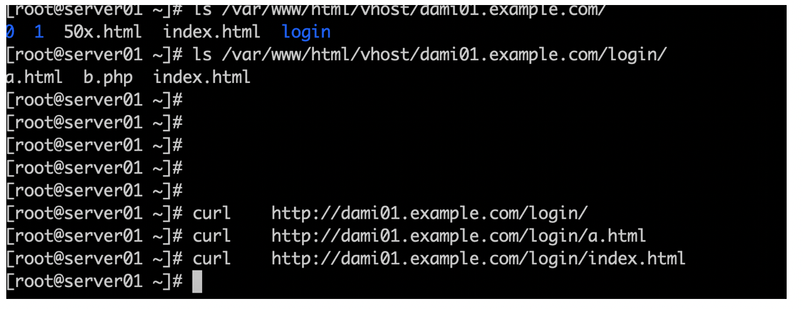

## 8.认识Nginx中的location和正则表达式，一起啃这块硬骨头（下篇）

\[location 匹配的优先级排序 和官方实例练习\]

上篇中 我们接触了 location的URL匹配实例 并有了一定的了解

（需要跟大家补充说明的一点是：在刚开始学习location的时候，尽量先使用return的方法 确认有没有正确匹配  
而不要上来就把location和root放在一起使用练习，因为这两项有特殊的交互关系，咱们在这一篇中 会讲解)

location的匹配 符号主要使用的是如下这几种种

> 1, = 精确精准匹配  
> 2, ~ 正则表达式匹配 区分大小写  
> 3, ~\* 正则表达式匹配 不区分大小写  
> 4, ^~ URL左半部分匹配 不区分大小写 （这个在上篇没有出现 ）  
> 5, 无匹配符号 （例如 location /nginx 这样）

那么接下来 咱们来看一下优先级的排序吧

正常情况下 优先级由高到低的顺序是这样排列的

1 > 4 > 2|3 > 5

精确匹配永远是最高优先级 这个没疑问

接下来的第二高优先级是 ~^ （一会我们用官方实例来解释 就很清楚了）

第三优先级 是 ~\* 或 ~ ，这两种只是区分大小写的区别 排在同一个优先级

最后的优先级是 无符号

接下来呢，咱们通过nginx官网提供的一段 实例来进行一个综合的解释吧，大家也请自己多多跟着练习

```coffeescript
location = / {
    [ configuration A ]
}

location / {
    [ configuration B ]
}

location /documents/ {
    [ configuration C ]
}

location ^~ /images/ {
    [ configuration D ]
}

location ~* \.(gif|jpg|jpeg)$ {
    [ configuration E ]
}
```

请看上面这一段 location的配置

官方给出了如下这么一段使用案例

The “/” request will match configuration A, the “/index.html” request will match configuration B, the “/documents/document.html” request will match configuration C, the “/images/1.gif” request will match configuration D, and the “/documents/1.jpg” request will match configuration E.

我们来翻译并解释一下

如果用户输入的是 / 那么A配置生效 因为A是精确=匹配，最高优先级哦

如果用户输入的是 /index.html , B配置生效，因为A肯定不行了 因为只能是 '/' , 而后面三项也都匹配不上

如果用户输入是 /documents/document.html 呢？ 配置C生效，因为当前只有一个/documents/ (请大家自己试试 如果同时再存在一个 localtion ~ /documents/的话 哪个生效吧 ^\_^)

如果用户输入 /images/1.gif 哪个生效呢？ 回答是D 而不是E, 为什么呢？ 咱们之前刚刚说过了， ^~这个匹配符号 是第二高优先级的，并且是URL左半部分匹配，意思就是说 URL 从/开始，有了images/到这里截止，后面的 就不再看了 直接生效 所以 E被直接忽略了

最后 /documents/1.jpg 呢 ？ 匹配的是E ,而不是C 为啥？ 因为C是无符号 排在最末尾的优先级哦

通过官方给的这样一个例子 相信大家对location匹配 更加清楚了一些

\[location和 root/alias的关系\]

这里是一个小难点了，我们一起来看一下吧  
alias我们一会再说，先看root这里

root表示文件资源路径的指定，这个我们已经知道了

接下来就是 root和location 这一对儿存在什么样的关系了

我们先来看如下这一段的配置吧

```plain
location ~ /test/ {
     root /www/root/html/;
}
```

如上这样配置的话  
如果一个请求的URI是/test/a.html时，web服务器将会返回服务器上的/www/root/html/test/a.html的文件。

其实这个例子就足够说明问题了

root和location 其实是一种继承的关系， 也就是说， 你location后面写的路径 会被追加到root的路径的后面  
也就是把 /test/ 放到 /www/root/html/test/ <- 这里来， 文件的寻找 会到这里去找

输入完整URL路径 /test/a.html 这个很好理解吧

不过 如果是走缺省的index主页呢？

例如 我现在输入的是 /test/ ，然后 你只要保证 在 /www/root/html/test/ 路径下 存在着 index主页即可 （比如 index.html）  
之后自动就会补全访问到首页了

但是这里有一个 特例 请大家往下看这个例子

这个特例 就是精准匹配模式下的 location和root

```coffeescript

         location = /login/ {
              root /var/www/html/vhost/dami01.example.com/;
         }
```

如果配置写成这个样子 就会造成一定的困扰了

为什么呢？ 就是因为这个 = 精确匹配的问题

精确匹配= 我们知道 这是跟用户输入的URL必须一模一样 完全一致的

而大多数情况下 我们在访问各个网站的时候，一般并不会在URL中 输入到具体的xxx.html xxx.php 之类的 ，而是到/path/这样的一个路径就截止了

接下来 是默认主页地址的跳转

但是 如上这样的精确匹配的情况下， 就算 我们在 /var/www/html/vhost/dami01.example.com/login/ 下面 准备了好了 各种 a.html , index.html 等等  
我们也访问不到

比如 如下的情况



为什么会出现这种情况呢？

答案就在精确匹配的情况下， 必须精确到 URL后面 所有的部分才可以  
比如输入/login/的情况下，感觉好像是跟location = /login/ 匹配上了，但事实上，后面被省略掉的主页地址 是会被自动填充上去 也计算在内  
而如果我们输入 /login/a.html 或者 /login/index.html 这样的话，就又跟 location = /login/ 不匹配了

所以 在使用精确匹配的时候 一定要注意这个问题  
如果 你location一定要使用精确匹配，那么就要按照如下这个样子 设定完整才可以访问到

```javascript

         location = /login/b.php {
              root /var/www/html/vhost/dami01.example.com/;
         }
```


所以，大多数情况下 我们还是更提倡使用 其他的匹配符号 更为稳妥一些

```plain

         location ~ /login/ {
              root /var/www/html/vhost/dami01.example.com/;
         }
```


看到了吗 ？ 改成 ~ 匹配， 或者无符号匹配之后， 我们无论怎么输入路径 都可以轻松正确的访问到资源 ^\_^

明白了root & location的关系后 ，咱们再来看一下 alias这个东东怎么使用

如下的这一段配置

其实alias跟root 唯一不同点就是， root继承location后面的path, 而alias则丢弃

下面这样定以后，其实资源就在/var/www/html/vhost/dami01.example.com/ 下寻找，而不是 /var/www/html/vhost/dami01.example.com/aa/ 下寻找

这样清楚了吧？ ^\_^

```plain

             location ^~ /aa/ {
                        alias /var/www/html/vhost/dami01.example.com/;
             }
```


```javascript
[location 和 proxy_path的联用]

         location ^~ /server02/ {
              proxy_pass http://server02:8080/server02.html;
         }

         location  /mynginx/ {
              proxy_pass http://nginx.org/;
         }
```

如上面这样两段的配置，要跟大家说明的是

proxy\_pass的调用 就是反向代理到某一个地址去 可以接upstream的地址 也可以接上某一个URL地址

而proxy\_pass 和 location一起使用的时候, location匹配 和 proxy\_pass跳转 并没有继承路径的关系

也就是说，location这一行只要匹配上了， 下面的proxy\_pass单独被执行 ，不会继承路径之类的 （这个跟root使用 有区别）

```xml
[root@server01 ~]# curl     http://dami01.example.com/server02/
hello this is server02

[root@server01 ~]# curl     http://dami01.example.com/mynginx/
beta version has been released with
<a href="http://mailman.nginx.org/pipermail/unit/2018-January/000029.html">
regression fixes</a>.
</p></td></tr>
            </table>
        </div></div></body></html>
```

最后 还要注意的一点是 , proxy\_pass和loaction在一起使用的时候， 不支持location调用正则匹配符号

比如下面这样的配置

```plain

         location ~* /mynginx/ {
              proxy_pass http://nginx.org/;
         }
```

会报出这样的错误

\[root@server01 ~\]# /usr/local/nginx/sbin/nginx -s reload  
nginx: \[emerg\] "proxy\_pass" cannot have URI part in location given by regular expression, or inside named location, or inside "if" statement, or inside "limit\_except" block in /usr/local/nginx/conf/nginx.conf:65

所以，location这里 只能使用 ^~, = , 或者 无符号  
（如果一定要使用正则表达式， 那么也有其他的方法可以实现 比如 nginx变量， 这个我们以后讲到了再提起吧）

\[正则表达式的练习\]

首先要说明的是 ， 正则表达式 是一个独立的知识体系，并不局限在nginx 或者 shell 或者 其他任何技术中

正则表达式 需要长期的单独学习 才可以熟练掌握

我们在这里 简单介绍一下 学习和练习的方法

学习正则 肯定少不了 先背诵一些通用的 正则符号 都代表什么意思

> 1、^：匹配字符串的开始位置；  
> 2、._: .匹配任意字符，_匹配数量0到正无穷；  
> 3、. 斜杠用来转义，.匹配.；  
> 4、（jpg|gif|png|bmp）匹配jpg或gif或png或bmp  
> 5、$匹配字符串的结束位置；  
> 6、i不区分大小写  
> 7 \\d：数字  
> 8 +：出现至少1次  
> 9 .：任意字符，除换行和回车之外  
> 10 ？：出现0或1次  
> (.\\d+)?：括号里内出现0或1次

然后接下来 拿出几个例子 自己尝试看懂是啥意思

比如 ^\\d+(.\\d+) 是什么意思呢？

行开头、至少出现一次数字、(任意字符和至少出现一次数字)

另外， 正则表达式，除了在location中调用外， 还可以在 server\_name中调用的哦

比如下面的例子

什么意思呢？

server\_name 第一个，除了输入 标准的 www.example.com以外，还可以支持 类似输入

www72.example.com 这样的输入方式， \\d+ 意思是啥？ 数字出现多次 ^\_^

```plain
server {
    server_name www.example.com ~^www\d+\.example\.com$;
}

server {
    server_name ~^(www\.)?(.+)$;
}
```

就按照这样的思路 来慢慢推荐学习 即可

