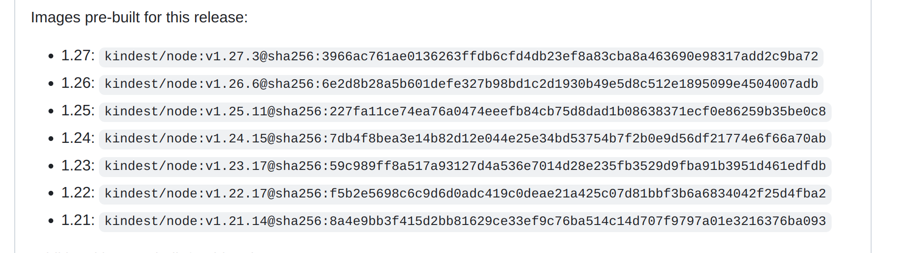

## 安装docker

**Ubuntu 14.04/16.04（使用 apt-get 进行安装）**

```bash
# step 1: 安装必要的一些系统工具
sudo apt-get update
sudo apt-get -y install apt-transport-https ca-certificates curl software-properties-common
# step 2: 安装GPG证书
curl -fsSL https://mirrors.aliyun.com/docker-ce/linux/ubuntu/gpg | sudo apt-key add -
# Step 3: 写入软件源信息
sudo add-apt-repository "deb [arch=amd64] https://mirrors.aliyun.com/docker-ce/linux/ubuntu $(lsb_release -cs) stable"
# Step 4: 更新并安装Docker-CE
sudo apt-get -y update
sudo apt-get -y install docker-ce

# 安装指定版本的Docker-CE:
# Step 1: 查找Docker-CE的版本:
# apt-cache madison docker-ce
#   docker-ce | 17.03.1~ce-0~ubuntu-xenial | https://mirrors.aliyun.com/docker-ce/linux/ubuntu xenial/stable amd64 Packages
#   docker-ce | 17.03.0~ce-0~ubuntu-xenial | https://mirrors.aliyun.com/docker-ce/linux/ubuntu xenial/stable amd64 Packages
# Step 2: 安装指定版本的Docker-CE: (VERSION例如上面的17.03.1~ce-0~ubuntu-xenial)
# sudo apt-get -y install docker-ce=[VERSION]

```

**CentOS 7（使用 yum 进行安装）**

```
# step 1: 安装必要的一些系统工具
sudo yum install -y yum-utils device-mapper-persistent-data lvm2
# Step 2: 添加软件源信息
sudo yum-config-manager --add-repo https://mirrors.aliyun.com/docker-ce/linux/centos/docker-ce.repo
# Step 3
sudo sed -i 's+download.docker.com+mirrors.aliyun.com/docker-ce+' /etc/yum.repos.d/docker-ce.repo
# Step 4: 更新并安装Docker-CE
sudo yum makecache fast
sudo yum -y install docker-ce
# Step 4: 开启Docker服务
sudo service docker start

# 注意：
# 官方软件源默认启用了最新的软件，您可以通过编辑软件源的方式获取各个版本的软件包。例如官方并没有将测试版本的软件源置为可用，您可以通过以下方式开启。同理可以开启各种测试版本等。
# vim /etc/yum.repos.d/docker-ce.repo
#   将[docker-ce-test]下方的enabled=0修改为enabled=1
#
# 安装指定版本的Docker-CE:
# Step 1: 查找Docker-CE的版本:
# yum list docker-ce.x86_64 --showduplicates | sort -r
#   Loading mirror speeds from cached hostfile
#   Loaded plugins: branch, fastestmirror, langpacks
#   docker-ce.x86_64            17.03.1.ce-1.el7.centos            docker-ce-stable
#   docker-ce.x86_64            17.03.1.ce-1.el7.centos            @docker-ce-stable
#   docker-ce.x86_64            17.03.0.ce-1.el7.centos            docker-ce-stable
#   Available Packages
# Step2: 安装指定版本的Docker-CE: (VERSION例如上面的17.03.0.ce.1-1.el7.centos)
# sudo yum -y install docker-ce-[VERSION]
```

**安装校验**

```
root@iZbp12adskpuoxodbkqzjfZ:$ docker version
Client:
 Version:      17.03.0-ce
 API version:  1.26
 Go version:   go1.7.5
 Git commit:   3a232c8
 Built:        Tue Feb 28 07:52:04 2017
 OS/Arch:      linux/amd64

Server:
 Version:      17.03.0-ce
 API version:  1.26 (minimum version 1.12)
 Go version:   go1.7.5
 Git commit:   3a232c8
 Built:        Tue Feb 28 07:52:04 2017
 OS/Arch:      linux/amd64
 Experimental: false
```


## 安装kind

> 官网https://github.com/kubernetes-sigs/kind/releases


### 下载kind

```bash
wget https://github.com/kubernetes-sigs/kind/releases/download/v0.20.0/kind-linux-amd64
```


可以根据官网的image去配置镜像




### 启动

```bash
kind create cluster --image kindest/node:v1.24.15
```

