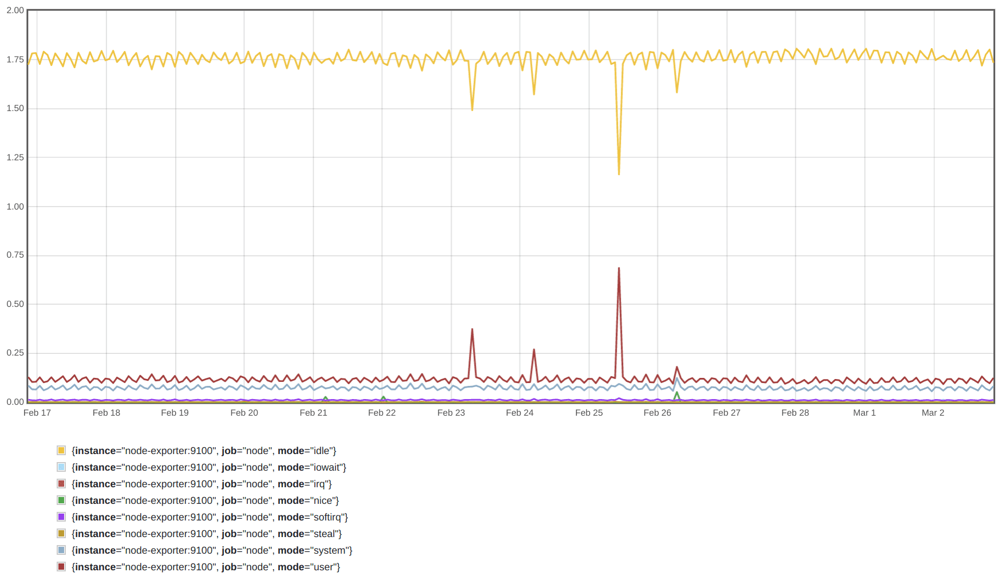
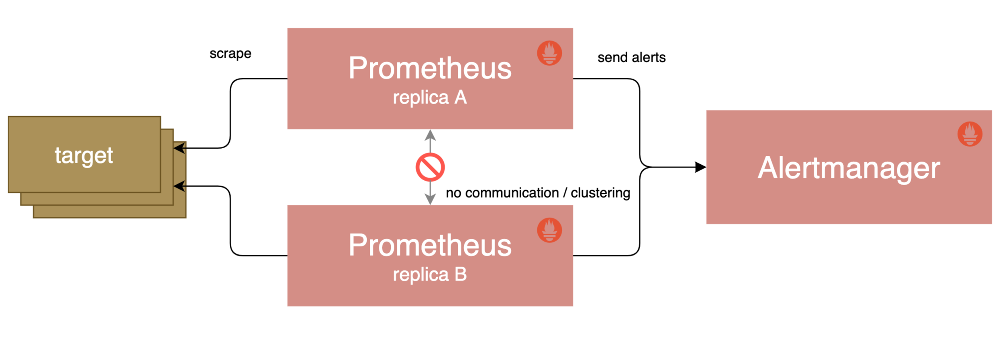
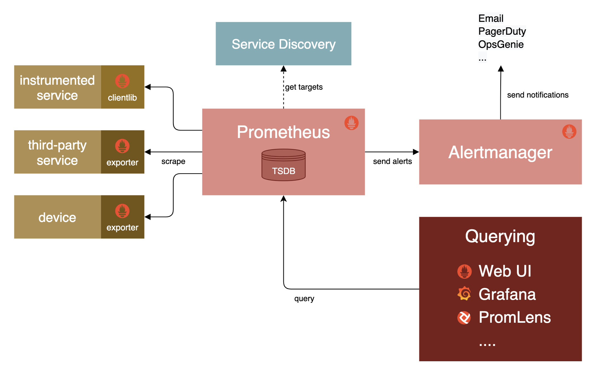
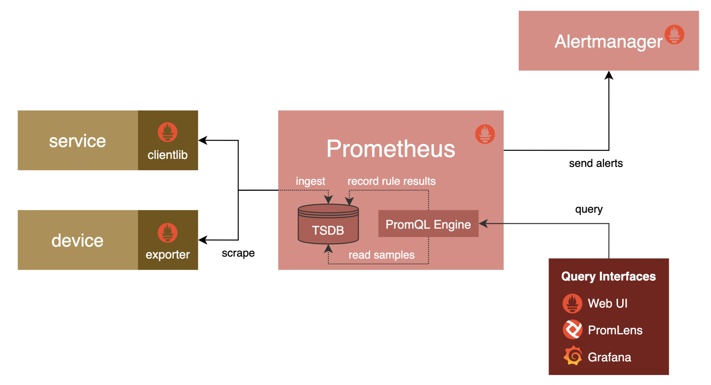
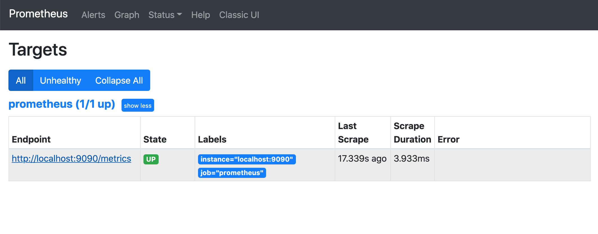
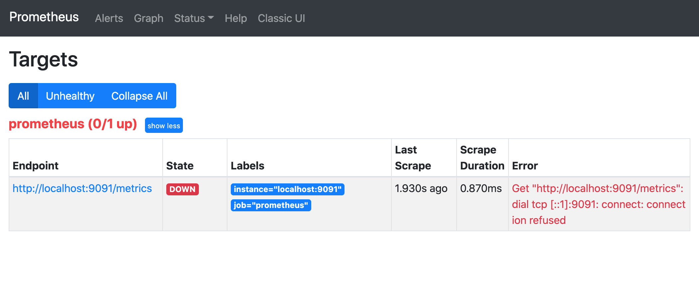
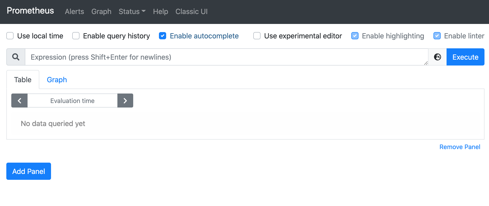
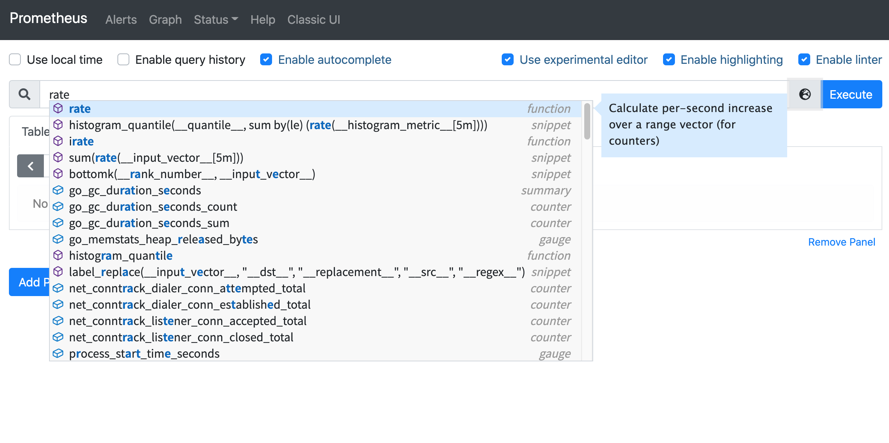
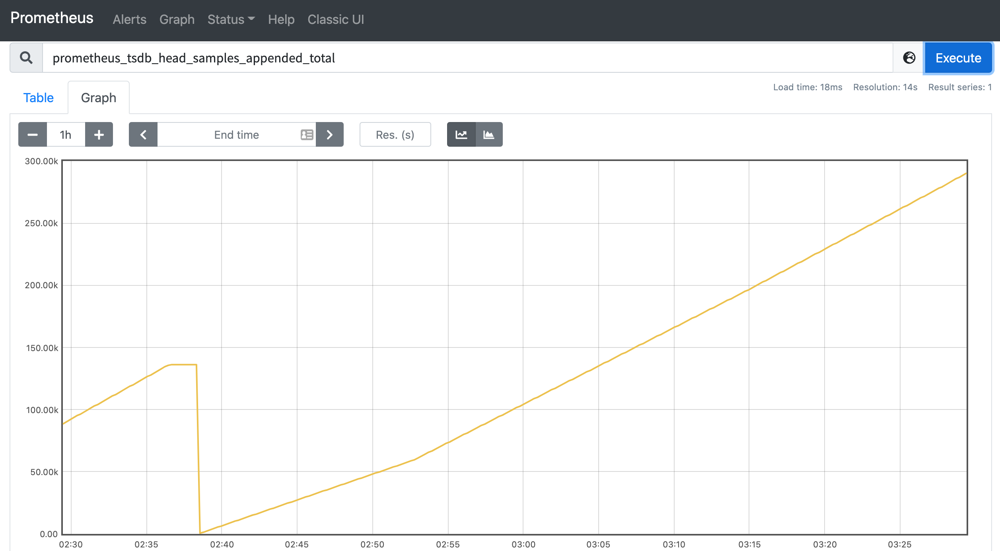
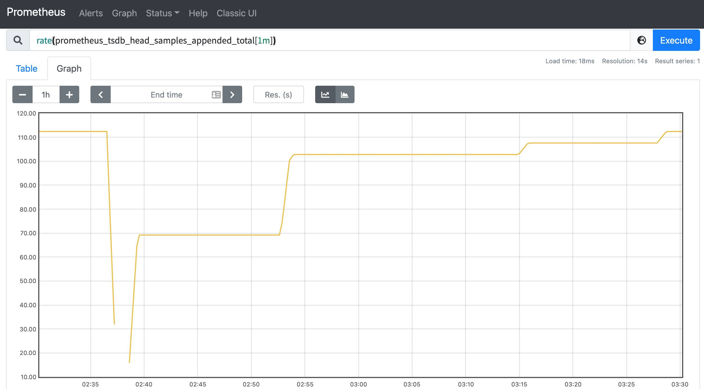

# 概述

[Prometheus](https://prometheus.io/) 是一个监控系统和时序数据库，特别适合监控云原生环境，它具有多维数据模型和强大的查询语言，并在一个生态系统中集成了检测、指标收集、服务发现和报警等功能。

本课程将为你从 0 讲解 Prometheus 的基本概念，然后一步一步深入带领你加深对 Prometheus 的理解。

## 先决条件

本课程的整个演示环境在 CentOS 7.9 上进行测试，但是整个过程基本上不需要很多的改动就可以移植到其他 Linux 发行版中。

所以在学习本课程之前你将需要有 Unix/Linux 服务器管理的基础知识，系统监控经验会有所帮助，但并不是必须要的，不需要你具有 Prometheus 本身的经验，因为我们本身就是从 0 开始讲解的，所以你不用担心。

## 什么是 Prometheus

[Prometheus](https://prometheus.io/) 是一个基于指标监控和报警的工具栈。 Prometheus 起源于 SoundCloud ，因为微服务迅速发展，导致实例数量以几何倍数递增，不得不考虑设计一个符合以下几个功能的监控系统：

- 多维数据模型，可以按照实例，服务，端点和方法之类的维度随意对数据进行切片和切块。
- 操作简单，可以随时随地部署监控服务，甚至在本地工作站上，而无需设置分布式存储后端或重新配置环境。
- 可扩展的数据收集和分散的架构，以便于可以可靠的监控服务的许多实例，独立团队可以部署独立的监控服务。
- 一种查询语言，可以利用数据模型进行有效的报警和图形展示。

但是，当时的情况是，以上的功能都分散在各个系统之中，直到 2012 年 SoundCloud 启动了一个孵化项目把这些所有功能集合到一起，也就是 Prometheus。Prometheus 是用 Go 语言编写，从一开始就是开源的，到 2016 年 Prometheus 成为继 Kubernetes 之后，成为 CNCF 的第二个成员。

到现在为止 Prometheus 提供的工具或与其他生态系统组件集成可以提供完整的监控管道：

- 检测（跟踪和暴露指标）
- 指标收集
- 指标存储
- 查询指标，用于报警、仪表板等



Prometheus 具有足够的通用性，可以监控各个级别的实例：你自己的应用程序、第三方服务、主机或网络设备等等。此外 Prometheus 特别适用于监控动态云环境和 Kubernetes 云原生环境。

但是也需要注意的是 Prometheus 并不是万能的，目前并没有解决下面的一些问题：

- 日志和追踪（Prometheus 只处理指标，也称为时间序列）
- 基于机器学习或 AI 的异常检测
- 水平扩展、集群化的存储

这些功能显然也是非常有价值的，但是 Prometheus 本身并没有尝试去解决，而是留给了第三方解决方案。

但是整体来说与其他监控解决方案相比，Prometheus 提供了许多重要功能：

- 多维数据模型，允许对指标进行跟踪
- 强大的查询语言（PromQL）
- 时间序列处理和报警的整合
- 与服务发现集成来确定应监控的内容
- 操作简单
- 执行高效

尽管这些功能中的许多功能如今在监控系统中变得越来越普遍，但是 Prometheus 是第一个将所有功能组合在一起的开源解决方案。

## 操作简单

Prometheus 的整个概念很简单并且操作也非常简单。 Prometheus 用 Go 编写，直接使用独立的二进制文件即可部署，而无需依赖外部运行时（例如 JVM）、解释器（例如 Python 或 Ruby）或共享系统库。

每个 Prometheus 服务器都独立于任何其他 Prometheus 服务器收集数据并评估报警规则，并且仅在本地存储数据，而没有严格的集群或副本。

要创建用于报警的高可用性配置，你仍然可以运行两个配置相同的 Prometheus 服务器，以计算相同的报警（Alertmanager 将对通知进行去重操作）：



当然，Prometheus 的大规模部署还是非常复杂的，在后面的章节中接触到，此外 Prometheus 还暴露了一些接口，允许第三方开发者来解决一些问题，比如远程存储这些功能。

## 性能高效

Prometheus 需要能够同时从许多系统和服务中收集详细的指标数据，为此，特别对以下组件进行了高度优化：

- 抓取和解析传入的指标
- 写入和读取时序数据库
- 评估基于 TSDB 数据的 PromQL 表达式

根据社区的使用经验显示，一台大型 Prometheus 服务器每秒可以摄取多达 `100万` 个时间序列样本，并使用 `1-2` 字节来将每个样本存储在磁盘上。


# 系统架构

下图演示了 Prometheus 系统的整体架构。



一个团队通常会运行一个或多个 Prometheus 服务器，这些服务器构成了 Prometheus 监控的核心。Prometheus 服务器可以配置为使用服务发现机制（如 DNS、Consul、Kubernetes 等）来自动发现一组指标源（所谓的`目标`），然后 Prometheus 通过 HTTP 定期从这些目标中以[文本格式](https://prometheus.io/docs/instrumenting/exposition_formats/)`抓取`指标，并将收集到的数据存储在本地时序数据库中。

抓取的目标可以是一个直接暴露 Prometheus 指标的应用程序，也是可以是一个将现有系统（比如 MySQL）的 metrics 指标转换为 Prometheus 指标标准格式的中间应用（也就是我们说的 `exporter`），然后 Prometheus 服务器通过其内置的 Web UI、其他仪表盘工具（比如 [Grafana](https://grafana.com/)）或者直接使用其 HTTP API 来提供收集到的数据进行查询。

> **注意**：每次抓取只会将目标的每个时间序列的当前值传输给 Prometheus，所以抓取间隔决定了存储数据的最终采样频率。目标进程本身不保留任何历史指标数据。

另外我们还可以配置 Prometheus 根据收集的指标数据生成报警，但是 Prometheus 不会直接把报警通知发送给我们，而是将原始报警转发到 `Alertmanager` 服务，Alertmanager 是作为单独的服务运行的，可以从多个 Prometheus 服务器上接收报警，并可以对这些报警进行分组、汇总和路由，最后可以通过 Email、Slack、PagerDuty、企业微信、Webhook 或其他通知服务来发送通知。


# 数据模型

Prometheus 采集的监控数据都是以指标（metric）的形式存储在内置的 TSDB 数据库中，这些数据都是**时间序列**：一个带时间戳的数据，这些数据具有一个标识符和一组样本值。除了存储的时间序列，Prometheus 还可以根据查询请求产生临时的、衍生的时间序列作为返回结果。


## 时间序列

Prometheus 会将所有采集到的样本数据以时间序列的形式保存在内存数据库中，并定时刷新到硬盘上，时间序列是按照时间戳和值的序列方式存放的，我们可以称之为**向量**（vector），每一条时间序列都由一个**指标名称**和一组**标签**（键值对）来唯一标识。

- 指标名称反映了被监控样本的含义（如 `http_request_total` 表示的是对应服务器处理的 HTTP 请求总数）。
- 标签可以用来区分不同的维度（比如 `method="GET"` 与 `method="POST"` 就可以用来区分这两种不同的 HTTP 请求指标数据）。

如下所示，可以将时间序列理解为一个以时间为 Y 轴的数字矩阵：

```shell
  ^
  │   . . . . . . . . . . . . . . . . .   . .   http_request_total{method="GET",status="200"}
  │     . . . . . . . . . . . . . . . . . . .   http_request_total{method="POST",status="500"}
  │     . . . . . . . . . .   . . . . . . . .
  │     . . . . . . . . . . . . . . . .   . .
  v
    <------------------ 时间 ---------------->
```


需要注意的是指标名称只能由 ASCII 字符、数字、下划线以及冒号组成，同时必须匹配正则表达式 `[a-zA-Z_:][a-zA-Z0-9_:]*`（冒号不能用来定义指标名称，是用来表示用户自定义的记录规则）。标签的名称只能由 ASCII 字符、数字以及下划线组成并满足正则表达式 `[a-zA-Z_][a-zA-Z0-9_]*`，其中以 `__` 作为前缀的标签，是系统保留的关键字，只能在系统内部使用，标签的值则可以包含任何 Unicode 编码的字符。


## 样本

时间序列中的每一个点就称为一个样本（sample），样本由以下 3 个部分组成：

- **指标**：指标名称和描述当前样本特征的标签集
- **时间戳**：精确到毫秒的时间戳数
- **样本值**：一个 64 位浮点数


## 指标

想要暴露 Prometheus 指标服务只需要暴露一个 HTTP 端点，并提供 Prometheus 基于文本格式的指标数据即可。这种指标格式是非常友好的，基本上的格式看起来类似于下面的这段代码：

```txt
# HELP http_requests_total The total number of processed HTTP requests.
# TYPE http_requests_total counter
http_requests_total{status="200"} 8556
http_requests_total{status="404"} 20
http_requests_total{status="500"} 68
```


其中 `#` 开头的行是注释信息，用来描述下面提供的指标含义，其他未注释行代表一个样本（带有指标名、标签和样本值），使其非常容易从系统和服务中暴露指标出来。

事实上所有的指标也都是通过如下所示的格式来标识的：

```shell
<metric name>{<label name>=<label value>, ...}
```


例如，指标名称是 `http_request_total`，标签集为 `method="POST", endpoint="/messages"`，那么我们可以用下面的方式来标识这个指标：

```shell
http_request_total{method="POST", endpoint="/messages"}
```


而事实上 Prometheus 的底层实现中指标名称实际上是以 `__name__=<metric name>` 的形式保存在数据库中的，所以上面的指标也等同与下面的指标：

```shell
{__name__="http_request_total", method="POST", endpoint="/messages"}
```


所以也可以认为一个指标就是一个标签集，只是这个标签集里面一定包含一个 `__name__` 的标签来定义这个指标的名称。


## 存储格式

Prometheus 按照两个小时为一个时间窗口，将两小时内产生的数据存储在一个块（Block）中，每个块都是一个单独的目录，里面包含该时间窗口内的所有样本数据（chunks），元数据文件（meta.json）以及索引文件（index）。

其中索引文件会将指标名称和标签索引到样本数据的时间序列中，如果该期间通过 API 删除时间序列，删除记录会保存在单独的逻辑文件 tombstone 当中。

当前样本数据所在的块会被直接保存在内存数据库中，不会持久化到磁盘中，为了确保 Prometheus 发生崩溃或重启时能够恢复数据，Prometheus 启动时会通过预写日志（write-ahead-log(WAL)）来重新播放记录，从而恢复数据，预写日志文件保存在 wal 目录中，wal 文件包括还没有被压缩的原始数据，所以比常规的块文件大得多。

Prometheus 保存块数据的目录结构如下所示：

```shell
.
├── 01FB9HHY61KAN6BRDYPTXDX9YF
│   ├── chunks
│   │   └── 000001
│   ├── index
│   ├── meta.json
│   └── tombstones
├── 01FB9Q76Z0J10WJZX3PYQYJ96R
│   ├── chunks
│   │   └── 000001
│   ├── index
│   ├── meta.json
│   └── tombstones
├── chunks_head
│   ├── 000014
│   └── 000015
├── lock
├── queries.active
└── wal
    ├── 00000011
    ├── 00000012
    ├── 00000013
    ├── 00000014
    └── checkpoint.00000010
        └── 00000000

7 directories, 17 files
```


# 查询语言

为了能够使用收集的监控数据，Prometheus 实现了自己的查询语言 PromQL。PromQL 是一种功能性的语言（类似于 SQL 语句），可以对时间序列数据进行灵活高效的计算。和类似 SQL 的语言相比，PromQL 仅用于数据读取，而不是插入、更新或者删除数据（这些操作在查询引擎之外实现的）



后续我们会详细讲解 PromQL，这里我们先简单了解一些示例即可。


## 示例

比如下面的语句表示的是过滤所有状态码位为 `500` 的 HTTP 请求总数：

```promql
http_requests_total{status="500"}
```


下面的查询语句表示每个序列在 5 分钟的时间窗口内的平均每秒增长率：

```promql
rate(http_requests_total{status="500"}[5m])
```


我们还可以计算 `status="500"` 错误与按 HTTP 路径分组的请求总数的比率：

```promql
sum by(path) (rate(http_requests_total{status="500"}[5m]))
/
sum by(path) (rate(http_requests_total[5m]))
```


这些查询方式是 PromQL 中一些非常常见的方式，当然除此之外还有很多其他使用方法，我们将在后面专门的 PromQL 章节中进行详细的讲解。


## 集成报警

Prometheus 将时间序列数据的收集、处理和主动报警系统集成在一起，它的理念是在单个数据模型中尽可能多地收集有关系统的数据，以便你可以对其进行集成查询。此外用于临时查询和仪表盘使用的查询语言也可以用于定义报警规则。

例如，以下警报规则（作为规则配置文件的一部分加载到 Prometheus 中）将在 500 状态码的 HTTP 请求数量超过指定路径总流量的`5%`时触发报警。

```yaml
alert: Many500Errors
# expr 是一个 PromQL 表达式，是整个报警规则的核心
expr: |
  (
      sum by(path) (rate(http_requests_total{status="500"}[5m]))
    /
      sum by(path) (rate(http_requests_total[5m]))
  ) * 100 > 5
for: 5m
labels:
  severity: 'critical'
annotations:
  summary: 'Many 500 errors for path {{$labels.path}} ({{$value}}%)'
```


上面是一个典型的报警规则定义规范，其中 `expr` 属性指定的 PromQL 表达式构成报警规则的核心，而其他基于 YAML 的配置选项则允许控制报警元数据、路由标签等。这样就可以根据收集的数据进行精确而准确的警报了。

# 安装配置

## 下载 Prometheus

前面我们提到了 Prometheus 是采用 Go 语言开发的，直接使用独立的二进制文件即可部署。下面我们就在我们的 CentOS 机器上来下载 Prometheus。

首先为我们的课程创建一个工作目录：

```shell
☸ ➜ mkdir $HOME/p8strain
```


切换到该目录下去：

```shell
☸ ➜ cd $HOME/p8strain
```


在 Prometheus 官网 https://prometheus.io/download/#prometheus 获取适用于 Linux 的 Prometheus 安装包，这里我们选择最新的 `2.30.2` 版本，我们这里是 Linux 系统，所以选择下载 `prometheus-2.30.2.linux-amd64.tar.gz`，其他系统请自行选择。

```shell
☸ ➜ wget https://github.com/prometheus/prometheus/releases/download/v2.30.2/prometheus-2.30.2.linux-amd64.tar.gz
# 如果被限制可以使用清华的，哈哈哈。
```


解压压缩包：

```shell
☸ ➜ tar -xvf prometheus-2.30.2.linux-amd64.tar.gz
```


切换到解压缩后的目录，执行 `prometheus --version` 命令查看是否正常：

```shell
☸ ➜ cd prometheus-2.30.1.linux-amd64
☸ ➜ ./prometheus --version
prometheus, version 2.30.2 (branch: HEAD, revision: b30db03f35651888e34ac101a06e25d27d15b476)
  build user:       root@80d1e84a93dd
  build date:       20211001-12:26:58
  go version:       go1.17.1
  platform:         linux/amd64
```


## 配置 Prometheus

前文我们已经下载完成了 Prometheus，接下来在启动之前我们需要为其创建一个配置文件。

Prometheus 通过抓取监控目标上的 HTTP 端点来收集指标，而且 Prometheus 本身也暴露 metrics 指标接口，所以自然它也可以抓取并监控其自身的运行状况，下面我们就用收集自身的数据为例进行配置说明。

将以下 Prometheus 配置保存为 `prometheus.yml` 文件（覆盖现有示例的 prometheus.yml 文件）：

```yaml
global:
  scrape_interval: 5s # 抓取频率

scrape_configs:
  - job_name: 'prometheus'
    static_configs:
      - targets: ['localhost:9090']
```


上面配置了 Prometheus 每 `5s` 从自身抓取指标。`global` 区域用于配置一些全局配置和默认值，`scrape_configs` 部分是用来告诉 Prometheus 要抓取哪些目标的。

在我们这里使用 `static_configs` 属性手动列举了抓取的目标（以 `<host>:<port>` 格式），不过一般生产环境配置使用一个或多个服务发现来发现目标，完整的配置可以参考官方文档 https://prometheus.io/docs/prometheus/latest/configuration/configuration/，后续我们也会不断接触相关的配置。

注意

5 秒钟的抓取间隔是非常激进的，但对于我们这里的演示目的来说还是非常有用的，因为我们希望可以快速获得数据。在实际情况下，间隔通常在 10 到 60 秒之间。


## 启动

现在我们使用新创建的配置文件启动 Prometheus：

```shell
☸ ➜ ./prometheus
```


默认情况下，Prometheus 将其数据库存储在 `./data`目录中（可以使用 `--storage.tsdb.path` 标志进行配置），并从文件 `prometheus.yml`（使用 `--config.file` 配置）中读取其配置。

注意

通过配置文件提供的任何设置都可以在运行时（通过发送 `HUP` 信号）重新加载，而通过标志设置的任何变更都需要重新启动服务器才能生效。

正常情况下 Prometheus 会启动并在 `http://<host-ip>:9090/` 上显示相关状态信息，几秒钟过后会从其自身的 HTTP 指标端点收集关于自己的数据，我们也可以直接在浏览器中访问它的指标端点来验证 Prometheus 是否正在提供关于自己的指标：`http://<host-ip>:9090/metrics`。


## 查看监控目标

当启动 Prometheus 后，我们可以检查下它是否正确的抓取了配置的目标，可以在浏览器中访问 `http://<host-ip>:9090/targets` 来查看所有的抓取目标列表：



如果我们配置的抓取本身的 prometheus 这个任务显示的绿色的 `UP` 状态，证明 Prometheus 已经正常抓取自身的监控指标了。

如果在抓取过程中出现任何问题（DNS 解析失败、连接超时等等错误），抓取目标都会显示为 `DOWN`，同时还有一条错误消息，提供有关抓取失败的相关信息，可以帮助我们快速发现错误配置或不健康的目标。

例如，如果你将 Prometheus 配置在错误的端口上进行抓取（9091 而不是 9090），targets 目标页面将显示 `connection refused` 错误。



## 表达式查询

Prometheus 内置了用于 PromQL 查询的表达式查询界面，浏览器中导航至 `http://<host-ip>:9090/graph` 并选择 `Table` 视图即可：



`Table` 选项卡显示了表达式的每个输出序列的最新值，而 `Graph` 选项卡是绘制随时间变化的值，当然会在图形对于服务端和浏览器来说是比较耗性能的，所以一般情况都是先在 `Table` 下尝试查询可能比较耗时的表达式，然后将表达式的查询时间范围缩小，再切换到 `Graph` 下面进行图形绘制是一个更好的做法。

我们这里使用的最新版本的 `2.26.0` 版本，还对查询功能做了大幅度的升级，新增了一个非常实用的功能就是有查询关键字相关的提示了，我们只需要勾选上 `Use experimental editor` 选项，然后在查询的时候就会有提示了。



这里的提示功能不只是有指标名称，还有查询语句中使用到的查询函数，也包括这个函数的用法提示等信息，可以说这个功能非常实用。

比如我们这里可以查询下面的指标，表示自进程开始以来被摄入 Prometheus 本地存储中的样本总数：

```promql
prometheus_tsdb_head_samples_appended_total
```




然后可以使用下面的表达式了查询 1 分钟内平均每秒摄取的样本数：

```promql
rate(prometheus_tsdb_head_samples_appended_total[1m])
```




我们可以在 `Table` 和 `Graph` 视图下面切换查看表达式查询的结果。

