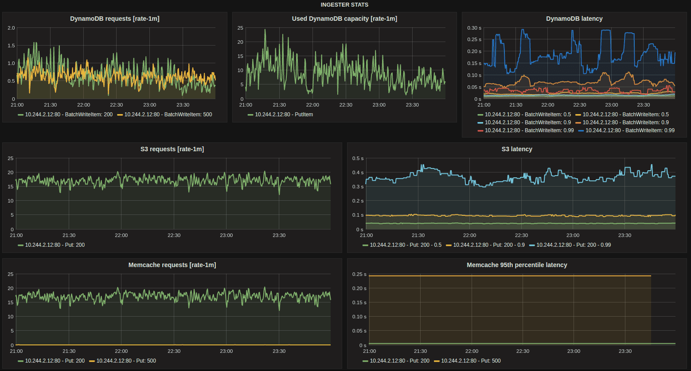
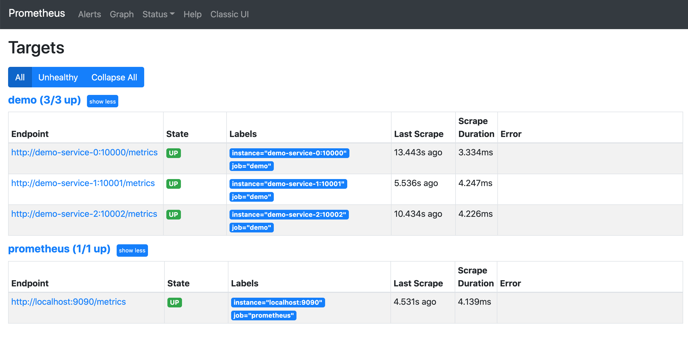

# PromQL 介绍

**PromQL** 是 Prometheus 监控系统内置的一种查询语言，PromQL 允许你以灵活的方式选择、聚合等其他方式转换和计算时间序列数据，该语言仅用于读取数据。可以说 PromQL 是我们学习 Prometheus 最困难也是最重要的部分，本章节我们将介绍 PromQL 的基础知识、理论基础，然后会深入了解更加高级的查询模式。

## 目标

通过对本章节 PromQL 的学习你将能够有效地构建、分享和理解 PromQL 查询，可以帮助我们从容应对报警规则、仪表盘可视化等需求，还能够避免一些在使用 PromQL 表达式的时候遇到的一些陷进。

## 执行

前面基础章节我们介绍了 Prometheus 整体的架构：


当 Prometheus 从系统和服务收集指标数据时，它会把数据存储在内置的时序数据库（TSDB）中，要对收集到的数据进行任何处理，我们都可以使用 PromQL 从 TSDB 中读取数据，同时可以对所选的数据执行过滤、聚合以及其他转换操作。

PromQL 的执行可以通过两种方式来触发：

- 在 Prometheus 服务器中，记录规则和警报规则会定期运行，并执行查询操作来计算规则结果（例如触发报警）。该执行在 Prometheus 服务内部进行，并在配置规则时自动发生。
- 外部用户和 UI 界面可以使用 Prometheus 服务提供的 [HTTP API](https://prometheus.io/docs/prometheus/latest/querying/api/) 来执行 PromQL 查询。这就是仪表盘软件（例如 [Grafana](https://grafana.com/grafana/)、[PromLens](https://promlens.com/) 以及 Prometheus 内置 Web UI）访问 PromQL 的方式。

## 场景

PromQL 可以用于许多监控场景，下面简单介绍几个相关案例。

**临时查询**

我们可以用 PromQL 来对收集的数据进行实时查询，这有助于我们去调试和诊断遇到的一些问题，我们一般也是直接使用内置的表达式查询界面来执行这类查询：


**仪表盘**

同样我们也可以基于 PromQL 查询来创建可视化的图形、表格等面板，当然一般我们都会使用 Grafana：



Grafana 原生支持 Prometheus 作为数据源，并内置支持了 PromQL 表达式的查询。

**报警**

Prometheus 可以直接使用基于 PromQL 对收集的数据进行的查询结果来生成报警，一个完整的报警规则如下所示：

```yaml
groups:
  - name: demo-service-alerts
    rules:
      - alert: Many5xxErrors
        expr: |
          (
            sum by(path, instance, job) (
              rate(demo_api_request_duration_seconds_count{status=~"5..",job="demo"}[1m])
            )
          /
            sum by(path, instance, job) (
              rate(demo_api_request_duration_seconds_count{job="demo"}[1m])
            ) * 100 > 0.5
          )
        for: 30s
        labels:
          severity: critical
        annotations:
          title: '{{$labels.instance}} high 5xx rate on {{$labels.path}}'
          description: 'The 5xx error rate for path {{$labels.path}} on {{$labels.instance}} is {{$value}}%.'
```


除了构成报警规则核心的 PromQL 表达式（上面 YAML 文件中的 `expr` 属性），报警规则还包含其他的一些元数据字段，后面在具体讲解报警的章节中会详细和大家讲解。

然后，Prometheus 可以通过一个名为 `Alertmanager` 的组件来发送报警通知，可以配置一些接收器来接收这些报警，比如用钉钉来接收报警：


**自动化**

此外我们还可以构建自动化流程，针对 PromQL 执行的查询结果来做出决策，比如 Kubernetes 中基于自定义指标的 HPA。


# 数据模型


在开始学习 PromQL 的知识之前，我们先重新来熟悉下 Prometheus 的数据模型


## 时间序列

Prometheus 会将所有采集到的样本数据以时间序列的方式保存在**内存数据库**中，并且定时保存到硬盘上。时间序列是按照时间戳和值的序列顺序存放的，我们称之为向量(vector)，每条时间序列通过指标名称(metrics name)和一组标签集(labelset)命名。如下所示，可以将时间序列理解为一个以时间为 X 轴的数字矩阵：

```text
  ^
  │   . . . . . . . . . . . . . . . . .   . .   node_cpu_seconds_total{cpu="cpu0",mode="idle"}
  │     . . . . . . . . . . . . . . . . . . .   node_cpu_seconds_total{cpu="cpu0",mode="system"}
  │     . . . . . . . . . .   . . . . . . . .   node_load1{}
  │     . . . . . . . . . . . . . . . .   . .
  v
    <------------------ 时间 ---------------->
```


在时间序列中的每一个点称为一个样本（sample），样本由以下三部分组成：

- 指标(metric)：指标名和描述当前样本特征的标签集合
- 时间戳(timestamp)：一个精确到毫秒的时间戳
- 样本值(value)： 一个 float64 的浮点型数据表示当前样本的值

如下所示：

```text
<--------------- metric ---------------------><-timestamp -><-value->
http_request_total{status="200", method="GET"}@1434417560938 => 94355
http_request_total{status="200", method="GET"}@1434417561287 => 94334

http_request_total{status="404", method="GET"}@1434417560938 => 38473
http_request_total{status="404", method="GET"}@1434417561287 => 38544

http_request_total{status="200", method="POST"}@1434417560938 => 4748
http_request_total{status="200", method="POST"}@1434417561287 => 4785
```


在形式上，所有的指标都通过如下格式表示：

```text
<metric name>{<label name> = <label value>, ...}
```


- 指标的名称可以反映被监控样本的含义（比如，http*request_total 表示当前系统接收到的 HTTP 请求总量）。指标名称只能由 ASCII 字符、数字、下划线以及冒号组成并必须符合正则表达式`[a-zA-Z*:]a-zA-Z0-9*:]*`。
- 标签(label)反映了当前样本的特征维度，通过这些维度 Prometheus 可以对样本数据进行过滤，聚合等。标签的名称只能由 ASCII 字符、数字以及下划线组成并满足正则表达式 `[a-zA-Z_][a-zA-Z0-9_]*`。

指标名称

在 TSDB 内部，指标名称也只是一个特殊的标签，标签名为 `__name__`，由于这个标签在 PromQL 中随时都会使用，所以在使用 PromQL 查询的时候就被单独写在了标签列表前面了。另外像 `method=""` 这样的空标签在 Prometheus 种相当于一个不存在的标签，在 Prometheus 代码里面是明确地剥离了空标签的，并不会存储它们。

## 类型

每个不同的 `metric_name`和 `label` 组合都称为**时间序列**，在 Prometheus 的表达式语言中，表达式或子表达式包括以下四种类型之一：

- `瞬时向量（Instant vector）`：一组时间序列，每个时间序列包含单个样本，它们共享相同的时间戳。也就是说，表达式的返回值中只会包含该时间序列中的最新的一个样本值。而相应的这样的表达式称之为瞬时向量表达式。
- `区间向量（Range vector）`：一组时间序列，每个时间序列包含一段时间范围内的样本数据，这些是通过将时间选择器附加到方括号中的瞬时向量（例如[5m]5 分钟）而生成的。
- `标量（Scalar）`：一个简单的数字浮点值。
- `字符串（String）`：一个简单的字符串值。

所有这些指标都是 Prometheus 定期从 metrics 接口那里采集过来的。采集的间隔时间的设置由 `prometheus.yml` 配置中的 `scrape_interval` 指定。最多抓取间隔为 30 秒，这意味着至少每 30 秒就会有一个带有新时间戳记录的新数据点，这个值可能会更改，也可能不会更改，但是每隔 `scrape_interval` 都会产生一个新的数据点。


# 指标类型

从存储上来讲所有的监控指标都是相同的，但是在不同的场景下这些指标又有一些细微的差异。 例如，在 Node Exporter 返回的样本中指标 `node_load1` 反应的是当前系统的负载状态，随着时间的变化这个指标返回的样本数据是在不断变化的。而指标 `node_cpu_seconds_total` 所获取到的样本数据却不同，它是一个持续增大的值，因为其反应的是 CPU 的累计使用时间，从理论上讲只要系统不关机，这个值是会一直变大。

为了能够帮助用户理解和区分这些不同监控指标之间的差异，Prometheus 定义了 4 种不同的指标类型：`Counter（计数器）`、`Gauge（仪表盘）`、`Histogram（直方图）`、`Summary（摘要）`。

在 node-exporter（后面会详细讲解）返回的样本数据中，其注释中也包含了该样本的类型。例如：

```text
# HELP node_cpu_seconds_total Seconds the cpus spent in each mode.
# TYPE node_cpu_seconds_total counter
node_cpu_seconds_total{cpu="cpu0",mode="idle"} 362812.7890625
```


## Counter

`Counter` (只增不减的计数器) 类型的指标其工作方式和计数器一样，只增不减，所以它对于存储诸如服务的 HTTP 请求数量或使用的 CPU 时间之类的信息非常有用。常见的监控指标，如 `http_requests_total`、`node_cpu_seconds_total` 都是 `Counter` 类型的监控指标。


可能你会觉得一直增加的数据没什么用处，了解服务从开始有多少请求有什么价值吗？但是需要记住，每个指标都存储了时间戳的，所有你的 HTTP 请求数现在可能是 1000 万，但是 Prometheus 也会记录之前某个时间点的值，我们可以去查询过去一个小时内的请求数，当然更多的时候我们想要看到的是请求数增加或减少的速度有多快，因此通常情况对于 `Counter` 指标我们都是去查看变化率而不是本身的数字。`PromQL` 内置的聚合操作和函数可以让用户对这些数据进行进一步的分析，例如，通过 `rate()` 函数获取 HTTP 请求的增长率：

```promql
rate(http_requests_total[5m])
```


## Gauge

与 `Counter` 不同，`Gauge`（可增可减的仪表盘）类型的指标侧重于反应系统的当前状态，因此这类指标的样本数据可增可减。常见指标如 `node_memory_MemFree_bytes`（当前主机空闲的内存大小）、`node_memory_MemAvailable_bytes`（可用内存大小）都是 `Gauge` 类型的监控指标。由于 Gauge 指标仍然带有时间戳存储，所有我们可以看到随时间变化的值，通常可以直接把它们绘制出来，这样就可以看到值本身而不是变化率了，通过 `Gauge` 指标，用户可以直接查看系统的当前状态。


这些简单的指标类型都只是为每个样本获取一个数字，但 Prometheus 的强大之处在于如何让你跟踪它们，比如我们绘制了两张图，一个是 HTTP 请求的变化率，另一个是分配的 gauge 类型的实际内存，直接从图上就可以看出这两个之间有一种关联性，当请求出现峰值的时候，内存的使用也会出现峰值，但是我们仔细观察也会发现在峰值过后，内存使用量并没有恢复到峰值前的水平，整体上它在逐渐增加，这表明很可能应用程序中存在内存泄露的问题，通过这些简单的指标就可以帮助我们找到这些可能存在的问题。


对于 `Gauge` 类型的监控指标，通过 `PromQL` 内置函数 `delta()` 可以获取样本在一段时间范围内的变化情况。例如，计算 CPU 温度在两个小时内的差异：

```promql
delta(cpu_temp_celsius{host="zeus"}[2h])
```


还可以直接使用 `predict_linear()` 对数据的变化趋势进行预测。例如，预测系统磁盘空间在 4 个小时之后的剩余情况：

```promql
predict_linear(node_filesystem_free_bytes[1h], 4 * 3600)
```


## Histogram 和 Summary

除了 `Counter` 和 `Gauge` 类型的监控指标以外，Prometheus 还定义了 `Histogram` 和 `Summary` 的指标类型。`Histogram` 和 `Summary` 主用用于统计和分析样本的分布情况。

在大多数情况下人们都倾向于使用某些量化指标的平均值，例如 CPU 的平均使用率、页面的平均响应时间，这种方式也有很明显的问题，以系统 API 调用的平均响应时间为例：如果大多数 API 请求都维持在 100ms 的响应时间范围内，而个别请求的响应时间需要 5s，那么就会导致某些 WEB 页面的响应时间落到**中位数**上，而这种现象被称为**长尾问题**。

为了区分是平均的慢还是长尾的慢，最简单的方式就是按照请求延迟的范围进行分组。例如，统计延迟在 `0~10ms` 之间的请求数有多少而 `10~20ms` 之间的请求数又有多少。通过这种方式可以快速分析系统慢的原因。`Histogram` 和 `Summary` 都是为了能够解决这样的问题存在的，通过 `Histogram` 和`Summary` 类型的监控指标，我们可以快速了解监控样本的分布情况。

**Summary**

摘要用于记录某些东西的平均大小，可能是计算所需的时间或处理的文件大小，摘要显示两个相关的信息：`count`（事件发生的次数）和 `sum`（所有事件的总大小），如下图计算摘要指标可以返回次数为 3 和总和 15，也就意味着 3 次计算总共需要 15s 来处理，平均每次计算需要花费 5s。下一个样本的次数为 10，总和为 113，那么平均值为 11.3，因为两组指标都记录有时间戳，所以我们可以使用摘要来构建一个图表，显示平均值的变化率，比如图上的语句表示的是 5 分钟时间段内的平均速率。


例如，指标 `prometheus_tsdb_wal_fsync_duration_seconds` 的指标类型为 `Summary`，它记录了 Prometheus Server 中 `wal_fsync` 的处理时间，通过访问 Prometheus Server 的 `/metrics` 地址，可以获取到以下监控样本数据：

```text
# HELP prometheus_tsdb_wal_fsync_duration_seconds Duration of WAL fsync.
# TYPE prometheus_tsdb_wal_fsync_duration_seconds summary
prometheus_tsdb_wal_fsync_duration_seconds{quantile="0.5"} 0.012352463
prometheus_tsdb_wal_fsync_duration_seconds{quantile="0.9"} 0.014458005
prometheus_tsdb_wal_fsync_duration_seconds{quantile="0.99"} 0.017316173
prometheus_tsdb_wal_fsync_duration_seconds_sum 2.888716127000002
prometheus_tsdb_wal_fsync_duration_seconds_count 216
```


从上面的样本中可以得知当前 Prometheus Server 进行 `wal_fsync` 操作的总次数为 216 次，耗时 2.888716127000002s。其中中位数（quantile=0.5）的耗时为 0.012352463，9 分位数（quantile=0.9）的耗时为 0.014458005s。

**Histogram**

摘要非常有用，但是平均值会隐藏一些细节，上图中 10 与 113 的总和包含非常广的范围，如果我们想查看时间花在什么地方了，那么我们就需要直方图了。直方图以 bucket 桶的形式记录数据，所以我们可能有一个桶用于需要 1s 或更少的计算，另一个桶用于 5 秒或更少、10 秒或更少、20 秒或更少、60 秒或更少。该指标返回每个存储桶的计数，其中 3 个在 5 秒或更短的时间内完成，6 个在 10 秒或更短的时间内完成。Prometheus 中的直方图是**累积**的，因此所有 10 次计算都属于 60 秒或更少的时间段，而在这 10 次中，有 9 次的处理时间为 20 秒或更少，这显示了数据的分布。所以可以看到我们的大部分计算都在 10 秒以下，只有一个超过 20 秒，这对于计算百分位数很有用。


在 Prometheus Server 自身返回的样本数据中，我们也能找到类型为 Histogram 的监控指标`prometheus_tsdb_compaction_chunk_range_seconds_bucket`：

```text
# HELP prometheus_tsdb_compaction_chunk_range_seconds Final time range of chunks on their first compaction
# TYPE prometheus_tsdb_compaction_chunk_range_seconds histogram
prometheus_tsdb_compaction_chunk_range_seconds_bucket{le="100"} 71
prometheus_tsdb_compaction_chunk_range_seconds_bucket{le="400"} 71
prometheus_tsdb_compaction_chunk_range_seconds_bucket{le="1600"} 71
prometheus_tsdb_compaction_chunk_range_seconds_bucket{le="6400"} 71
prometheus_tsdb_compaction_chunk_range_seconds_bucket{le="25600"} 405
prometheus_tsdb_compaction_chunk_range_seconds_bucket{le="102400"} 25690
prometheus_tsdb_compaction_chunk_range_seconds_bucket{le="409600"} 71863
prometheus_tsdb_compaction_chunk_range_seconds_bucket{le="1.6384e+06"} 115928
prometheus_tsdb_compaction_chunk_range_seconds_bucket{le="6.5536e+06"} 2.5687892e+07
prometheus_tsdb_compaction_chunk_range_seconds_bucket{le="2.62144e+07"} 2.5687896e+07
prometheus_tsdb_compaction_chunk_range_seconds_bucket{le="+Inf"} 2.5687896e+07
prometheus_tsdb_compaction_chunk_range_seconds_sum 4.7728699529576e+13
prometheus_tsdb_compaction_chunk_range_seconds_count 2.5687896e+07
```


与 `Summary` 类型的指标相似之处在于 `Histogram` 类型的样本同样会反应当前指标的记录的总数(以 `_count` 作为后缀)以及其值的总量（以 `_sum` 作为后缀）。不同在于 `Histogram` 指标直接反应了在不同区间内样本的个数，区间通过标签 `le` 进行定义。


# 演示服务

为了尽可能详细地给大家演示 PromQL 指标查询，这里我们将 Fork 一个开源的 Prometheus 演示服务来进行查询，这样可以让我们更加灵活地对指标数据进行控制，项目仓库地址：https://github.com/cnych/prometheus_demo_service，这是一个 Go 语言开发的服务，我们可以自己构建应用。

## 构建

首先准备 golang 环境：

```shell
☸ ➜ wget https://golang.org/dl/go1.16.3.linux-amd64.tar.gz
☸ ➜ rm -rf /usr/local/go && tar -C /usr/local -xzf go1.16.3.linux-amd64.tar.gz
# 配置环境变量，可以将下面命令添加到 /etc/profile 中
☸ ➜ export PATH=$PATH:/usr/local/go/bin
# 执行go命令验证
☸ ➜ go version
go version go1.16.3 linux/amd64
```


然后 clone 代码构建：

```shell
# 首先clone代码(建议使用ssh模式，你懂的~)
☸ ➜ git clone https://github.com/cnych/prometheus_demo_service
☸ ➜ cd prometheus_demo_service
# 配置 GOPROXY 代理
☸ ➜ export GOPROXY=https://goproxy.cn
# 构建
☸ ➜ env GOOS=linux GOARCH=amd64 go build -o prometheus_demo_service
```


构建完成后启动 3 个服务，分别监听 10000、10001、10002 端口：

```shell
☸ ➜ ps -aux |grep demo
root      15224  2.9  0.1 834120 14836 pts/0    Sl   10:39   0:00 ./prometheus_demo_service --listen-address=:10000
root      15333  3.0  0.2 899656 16888 pts/0    Sl   10:39   0:00 ./prometheus_demo_service --listen-address=:10001
root      15353  2.7  0.1 907596 14896 pts/0    Sl   10:39   0:00 ./prometheus_demo_service --listen-address=:10002
```


上面 3 个服务都在 `/metrics` 端点暴露了一些指标数据，我们可以把这 3 个服务配置到 Prometheus 抓取任务中，这样后续就可以使用这几个服务来进行 PromQL 查询说明了。

## 配置

完整的 `prometheus.yml` 配置文件如下所示：

```yaml
global:
  scrape_interval: 5s # 抓取频率

scrape_configs:
  - job_name: 'prometheus'
    static_configs:
      - targets: ['localhost:9090']
  # 配置demo抓取任务
  - job_name: demo
    scrape_interval: 15s
    scrape_timeout: 10s
    static_configs:
      - targets:
          - demo-service-0:10000
          - demo-service-1:10001
          - demo-service-2:10002
```


这里我们将 3 个服务配置到名为 demo 的抓取任务中，为了看上去更加清晰，这里我们使用 `demo-service-<index>` 来代替服务地址，直接在 Prometheus 所在节点的 `/etc/hosts` 文件中添加上对应服务的映射：

```shell
☸ ➜ cat /etc/hosts
......
192.168.31.46 demo-service-0
192.168.31.46 demo-service-1
192.168.31.46 demo-service-2
```


配置完成后直接启动 Prometheus 服务即可（可以参考前面的[安装配置章节](https://docs.youdianzhishi.com/prometheus/promql/basic/install/)）：

```shell
☸ ➜ ./prometheus
```


启动后可以在 `/targets` 页面查看是否在正确抓取监控指标：



该演示服务**模拟**了一些用于我们测试的监控指标，包括：

- 暴露请求计数和响应时间（以 path、method 和响应状态码为标签 key）的 HTTP API 服务
- 一个定期的批处理任务，它暴露了最后一次成功运行的时间戳和处理的字节数
- 有关 CPU 数量及其使用情况的综合指标
- 有关内存使用情况的综合指标
- 有关磁盘总大小及其使用情况的综合指标
- 其他指标......

我们将在后面查询各个指标时了解更多关于它们的信息。


