# PromQL 基础

在继续深入学习 PromQL 查询细节之前，我们先来看看 PromQL 查询的一些理论基础。

## 嵌套结构

与 SQL 查询语言（SELECT * FROM ...）不同，PromQL 是一种嵌套的函数式语言，就是我们要把需要查找的数据描述成一组嵌套的表达式，每个表达式都会评估为一个中间值，每个中间值都会被用作它上层表达式中的参数，而查询的最外层表达式表示你可以在表格、图形中看到的最终返回值。比如下面的查询语句：

```sql
histogram_quantile(  # 查询的根，最终结果表示一个近似分位数。
  0.9,  # histogram_quantile() 的第一个参数，分位数的目标值
  # histogram_quantile() 的第二个参数，聚合的直方图
  sum by(le, method, path) (
    # sum() 的参数，直方图过去5分钟每秒增量。
    rate(
      # rate() 的参数，过去5分钟的原始直方图序列
      demo_api_request_duration_seconds_bucket{job="demo"}[5m]
    )
  )
)
```


PromQL 表达式不仅仅是整个查询，而是查询的任何嵌套部分（比如上面的`rate(...)`部分），你可以把它作为一个查询本身来运行。在上面的例子中，每行注释代表一个表达式。

## 结果类型

在查询 Prometheus 时，有两个 `类型` 的概念经常出现，区分它们很重要。

- 抓取目标报告的**指标类型**：counter、gauge、histogram、summary。
- PromQL 表达式的**结果数据类型**：字符串、标量、瞬时向量或区间向量。

PromQL 实际上没有直接的指标类型的概念，只关注表达式的结果类型。每个 PromQL 表达式都有一个类型，每个函数、运算符或其他类型的操作都要求其参数是某种表达式类型。例如，`rate()` 函数要求它的参数是一个区间向量，但是 `rate()` 本身评估为一个瞬时向量输出，所以 `rate()` 的结果只能用在期望是瞬时向量的地方。

PromQL 中可能的表达式类型包括：

- `string(字符串)`：字符串只会作为某些函数（如 `label_join()` 和 `label_replace()`）的参数出现。

- `scalar(标量)`：一个单一的数字值，如 1.234，这些数字可以作为某些函数的参数，如 `histogram_quantile(0.9, ...)` 或 `topk(3, ...)`，也会出现在算术运算中。

- `instant vector(瞬时向量)`：一组标记的时间序列，每个序列有一个样本，都在同一个时间戳，瞬时向量可以由 TSDB 时间序列选择器直接产生，如`node_cpu_seconds_total`，也可以由任何函数或其他转换来获取。

  ```shell
  node_cpu_seconds_total{cpu="0", mode="idle"}   → 19165078.75 @ timestamp_1
  node_cpu_seconds_total{cpu="0", mode="system"} →   381598.72 @ timestamp_1
  node_cpu_seconds_total{cpu="0", mode="user"}   → 23211630.97 @ timestamp_1
  ```

  

- `range vector(区间向量)`：一组标记的时间序列，每个序列都有一个随时间变化的样本范围。在 PromQL 中只有两种方法可以生成区间向量：在查询中使用字面区间向量选择器（如 `node_cpu_seconds_total[5m]`），或使用子查询表达式（如 `<expression>[5m:10s]`），当想要在指定的时间窗口内聚合一个序列的行为时，区间向量非常有用，就像 `rate(node_cpu_seconds_total[5m])` 计算每秒增加率一样，在 `node_cpu_seconds_total` 指标的最后 5 分钟内求平均值。

  ```shell
  node_cpu_seconds_total{cpu="0", mode="idle"}   → 19165078.75 @ timestamp_1,  19165136.3 @ timestamp_2, 19165167.72 @ timestamp_3
  node_cpu_seconds_total{cpu="0", mode="system"} → 381598.72   @ timestamp_1,   381599.98 @ timestamp_2,   381600.58 @ timestamp_3
  node_cpu_seconds_total{cpu="0", mode="user"}   → 23211630.97 @ timestamp_1, 23211711.34 @ timestamp_2, 23211748.64 @ timestamp_3
  ```

  

注意

但是指标类型呢？如果你已经使用过 PromQL，你可能知道某些函数仅适用于特定类型的指标！例如，`histogram_quantile()` 函数仅适用于直方图指标， `rate()` 仅适用于计数器指标，`deriv()` 仅适用于 `Gauge`。但是 PromQL 实际上并没有检查你是否传入了正确类型的指标——这些函数通常会运行并为错误类型的输入指标返回一些无意义的数据，这取决于用户是否传入了遵守某些假设的时间序列（比如在直方图的情况下有一个有意义的 `le` 标签，或者在计数器的情况下单调递增）。

## 查询类型和评估时间

PromQL 查询中对时间的引用只有相对引用，比如 `[5m]`，表示过去 5 分钟，那么如何指定一个绝对的时间范围，或在一个表格中显示查询结果的时间戳？在 PromQL 中，这样的时间参数是与表达式分开发送到 Prometheus 查询 API 的，确切的时间参数取决于你发送的查询类型，Prometheus 有两种类型的 PromQL 查询：瞬时查询和区间查询。

### 瞬时查询

瞬时查询用于类似表格的视图，你想在一个时间点上显示 PromQL 查询的结果。一个瞬时查询有以下参数：

- PromQL 表达式
- 一个评估的时间戳

在查询的时候可以选择查询过去的数据，比如 `foo[1h]` 表示查询 foo 序列最近 1 个小时的数据，访问过去的数据，对于计算一段时间内的比率或平均数等聚合会非常有用。


在 Prometheus 的 WebUI 界面中表格视图中的查询就是瞬时查询，API 接口 `/api/v1/query?query=xxxx&time=xxxx` 中的 `query` 参数就是 PromQL 表达式，`time` 参数就是评估的时间戳。瞬时查询可以返回任何有效的 PromQL 表达式类型（字符串、标量、即时和范围向量）。

下面来看一个瞬时查询的示例，看看它是如何进行评估工作的。比如 `http_requests_total` 在指定的时间戳来评估表达式，`http_requests_total` 是一个瞬时向量选择器，它可以选择该时间序列的最新样本，`最新`意味着查询最近 5 分钟的样本数据。

如果我们在一个有最近样本的时间戳上运行此查询，结果将包含两个序列，每个序列都有一个样本：


注意每个返回的样本输出时间戳不再是原始样本被采集的时间戳，而会被设置为评估的时间戳。

如果在时间戳之前有一个 `>5m` 的间隙，这个时候如果我们执行相同的查询：


这个情况下查询的结果将返回为空，因为很显然在最近 5 分钟内没有能够匹配的样本。

### 区间查询

区间查询主要用于图形，想在一个指定的时间范围内显示一个 PromQL 表达式，范围查询的工作方式与即时查询完全相同，这些查询在指定时间范围的评估步长中进行评估。当然，这在后台是高度优化的，在这种情况下，Prometheus 实际上并没有运行许多独立的即时查询。

区间查询包括以下一些参数：

- PromQL 表达式
- 开始时间
- 结束时间
- 评估步长

在开始时间和结束时间之间的每个评估步长上评估表达式后，单独评估的时间片被拼接到一个单一的区间向量中。区间查询允许传入瞬时向量类型或标量类型的表达式，但始终返回一个范围向量（标量或瞬时向量在一个时间范围内被评估的结果）。

在 Prometheus 的 WebUI 界面中图形视图中的查询就是区间查询，API 接口 `/api/v1/query_range?query=xxx&start=xxxxxx&end=xxxx&step=14` 中的 `query` 参数就是 PromQL 表达式，`start` 为开始时间，`end` 为结束时间，`step` 为评估的步长。


比如把上面的 `http_requests_total` 表达式作为一个范围查询来进行评估，它的评估结果如下所示：


注意每个评估步骤的行为与独立的瞬时查询完全一样，而且每个独立的瞬时查询都没有查询的总体范围的概念，在我们这个示例中最终的结果将是一个区间向量，其中包含两个选定序列在一定时间范围内的样本，但也将包含某些时间步长的序列数据的间隙。


# 选择时间序列

本节我们将学习如何用不同的方式来选择数据，如何在单个时间戳或一段时间范围内基于标签过滤数据，以及如何使用移动时间的方式来选择数据。

## 过滤指标名称

最简单的 PromQL 查询就是直接选择具有指定指标名称的序列，例如，以下查询将返回所有具有指标名称 `demo_api_request_duration_seconds_count` 的序列：

```shell
demo_api_request_duration_seconds_count
```


该查询将返回许多具有相同指标名称的序列，但有不同的标签组合 instance、job、method、path 和 status 等。输出结果如下所示：


## 根据标签过滤

如果我们只查询 `demo_api_request_duration_seconds_count` 中具有 `method="GET"` 标签的那些指标序列，则可以在指标名称后用大括号加上这个过滤条件：

```shell
demo_api_request_duration_seconds_count{method="GET"}
```


此外我们还可以使用**逗号**来组合多个标签匹配器：

```shell
demo_api_request_duration_seconds_count{instance="demo-service-0:10000",method="GET",job="demo"}
```


上面将得到 demo 任务下面 `demo-service-0:10000` 这个实例**且** `method="GET"` 的指标序列数据：


需要注意的是组合使用多个匹配条件的时候，是过滤所有条件都满足的时间序列。

除了相等匹配之外，Prometheus 还支持其他几种匹配器类型：

- `!=`：不等于
- `=~`：正则表达式匹配
- `!~`：正则表达式不匹配

甚至我们还可以完全省略指标名称，比如直接查询所有 `path` 标签以 `/api` 开头的所有序列：

```shell
{path=~"/api.*"}
```


该查询会得到一些具有不同指标名称的序列：


注意

Prometheus 中的正则表达式总是针对完整的字符串而不是部分字符串匹配。因此，在匹配任何以 `/api` 开通的路径时，不需要以 `^` 开头，但需要在结尾处添加 `.*`，这样可以匹配 `path="/api"` 这样的序列。

前面我们说过在 Prometheus 内部，指标名称本质上是一个名为 `__name__` 的特性标签，所以查询 `demo_api_request_duration_seconds_count` 实际上和下面的查询方式是等效的：

```shell
{__name__="demo_api_request_duration_seconds_count"}
```


按上面的方法编写的选择器，可以得到一个**瞬时向量**，其中包含所有选定序列的单个**最新值**。事实上有些函数要求你不是传递一个单一的值，而是传递一个序列在一段时间范围内的值，也就是前面我们说的**区间向量**。这个时候我们可以通过附加一个`[<数字><单位>]`形式的持续时间指定符，将即时向量选择器改变为范围向量选择器（例如`[5m]`表示 5 分钟）。

比如要查询最近 5 分钟的可用内存，可以执行下面的查询语句：

```shell
demo_memory_usage_bytes{type="free"}[5m]
```


将得到如下所示的查询结果：


可以使用的有效的时间单位为：

- `ms` -毫秒
- `s` -秒
- `m` - 分钟
- `h` - 小时
- `d` - 天
- `y` - 年

有时我们还需要以时移方式访问过去的数据，通常用来与当前数据进行比较。要将过去的数据时移到当前位置，可以使用 `offset <duration>` 修饰符添加到任何范围或即时序列选择器进行查询（例如 `my_metric offset 5m` 或 `my_metric[1m] offset 7d`）。

例如，要选择一个小时前的可用内存，可以使用下面的查询语句：

```shell
demo_memory_usage_bytes{type="free"} offset 1h
```


这个时候查询的值则是一个小时之前的数据：


## 练习

1.构建一个查询，选择所有时间序列。

```shell
{job!=""}
```


或者：

```shell
{__name__=~".+"}
```


2.构建一个查询，查询所有指标名称为 `demo_api_request_duration_seconds_count` 并且 `method` 标签不为 `POST` 的序列。

```shell
demo_api_request_duration_seconds_count{method!="POST"}
```


3.使用 `demo_memory_usage_bytes` 指标查询一小时前的 1 分钟时间范围的的可用**空闲**内存。

```shell
demo_memory_usage_bytes{type="free"}[1m] offset 1h
```

# 变化率

通常来说直接绘制一个原始的 `Counter` 类型的指标数据用处不大，因为它们会一直增加，一般来说是不会去直接关心这个数值的，因为 `Counter` 一旦重置，总计数就没有意义了，比如我们直接执行下面的查询语句：

```shell
demo_api_request_duration_seconds_count{job="demo"}
```


可以得到下图所示的图形：


可以看到所有的都是不断增长的，一般来说我们更想要知道的是 Counter 指标的变化率，PromQL 提供了不同的函数来计算变化率。

## rate

用于计算变化率的最常见函数是 `rate()`，`rate()` 函数用于计算在指定时间范围内计数器平均每秒的增加量。因为是计算一个时间范围内的平均值，所以我们需要在序列选择器之后添加一个范围选择器。

例如我们要计算 `demo_api_request_duration_seconds_count` 在最近五分钟内的每秒平均变化率，则可以使用下面的查询语句：

```shell
rate(demo_api_request_duration_seconds_count[5m])
```


可以得到如下所示的图形：


现在绘制的图形看起来显然更加有意义了，进行 rate 计算的时候是选择指定时间范围下的第一和最后一个样本进行计算，下图是表示瞬时计算的计算方式：


往往我们需要的是绘制一个图形，那么就需要进行区间查询，指定一个时间范围内进行多次计算，将结果串联起来形成一个图形：


对于 `rate()` 和相关函数有几个需要说明的：

- 当被抓取指标进的程重启时，`Counter` 指标可能会重置为 0，但 `rate()` 函数会自动处理这个问题，它会假设 `Counter` 指标的值只要是减少了就认为是被重置了，然后它可以调整后续的样本，例如，如果时间序列的值为`[5,10,4,6]`，则将其视为`[5,10,14,16]`。
- 变化率是从指定的时间范围下包含的样本进行计算的，需要注意的是这个时间窗口的边界并不一定就是一个样本数据，可能会不完全对齐，所以，即使对于每次都是增加整数的 `Counter`，也可能计算结果是非整数。


另外我们需要注意当把 `rate()` 与一个聚合运算符（例如 `sum()`）或一个随时间聚合的函数（任何以 `_over_time` 结尾的函数）结合起来使用时，总是先取用 `rate()` 函数，然后再进行聚合，否则，当你的目标重新启动时，`rate()` 函数无法检测到 Counter 的重置。

> **注意**：`rate()` 函数需要在指定窗口下至少有两个样本才能计算输出。一般来说，比较好的做法是选择范围窗口大小至少是抓取间隔的`4`倍，这样即使在遇到窗口对齐或抓取故障时也有可以使用的样本进行计算，例如，对于 1 分钟的抓取间隔，你可以使用 4 分钟的 Rate 计算，但是通常将其四舍五入为 5 分钟。所以如果使用 `query_range` 区间查询，例如在绘图中，那么范围应该至少是步长的大小，否则会丢失一些数据。

## irate

由于使用 rate 或者 increase 函数去计算样本的平均增长速率，容易陷入**长尾问题**当中，其无法反应在时间窗口内样本数据的突发变化。

例如，对于主机而言在 2 分钟的时间窗口内，可能在某一个由于访问量或者其它问题导致 CPU 占用 100%的情况，但是通过计算在时间窗口内的平均增长率却无法反应出该问题。

为了解决该问题，PromQL 提供了另外一个灵敏度更高的函数`irate(v range-vector)`。irate 同样用于计算区间向量的计算率，但是其反应出的是**瞬时增长率**。

irate 函数是通过区间向量中最后两个样本数据来计算区间向量的增长速率。这种方式可以避免在时间窗口范围内的**长尾问题**，并且体现出更好的灵敏度，通过 irate 函数绘制的图标能够更好的反应样本数据的瞬时变化状态。那既然是使用最后两个点计算，那为什么还要指定类似于 `[1m]` 的时间范围呢？这个 `[1m]` 不是用来计算的，irate 在计算的时候会最多向前在 `[1m]` 范围内找点，如果超过 `[1m]` 没有找到数据点，这个点的计算就放弃了。


由于 `rate()` 提供了更平滑的结果，因此在长期趋势分析或者告警中更推荐使用 rate 函数，因为当速率只出现一个短暂的峰值时，不应该触发该报警。

使用 `irate()` 函数上面的表达式会出现一些短暂下降的图形：


除了计算每秒速率，你还可以使用 `increase()` 函数查询指定时间范围内的总增量，它基本上相当于速率乘以时间范围选择器中的秒数：

```shell
increase(demo_api_request_duration_seconds_count{job="demo"}[1h])
```


比如上面表达式的结果和使用 `rate()` 函数计算的结果整体图形趋势都是一样的，只是 Y 轴的数据不一样而已，一个表示数量，一个表示百分比。`rate()`、`irate()` 和 `increase()` 函数只能输出非负值的结果，对于跟踪一个可以上升或下降的值的指标（如温度、内存或磁盘空间），可以使用 `delta()` 和 `deriv()` 函数来代替。

`deriv()` 函数可以计算一个区间向量中各个时间序列二阶导数，使用简单线性回归，`deriv(v range-vector)` 的参数是一个区间向量，返回一个瞬时向量，这个函数一般只用在 Gauge 类型的时间序列上。例如，要计算在 15 分钟的窗口下，每秒钟磁盘使用量上升或下降了多少：


还有另外一个 `predict_linear()` 函数可以预测一个 `Gauge` 类型的指标在未来指定一段时间内的值，例如我们可以根据过去 15 分钟的变化情况，来预测一个小时后的磁盘使用量是多少，可以用如下所示的表达式来查询：

```shell
predict_linear(demo_disk_usage_bytes{job="demo"}[15m], 3600)
```


这个函数可以用于报警，告诉我们磁盘是否会在几个小时候内用完。


# 聚合

我们知道 Prometheus 的时间序列数据是多维数据模型，我们经常就有根据各个维度进行汇总的需求。

## 基于标签聚合

例如我们想知道我们的 demo 服务每秒处理的请求数，那么可以将单个的速率相加就可以。

```shell
sum(rate(demo_api_request_duration_seconds_count{job="demo"}[5m]))
```


可以得到如下所示的结果：


但是我们可以看到绘制出来的图形没有保留任何标签维度，一般来说可能我们希望保留一些维度，例如，我们可能更希望计算每个 `instance` 和 `path` 的变化率，但并不关心单个 `method` 或者 `status` 的结果，这个时候我们可以在 `sum()` 聚合器中添加一个 `without()` 的修饰符：

```shell
sum without(method, status) (rate(demo_api_request_duration_seconds_count{job="demo"}[5m]))
```


上面的查询语句相当于用 `by()` 修饰符来保留需要的标签的取反操作：

```shell
sum by(instance, path, job) (rate(demo_api_request_duration_seconds_count{job="demo"}[5m]))
```


现在得到的 sum 结果是就是按照 `instance`、`path`、`job` 来进行分组去聚合的了：


这里的**分组**概念和 SQL 语句中的分组去聚合就非常类似了。

除了 `sum()` 之外，Prometheus 还支持下面的这些聚合器：

- `sum()`：对聚合分组中的所有值进行求和
- `min()`：获取一个聚合分组中最小值
- `max()`：获取一个聚合分组中最大值
- `avg()`：计算聚合分组中所有值的平均值
- `stddev()`：计算聚合分组中所有数值的标准差
- `stdvar()`：计算聚合分组中所有数值的标准方差
- `count()`：计算聚合分组中所有序列的总数
- `count_values()`：计算具有相同样本值的元素数量
- `bottomk(k, ...)`：计算按样本值计算的最小的 k 个元素
- `topk(k，...)`：计算最大的 k 个元素的样本值
- `quantile(φ，...)`：计算维度上的 φ-分位数(0≤φ≤1)
- `group(...)`：只是按标签分组，并将样本值设为 1。

## 练习 1

1.按 `job` 分组聚合，计算我们正在监控的所有进程的总内存使用量（`process_resident_memory_bytes` 指标）：

```shell
sum by(job) (process_resident_memory_bytes)
```


2.计算 `demo_cpu_usage_seconds_total` 指标有多少不同的 CPU 模式：

```shell
count (group by(mode) (demo_cpu_usage_seconds_total))
```


3.计算每个 job 任务和指标名称的时间序列数量：

```shell
count by (job, __name__) ({__name__ != ""})
```


## 基于时间聚合

前面我们已经学习了如何使用 `sum()`、`avg()` 和相关的聚合运算符从标签维度进行聚合，这些运算符在一个时间内对多个序列进行聚合，但是有时候我们可能想在每个序列中按时间进行聚合，例如，使尖锐的曲线更平滑，或深入了解一个序列在一段时间内的最大值。

为了基于时间来计算这些聚合，PromQL 提供了一些与标签聚合运算符类似的函数，但是在这些函数名前面附加了 `_over_time()`：

- `avg_over_time(range-vector)`：区间向量内每个指标的平均值。
- `min_over_time(range-vector)`：区间向量内每个指标的最小值。
- `max_over_time(range-vector)`：区间向量内每个指标的最大值。
- `sum_over_time(range-vector)`：区间向量内每个指标的求和。
- `count_over_time(range-vector)`：区间向量内每个指标的样本数据个数。
- `quantile_over_time(scalar, range-vector)`：区间向量内每个指标的样本数据值分位数。
- `stddev_over_time(range-vector)`：区间向量内每个指标的总体标准差。
- `stdvar_over_time(range-vector)`：区间向量内每个指标的总体标准方差。

例如，我们查询 demo 实例中使用的 goroutine 的原始数量，可以使用查询语句 `go_goroutines{job="demo"}`，这会产生一些尖锐的峰值图：


我们可以通过对图中的每一个点来计算 10 分钟内的 goroutines 数量进行平均来使图形更加平滑：

```promql
avg_over_time(go_goroutines{job="demo"}[10m])
```


这个查询结果生成的图表看起来就平滑很多了：


比如要查询 1 小时内内存的使用率则可以用下面的查询语句：

```promql
100 * (1 - ((avg_over_time(node_memory_MemFree_bytes[1h]) + avg_over_time(node_memory_Cached_bytes[1h]) + avg_over_time(node_memory_Buffers_bytes[1h])) / avg_over_time(node_memory_MemTotal_bytes[1h])))
```


## 子查询

上面所有的 `_over_time()` 函数都需要一个范围向量作为输入，通常情况下只能由一个区间向量选择器来产生，比如 `my_metric[5m]`。但是如果现在我们想使用例如 `max_over_time()` 函数来找出过去一天中 demo 服务的最大请求率应该怎么办呢？

请求率 `rate` 并不是一个我们可以直接选择时间的原始值，而是一个计算后得到的值，比如：

```promql
rate(demo_api_request_duration_seconds_count{job="demo"}[5m])
```


如果我们直接将表达式传入 `max_over_time()` 并附加一天的持续时间查询的话就会产生错误：

```promql
# ERROR!
max_over_time(
  rate(
    demo_api_request_duration_seconds_count{job="demo"}[5m]
  )[1d]
)
```


实际上 Prometheus 是支持子查询的，它允许我们首先以指定的步长在一段时间内执行内部查询，然后根据子查询的结果计算外部查询。子查询的表示方式类似于区间向量的持续时间，但需要冒号后添加了一个额外的步长参数：`[<duration>:<resolution>]`。

这样我们可以重写上面的查询语句，告诉 Prometheus 在一天的范围内评估内部表达式，步长分辨率为 15s：

```promql
max_over_time(
  rate(
    demo_api_request_duration_seconds_count{job="demo"}[5m]
  )[1d:15s] # 在1天内明确地评估内部查询，步长为15秒
)
```


也可以省略冒号后的步长，在这种情况下，Prometheus 会使用配置的全局 `evaluation_interval` 参数进行评估内部表达式：

```promql
max_over_time(
  rate(
    demo_api_request_duration_seconds_count{job="demo"}[5m]
  )[1d:]
)
```


这样就可以得到过去一天中 demo 服务最大的 5 分钟请求率，不过冒号仍然是需要的，以明确表示运行子查询。子查询还允许添加一个偏移修饰符 offset 来对内部查询进行时间偏移，类似于瞬时和区间向量选择器。

但是也需要注意长时间计算子查询代价也是非常昂贵的，我们可以使用**记录规则**（后续会讲解）预先记录中间的表达式，而不是每次运行外部查询时都实时计算它。

## 练习 2

1. 输出过去一小时内 demo 服务的最大 95 分位数延迟值（1 分钟内平均），按 path 划分：

```shell
max_over_time(
   histogram_quantile(0.95, sum by(le, path) (
     rate(demo_api_request_duration_seconds_bucket[1m])
    )
  )[1h:]
)
```

# 运算

Prometheus 的查询语言支持基本的逻辑运算和算术运算。

## 算术运算符

在 Prometheus 系统中支持下面的二元算术运算符：

- `+` 加法
- `-` 减法
- `*` 乘法
- `/` 除法
- `%` 模
- `^` 幂等

最简单的我们可以将一个数字计算当做一个 PromQL 语句，用于**标量与标量**之间计算，比如：

```shell
(2 + 3 / 6) * 2^2
```


可以得到如下所示的结果：


图形中返回的是一个值为 10 的标量（`scalar`）类型的数据。

二元运算同样适用于**向量和标量**之间，例如我们可以将一个字节数除以两次 1024 来转换为 MiB，如下查询语句：

```shell
demo_batch_last_run_processed_bytes{job="demo"} / 1024 / 1024
```


最后计算的结果就是 MiB 单位的了：


另外 PromQL 的一个强大功能就是可以让我们在**向量与向量**之间进行二元运算。

例如 `demo_api_request_duration_seconds_sum` 的数据包含了在 `path`、`method`、`status` 等不同维度上花费的总时间，指标 `demo_api_request_duration_seconds_count` 包含了上面同维度下的请求总次数。则我们可以用下面的语句来查询过去 5 分钟的平均请求持续时间：

```shell
rate(demo_api_request_duration_seconds_sum{job="demo"}[5m])
/
rate(demo_api_request_duration_seconds_count{job="demo"}[5m])
```


PromQL 会通过相同的标签集自动匹配操作符左边和右边的元素，并将二元运算应用到它们身上。由于上面两个指标的标签集合都是一致的，所有可以得到相同标签集的平均请求延迟结果：


## 向量匹配

### 一对一

上面的示例其实就是一对一的向量匹配，但是一对一向量匹配也有两种情况，就是是否按照所有标签匹配进行计算，下图是匹配所有标签的情况：


图中我们两个指标 foo 和 bar，分别生成了 3 个序列：

```shell
# TYPE foo gauge
foo{color="red", size="small"} 4
foo{color="green", size="medium"} 8
foo{color="blue", size="large"} 16
# TYPE bar gauge
bar{color="green", size="xlarge"} 2
bar{color="blue", size="large"} 7
bar{color="red", size="small"} 5
```


当我们执行查询语句 `foo{} + bar{}` 的时候，对于向量左边的每一个元素，操作符都会尝试在右边里面找到一个匹配的元素，匹配是通过比较所有的标签来完成的，没有匹配的元素会被丢弃，我们可以看到其中的 `foo{color="green", size="medium"}` 与 `bar{color="green", size="xlarge"}` 两个序列的标签是不匹配的，其余两个序列标签匹配，所以计算结果会抛弃掉不匹配的序列，得到的结果为其余序列的值相加。

上面例子中其中不匹配的标签主要是因为第二个 `size` 标签不一致造成的，那么如果我们在计算的时候忽略掉这个标签可以吗？如下图所示：


同样针对上面的两个指标，我们在进行计算的时候可以使用 `on` 或者 `ignoring` 修饰符来指定用于匹配的标签进行计算，由于示例中两边的标签都具有 `color` 标签，所以在进行计算的时候我们可以基于该标签（`on (color)`）或者忽略其他的标签（`ignoring (size)`）进行计算，这样得到的结果就是所以匹配的标签序列相加的结果，要注意结果中的标签也是匹配的标签。

### 一对多与多对一

上面讲解的一对一的向量计算是最直接的方式，在多数情况下，`on` 或者 `ignoring` 修饰符有助于是查询返回合理的结果，但通常情况用于计算的两个向量之间并不是一对一的关系，更多的是一对多或者多对一的关系，对于这种场景我们就不能简单使用上面的方式进行处理了。

多对一和一对多两种匹配模式指的是`一`侧的每一个向量元素可以与`多`侧的多个元素匹配的情况，在这种情况下，必须使用 group 修饰符：`group_left` 或者 `group_right` 来确定哪一个向量具有更高的基数（充当`多`的角色）。多对一和一对多两种模式一定是出现在操作符两侧表达式返回的向量标签不一致的情况，因此同样需要使用 `ignoring` 和 `on` 修饰符来排除或者限定匹配的标签列表。

例如 `demo_num_cpus` 指标告诉我们每个实例的 CPU 核心数量，只有 `instance` 和 `job` 这两个标签维度。


而 `demo_cpu_usage_seconds_total` 指标则多了一个 `mode` 标签的维度，将每个 `mode` 模式（`idle`、`system`、`user`）的 CPU 使用情况分开进行了统计。


如果要计算每个模式的 CPU 使用量除以核心数，我们需要告诉除法运算符按照 `demo_cpu_usage_seconds_total` 指标上额外的 `mode` 标签维度对结果进行分组，我们可以使用 `group_left`（表示左边的向量具有更高的基数）修饰符来实现。同时，我们还需要通过 `on()` 修饰符明确将所考虑的标签集减少到需要匹配的标签列表：

```shell
rate(demo_cpu_usage_seconds_total{job="demo"}[5m])
/ on(job, instance) group_left
demo_num_cpus{job="demo"}
```


上面的表达式可以正常得到结果：


除了 `on()` 之外，还可以使用相反的 `ignoring()` 修饰符，可以用来将一些标签维度从二元运算操作匹配中忽略掉，如果在操作符的右侧有额外的维度，则应该使用 `group_right`（表示右边的向量具有更高的基数）修饰符。

比如上面的查询语句同样可以用 `ignoring` 关键字来完成：

```shell
rate(demo_cpu_usage_seconds_total{job="demo"}[5m])
/ ignoring(mode) group_left
demo_num_cpus{job="demo"}
```


得到的结果和前面用 `on()` 查询的结果是一致的。

到这里我们就知道了如何在 PromQL 中进行标量和向量之间的运算了。不过我们在使用 PromQL 查询数据的时候还行要避免使用关联查询，先想想能不能通过 Relabel（后续会详细介绍）的方式给原始数据多加个 Label，一条语句能查出来的何必用 Join 呢？时序数据库不是关系数据库。

## 练习

1.计算过去 5 分钟所有 POST 请求平均数的总和相对于所有请求平均数总和的百分比。

```shell
sum(rate(demo_api_request_duration_seconds_count{method="POST"}[5m]))
/
sum(rate(demo_api_request_duration_seconds_count[5m])) * 100
```


2.计算过去 5 分钟内每个实例的 user 和 system 的模式（`demo_cpu_usage_seconds_total` 指标）下 CPU 使用量平均值总和。

```shell
sum by(instance, job) (rate(demo_cpu_usage_seconds_total{mode=~"user|system"}[5m]))
```


或者

```shell
sum without(mode) (rate(demo_cpu_usage_seconds_total{mode=~"user|system"}[5m]))
```


或者

```shell
rate(demo_cpu_usage_seconds_total{mode="user"}[5m]) + ignoring(mode)
rate(demo_cpu_usage_seconds_total{mode="system"}[5m])
```

# 阈值

PromQL 通过提供一组过滤的二元运算符（`>`、`<`、`==` 等），允许根据其样本值过滤一组序列，这种过滤最常见的场景就是在报警规则中使用的阈值。比如我们想查找在过去 15 分钟内的 `status="500"` 错误率大于 20% 的所有 HTTP 路径，我们在 `rate` 表达式后面添加一个 `>0.2` 的过滤运算符：

```promql
rate(demo_api_request_duration_seconds_count{status="500",job="demo"}[15m]) > 0.2
```


这个查询只会将错误率大于 20% 的数据过滤出来。

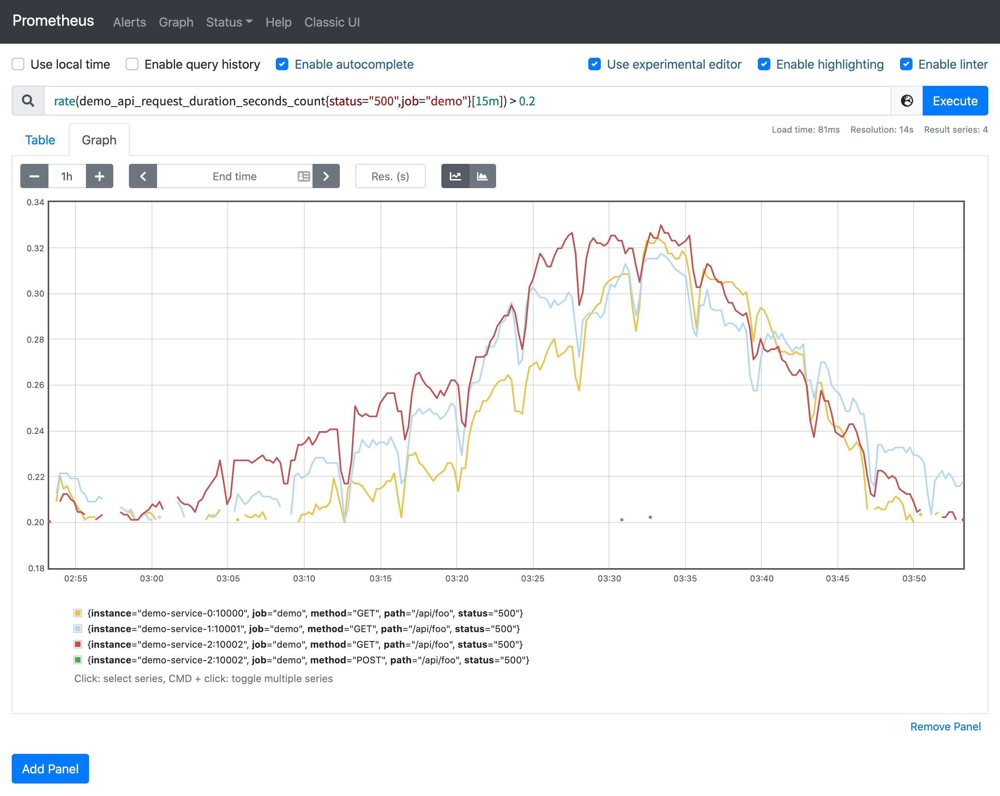

> 注意：由于在图形中的每个步长都是完全独立评估表达式的，因此根据每个步骤的过滤条件，某些比率会出现或消失（因此存在间隙）。 一般来说，二元过滤运算符在图形中并不常见，大多数在报警条件中出现，用来表示阈值。

这种过滤方式不仅适用于单个数字，PromQL 还允许你用一组时间序列过滤另一组序列。与上面的二元运算一样，比较运算符会自动应用于比较左侧和右侧具有相同标签集的序列之间。 `on() / ignoring()` 和 `group_left() / group_right()` 修饰符的作用也与我们前面学习的二元算术运算符一样。

以下示例是选择所有具有 500 错误率且至少比同一路径的总请求率大 50 倍的路径：

```promql
  rate(demo_api_request_duration_seconds_count{status="500",job="demo"}[5m]) * 50
> ignoring(status)
  sum without(status) (rate(demo_api_request_duration_seconds_count{job="demo"}[5m]))
```


不过需要注意的是我们必须忽略匹配中的 status 标签，因为在左边一直有这个标签，而右边没有这个标签。

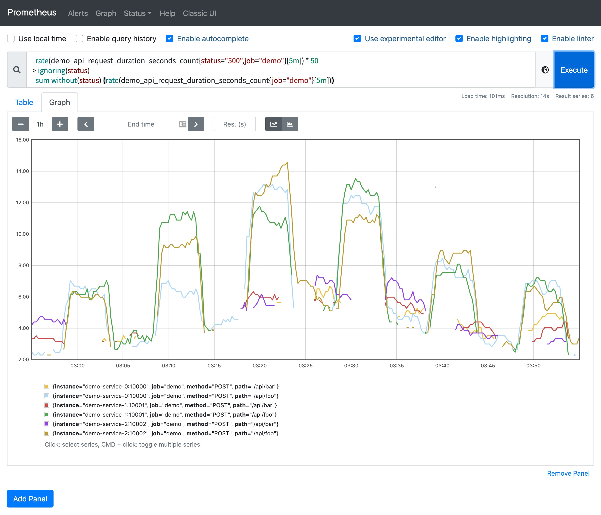

比如我们还可以计算 demo 演示服务实例在一小时内的预测磁盘使用量，但要过滤只有那些预测磁盘已满的实例。

```promql
predict_linear(demo_disk_usage_bytes{job="demo"}[1h], 3600) >= demo_disk_total_bytes{job="demo"}
```


Prometheus 支持以下过滤操作：

- `==`
- `!=`
- `<`
- `<=`
- `>`
- `>=`

有时你可能想知道比较运算符的结果而不实际删除任何输出系列。要实现这一点，我们可以向运算符添加一个 bool 修饰符来保留所有的序列，但是把输出样本值设置为 1（比较为真）或 0（比较为假）。

例如，要简单地显示一组数据中哪些请求率高于或低于 `0.2/s`，我们可以这样查询：

```promql
rate(demo_api_request_duration_seconds_count{job="demo"}[5m]) > bool 0.2
```


我们可以看到输入序列的结果为 0 或 1，把数字条件转换为了布尔输出值。

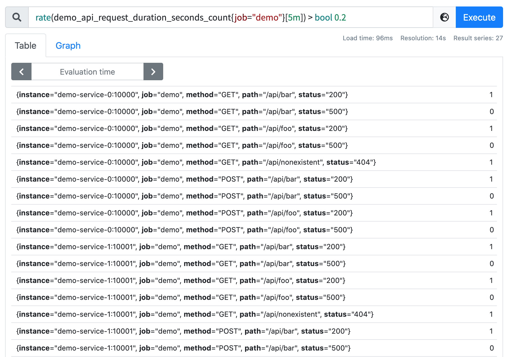

## 练习

1.构建一个查询，显示使用少于 20MB 内存的目标（`process_resident_memory_bytes` 指标）。

```promql
process_resident_memory_bytes / 1024^2 < 20
```


2.构建一个查询，显示 Prometheus 服务内部所有在过去 5 分钟内没有收到任何查询的 HTTP 处理器。

```promql
rate(prometheus_http_requests_total[5m]) == 0
```


# 集合操作

有的时候我们需要过滤或将一组时间序列与另一组时间序列进行合并，Prometheus 提供了 3 个在瞬时向量之间操作的集合运算符。

- `and（集合交集）`：比如对较高错误率触发报警，但是只有当对应的总错误率超过某个阈值的时候才会触发报警
- `or（集合并集）`：对序列进行并集计算
- `unless（除非）`：比如要对磁盘空间不足进行告警，除非它是只读文件系统。


与算术和过滤二元运算符类似，这些集合运算符会尝试根据相同的标签集在左侧和右侧之间查找来匹配序列，除非你提供 `on()` 或 `ignoring()` 修饰符来指定应该如何找到匹配。

> 注意：与算术和过滤二进制运算符相比，集合运算符没有 `group_left()` 或 `group_right()` 修饰符，因为集合运算符总是进行多对多的匹配，也就是说，它们总是允许任何一边的匹配序列与另一边的多个序列相匹配。

对于 `and` 运算符，如果找到一个匹配的，左边的序列就会成为输出结果的一部分，如果右边没有匹配的序列，则不会输出任何结果。

例如我们想筛选出第 90 个百分位延迟高于 50ms 的所有 HTTP 端点，但只针对每秒收到多个请求的维度组合，查询方式如下所示：

```promql
  histogram_quantile(0.9, rate(demo_api_request_duration_seconds_bucket{job="demo"}[5m])) > 0.05
and
  rate(demo_api_request_duration_seconds_count{job="demo"}[5m]) > 1
```


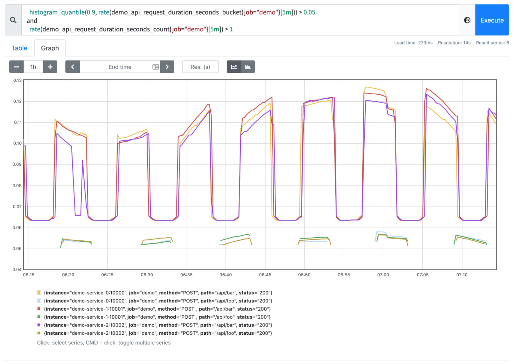

有的时候我们也需要对两组时间序列进行合并操作，而不是交集，这个时候我们可以使用 `or` 集合运算符，产生的结果是运算符左侧的序列，加上来自右侧但左侧没有匹配标签集的时间序列。比如我们要列出所有低于 10 或者高于 30 的请求率，则可以用下面的表达式来查询：

```promql
  rate(demo_api_request_duration_seconds_count{job="demo"}[5m]) < 10
or
  rate(demo_api_request_duration_seconds_count{job="demo"}[5m]) > 30
```


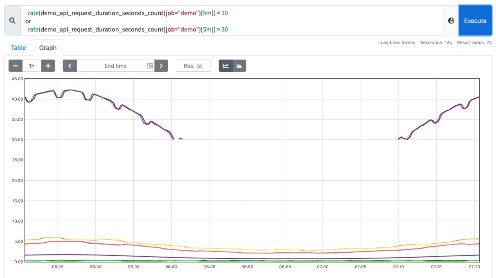

我们可以看到在图中使用值过滤器和集合操作会导致时间序列在图中有断点现象，这取决于他们在图中的时间间隔下是否能够与过滤器进行匹配，所以一般情况下，我们建议只在告警规则中使用这种过滤操作。

还有一个 `unless` 操作符，它只会保留左边的时间序列，如果右边不存在相等的标签集合的话。

## 练习

1.构建一个查询，显示按 path、method、status（5 分钟内平均）划分的 demo API 请求的第 95 个百分位延迟，除非这个维度组合每秒收到的请求少于 1 个请求（5 分钟内平均）。

```promql
histogram_quantile(0.95, sum by(path, method, status, le) (rate(demo_api_request_duration_seconds_bucket[5m])))
unless
 sum by(path, method, status) (rate(demo_api_request_duration_seconds_count[5m])) < 1
```


# 排序

本节我们将学习如何对查询结果进行排序，或者只选择一组序列中最大或最小的值。

我们可以使用 `sort()`（升序） 或者 `sort_desc()`（降序）函数来实现对输出结果进行排序，例如，要显示按值排序的每个路径请求率，从最高到最低，我们可以用下面的语句进行查询：

```promql
sort_desc(sum by(path) (rate(demo_api_request_duration_seconds_count{job="demo"}[5m])))
```


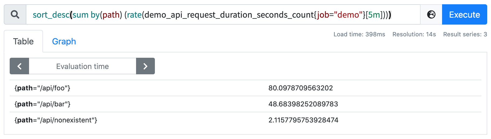

有的时候我们并不是对所有的时间序列感兴趣，只对最大或最小的几个序列感兴趣，我们可以使用 `topk()` 和 `bottomk()` 这两个运算符来操作，可以返回 `K` 个最大或最小的序列，比如只显示每个 path 和 method 的前三的请求率，我们可以使用下面的语句来查询。

```promql
topk(3, sum by(path, method) (rate(demo_api_request_duration_seconds_count{job="demo"}[5m])))
```


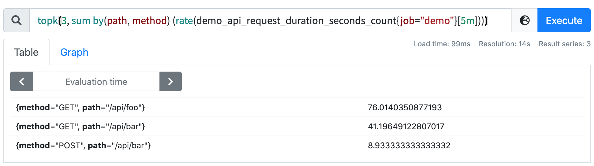

## 练习

1.构建一个查询以升序的方式显示所有 3 个 demo 服务的磁盘使用情况。

```promql
sort(demo_disk_usage_bytes)
```


2.构建一个查询，按 method、path 和 status 维度显示 3 个最低流量的 demo API 请求比率。

```promql
bottomk(3, sum by(method, path, status) (rate(demo_api_request_duration_seconds_count[5m])))
```


# 直方图

在这一节中，我们将学习直方图指标，了解如何根据这些指标来计算分位数。Prometheus 中的直方图指标允许一个服务记录一系列数值的分布。直方图通常用于跟踪**请求的延迟或响应大小**等指标值，当然理论上它是可以跟踪任何根据某种分布而产生波动数值的大小。Prometheus 直方图是在客户端对数据进行的采样，它们使用的一些可配置的（例如延迟）bucket 桶对观察到的值进行计数，然后将这些 bucket 作为单独的时间序列暴露出来。

下图是一个非累积直方图的例子：

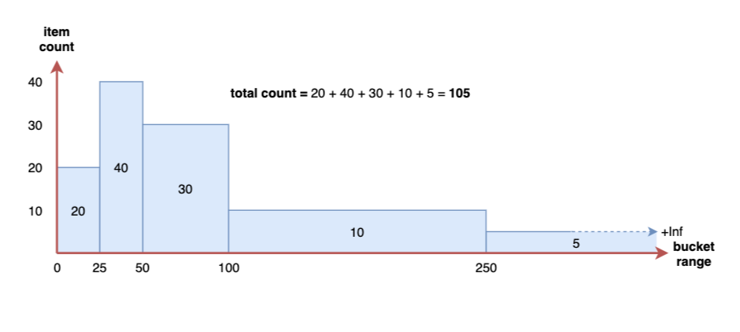

在 Prometheus 内部，直方图被实现为一组时间序列，每个序列代表指定桶的计数（例如`10ms以下的请求数`、`25ms以下的请求数`、`50ms以下的请求数`等）。 在 Prometheus 中每个 bucket 桶的计数器是累加的，这意味着较大值的桶也包括所有低数值的桶的计数。在作为直方图一部分的每个时间序列上，相应的桶由特殊的 `le` 标签表示。`le` 代表的是**小于或等于**。

与上面相同的直方图在 Prometheus 中的累积直方图如下所示：

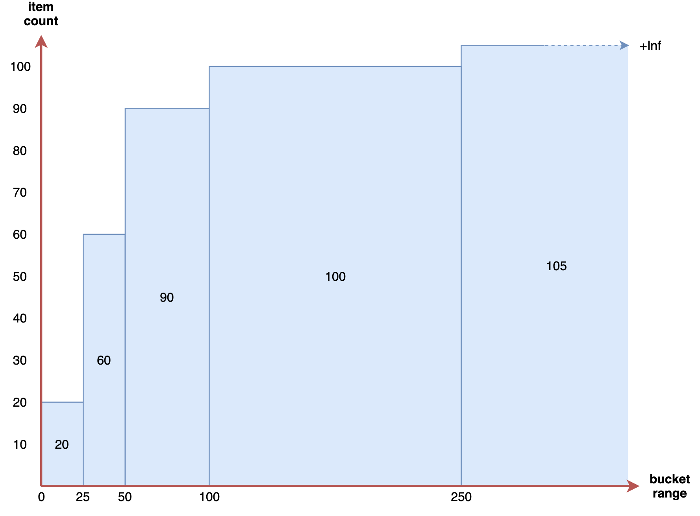

可以看到在 Prometheus 中直方图的计数是累计的，这是很奇怪的，因为通常情况下非累积的直方图更容易理解。Prometheus 为什么要这么做呢？想象一下，如果直方图指标中加入了额外的标签，或者划分了更多的 bucket，那么样本数据的分析就会变得越来越复杂，如果直方图是累积的，在抓取指标时就可以根据需要丢弃某些 bucket，这样可以在降低 Prometheus 维护成本的同时，还可以粗略计算样本值的分位数。通过这种方法，用户不需要修改应用代码，便可以动态减少抓取到的样本数量。另外直方图还提供了 `_sum` 指标和 `_count` 指标，所以即使你丢弃了所有的 bucket，仍然可以通过这两个指标值来计算请求的平均响应时间。通过累积直方图的方式，还可以很轻松地计算某个 bucket 的样本数占所有样本数的比例。

我们在演示的 demo 服务中暴露了一个直方图指标 `demo_api_request_duration_seconds_bucket`，用于跟踪 API 请求时长的分布，由于这个直方图为每个跟踪的维度导出了 26 个 bucket，因此这个指标有很多时间序列。我们可以先来看下来自一个服务实例的一个请求维度组合的直方图，查询语句如下所示：

```promql
demo_api_request_duration_seconds_bucket{instance="demo-service-0:10000", method="POST", path="/api/bar", status="200", job="demo"}
```


正常我们可以看到 26 个序列，每个序列代表一个 bucket，由 `le` 标签标识：

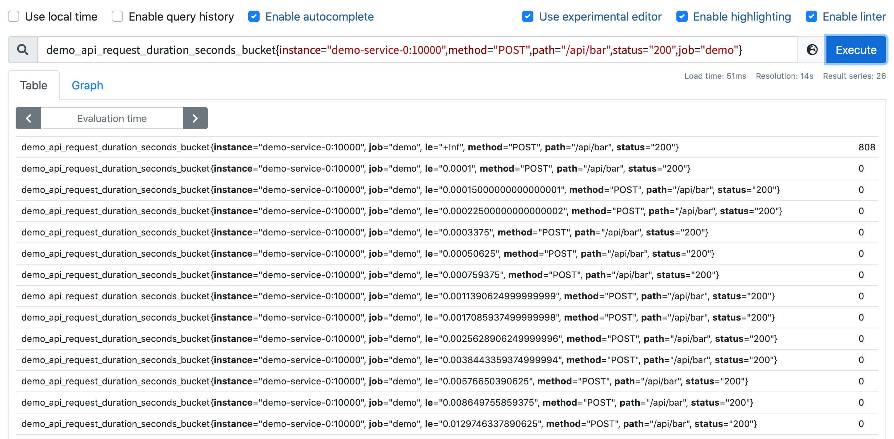

直方图可以帮助我们了解这样的问题，比如`"我有多少个请求超过了100ms的时间？"` (当然需要直方图中配置了一个以 100ms 为边界的桶)，又比如`"我99%的请求是在多少延迟下完成的？"`，这类数值被称为**百分位数**或**分位数**。在 Prometheus 中这两个术语几乎是可以通用，只是百分位数指定在 0-100 范围内，而分位数表示在 0 和 1 之间，所以第 99 个百分位数相当于目标分位数 0.99。

如果你的直方图桶粒度足够小，那么我们可以使用 `histogram_quantile(φ scalar, b instant-vector)` 函数用于计算历史数据指标一段时间内的分位数。该函数将目标分位数 (`0 ≤ φ ≤ 1`) 和直方图指标作为输入，就是大家平时讲的 `pxx`，`p50` 就是中位数，参数 `b` 一定是包含 `le` 这个标签的瞬时向量，不包含就无从计算分位数了，但是计算的分位数是一个预估值，并不完全准确，因为这个函数是假定每个区间内的样本分布是线性分布来计算结果值的，预估的准确度取决于 bucket 区间划分的粒度，粒度越大，准确度越低。

回到我们的演示服务，我们可以尝试计算所有维度在所有时间内的第 90 个百分位数，也就是 90% 的请求的持续时间。

```promql
# BAD!
histogram_quantile(0.9, demo_api_request_duration_seconds_bucket{job="demo"})
```


但是这个查询方式是有一点问题的，当单个服务实例重新启动时，bucket 的 Counter 计数器会被重置，而且我们常常想看看`现在`的延迟是多少（比如在过去 5 分钟内），而不是整个时间内的指标。我们可以使用 `rate()` 函数应用于底层直方图计数器来实现这一点，该函数会自动处理 Counter 重置，又可以只计算每个桶在指定时间窗口内的平均增长。

我们可以这样去计算过去 5 分钟内第 90 个百分位数的 API 延迟：

```promql
# GOOD!
histogram_quantile(0.9, rate(demo_api_request_duration_seconds_bucket{job="demo"}[5m]))
```


这个查询就好很多了。

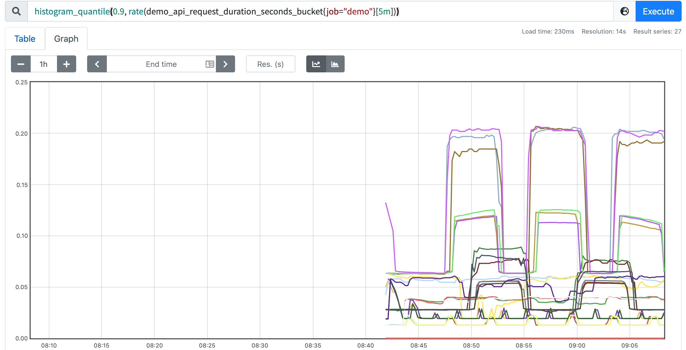

这个查询会显示每个维度（job、instance、path、method 和 status）的第 90 个百分点，但是我们可能对单独的这些维度并不感兴趣，想把他们中的一些指标聚合起来，这个时候我们可以在查询的时候使用 Prometheus 的 `sum` 运算符与 `histogram_quantile()` 函数结合起来，计算出聚合的百分位，假设在我们想要聚合的维度之间，直方图桶的配置方式相同（桶的数量相同，上限相同），我们可以将不同维度之间具有相同 `le` 标签值的桶加在一起，得到一个聚合直方图。然后，我们可以使用该聚合直方图作为 `histogram_quantile()` 函数的输入。

> 注意：这是假设直方图的桶在你要聚合的所有维度之间的配置是相同的，桶的配置也应该是相对静态的配置，不会一直变化，因为这会破坏你使用 `histogram_quantile()` 查看的时间范围内的结果。

下面的查询计算了第 90 个百分位数的延迟，但只按 job、instance 和 path 维度进行聚合结果：

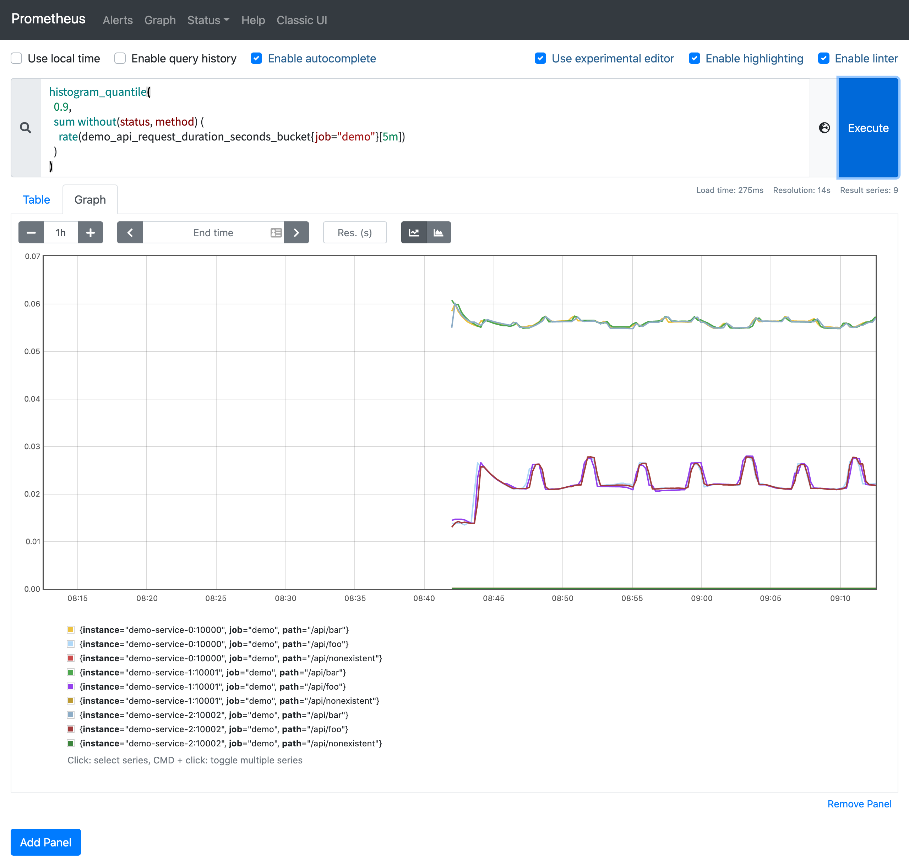

## 练习

1.构建一个查询，计算在 0.0001 秒内完成的 demo 服务 API 请求的总百分比，与过去 5 分钟内所有请求总数的平均值。

```promql
sum(rate(demo_api_request_duration_seconds_bucket{le="0.0001"}[5m]))
/
sum(rate(demo_api_request_duration_seconds_bucket{le="+Inf"}[5m])) * 100
```


或者可以使用下面的语句查询

```promql
sum(rate(demo_api_request_duration_seconds_bucket{le="0.0001"}[5m]))
/
 sum(rate(demo_api_request_duration_seconds_count[5m])) * 100
```


2.构建一个查询，计算 demo 服务 API 请求的第 50 个百分位延迟，按 status code 和 method 进行划分，在过去一分钟的平均值。

```promql
histogram_quantile(0.5, sum by(status, method, le) (rate(demo_api_request_duration_seconds_bucket[1m])))
```

# 数据对比

有的时候我们可能需要去访问过去的数据，并和当前数据进行对比。例如，我们可能想比较今天的请求率和一周前的请求率之间的差异。我们可以在任何区间向量或瞬时向量选择器上附加一个偏移量 `offset<duration>` 的修饰符（比如 `my_metric offset 5m` 或者 `my_metric[1m] offset 7d`）。

让我们来看一个示例，在我们的 demo 服务中暴露了一个 Counter 指标 `demo_items_shipped_total`，该指标追踪物品的运输情况，用 5 分钟来模拟`"每日"`流量周期，所以我们不必等待一整天才能查看该时段的数据。

我们只使用第一个演示服务实例来测试即可，首先我们来看看它的速率：

```promql
rate(demo_items_shipped_total{instance="demo-service-0:10000"}[1m])
```


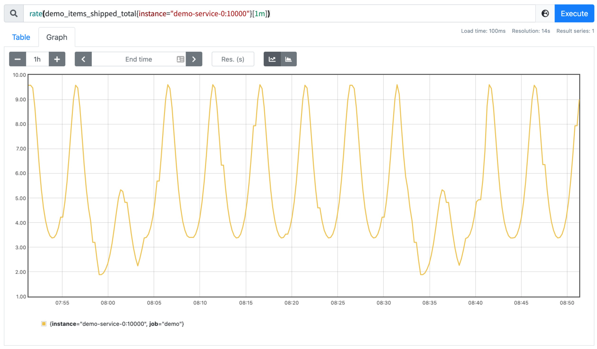

该服务还暴露了一个 `0` 或 `1` 的布尔指标，告诉我们现在是否是假期：

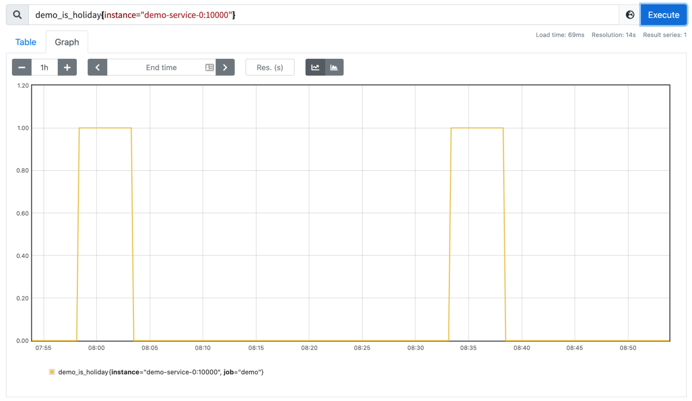

将假期与发货商品率进行比较，注意到节假日时它会减少!我们可以尝试将当前的发货速度与 7"天"（7 * 5 分钟）前的速度进行比较，看看是否有什么不正常的情况。

```promql
  rate(demo_items_shipped_total{instance="demo-service-0:10000"}[1m])
/
  rate(demo_items_shipped_total{instance="demo-service-0:10000"}[1m] offset 35m)
```


通常情况下，该比率约为 1，但当当天或前一天是假期时，我们得到的比率比正常情况下要略低或高。

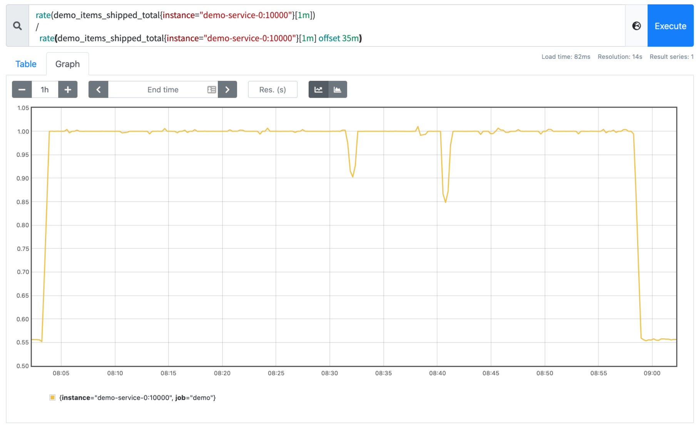

但是，如果原因只是假期，我们想忽略这个较低或较高的比率。我们可以在过去或现在是假期的时候过滤掉这个比率，方法是附加一个 unless 集合操作符。

```promql
(
    rate(demo_items_shipped_total{instance="demo-service-0:10000"}[1m])
  /
    rate(demo_items_shipped_total{instance="demo-service-0:10000"}[1m] offset 35m)
)
unless
  (
    demo_is_holiday == 1  # Is it currently a holiday?
  or
    demo_is_holiday offset 35m == 1  # Was it a holiday 7 "days" ago?
  )
```


或者另外一种方法，我们只需要比较今天和一周前是否有相同的节日：

```promql
(
    rate(demo_items_shipped_total{instance="demo-service-0:10000"}[1m])
  /
    rate(demo_items_shipped_total{instance="demo-service-0:10000"}[1m] offset 35m)
)
unless
  (
      demo_is_holiday
    !=
      demo_is_holiday offset 35m
  )
```


这样我们就可以过滤掉当前时间有假期或过去有假期的结果。

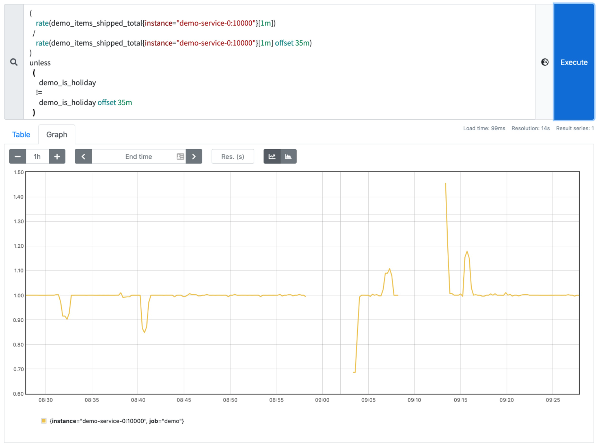

## 练习

1.构建一个查询，计算每个 path 路径的总请求率和 35 分钟前的差异。

```promql
sum by(path) (rate(demo_api_request_duration_seconds_count[5m])) -
  sum by(path) (rate(demo_api_request_duration_seconds_count[5m] offset 35m))
```


# 检测

本节我们将学习如何来检查我们的实例数据抓取健康状况。

## 检查抓取实例

每当 Prometheus 抓取一个目标时，它都会存储一个合成的样本，其中包含指标名称 `up` 和被抓取实例的 `job` 和 `instance` 标签，如果抓取成功，则样本的值被设置为 1，如果抓取失败，则设置为 0，所以我们可以通过如下所示的查询来获取当前哪些实例处于正常或挂掉的状态：

```promql
up{job="demo"}
```


正常三个演示服务实例都处于正常状态，所以应该都为**1**。如果我们将第一个实例停掉，重新查询则第一个实例结果为**0**：

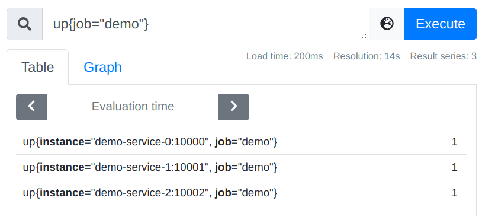

如果只希望显示 `down` 掉的实例，可以通过过滤**0**值来获取：

```promql
up{job="demo"} == 0
```


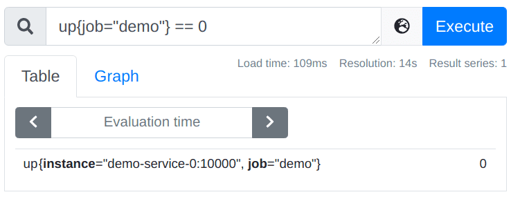

或者获取挂掉实例的总数：

```promql
count by(job) (up{job="demo"} == 0)
```


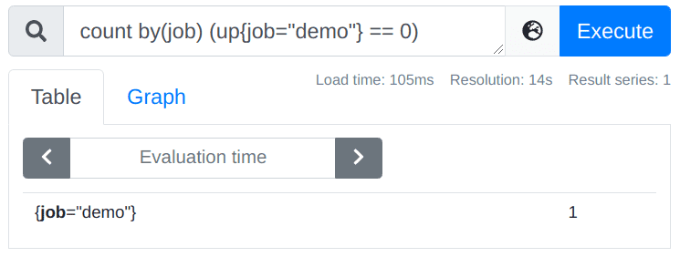

一般情况下这种类型的查询会用于指标抓取健康状态报警。

> 注意：因为 `count()` 是一个聚合运算符，它期望有一组维度的时间序列作为其输入，并且可以根据 `by` 或 `without` 子句将输出序列分组。任何输出组只能基于现有的输入序列，如果根本没有输入序列，就不会产生输出。

## 检查序列数据

在某些情况下，只查看序列的样本值是不够的，有时还需要检测是否存在某些序列，上面我们用 `up{job="demo"} == 0` 语句来查询所有无法抓取的演示服务实例，但是只有已经被抓取的目标才会被加上 `up` 指标，如果 Prometheus 都没有抓取到任何的演示服务目标应该怎么办呢？比如它的抓取配置出问题了，服务发现可能返回也为空，或者由于 Prometheus 自身出了某些问题。

在这种情况下，`absent()` 函数就非常有用了，`absent()` 将一个瞬时向量作为其输入，当输入包含序列时，将返回一个空结果，不包含时将返回单个输出序列，而且样本值为**1**。

例如，查询语句 `absent(up{job="demo"})` 将得到一个空的输出结果，如果测试一个没有被抓取的 job 是否存在的时候，将得到样本值**1**。

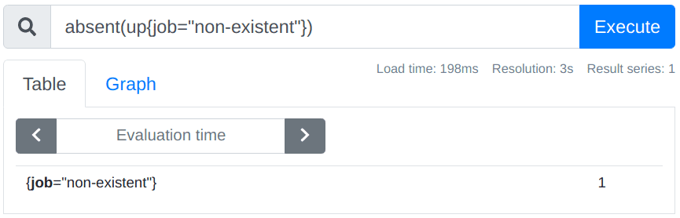

这可以帮助我们检测序列是否存在的情况。此外还有一个 `absent()` 的变种，叫做 `absent_over_time()`，它接受一个区间向量，告诉你在该输入向量的整个时间范围内是否有样本。

> **练习：**
>
> 1.构建一个查询，检测指标 `demo_api_request_duration_seconds_count` 是否具有 `PUT` 的 method 标签的序列。

> ```promql
>  absent(demo_api_request_duration_seconds_count{method="PUT"})
> ```

> 2.构建一个查询，当过去一小时内任务 `non-existent` 没有记录 up 指标时，该查询输出一个系列。

> ```promql
> absent_over_time(up{job="non-existent"}[1h])
> ```