# PromQL 基础

在继续深入学习 PromQL 查询细节之前，我们先来看看 PromQL 查询的一些理论基础。

## 嵌套结构

与 SQL 查询语言（SELECT * FROM ...）不同，PromQL 是一种嵌套的函数式语言，就是我们要把需要查找的数据描述成一组嵌套的表达式，每个表达式都会评估为一个中间值，每个中间值都会被用作它上层表达式中的参数，而查询的最外层表达式表示你可以在表格、图形中看到的最终返回值。比如下面的查询语句：

```sql
histogram_quantile(  # 查询的根，最终结果表示一个近似分位数。
  0.9,  # histogram_quantile() 的第一个参数，分位数的目标值
  # histogram_quantile() 的第二个参数，聚合的直方图
  sum by(le, method, path) (
    # sum() 的参数，直方图过去5分钟每秒增量。
    rate(
      # rate() 的参数，过去5分钟的原始直方图序列
      demo_api_request_duration_seconds_bucket{job="demo"}[5m]
    )
  )
)
```


PromQL 表达式不仅仅是整个查询，而是查询的任何嵌套部分（比如上面的`rate(...)`部分），你可以把它作为一个查询本身来运行。在上面的例子中，每行注释代表一个表达式。

## 结果类型

在查询 Prometheus 时，有两个 `类型` 的概念经常出现，区分它们很重要。

- 抓取目标报告的**指标类型**：counter、gauge、histogram、summary。
- PromQL 表达式的**结果数据类型**：字符串、标量、瞬时向量或区间向量。

PromQL 实际上没有直接的指标类型的概念，只关注表达式的结果类型。每个 PromQL 表达式都有一个类型，每个函数、运算符或其他类型的操作都要求其参数是某种表达式类型。例如，`rate()` 函数要求它的参数是一个区间向量，但是 `rate()` 本身评估为一个瞬时向量输出，所以 `rate()` 的结果只能用在期望是瞬时向量的地方。

PromQL 中可能的表达式类型包括：

- `string(字符串)`：字符串只会作为某些函数（如 `label_join()` 和 `label_replace()`）的参数出现。

- `scalar(标量)`：一个单一的数字值，如 1.234，这些数字可以作为某些函数的参数，如 `histogram_quantile(0.9, ...)` 或 `topk(3, ...)`，也会出现在算术运算中。

- `instant vector(瞬时向量)`：一组标记的时间序列，每个序列有一个样本，都在同一个时间戳，瞬时向量可以由 TSDB 时间序列选择器直接产生，如`node_cpu_seconds_total`，也可以由任何函数或其他转换来获取。

  ```shell
  node_cpu_seconds_total{cpu="0", mode="idle"}   → 19165078.75 @ timestamp_1
  node_cpu_seconds_total{cpu="0", mode="system"} →   381598.72 @ timestamp_1
  node_cpu_seconds_total{cpu="0", mode="user"}   → 23211630.97 @ timestamp_1
  ```

  

- `range vector(区间向量)`：一组标记的时间序列，每个序列都有一个随时间变化的样本范围。在 PromQL 中只有两种方法可以生成区间向量：在查询中使用字面区间向量选择器（如 `node_cpu_seconds_total[5m]`），或使用子查询表达式（如 `<expression>[5m:10s]`），当想要在指定的时间窗口内聚合一个序列的行为时，区间向量非常有用，就像 `rate(node_cpu_seconds_total[5m])` 计算每秒增加率一样，在 `node_cpu_seconds_total` 指标的最后 5 分钟内求平均值。

  ```shell
  node_cpu_seconds_total{cpu="0", mode="idle"}   → 19165078.75 @ timestamp_1,  19165136.3 @ timestamp_2, 19165167.72 @ timestamp_3
  node_cpu_seconds_total{cpu="0", mode="system"} → 381598.72   @ timestamp_1,   381599.98 @ timestamp_2,   381600.58 @ timestamp_3
  node_cpu_seconds_total{cpu="0", mode="user"}   → 23211630.97 @ timestamp_1, 23211711.34 @ timestamp_2, 23211748.64 @ timestamp_3
  ```

  

注意

但是指标类型呢？如果你已经使用过 PromQL，你可能知道某些函数仅适用于特定类型的指标！例如，`histogram_quantile()` 函数仅适用于直方图指标， `rate()` 仅适用于计数器指标，`deriv()` 仅适用于 `Gauge`。但是 PromQL 实际上并没有检查你是否传入了正确类型的指标——这些函数通常会运行并为错误类型的输入指标返回一些无意义的数据，这取决于用户是否传入了遵守某些假设的时间序列（比如在直方图的情况下有一个有意义的 `le` 标签，或者在计数器的情况下单调递增）。

## 查询类型和评估时间

PromQL 查询中对时间的引用只有相对引用，比如 `[5m]`，表示过去 5 分钟，那么如何指定一个绝对的时间范围，或在一个表格中显示查询结果的时间戳？在 PromQL 中，这样的时间参数是与表达式分开发送到 Prometheus 查询 API 的，确切的时间参数取决于你发送的查询类型，Prometheus 有两种类型的 PromQL 查询：瞬时查询和区间查询。

### 瞬时查询

瞬时查询用于类似表格的视图，你想在一个时间点上显示 PromQL 查询的结果。一个瞬时查询有以下参数：

- PromQL 表达式
- 一个评估的时间戳

在查询的时候可以选择查询过去的数据，比如 `foo[1h]` 表示查询 foo 序列最近 1 个小时的数据，访问过去的数据，对于计算一段时间内的比率或平均数等聚合会非常有用。

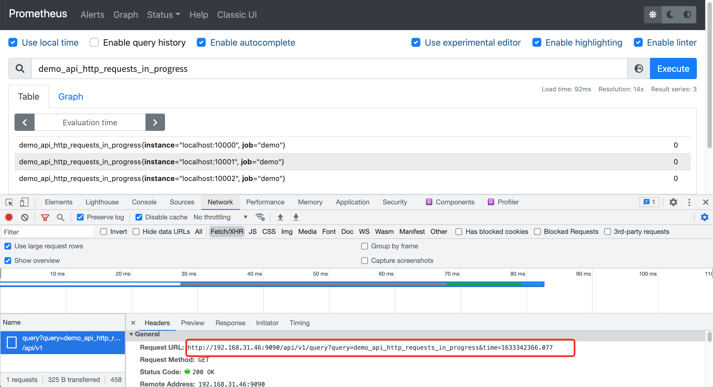

在 Prometheus 的 WebUI 界面中表格视图中的查询就是瞬时查询，API 接口 `/api/v1/query?query=xxxx&time=xxxx` 中的 `query` 参数就是 PromQL 表达式，`time` 参数就是评估的时间戳。瞬时查询可以返回任何有效的 PromQL 表达式类型（字符串、标量、即时和范围向量）。

下面来看一个瞬时查询的示例，看看它是如何进行评估工作的。比如 `http_requests_total` 在指定的时间戳来评估表达式，`http_requests_total` 是一个瞬时向量选择器，它可以选择该时间序列的最新样本，`最新`意味着查询最近 5 分钟的样本数据。

如果我们在一个有最近样本的时间戳上运行此查询，结果将包含两个序列，每个序列都有一个样本：

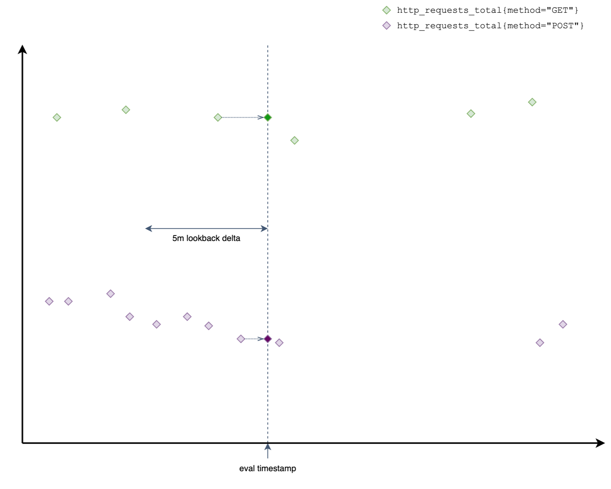

注意每个返回的样本输出时间戳不再是原始样本被采集的时间戳，而会被设置为评估的时间戳。

如果在时间戳之前有一个 `>5m` 的间隙，这个时候如果我们执行相同的查询：

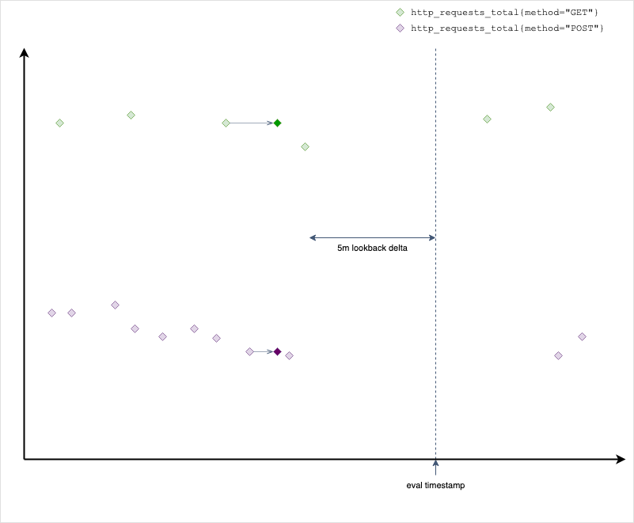

这个情况下查询的结果将返回为空，因为很显然在最近 5 分钟内没有能够匹配的样本。

### 区间查询

区间查询主要用于图形，想在一个指定的时间范围内显示一个 PromQL 表达式，范围查询的工作方式与即时查询完全相同，这些查询在指定时间范围的评估步长中进行评估。当然，这在后台是高度优化的，在这种情况下，Prometheus 实际上并没有运行许多独立的即时查询。

区间查询包括以下一些参数：

- PromQL 表达式
- 开始时间
- 结束时间
- 评估步长

在开始时间和结束时间之间的每个评估步长上评估表达式后，单独评估的时间片被拼接到一个单一的区间向量中。区间查询允许传入瞬时向量类型或标量类型的表达式，但始终返回一个范围向量（标量或瞬时向量在一个时间范围内被评估的结果）。

在 Prometheus 的 WebUI 界面中图形视图中的查询就是区间查询，API 接口 `/api/v1/query_range?query=xxx&start=xxxxxx&end=xxxx&step=14` 中的 `query` 参数就是 PromQL 表达式，`start` 为开始时间，`end` 为结束时间，`step` 为评估的步长。

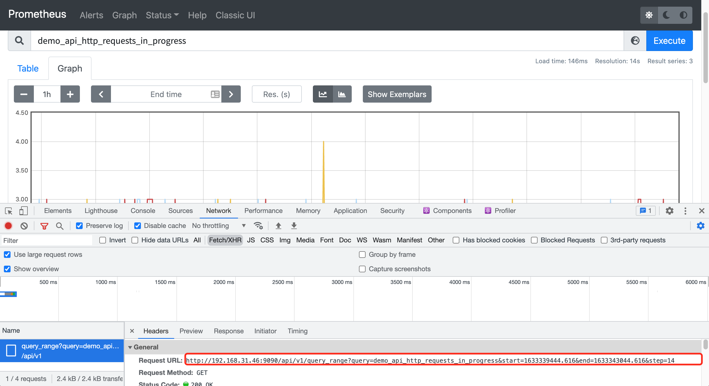

比如把上面的 `http_requests_total` 表达式作为一个范围查询来进行评估，它的评估结果如下所示：

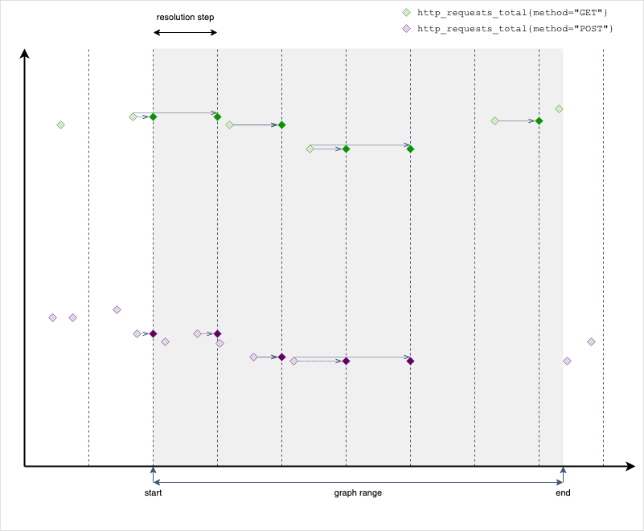

注意每个评估步骤的行为与独立的瞬时查询完全一样，而且每个独立的瞬时查询都没有查询的总体范围的概念，在我们这个示例中最终的结果将是一个区间向量，其中包含两个选定序列在一定时间范围内的样本，但也将包含某些时间步长的序列数据的间隙。


# 选择时间序列

本节我们将学习如何用不同的方式来选择数据，如何在单个时间戳或一段时间范围内基于标签过滤数据，以及如何使用移动时间的方式来选择数据。

## 过滤指标名称

最简单的 PromQL 查询就是直接选择具有指定指标名称的序列，例如，以下查询将返回所有具有指标名称 `demo_api_request_duration_seconds_count` 的序列：

```shell
demo_api_request_duration_seconds_count
```


该查询将返回许多具有相同指标名称的序列，但有不同的标签组合 instance、job、method、path 和 status 等。输出结果如下所示：

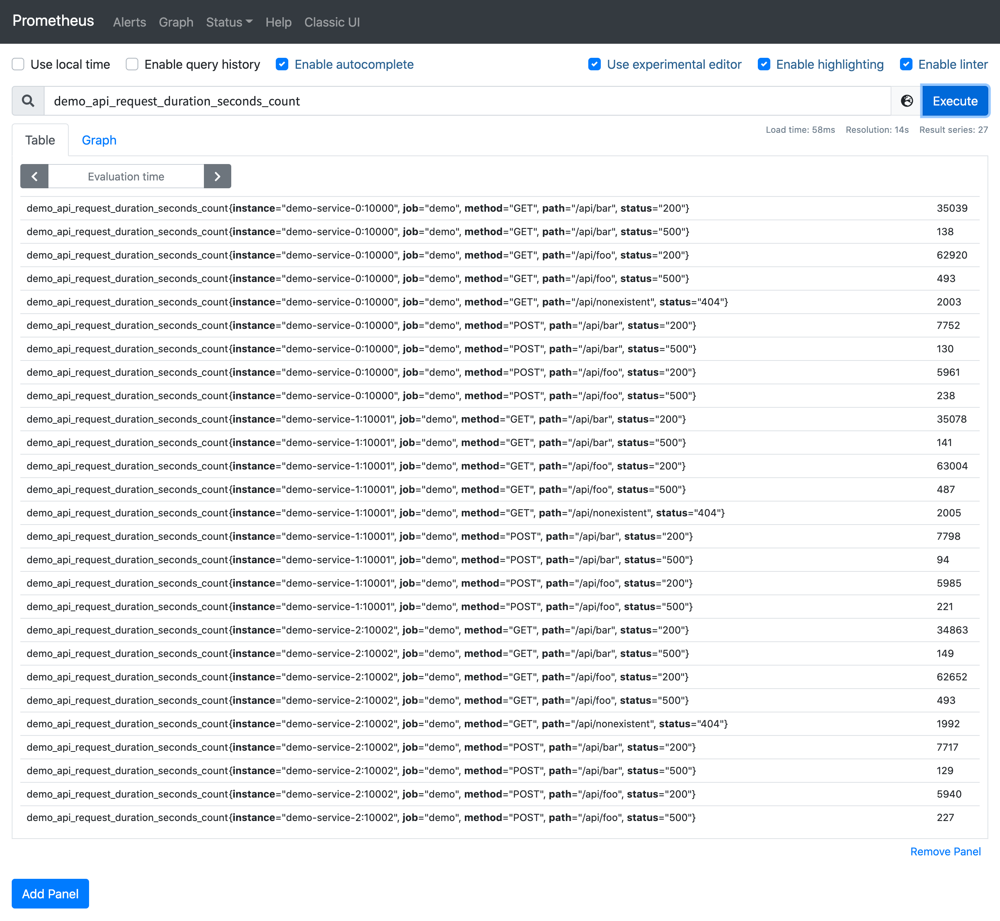

## 根据标签过滤

如果我们只查询 `demo_api_request_duration_seconds_count` 中具有 `method="GET"` 标签的那些指标序列，则可以在指标名称后用大括号加上这个过滤条件：

```shell
demo_api_request_duration_seconds_count{method="GET"}
```


此外我们还可以使用**逗号**来组合多个标签匹配器：

```shell
demo_api_request_duration_seconds_count{instance="demo-service-0:10000",method="GET",job="demo"}
```


上面将得到 demo 任务下面 `demo-service-0:10000` 这个实例**且** `method="GET"` 的指标序列数据：

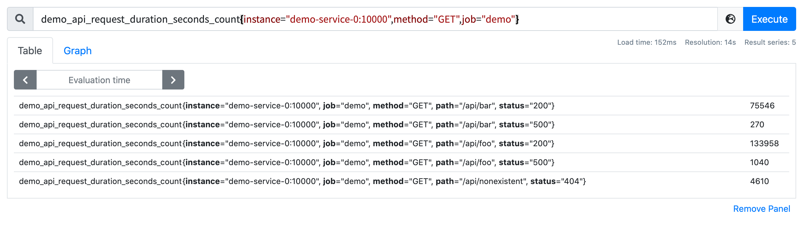

需要注意的是组合使用多个匹配条件的时候，是过滤所有条件都满足的时间序列。

除了相等匹配之外，Prometheus 还支持其他几种匹配器类型：

- `!=`：不等于
- `=~`：正则表达式匹配
- `!~`：正则表达式不匹配

甚至我们还可以完全省略指标名称，比如直接查询所有 `path` 标签以 `/api` 开头的所有序列：

```shell
{path=~"/api.*"}
```


该查询会得到一些具有不同指标名称的序列：

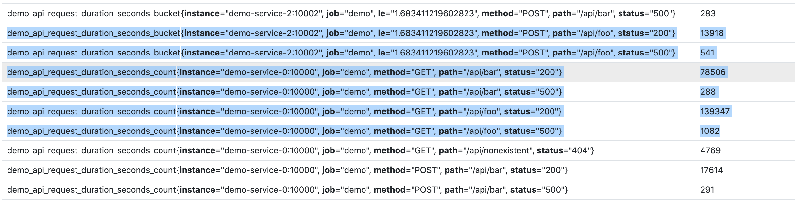

注意

Prometheus 中的正则表达式总是针对完整的字符串而不是部分字符串匹配。因此，在匹配任何以 `/api` 开通的路径时，不需要以 `^` 开头，但需要在结尾处添加 `.*`，这样可以匹配 `path="/api"` 这样的序列。

前面我们说过在 Prometheus 内部，指标名称本质上是一个名为 `__name__` 的特性标签，所以查询 `demo_api_request_duration_seconds_count` 实际上和下面的查询方式是等效的：

```shell
{__name__="demo_api_request_duration_seconds_count"}
```


按上面的方法编写的选择器，可以得到一个**瞬时向量**，其中包含所有选定序列的单个**最新值**。事实上有些函数要求你不是传递一个单一的值，而是传递一个序列在一段时间范围内的值，也就是前面我们说的**区间向量**。这个时候我们可以通过附加一个`[<数字><单位>]`形式的持续时间指定符，将即时向量选择器改变为范围向量选择器（例如`[5m]`表示 5 分钟）。

比如要查询最近 5 分钟的可用内存，可以执行下面的查询语句：

```shell
demo_memory_usage_bytes{type="free"}[5m]
```


将得到如下所示的查询结果：

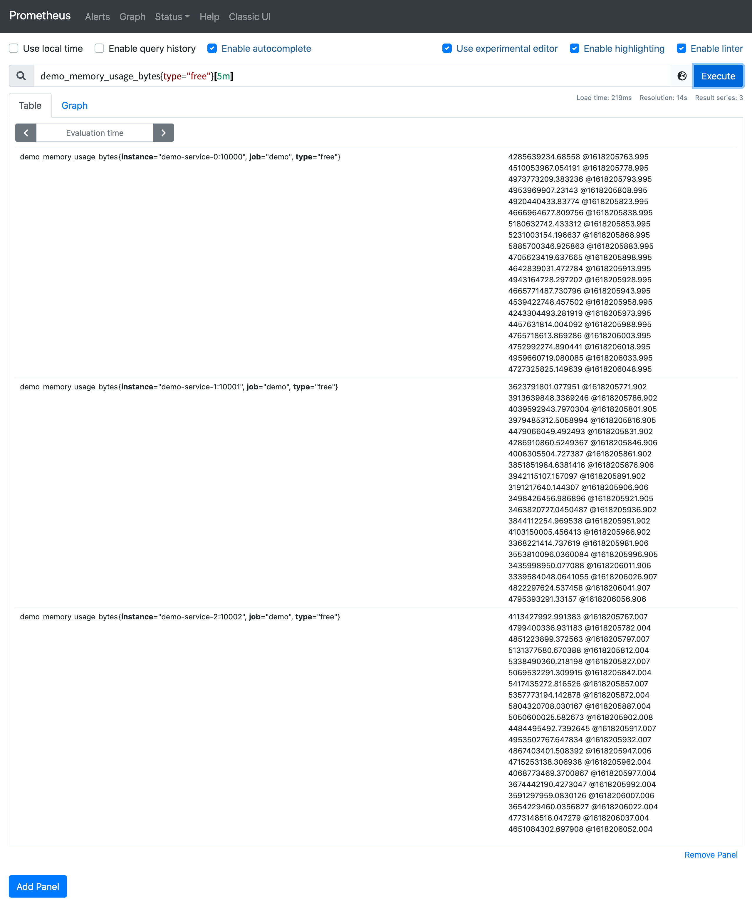

可以使用的有效的时间单位为：

- `ms` -毫秒
- `s` -秒
- `m` - 分钟
- `h` - 小时
- `d` - 天
- `y` - 年

有时我们还需要以时移方式访问过去的数据，通常用来与当前数据进行比较。要将过去的数据时移到当前位置，可以使用 `offset <duration>` 修饰符添加到任何范围或即时序列选择器进行查询（例如 `my_metric offset 5m` 或 `my_metric[1m] offset 7d`）。

例如，要选择一个小时前的可用内存，可以使用下面的查询语句：

```shell
demo_memory_usage_bytes{type="free"} offset 1h
```


这个时候查询的值则是一个小时之前的数据：

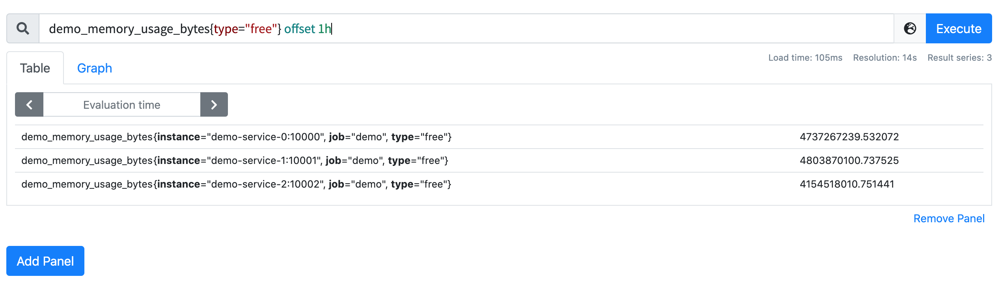

## 练习

1.构建一个查询，选择所有时间序列。

```shell
{job!=""}
```


或者：

```shell
{__name__=~".+"}
```


2.构建一个查询，查询所有指标名称为 `demo_api_request_duration_seconds_count` 并且 `method` 标签不为 `POST` 的序列。

```shell
demo_api_request_duration_seconds_count{method!="POST"}
```


3.使用 `demo_memory_usage_bytes` 指标查询一小时前的 1 分钟时间范围的的可用**空闲**内存。

```shell
demo_memory_usage_bytes{type="free"}[1m] offset 1h
```

# 变化率

通常来说直接绘制一个原始的 `Counter` 类型的指标数据用处不大，因为它们会一直增加，一般来说是不会去直接关心这个数值的，因为 `Counter` 一旦重置，总计数就没有意义了，比如我们直接执行下面的查询语句：

```shell
demo_api_request_duration_seconds_count{job="demo"}
```


可以得到下图所示的图形：

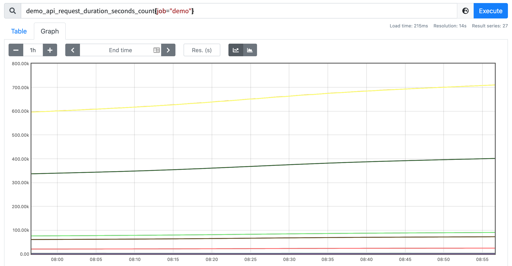

可以看到所有的都是不断增长的，一般来说我们更想要知道的是 Counter 指标的变化率，PromQL 提供了不同的函数来计算变化率。

## rate

用于计算变化率的最常见函数是 `rate()`，`rate()` 函数用于计算在指定时间范围内计数器平均每秒的增加量。因为是计算一个时间范围内的平均值，所以我们需要在序列选择器之后添加一个范围选择器。

例如我们要计算 `demo_api_request_duration_seconds_count` 在最近五分钟内的每秒平均变化率，则可以使用下面的查询语句：

```shell
rate(demo_api_request_duration_seconds_count[5m])
```


可以得到如下所示的图形：

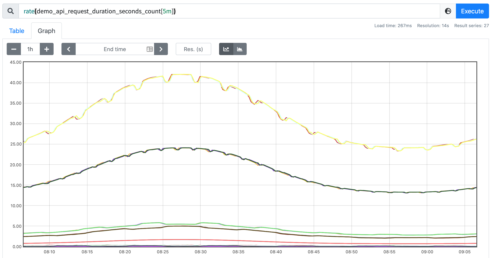

现在绘制的图形看起来显然更加有意义了，进行 rate 计算的时候是选择指定时间范围下的第一和最后一个样本进行计算，下图是表示瞬时计算的计算方式：

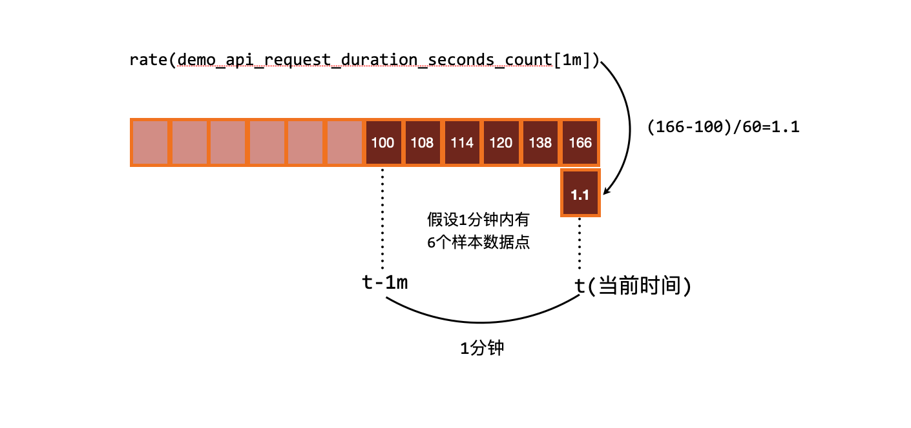

往往我们需要的是绘制一个图形，那么就需要进行区间查询，指定一个时间范围内进行多次计算，将结果串联起来形成一个图形：

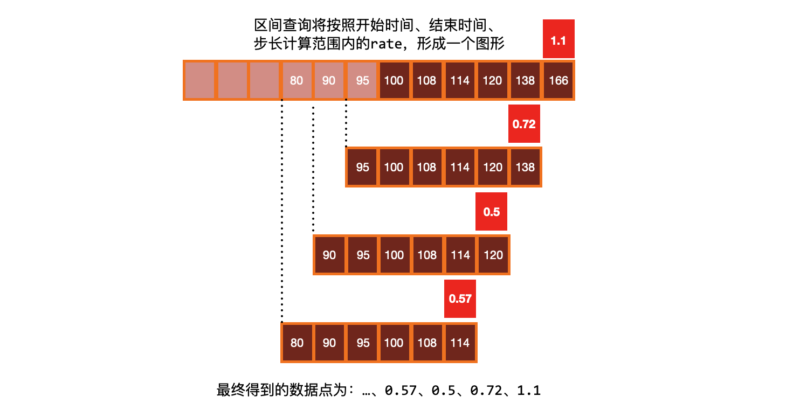

对于 `rate()` 和相关函数有几个需要说明的：

- 当被抓取指标进的程重启时，`Counter` 指标可能会重置为 0，但 `rate()` 函数会自动处理这个问题，它会假设 `Counter` 指标的值只要是减少了就认为是被重置了，然后它可以调整后续的样本，例如，如果时间序列的值为`[5,10,4,6]`，则将其视为`[5,10,14,16]`。
- 变化率是从指定的时间范围下包含的样本进行计算的，需要注意的是这个时间窗口的边界并不一定就是一个样本数据，可能会不完全对齐，所以，即使对于每次都是增加整数的 `Counter`，也可能计算结果是非整数。

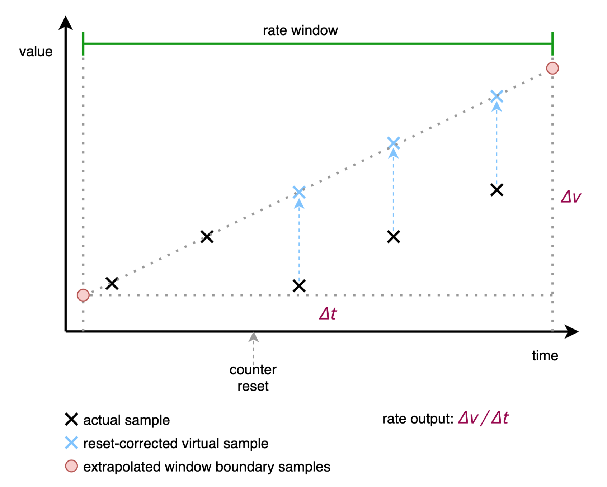

另外我们需要注意当把 `rate()` 与一个聚合运算符（例如 `sum()`）或一个随时间聚合的函数（任何以 `_over_time` 结尾的函数）结合起来使用时，总是先取用 `rate()` 函数，然后再进行聚合，否则，当你的目标重新启动时，`rate()` 函数无法检测到 Counter 的重置。

> **注意**：`rate()` 函数需要在指定窗口下至少有两个样本才能计算输出。一般来说，比较好的做法是选择范围窗口大小至少是抓取间隔的`4`倍，这样即使在遇到窗口对齐或抓取故障时也有可以使用的样本进行计算，例如，对于 1 分钟的抓取间隔，你可以使用 4 分钟的 Rate 计算，但是通常将其四舍五入为 5 分钟。所以如果使用 `query_range` 区间查询，例如在绘图中，那么范围应该至少是步长的大小，否则会丢失一些数据。

## irate

由于使用 rate 或者 increase 函数去计算样本的平均增长速率，容易陷入**长尾问题**当中，其无法反应在时间窗口内样本数据的突发变化。

例如，对于主机而言在 2 分钟的时间窗口内，可能在某一个由于访问量或者其它问题导致 CPU 占用 100%的情况，但是通过计算在时间窗口内的平均增长率却无法反应出该问题。

为了解决该问题，PromQL 提供了另外一个灵敏度更高的函数`irate(v range-vector)`。irate 同样用于计算区间向量的计算率，但是其反应出的是**瞬时增长率**。

irate 函数是通过区间向量中最后两个样本数据来计算区间向量的增长速率。这种方式可以避免在时间窗口范围内的**长尾问题**，并且体现出更好的灵敏度，通过 irate 函数绘制的图标能够更好的反应样本数据的瞬时变化状态。那既然是使用最后两个点计算，那为什么还要指定类似于 `[1m]` 的时间范围呢？这个 `[1m]` 不是用来计算的，irate 在计算的时候会最多向前在 `[1m]` 范围内找点，如果超过 `[1m]` 没有找到数据点，这个点的计算就放弃了。

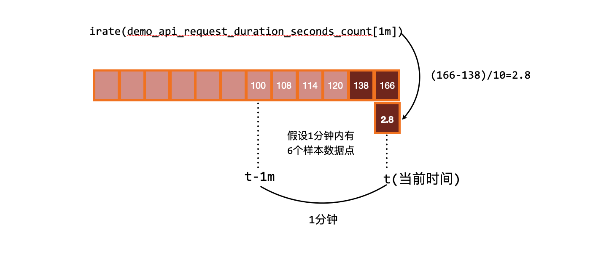

由于 `rate()` 提供了更平滑的结果，因此在长期趋势分析或者告警中更推荐使用 rate 函数，因为当速率只出现一个短暂的峰值时，不应该触发该报警。

使用 `irate()` 函数上面的表达式会出现一些短暂下降的图形：

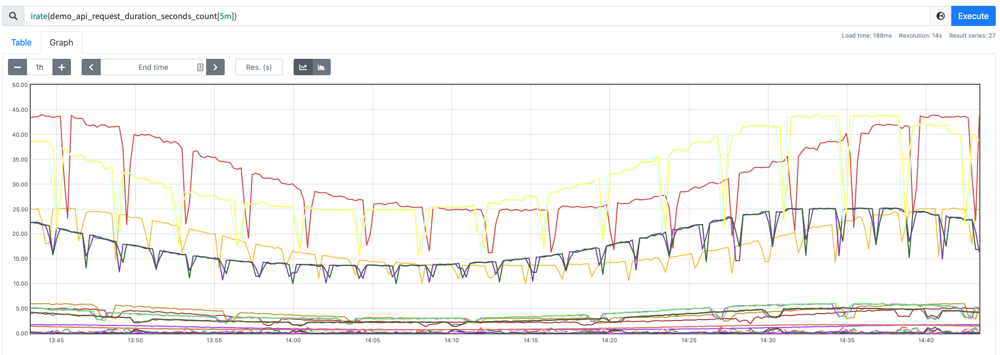

除了计算每秒速率，你还可以使用 `increase()` 函数查询指定时间范围内的总增量，它基本上相当于速率乘以时间范围选择器中的秒数：

```shell
increase(demo_api_request_duration_seconds_count{job="demo"}[1h])
```


比如上面表达式的结果和使用 `rate()` 函数计算的结果整体图形趋势都是一样的，只是 Y 轴的数据不一样而已，一个表示数量，一个表示百分比。`rate()`、`irate()` 和 `increase()` 函数只能输出非负值的结果，对于跟踪一个可以上升或下降的值的指标（如温度、内存或磁盘空间），可以使用 `delta()` 和 `deriv()` 函数来代替。

`deriv()` 函数可以计算一个区间向量中各个时间序列二阶导数，使用简单线性回归，`deriv(v range-vector)` 的参数是一个区间向量，返回一个瞬时向量，这个函数一般只用在 Gauge 类型的时间序列上。例如，要计算在 15 分钟的窗口下，每秒钟磁盘使用量上升或下降了多少：

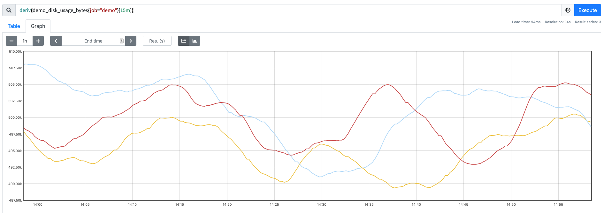

还有另外一个 `predict_linear()` 函数可以预测一个 `Gauge` 类型的指标在未来指定一段时间内的值，例如我们可以根据过去 15 分钟的变化情况，来预测一个小时后的磁盘使用量是多少，可以用如下所示的表达式来查询：

```shell
predict_linear(demo_disk_usage_bytes{job="demo"}[15m], 3600)
```


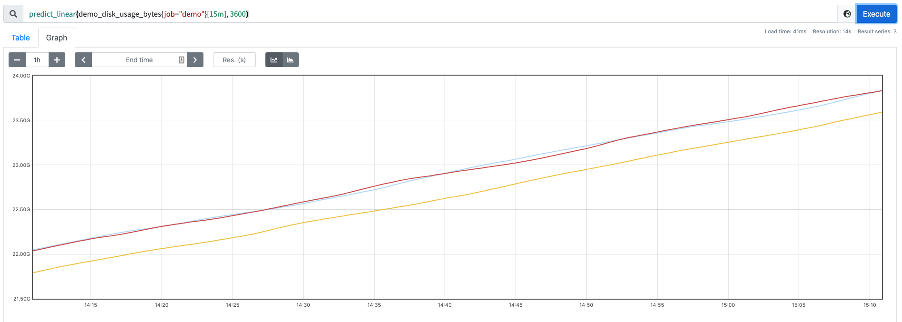

这个函数可以用于报警，告诉我们磁盘是否会在几个小时候内用完。


# 聚合

我们知道 Prometheus 的时间序列数据是多维数据模型，我们经常就有根据各个维度进行汇总的需求。

## 基于标签聚合

例如我们想知道我们的 demo 服务每秒处理的请求数，那么可以将单个的速率相加就可以。

```shell
sum(rate(demo_api_request_duration_seconds_count{job="demo"}[5m]))
```


可以得到如下所示的结果：

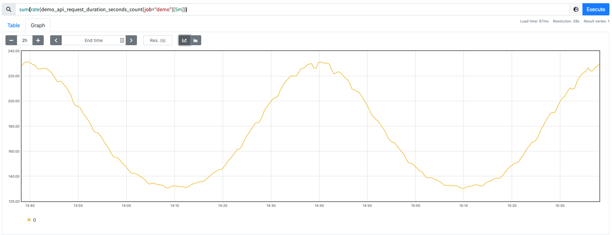

但是我们可以看到绘制出来的图形没有保留任何标签维度，一般来说可能我们希望保留一些维度，例如，我们可能更希望计算每个 `instance` 和 `path` 的变化率，但并不关心单个 `method` 或者 `status` 的结果，这个时候我们可以在 `sum()` 聚合器中添加一个 `without()` 的修饰符：

```shell
sum without(method, status) (rate(demo_api_request_duration_seconds_count{job="demo"}[5m]))
```


上面的查询语句相当于用 `by()` 修饰符来保留需要的标签的取反操作：

```shell
sum by(instance, path, job) (rate(demo_api_request_duration_seconds_count{job="demo"}[5m]))
```


现在得到的 sum 结果是就是按照 `instance`、`path`、`job` 来进行分组去聚合的了：

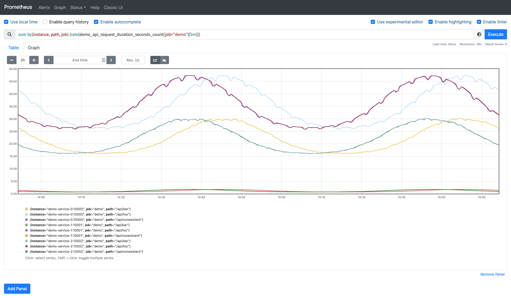

这里的**分组**概念和 SQL 语句中的分组去聚合就非常类似了。

除了 `sum()` 之外，Prometheus 还支持下面的这些聚合器：

- `sum()`：对聚合分组中的所有值进行求和
- `min()`：获取一个聚合分组中最小值
- `max()`：获取一个聚合分组中最大值
- `avg()`：计算聚合分组中所有值的平均值
- `stddev()`：计算聚合分组中所有数值的标准差
- `stdvar()`：计算聚合分组中所有数值的标准方差
- `count()`：计算聚合分组中所有序列的总数
- `count_values()`：计算具有相同样本值的元素数量
- `bottomk(k, ...)`：计算按样本值计算的最小的 k 个元素
- `topk(k，...)`：计算最大的 k 个元素的样本值
- `quantile(φ，...)`：计算维度上的 φ-分位数(0≤φ≤1)
- `group(...)`：只是按标签分组，并将样本值设为 1。

## 练习 1

1.按 `job` 分组聚合，计算我们正在监控的所有进程的总内存使用量（`process_resident_memory_bytes` 指标）：

```shell
sum by(job) (process_resident_memory_bytes)
```


2.计算 `demo_cpu_usage_seconds_total` 指标有多少不同的 CPU 模式：

```shell
count (group by(mode) (demo_cpu_usage_seconds_total))
```


3.计算每个 job 任务和指标名称的时间序列数量：

```shell
count by (job, __name__) ({__name__ != ""})
```


## 基于时间聚合

前面我们已经学习了如何使用 `sum()`、`avg()` 和相关的聚合运算符从标签维度进行聚合，这些运算符在一个时间内对多个序列进行聚合，但是有时候我们可能想在每个序列中按时间进行聚合，例如，使尖锐的曲线更平滑，或深入了解一个序列在一段时间内的最大值。

为了基于时间来计算这些聚合，PromQL 提供了一些与标签聚合运算符类似的函数，但是在这些函数名前面附加了 `_over_time()`：

- `avg_over_time(range-vector)`：区间向量内每个指标的平均值。
- `min_over_time(range-vector)`：区间向量内每个指标的最小值。
- `max_over_time(range-vector)`：区间向量内每个指标的最大值。
- `sum_over_time(range-vector)`：区间向量内每个指标的求和。
- `count_over_time(range-vector)`：区间向量内每个指标的样本数据个数。
- `quantile_over_time(scalar, range-vector)`：区间向量内每个指标的样本数据值分位数。
- `stddev_over_time(range-vector)`：区间向量内每个指标的总体标准差。
- `stdvar_over_time(range-vector)`：区间向量内每个指标的总体标准方差。

例如，我们查询 demo 实例中使用的 goroutine 的原始数量，可以使用查询语句 `go_goroutines{job="demo"}`，这会产生一些尖锐的峰值图：

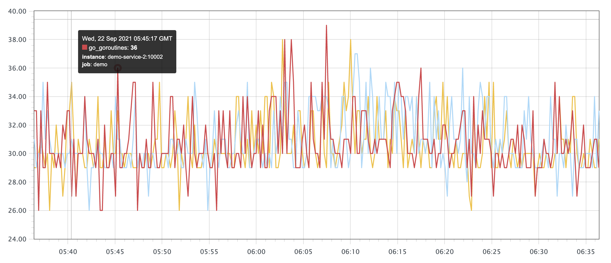

我们可以通过对图中的每一个点来计算 10 分钟内的 goroutines 数量进行平均来使图形更加平滑：

```promql
avg_over_time(go_goroutines{job="demo"}[10m])
```


这个查询结果生成的图表看起来就平滑很多了：

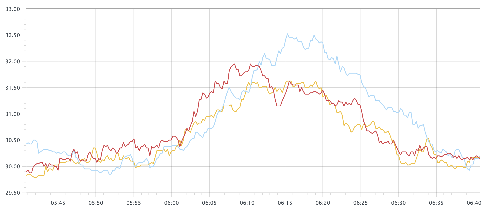

比如要查询 1 小时内内存的使用率则可以用下面的查询语句：

```promql
100 * (1 - ((avg_over_time(node_memory_MemFree_bytes[1h]) + avg_over_time(node_memory_Cached_bytes[1h]) + avg_over_time(node_memory_Buffers_bytes[1h])) / avg_over_time(node_memory_MemTotal_bytes[1h])))
```


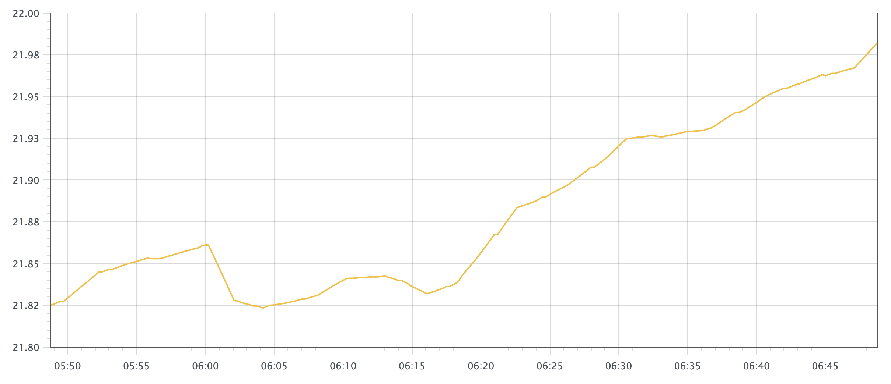

## 子查询

上面所有的 `_over_time()` 函数都需要一个范围向量作为输入，通常情况下只能由一个区间向量选择器来产生，比如 `my_metric[5m]`。但是如果现在我们想使用例如 `max_over_time()` 函数来找出过去一天中 demo 服务的最大请求率应该怎么办呢？

请求率 `rate` 并不是一个我们可以直接选择时间的原始值，而是一个计算后得到的值，比如：

```promql
rate(demo_api_request_duration_seconds_count{job="demo"}[5m])
```


如果我们直接将表达式传入 `max_over_time()` 并附加一天的持续时间查询的话就会产生错误：

```promql
# ERROR!
max_over_time(
  rate(
    demo_api_request_duration_seconds_count{job="demo"}[5m]
  )[1d]
)
```


实际上 Prometheus 是支持子查询的，它允许我们首先以指定的步长在一段时间内执行内部查询，然后根据子查询的结果计算外部查询。子查询的表示方式类似于区间向量的持续时间，但需要冒号后添加了一个额外的步长参数：`[<duration>:<resolution>]`。

这样我们可以重写上面的查询语句，告诉 Prometheus 在一天的范围内评估内部表达式，步长分辨率为 15s：

```promql
max_over_time(
  rate(
    demo_api_request_duration_seconds_count{job="demo"}[5m]
  )[1d:15s] # 在1天内明确地评估内部查询，步长为15秒
)
```


也可以省略冒号后的步长，在这种情况下，Prometheus 会使用配置的全局 `evaluation_interval` 参数进行评估内部表达式：

```promql
max_over_time(
  rate(
    demo_api_request_duration_seconds_count{job="demo"}[5m]
  )[1d:]
)
```


这样就可以得到过去一天中 demo 服务最大的 5 分钟请求率，不过冒号仍然是需要的，以明确表示运行子查询。子查询还允许添加一个偏移修饰符 offset 来对内部查询进行时间偏移，类似于瞬时和区间向量选择器。

但是也需要注意长时间计算子查询代价也是非常昂贵的，我们可以使用**记录规则**（后续会讲解）预先记录中间的表达式，而不是每次运行外部查询时都实时计算它。

## 练习 2

1. 输出过去一小时内 demo 服务的最大 95 分位数延迟值（1 分钟内平均），按 path 划分：

```shell
max_over_time(
   histogram_quantile(0.95, sum by(le, path) (
     rate(demo_api_request_duration_seconds_bucket[1m])
    )
  )[1h:]
)
```

# 运算

Prometheus 的查询语言支持基本的逻辑运算和算术运算。

## 算术运算符

在 Prometheus 系统中支持下面的二元算术运算符：

- `+` 加法
- `-` 减法
- `*` 乘法
- `/` 除法
- `%` 模
- `^` 幂等

最简单的我们可以将一个数字计算当做一个 PromQL 语句，用于**标量与标量**之间计算，比如：

```shell
(2 + 3 / 6) * 2^2
```


可以得到如下所示的结果：

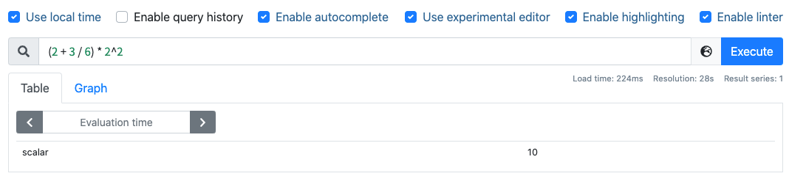

图形中返回的是一个值为 10 的标量（`scalar`）类型的数据。

二元运算同样适用于**向量和标量**之间，例如我们可以将一个字节数除以两次 1024 来转换为 MiB，如下查询语句：

```shell
demo_batch_last_run_processed_bytes{job="demo"} / 1024 / 1024
```


最后计算的结果就是 MiB 单位的了：

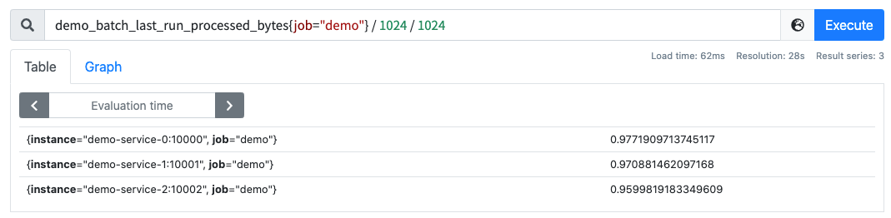

另外 PromQL 的一个强大功能就是可以让我们在**向量与向量**之间进行二元运算。

例如 `demo_api_request_duration_seconds_sum` 的数据包含了在 `path`、`method`、`status` 等不同维度上花费的总时间，指标 `demo_api_request_duration_seconds_count` 包含了上面同维度下的请求总次数。则我们可以用下面的语句来查询过去 5 分钟的平均请求持续时间：

```shell
rate(demo_api_request_duration_seconds_sum{job="demo"}[5m])
/
rate(demo_api_request_duration_seconds_count{job="demo"}[5m])
```


PromQL 会通过相同的标签集自动匹配操作符左边和右边的元素，并将二元运算应用到它们身上。由于上面两个指标的标签集合都是一致的，所有可以得到相同标签集的平均请求延迟结果：

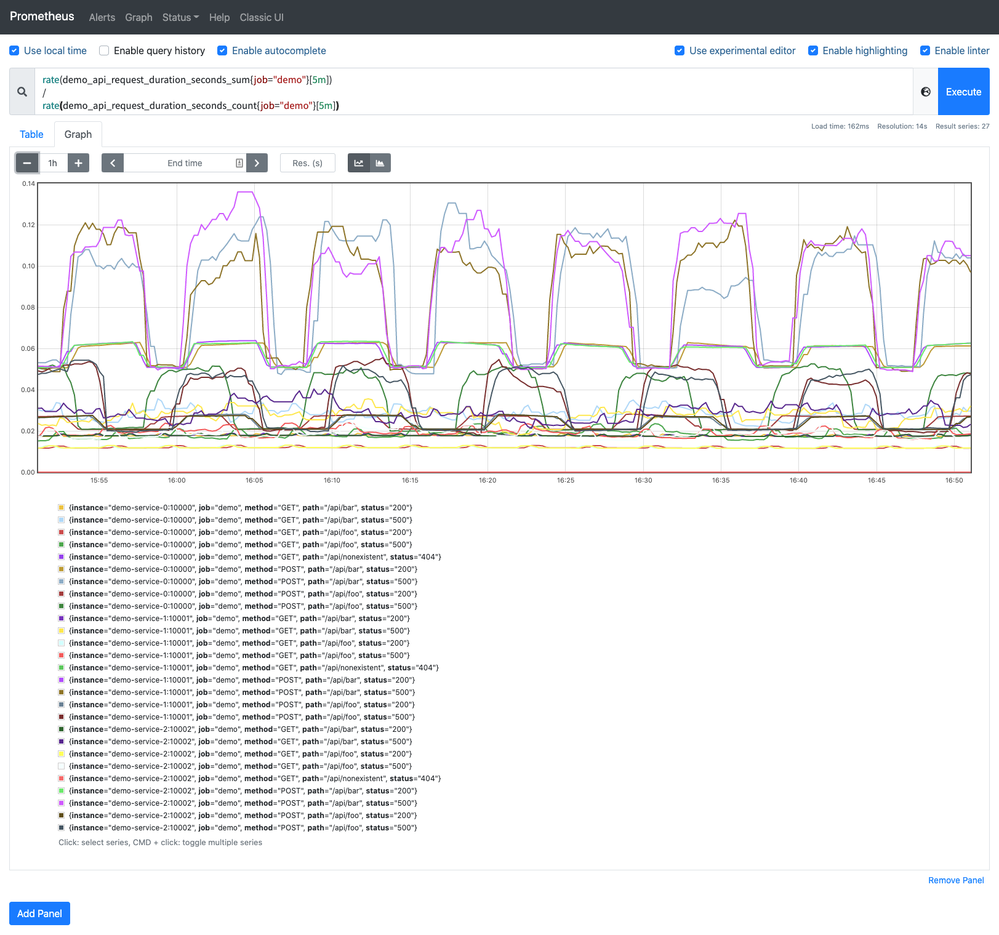

## 向量匹配

### 一对一

上面的示例其实就是一对一的向量匹配，但是一对一向量匹配也有两种情况，就是是否按照所有标签匹配进行计算，下图是匹配所有标签的情况：

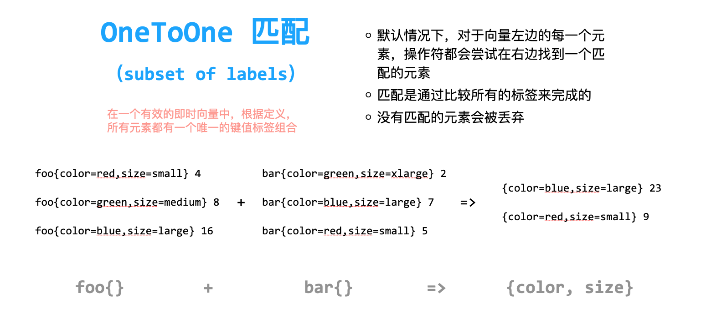

图中我们两个指标 foo 和 bar，分别生成了 3 个序列：

```shell
# TYPE foo gauge
foo{color="red", size="small"} 4
foo{color="green", size="medium"} 8
foo{color="blue", size="large"} 16
# TYPE bar gauge
bar{color="green", size="xlarge"} 2
bar{color="blue", size="large"} 7
bar{color="red", size="small"} 5
```


当我们执行查询语句 `foo{} + bar{}` 的时候，对于向量左边的每一个元素，操作符都会尝试在右边里面找到一个匹配的元素，匹配是通过比较所有的标签来完成的，没有匹配的元素会被丢弃，我们可以看到其中的 `foo{color="green", size="medium"}` 与 `bar{color="green", size="xlarge"}` 两个序列的标签是不匹配的，其余两个序列标签匹配，所以计算结果会抛弃掉不匹配的序列，得到的结果为其余序列的值相加。

上面例子中其中不匹配的标签主要是因为第二个 `size` 标签不一致造成的，那么如果我们在计算的时候忽略掉这个标签可以吗？如下图所示：

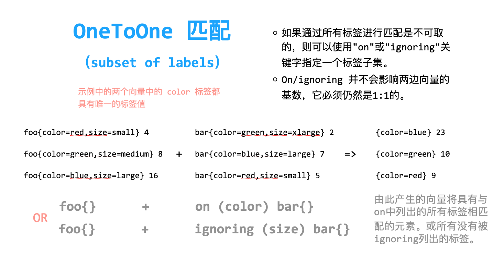

同样针对上面的两个指标，我们在进行计算的时候可以使用 `on` 或者 `ignoring` 修饰符来指定用于匹配的标签进行计算，由于示例中两边的标签都具有 `color` 标签，所以在进行计算的时候我们可以基于该标签（`on (color)`）或者忽略其他的标签（`ignoring (size)`）进行计算，这样得到的结果就是所以匹配的标签序列相加的结果，要注意结果中的标签也是匹配的标签。

### 一对多与多对一

上面讲解的一对一的向量计算是最直接的方式，在多数情况下，`on` 或者 `ignoring` 修饰符有助于是查询返回合理的结果，但通常情况用于计算的两个向量之间并不是一对一的关系，更多的是一对多或者多对一的关系，对于这种场景我们就不能简单使用上面的方式进行处理了。

多对一和一对多两种匹配模式指的是`一`侧的每一个向量元素可以与`多`侧的多个元素匹配的情况，在这种情况下，必须使用 group 修饰符：`group_left` 或者 `group_right` 来确定哪一个向量具有更高的基数（充当`多`的角色）。多对一和一对多两种模式一定是出现在操作符两侧表达式返回的向量标签不一致的情况，因此同样需要使用 `ignoring` 和 `on` 修饰符来排除或者限定匹配的标签列表。

例如 `demo_num_cpus` 指标告诉我们每个实例的 CPU 核心数量，只有 `instance` 和 `job` 这两个标签维度。

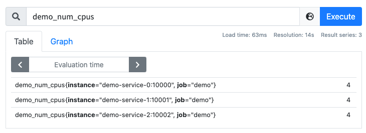

而 `demo_cpu_usage_seconds_total` 指标则多了一个 `mode` 标签的维度，将每个 `mode` 模式（`idle`、`system`、`user`）的 CPU 使用情况分开进行了统计。

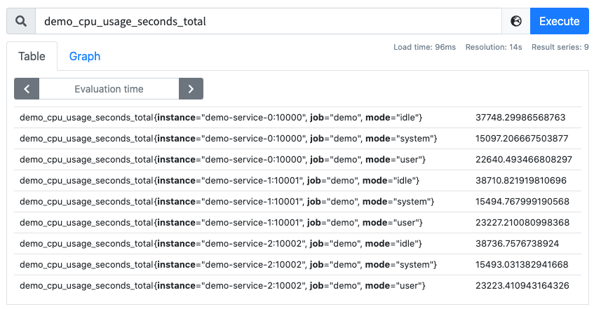

如果要计算每个模式的 CPU 使用量除以核心数，我们需要告诉除法运算符按照 `demo_cpu_usage_seconds_total` 指标上额外的 `mode` 标签维度对结果进行分组，我们可以使用 `group_left`（表示左边的向量具有更高的基数）修饰符来实现。同时，我们还需要通过 `on()` 修饰符明确将所考虑的标签集减少到需要匹配的标签列表：

```shell
rate(demo_cpu_usage_seconds_total{job="demo"}[5m])
/ on(job, instance) group_left
demo_num_cpus{job="demo"}
```


上面的表达式可以正常得到结果：

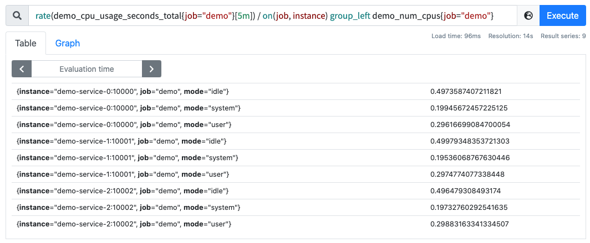

除了 `on()` 之外，还可以使用相反的 `ignoring()` 修饰符，可以用来将一些标签维度从二元运算操作匹配中忽略掉，如果在操作符的右侧有额外的维度，则应该使用 `group_right`（表示右边的向量具有更高的基数）修饰符。

比如上面的查询语句同样可以用 `ignoring` 关键字来完成：

```shell
rate(demo_cpu_usage_seconds_total{job="demo"}[5m])
/ ignoring(mode) group_left
demo_num_cpus{job="demo"}
```


得到的结果和前面用 `on()` 查询的结果是一致的。

到这里我们就知道了如何在 PromQL 中进行标量和向量之间的运算了。不过我们在使用 PromQL 查询数据的时候还行要避免使用关联查询，先想想能不能通过 Relabel（后续会详细介绍）的方式给原始数据多加个 Label，一条语句能查出来的何必用 Join 呢？时序数据库不是关系数据库。

## 练习

1.计算过去 5 分钟所有 POST 请求平均数的总和相对于所有请求平均数总和的百分比。

```shell
sum(rate(demo_api_request_duration_seconds_count{method="POST"}[5m]))
/
sum(rate(demo_api_request_duration_seconds_count[5m])) * 100
```


2.计算过去 5 分钟内每个实例的 user 和 system 的模式（`demo_cpu_usage_seconds_total` 指标）下 CPU 使用量平均值总和。

```shell
sum by(instance, job) (rate(demo_cpu_usage_seconds_total{mode=~"user|system"}[5m]))
```


或者

```shell
sum without(mode) (rate(demo_cpu_usage_seconds_total{mode=~"user|system"}[5m]))
```


或者

```shell
rate(demo_cpu_usage_seconds_total{mode="user"}[5m]) + ignoring(mode)
rate(demo_cpu_usage_seconds_total{mode="system"}[5m])
```